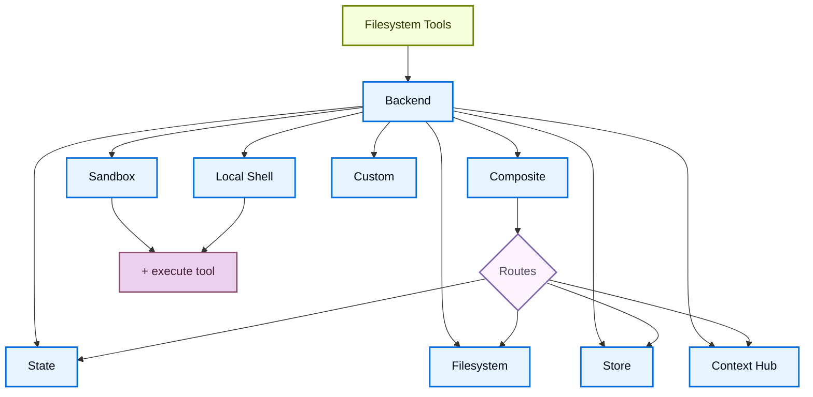

# Backends

> 为 Deep Agents 选择和配置文件系统 backend。你可以指定路由到不同 backend、实现虚拟文件系统并强制执行策略。

Deep Agents 通过 `ls`、`read_file`、`write_file`、`edit_file`、`glob` 和 `grep` 等工具向代理暴露文件系统表面。这些工具通过可插拔 backend 运行。`read_file` 工具在所有 backend 中原生支持图像文件（`.png`、`.jpg`、`.jpeg`、`.gif`、`.webp`），以多模态内容块返回。

沙箱和 [`LocalShellBackend`](https://reference.langchain.com/python/deepagents/backends/local_shell/LocalShellBackend) 还提供 `execute` 工具。本页解释如何：

* [选择 backend](#指定-backend)
* [将不同路径路由到不同 backend](#路由到不同-backend)
* [实现你自己的虚拟文件系统](#使用虚拟文件系统)（例如 S3 或 Postgres）
* [设置文件系统访问的权限](#权限)
* [遵守 backend 协议](#协议参考)

## 快速开始

以下是你可以快速与 deep agent 一起使用的预构建文件系统 backend：

| 内置 backend | 描述 |
|-------------|------|
| [默认](#statebackend) | `agent = create_deep_agent(model="...")` 线程范围。默认文件系统 backend 存储在 `langgraph` 状态中。文件在线程内的多轮之间持久化（通过 checkpointer），不跨线程共享。 |
| [本地文件系统持久化](#filesystembackend本地磁盘) | `agent = create_deep_agent(model="...", backend=FilesystemBackend(root_dir="/path/"))` 代理访问本地机器文件系统。`root_dir` 必须是绝对路径。通常用 CompositeBackend 包装以分离内部数据和项目文件。 |
| [持久化 Store](#storebackendlanggraph-store) | `agent = create_deep_agent(model="...", backend=StoreBackend())` 跨线程持久化存储。适用于长期记忆或跨执行的指令。 |
| [Context Hub](#contexthubbackend) | `agent = create_deep_agent(model="...", backend=ContextHubBackend("my-agent"))` 在 LangSmith Hub repo 中持久化存储文件。 |
| [沙箱](/oss/python/deepagents/sandboxes) | `agent = create_deep_agent(model="...", backend=sandbox)` 在隔离环境中执行代码。提供文件系统工具 + `execute` 工具。 |
| [本地 shell](#localshellbackend本地-shell) | `agent = create_deep_agent(model="...", backend=LocalShellBackend(root_dir=".", env={"PATH": "..."}))` 文件系统和 shell 直接在主机上执行。无隔离。 |
| [Composite](#compositebackend路由器) | 线程范围默认，`/memories/` 跨线程持久化。可指定不同路由指向不同 backend。 |



## 内置 backend

### StateBackend

```python
from deepagents import create_deep_agent
from deepagents.backends import StateBackend

# 默认提供 StateBackend
agent = create_deep_agent(model="google_genai:gemini-3.1-pro-preview")

# 底层实现
agent2 = create_deep_agent(
    model="google_genai:gemini-3.1-pro-preview",
    backend=StateBackend(),
)
```

**工作原理：**

* 通过 [`StateBackend`](https://reference.langchain.com/python/deepagents/backends/state/StateBackend) 将文件存储在当前线程的 LangGraph 代理状态中。
* 通过检查点在同一线程的多轮之间持久化。文件不跨线程共享。

> **警告：** 设计为在 graph 内使用。在 graph 运行之外调用 backend 方法（例如 `state_backend.upload_files(...)`）不会生效，直到 graph 执行。

**最适合：**

* 代理写入中间结果的草稿板。
* 大型工具输出的自动淘汰，代理可以逐块读回。

注意此 backend 在主管代理和子代理之间共享，子代理写入的任何文件将保留在 LangGraph 代理状态中，即使该子代理的执行已完成。这些文件将继续对主管代理和其他子代理可用。

### FilesystemBackend（本地磁盘）

[`FilesystemBackend`](https://reference.langchain.com/python/deepagents/backends/filesystem/FilesystemBackend) 在可配置的根目录下读写真实文件。

> **警告：** 此 backend 授予代理直接的文件系统读写访问权限。谨慎使用，仅在适当环境中使用。
>
> **适当用例：** 本地开发 CLI、CI/CD 流水线
>
> **不适当用例：** Web 服务器或 HTTP API — 使用 `StateBackend`、`StoreBackend` 或沙箱 backend 代替
>
> **安全风险：** 代理可以读取任何可访问的文件（包括 secrets）；与网络工具结合可能导致 SSRF；文件修改永久不可逆
>
> **推荐防护：** 启用 HITL middleware；排除 secrets 路径；生产环境使用沙箱；**始终**使用 `virtual_mode=True`

```python
from deepagents import create_deep_agent
from deepagents.backends import FilesystemBackend

agent = create_deep_agent(
    model="google_genai:gemini-3.1-pro-preview",
    backend=FilesystemBackend(root_dir=".", virtual_mode=True),
)
```

**工作原理：**

* 在可配置的 `root_dir` 下读写真实文件。
* 可选设置 `virtual_mode=True` 在 `root_dir` 下沙箱化和规范化路径。
* 使用安全路径解析，防止不安全的符号链接遍历。

> **提示：** 将 `FilesystemBackend` 包装在 `CompositeBackend` 中。Deep Agents 自动向 backend 写入内部数据（卸载的工具结果在 `/large_tool_results/`，对话历史在 `/conversation_history/`）。单独使用 `FilesystemBackend` 时，这些内部文件会写入真实磁盘，混入项目文件。

### LocalShellBackend（本地 shell）

> **警告：** 此 backend 授予代理直接的文件系统读写访问**和**主机上不受限制的 shell 执行。极端谨慎使用。
>
> **适当用例：** 本地开发 CLI、个人开发环境、有适当 secret 管理的 CI/CD
>
> **不适当用例：** 生产环境、处理不受信任的用户输入
>
> **安全风险：** 代理可以执行**任意 shell 命令**；可以读取任何文件（包括 secrets）；命令直接在主机上运行；可消耗无限 CPU/内存/磁盘

```python
from deepagents import create_deep_agent
from deepagents.backends import LocalShellBackend

agent = create_deep_agent(
    model="google_genai:gemini-3.1-pro-preview",
    backend=LocalShellBackend(root_dir=".", virtual_mode=True, env={"PATH": "/usr/bin:/bin"}),
)
```

**工作原理：**

* 扩展 `FilesystemBackend`，添加 `execute` 工具在主机上运行 shell 命令。
* 命令使用 `subprocess.run(shell=True)` 直接在机器上运行，无沙箱。
* 支持 `timeout`（默认 120s）、`max_output_bytes`（默认 100,000）、`env` 和 `inherit_env`。
* Shell 命令使用 `root_dir` 作为工作目录，但可以访问系统上的任何路径。

### StoreBackend（LangGraph Store）

```python
from deepagents import create_deep_agent
from deepagents.backends import StoreBackend
from langgraph.store.memory import InMemoryStore

agent = create_deep_agent(
    model="google_genai:gemini-3.1-pro-preview",
    backend=StoreBackend(
        namespace=lambda rt: (rt.server_info.user.identity,),
    ),
    store=InMemoryStore(),
)
```

> 部署到 LangSmith Deployment 时，省略 `store` 参数。平台自动为你的代理配置 store。

> **提示：** `namespace` 参数控制数据隔离。对于多用户部署，始终设置 namespace factory 以按用户或租户隔离数据。

**工作原理：**

* [`StoreBackend`](https://reference.langchain.com/python/deepagents/backends/store/StoreBackend) 将文件存储在运行时提供的 LangGraph [`BaseStore`](https://reference.langchain.com/python/langchain-core/stores/BaseStore) 中，实现跨线程持久化存储。

**最适合：**

* 已配置 LangGraph store（Redis、Postgres 等）
* 通过 LangSmith Deployment 部署

#### Namespace Factories

Namespace factory 控制 `StoreBackend` 读写数据的位置。它接收 LangGraph [`Runtime`](https://reference.langchain.com/python/langgraph/runtime/Runtime) 并返回用作 store namespace 的字符串元组。

```python
NamespaceFactory = Callable[[Runtime], tuple[str, ...]]
```

`Runtime` 提供：

* `rt.context` — 用户通过 context schema 传递的上下文（例如 `user_id`）
* `rt.server_info` — 运行在 LangGraph Server 上时的服务器元数据（assistant ID、graph ID、已认证用户）
* `rt.execution_info` — 执行身份信息（thread ID、run ID、checkpoint ID）

**常见 namespace 模式：**

```python
from deepagents.backends import StoreBackend

# 按用户：每个用户获得自己的隔离存储
backend = StoreBackend(
    namespace=lambda rt: (rt.server_info.user.identity,),
)

# 按助手：同一助手的所有用户共享存储
backend = StoreBackend(
    namespace=lambda rt: (rt.server_info.assistant_id,),
)

# 按线程：存储限定在单个对话
backend = StoreBackend(
    namespace=lambda rt: (rt.execution_info.thread_id,),
)
```

> **警告：** `namespace` 参数在 v0.5.0 中将是**必需的**。新代码始终显式设置它。

### ContextHubBackend

```python
from deepagents import create_deep_agent
from deepagents.backends import ContextHubBackend

agent = create_deep_agent(
    model="google_genai:gemini-3.1-pro-preview",
    backend=ContextHubBackend("my-agent"),
)
```

`ContextHubBackend` 将文件存储在 LangSmith Hub repo 中。使用 `owner/name` 或 `name` 格式的 repo 标识符构造。

> 使用前设置 `LANGSMITH_API_KEY`。

**工作原理：**

* 首次使用时延迟拉取 Hub repo 树，然后从内存缓存提供读取。
* 将写入和编辑作为 Hub commits 持久化，成功 commit 后更新缓存。
* 使用乐观父 commit 写入（`parent_commit`）。

**最适合：**

* LangSmith 原生持久化文件系统持久化
* 受益于 Hub commit 历史的工作流

### CompositeBackend（路由器）

```python
from deepagents import create_deep_agent
from deepagents.backends import CompositeBackend, StateBackend, StoreBackend
from langgraph.store.memory import InMemoryStore

agent = create_deep_agent(
    model="google_genai:gemini-3.1-pro-preview",
    backend=CompositeBackend(
        default=StateBackend(),
        routes={
            "/memories/": StoreBackend(namespace=lambda _rt: ("memories",)),
        },
    ),
    store=InMemoryStore(),
)
```

**工作原理：**

* [`CompositeBackend`](https://reference.langchain.com/python/deepagents/backends/composite/CompositeBackend) 根据路径前缀将文件操作路由到不同 backend。
* 在列表和搜索结果中保留原始路径前缀。

**最适合：**

* 同时需要线程范围和跨线程存储
* 有多个信息源需要作为单个文件系统提供给代理

## 指定 backend

* 将 backend 实例传递给 `create_deep_agent(model=..., backend=...)`。
* Backend 必须实现 `BackendProtocol`。
* 如果省略，默认为 `StateBackend()`。

## 路由到不同 backend

将 namespace 的部分路由到不同 backend。通常用于持久化 `/memories/*` 跨线程，其他保持线程范围。

```python
from deepagents import create_deep_agent
from deepagents.backends import CompositeBackend, StateBackend, FilesystemBackend

agent = create_deep_agent(
    model="google_genai:gemini-3.1-pro-preview",
    backend=CompositeBackend(
        default=StateBackend(),
        routes={
            "/memories/": FilesystemBackend(root_dir="/deepagents/myagent", virtual_mode=True),
        },
    )
)
```

行为：

* `/workspace/plan.md` → `StateBackend`（线程范围）
* `/memories/agent.md` → `FilesystemBackend`（`/deepagents/myagent` 下）
* `ls`、`glob`、`grep` 聚合结果并显示原始路径前缀。

注意：

* 更长的前缀优先（例如路由 `"/memories/projects/"` 可以覆盖 `"/memories/"`）。
* Deep Agents 将内部数据写入默认 backend。使用 `StateBackend` 作为默认以保持这些制品临时性。

## 使用虚拟文件系统

构建自定义 backend 以将远程或数据库文件系统（例如 S3 或 Postgres）投影到工具 namespace 中。

设计指南：

* 路径是绝对的（`/x/y.txt`）。决定如何映射到存储键/行。
* 高效实现 `ls` 和 `glob`（服务端过滤，否则本地过滤）。
* 对于外部持久化，write/edit 结果返回 `files_update=None`。
* 使用 `ls` 和 `glob` 作为方法名。
* 返回带 `error` 字段的结构化结果类型（不 raise）。

S3 风格大纲：

```python
from deepagents.backends.protocol import (
    BackendProtocol, WriteResult, EditResult, LsResult, ReadResult, GrepResult, GlobResult,
)

class S3Backend(BackendProtocol):
    def __init__(self, bucket: str, prefix: str = ""):
        self.bucket = bucket
        self.prefix = prefix.rstrip("/")

    def _key(self, path: str) -> str:
        return f"{self.prefix}{path}"

    def ls(self, path: str) -> LsResult:
        # 列出 _key(path) 下的对象
        ...

    def read(self, file_path: str, offset: int = 0, limit: int = 2000) -> ReadResult:
        # 获取对象
        ...

    def grep(self, pattern: str, path: str | None = None, glob: str | None = None) -> GrepResult:
        # 可选服务端过滤；否则列出并扫描内容
        ...

    def glob(self, pattern: str, path: str = "/") -> GlobResult:
        # 在键上应用 glob
        ...

    def write(self, file_path: str, content: str) -> WriteResult:
        # 创建语义；返回 WriteResult(path=file_path, files_update=None)
        ...

    def edit(self, file_path: str, old_string: str, new_string: str, replace_all: bool = False) -> EditResult:
        # 读取 → 替换 → 写入 → 返回 occurrences
        ...
```

## 权限

使用[权限](/oss/python/deepagents/permissions)声明式控制代理可以读取或写入哪些文件和目录。权限适用于内置文件系统工具，在调用 backend 之前评估。

```python
from deepagents import create_deep_agent, FilesystemPermission

agent = create_deep_agent(
    model="google_genai:gemini-3.1-pro-preview",
    backend=CompositeBackend(
        default=StateBackend(),
        routes={
            "/memories/": StoreBackend(
                namespace=lambda rt: (rt.server_info.user.identity,),
            ),
            "/policies/": StoreBackend(
                namespace=lambda rt: (rt.context.org_id,),
            ),
        },
    ),
    permissions=[
        FilesystemPermission(
            operations=["write"],
            paths=["/policies/**"],
            mode="deny",
        ),
    ],
)
```

## 添加策略 hooks

对于超出基于路径允许/拒绝规则的自定义验证逻辑（速率限制、审计日志、内容检查），通过子类化或包装 backend 来强制执行企业规则。

阻止选中前缀下的写入/编辑（子类）：

```python
from deepagents.backends.filesystem import FilesystemBackend
from deepagents.backends.protocol import WriteResult, EditResult

class GuardedBackend(FilesystemBackend):
    def __init__(self, *, deny_prefixes: list[str], **kwargs):
        super().__init__(**kwargs)
        self.deny_prefixes = [p if p.endswith("/") else p + "/" for p in deny_prefixes]

    def write(self, file_path: str, content: str) -> WriteResult:
        if any(file_path.startswith(p) for p in self.deny_prefixes):
            return WriteResult(error=f"Writes are not allowed under {file_path}")
        return super().write(file_path, content)

    def edit(self, file_path: str, old_string: str, new_string: str, replace_all: bool = False) -> EditResult:
        if any(file_path.startswith(p) for p in self.deny_prefixes):
            return EditResult(error=f"Edits are not allowed under {file_path}")
        return super().edit(file_path, old_string, new_string, replace_all)
```

通用包装器（适用于任何 backend）：

```python
from deepagents.backends.protocol import (
    BackendProtocol, WriteResult, EditResult, LsResult, ReadResult, GrepResult, GlobResult,
)

class PolicyWrapper(BackendProtocol):
    def __init__(self, inner: BackendProtocol, deny_prefixes: list[str] | None = None):
        self.inner = inner
        self.deny_prefixes = [p if p.endswith("/") else p + "/" for p in (deny_prefixes or [])]

    def _deny(self, path: str) -> bool:
        return any(path.startswith(p) for p in self.deny_prefixes)

    def ls(self, path: str) -> LsResult:
        return self.inner.ls(path)

    def read(self, file_path: str, offset: int = 0, limit: int = 2000) -> ReadResult:
        return self.inner.read(file_path, offset=offset, limit=limit)

    def grep(self, pattern: str, path: str | None = None, glob: str | None = None) -> GrepResult:
        return self.inner.grep(pattern, path, glob)

    def glob(self, pattern: str, path: str = "/") -> GlobResult:
        return self.inner.glob(pattern, path)

    def write(self, file_path: str, content: str) -> WriteResult:
        if self._deny(file_path):
            return WriteResult(error=f"Writes are not allowed under {file_path}")
        return self.inner.write(file_path, content)

    def edit(self, file_path: str, old_string: str, new_string: str, replace_all: bool = False) -> EditResult:
        if self._deny(file_path):
            return EditResult(error=f"Edits are not allowed under {file_path}")
        return self.inner.edit(file_path, old_string, new_string, replace_all)
```

## 从 backend 工厂迁移

> **警告：** Backend 工厂模式在 `deepagents` 0.5.0 中**已弃用**。直接传递预构造的 backend 实例。

| 之前（已弃用） | 之后 |
|---------------|------|
| `backend=lambda rt: StateBackend(rt)` | `backend=StateBackend()` |
| `backend=lambda rt: StoreBackend(rt)` | `backend=StoreBackend()` |
| `backend=lambda rt: CompositeBackend(default=StateBackend(rt), ...)` | `backend=CompositeBackend(default=StateBackend(), ...)` |

迁移示例：

```python
# 之前（已弃用）
agent = create_deep_agent(
    model="...",
    backend=lambda rt: CompositeBackend(
        default=StateBackend(rt),
        routes={"/memories/": StoreBackend(rt, namespace=lambda rt: (rt.server_info.user.identity,))},
    ),
)

# 之后
agent = create_deep_agent(
    model="...",
    backend=CompositeBackend(
        default=StateBackend(),
        routes={"/memories/": StoreBackend(namespace=lambda rt: (rt.server_info.user.identity,))},
    ),
)
```

## 协议参考

Backend 必须实现 [`BackendProtocol`](https://reference.langchain.com/python/deepagents/backends/protocol/BackendProtocol)。

必需方法：

* `ls(path: str) -> LsResult` — 返回至少包含 `path` 的条目。包含 `is_dir`、`size`、`modified_at`。按 `path` 排序。
* `read(file_path: str, offset: int = 0, limit: int = 2000) -> ReadResult` — 成功返回文件数据。文件不存在返回 `ReadResult(error="Error: File '/x' not found")`。
* `grep(pattern: str, path: Optional[str] = None, glob: Optional[str] = None) -> GrepResult` — 返回结构化匹配。错误返回 `GrepResult(error="...")`。
* `glob(pattern: str, path: str = "/") -> GlobResult` — 返回匹配文件为 `FileInfo` 条目。
* `write(file_path: str, content: str) -> WriteResult` — 仅创建。冲突返回 `WriteResult(error=...)`。成功设置 `path`，状态 backend 设置 `files_update={...}`；外部 backend 使用 `files_update=None`。
* `edit(file_path: str, old_string: str, new_string: str, replace_all: bool = False) -> EditResult` — 强制 `old_string` 唯一性（除非 `replace_all=True`）。未找到返回错误。成功包含 `occurrences`。
