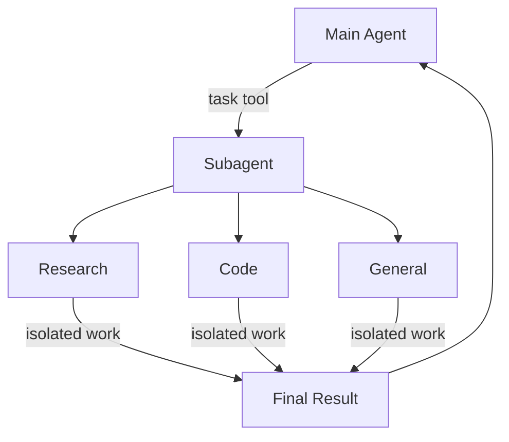

# Subagents

> 了解如何使用 subagent 委派工作并保持上下文干净

深度代理可以创建 subagent 来委派工作。你可以在 `subagents` 参数中指定自定义 subagent。Subagent 对于[上下文隔离](https://www.dbreunig.com/2025/06/26/how-to-fix-your-context.html#context-quarantine)（保持主代理的上下文干净）和提供专门指令非常有用。

本页介绍**同步** subagent，其中主管代理会阻塞直到 subagent 完成。对于长时间运行的任务、并行工作流，或需要中途引导和取消的情况，请参阅[异步 subagent](/oss/python/deepagents/async-subagents)。



## 为什么使用 subagent？

Subagent 解决了**上下文膨胀问题**。当代理使用具有大型输出的工具（网页搜索、文件读取、数据库查询）时，上下文窗口很快就会被中间结果填满。Subagent 隔离了这些详细工作——主代理只收到最终结果，而不是产生它的数十个工具调用。

**何时使用 subagent：**

* ✅ 多步骤任务会弄乱主代理的上下文
* ✅ 需要自定义指令或工具的专门领域
* ✅ 需要不同模型能力的任务
* ✅ 当你希望主代理专注于高层协调时

**何时不使用 subagent：**

* ❌ 简单的单步任务
* ❌ 当你需要保持中间上下文时
* ❌ 当开销大于收益时

## 配置

`subagents` 应该是字典列表或 [`CompiledSubAgent`](https://reference.langchain.com/python/deepagents/middleware/subagents/CompiledSubAgent) 对象。有两种类型：

### 默认 subagent

Deep Agents 会自动添加一个同步的 `general-purpose` subagent，除非你已经提供了一个同名的同步 subagent。

`general-purpose` subagent 默认具有文件系统工具，可以通过额外的工具/middleware 进行自定义。

* 要替换它，请传递你自己的名为 `general-purpose` 的 subagent。
* 要重命名或重新提示自动添加的版本，请在活动 [harness profile](/oss/python/deepagents/profiles#harness-profiles) 上设置 `general_purpose_subagent=GeneralPurposeSubagentProfile(...)`。
* 要禁用它，请参阅下面的[无 subagent 运行](#无-subagent-运行)。

### 无 subagent 运行

要运行没有 `task` 工具的代理，需要做两件事：

1. 在活动 [harness profile](/oss/python/deepagents/profiles#harness-profiles) 上设置 `general_purpose_subagent=GeneralPurposeSubagentProfile(enabled=False)`。
2. 不通过 `subagents=` 在 `create_deep_agent` 上传递同步 subagent。

Deep Agents 只在至少存在一个同步 subagent 时才附加 `SubAgentMiddleware`（和 `task` 工具）。既没有默认的也没有调用者提供的 subagent 时，代理运行时不带委派功能。

异步 subagent 不受影响——它们通过自己的 middleware 和工具流动，在[异步 subagent](/oss/python/deepagents/async-subagents)中描述。

<Tip>
  不要在这里使用 `excluded_middleware`——`SubAgentMiddleware` 是必需的脚手架，列出它会引发 `ValueError`。`general_purpose_subagent.enabled = False` 旋钮是支持的路径。
</Tip>

## 自定义 subagent

你可以使用 `subagents` 参数定义具有特定工具的专门 subagent。例如用作代码审查员、网络研究员或测试运行器。

对于大多数用例，将 subagent 定义为匹配 [`SubAgent`](https://reference.langchain.com/python/deepagents/middleware/subagents/SubAgent) 规范的字典。对于复杂工作流，使用 [`CompiledSubAgent`](#compiledsubagent)：

### SubAgent（基于字典）

将 subagent 定义为具有以下字段的字典：

| 字段 | 类型 | 描述 |
|------|------|------|
| `name` | `str` | 必需。Subagent 的唯一标识符。主代理在调用 `task()` 工具时使用此名称。Subagent 名称成为 `AIMessage` 和流式传输的元数据，有助于区分代理。 |
| `description` | `str` | 必需。此 subagent 做什么的描述。要具体且面向操作。主代理使用它来决定何时委派。 |
| `system_prompt` | `str` | 必需。Subagent 的指令。自定义 subagent 必须定义自己的。包括工具使用指导和输出格式要求。不会从主代理继承。 |
| `tools` | `list[Callable]` | 可选。Subagent 可以使用的工具。保持最小化，只包含需要的。默认从主代理继承。指定时，完全覆盖继承的工具。 |
| `model` | `str` \| `BaseChatModel` | 可选。覆盖主代理的模型。省略则使用主代理的模型。默认从主代理继承。你可以传递模型标识符字符串（如 `'openai:gpt-5.4'`，使用 `'provider:model'` 格式）或 LangChain 聊天模型对象（`init_chat_model("gpt-5.4")` 或 `ChatOpenAI(model="gpt-5.4")`）。 |
| `middleware` | `list[Middleware]` | 可选。用于自定义行为、日志记录或速率限制的额外 middleware。不会从主代理继承。 |
| `interrupt_on` | `dict[str, bool]` | 可选。为特定工具配置[人机交互](/oss/python/deepagents/human-in-the-loop)。Subagent 值覆盖主代理。需要 checkpointer。默认从主代理继承。Subagent 值覆盖默认值。 |
| `skills` | `list[str]` | 可选。[Skills](/oss/python/deepagents/skills) 源路径。指定时，subagent 将从这些目录加载 skills（例如 `["/skills/research/", "/skills/web-search/"]`）。这允许 subagent 拥有与主代理不同的 skill 集。不会从主代理继承。只有 general-purpose subagent 继承主代理的 skills。当 subagent 有 skills 时，它运行自己独立的 [`SkillsMiddleware`](https://reference.langchain.com/python/deepagents/middleware/skills/SkillsMiddleware) 实例。Skill 状态完全隔离——subagent 的已加载 skills 对父代理不可见，反之亦然。 |
| `response_format` | `ResponseFormat` | 可选。Subagent 的[结构化输出](/oss/python/langchain/structured-output) schema。设置时，父代理收到 subagent 的结果为 JSON 而不是自由形式文本。接受 Pydantic 模型、`ToolStrategy(...)`、`ProviderStrategy(...)` 或原始 schema 类型。 |
| `permissions` | `list[FilesystemPermission]` | 可选。Subagent 的[文件系统权限规则](/oss/python/deepagents/permissions)。设置时，**完全替换**父代理的权限。默认从主代理继承。 |

### CompiledSubAgent

对于复杂工作流，使用预构建的 LangGraph 图作为 [`CompiledSubAgent`](https://reference.langchain.com/python/deepagents/middleware/subagents/CompiledSubAgent)：

| 字段 | 类型 | 描述 |
|------|------|------|
| `name` | `str` | 必需。Subagent 的唯一标识符。Subagent 名称成为 `AIMessage` 和流式传输的元数据，有助于区分代理。 |
| `description` | `str` | 必需。此 subagent 做什么。 |
| `runnable` | `Runnable` | 必需。编译的 LangGraph 图（必须先调用 `.compile()`）。 |

## 使用 SubAgent

```python
import os
from typing import Literal

from deepagents import create_deep_agent
from tavily import TavilyClient

tavily_client = TavilyClient(api_key=os.environ["TAVILY_API_KEY"])


def internet_search(
    query: str,
    max_results: int = 5,
    topic: Literal["general", "news", "finance"] = "general",
    include_raw_content: bool = False,
):
    """Run a web search"""
    return tavily_client.search(
        query,
        max_results=max_results,
        include_raw_content=include_raw_content,
        topic=topic,
    )


research_subagent = {
    "name": "research-agent",
    "description": "Used to research more in depth questions",
    "system_prompt": "You are a great researcher",
    "tools": [internet_search],
    "model": "openai:gpt-5.4",  # 可选覆盖，默认使用主代理模型
}
subagents = [research_subagent]

agent = create_deep_agent(
    model="google_genai:gemini-3.1-pro-preview",
    subagents=subagents,
)
```

## 使用 CompiledSubAgent

对于更复杂的用例，你可以使用 [`CompiledSubAgent`](https://reference.langchain.com/python/deepagents/middleware/subagents/CompiledSubAgent) 提供自定义 subagent。
你可以使用 LangChain 的 [`create_agent`](https://reference.langchain.com/python/langchain/agents/factory/create_agent) 创建自定义 subagent，或使用[图 API](/oss/python/langgraph/graph-api) 制作自定义 LangGraph 图。

如果你正在创建自定义 LangGraph 图，请确保图有一个[名为 `"messages"` 的状态键](/oss/python/langgraph/quickstart#2-define-state)：

```python
from deepagents import create_deep_agent, CompiledSubAgent
from langchain.agents import create_agent

# 创建自定义代理图
custom_graph = create_agent(
    model=your_model,
    tools=specialized_tools,
    prompt="You are a specialized agent for data analysis..."
)

# 用作自定义 subagent
custom_subagent = CompiledSubAgent(
    name="data-analyzer",
    "description": "Specialized agent for complex data analysis tasks",
    runnable=custom_graph
)

subagents = [custom_subagent]

agent = create_deep_agent(
    model="google_genai:gemini-3.1-pro-preview",
    tools=[internet_search],
    system_prompt=research_instructions,
    subagents=subagents
)
```

## 流式传输

当流式传输追踪信息时，代理名称在元数据中以 `lc_agent_name` 可用。
当查看追踪信息时，你可以使用此元数据来区分数据来自哪个代理。

以下示例创建一个名为 `main-agent` 的深度代理和一个名为 `research-agent` 的 subagent：

```python
import os
from typing import Literal
from tavily import TavilyClient
from deepagents import create_deep_agent

tavily_client = TavilyClient(api_key=os.environ["TAVILY_API_KEY"])

def internet_search(
    query: str,
    max_results: int = 5,
    topic: Literal["general", "news", "finance"] = "general",
    include_raw_content: bool = False,
):
    """Run a web search"""
    return tavily_client.search(
        query,
        max_results=max_results,
        include_raw_content=include_raw_content,
        topic=topic,
    )

research_subagent = {
    "name": "research-agent",
    "description": "Used to research more in depth questions",
    "system_prompt": "You are a great researcher",
    "tools": [internet_search],
    "model": "google_genai:gemini-3.1-pro-preview",  # 可选覆盖，默认使用主代理模型
}
subagents = [research_subagent]

agent = create_deep_agent(
    model="google_genai:gemini-3.1-pro-preview",
    subagents=subagents,
    name="main-agent"
)
```

当你提示深度代理时，subagent 或深度代理执行的所有代理运行都将在其元数据中包含代理名称。
在这种情况下，名为 `"research-agent"` 的 subagent 将在任何关联的代理运行元数据中包含 `{'lc_agent_name': 'research-agent'}`：


## 结构化输出

Subagent 支持[结构化输出](/oss/python/langchain/structured-output)，因此父代理收到可预测、可解析的 JSON 而不是自由形式文本。

<Note>
  Subagent 的结构化输出需要 `deepagents>=0.5.3`。
</Note>

在 subagent 配置中传递 `response_format`。当 subagent 完成时，其结构化响应被 JSON 序列化并作为 `ToolMessage` 内容返回给父代理。Schema 接受 [`create_agent`](https://reference.langchain.com/python/langchain/agents/factory/create_agent) 支持的任何内容：Pydantic 模型、`ToolStrategy(...)`、`ProviderStrategy(...)` 或原始 schema 类型。

```python
from pydantic import BaseModel, Field

from deepagents import create_deep_agent


class ResearchFindings(BaseModel):
    """结构化研究结果。"""
    summary: str = Field(description="研究结果摘要")
    confidence: float = Field(description="置信度分数，0 到 1")
    sources: list[str] = Field(description="来源 URL 列表")

research_subagent = {
    "name": "researcher",
    "description": "研究主题并返回结构化结果",
    "system_prompt": "彻底研究给定主题。返回你的发现。",
    "tools": [web_search],
    "response_format": ResearchFindings,
}

agent = create_deep_agent(
    model="claude-sonnet-4-6",
    subagents=[research_subagent],
)

result = await agent.ainvoke(
    {"messages": [{"role": "user", "content": "Research recent advances in quantum computing"}]}
)

# 父代理的 ToolMessage 包含 JSON 序列化的结构化数据：
# '{"summary": "...", "confidence": 0.87, "sources": ["https://..."]}'
```

没有 `response_format` 时，父代理收到 subagent 最后一条消息的原文。有 `response_format` 时，父代理总是得到匹配 schema 的有效 JSON，当父代理需要以编程方式处理结果或将其传递给下游工具时很有用。

有关 schema 类型和策略（工具调用 vs 供应商原生）的完整详情，请参阅[结构化输出](/oss/python/langchain/structured-output)。

## general-purpose subagent

除了任何用户定义的 subagent 外，每个深度代理始终可以访问 `general-purpose` subagent。此 subagent：

* 与主代理有相同的系统提示
* 可以访问所有相同的工具
* 使用相同的模型（除非覆盖）
* 从主代理继承 skills（当配置了 skills 时）

### 覆盖 general-purpose subagent

在你的 `subagents` 列表中包含一个 `name="general-purpose"` 的 subagent 来替换默认值。用它来为 general-purpose subagent 配置不同的模型、工具或系统提示：

```python
from deepagents import create_deep_agent

# 主代理使用 Gemini；general-purpose subagent 使用 GPT
agent = create_deep_agent(
    model="google_genai:gemini-3.1-pro-preview",
    tools=[internet_search],
    subagents=[
        {
            "name": "general-purpose",
            "description": "General-purpose agent for research and multi-step tasks",
            "system_prompt": "You are a general-purpose assistant.",
            "tools": [internet_search],
            "model": "openai:gpt-5.4",  # 委派任务使用不同模型
        },
    ],
)
```

当你提供具有 general-purpose 名称的 subagent 时，默认的 general-purpose subagent 不会被添加。你的规范完全替换了它。

要完全移除内置的 general-purpose subagent 而不是替换它，请将活动 harness profile 的 general-purpose subagent `enabled` 标志设置为 `False`。

### 何时使用它

General-purpose subagent 非常适合不需要专门行为的上下文隔离。主代理可以将复杂的多步骤任务委派给此 subagent，并获得简洁的结果，而不会因中间工具调用而膨胀。

<Card title="示例">
  主代理不是进行 10 次网页搜索并用结果填满其上下文，而是委派给 general-purpose subagent：`task(name="general-purpose", task="Research quantum computing trends")`。Subagent 内部执行所有搜索，只返回摘要。
</Card>

### Skills 继承

当使用 `create_deep_agent` 配置 [skills](/oss/python/deepagents/skills) 时：

* **General-purpose subagent**：自动从主代理继承 skills
* **自定义 subagent**：默认不继承 skills——使用 `skills` 参数给它们自己的 skills

<Note>
  只有配置了 skills 的 subagent 才会获得 `SkillsMiddleware` 实例——没有 `skills` 参数的自定义 subagent 不会。存在时，skill 状态在两个方向上完全隔离：父代理的 skills 对子代理不可见，反之亦然。
</Note>

```python
from deepagents import create_deep_agent

# 具有自己 skills 的研究 subagent
research_subagent = {
    "name": "researcher",
    "description": "Research assistant with specialized skills",
    "system_prompt": "You are a researcher.",
    "tools": [web_search],
    "skills": ["/skills/research/", "/skills/web-search/"],  # Subagent 专属 skills
}

agent = create_deep_agent(
    model="google_genai:gemini-3.1-pro-preview",
    skills=["/skills/main/"],  # 主代理和 GP subagent 获得这些
    subagents=[research_subagent],  # 只获得 /skills/research/ 和 /skills/web-search/
)
```

## 最佳实践

### 编写清晰的描述

主代理使用描述来决定调用哪个 subagent。要具体：

✅ **好：** `"分析财务数据并生成带有置信度分数的投资洞察"`

❌ **差：** `"处理财务相关"`

### 保持系统提示详细

包括关于如何使用工具和格式化输出的具体指导：

```python
research_subagent = {
    "name": "research-agent",
    "description": "Conducts in-depth research using web search and synthesizes findings",
    "system_prompt": """You are a thorough researcher. Your job is to:

    1. Break down the research question into searchable queries
    2. Use internet_search to find relevant information
    3. Synthesize findings into a comprehensive but concise summary
    4. Cite sources when making claims

    Output format:
    - Summary (2-3 paragraphs)
    - Key findings (bullet points)
    - Sources (with URLs)

    Keep your response under 500 words to maintain clean context.""",
    "tools": [internet_search],
}
```

### 最小化工具集

只给 subagent 需要的工具。这提高了专注度和安全性：

```python
# ✅ 好：聚焦的工具集
email_agent = {
    "name": "email-sender",
    "tools": [send_email, validate_email],  # 只有邮件相关
}

# ❌ 差：太多工具
email_agent = {
    "name": "email-sender",
    "tools": [send_email, web_search, database_query, file_upload],  # 不聚焦
}
```

### 按任务选择模型

不同模型擅长不同任务：

```python
subagents = [
    {
        "name": "contract-reviewer",
        "description": "Reviews legal documents and contracts",
        "system_prompt": "You are an expert legal reviewer...",
        "tools": [read_document, analyze_contract],
        "model": "google_genai:gemini-3.1-pro-preview",  # 长文档需要大上下文
    },
    {
        "name": "financial-analyst",
        "description": "Analyzes financial data and market trends",
        "system_prompt": "You are an expert financial analyst...",
        "tools": [get_stock_price, analyze_fundamentals],
        "model": "openai:gpt-5.4",  # 更适合数值分析
    },
]
```

### 返回简洁结果

指示 subagent 返回摘要，而不是原始数据：

```python
data_analyst = {
    "system_prompt": """Analyze the data and return:
    1. Key insights (3-5 bullet points)
    2. Overall confidence score
    3. Recommended next actions

    Do NOT include:
    - Raw data
    - Intermediate calculations
    - Detailed tool outputs

    Keep response under 300 words."""
}
```

## 常见模式

### 多个专门 subagent

为不同领域创建专门的 subagent：

```python
from deepagents import create_deep_agent

subagents = [
    {
        "name": "data-collector",
        "description": "Gathers raw data from various sources",
        "system_prompt": "Collect comprehensive data on the topic",
        "tools": [web_search, api_call, database_query],
    },
    {
        "name": "data-analyzer",
        "description": "Analyzes collected data for insights",
        "system_prompt": "Analyze data and extract key insights",
        "tools": [statistical_analysis],
    },
    {
        "name": "report-writer",
        "description": "Writes polished reports from analysis",
        "system_prompt": "Create professional reports from insights",
        "tools": [format_document],
    },
]

agent = create_deep_agent(
    model="google_genai:gemini-3.1-pro-preview",
    system_prompt="You coordinate data analysis and reporting. Use subagents for specialized tasks.",
    subagents=subagents
)
```

**工作流：**

1. 主代理创建高层计划
2. 将数据收集委派给 data-collector
3. 将结果传递给 data-analyzer
4. 将洞察发送给 report-writer
5. 编译最终输出

每个 subagent 在只关注其任务的干净上下文中工作。

## 上下文管理

当你使用[运行时上下文](/oss/python/langchain/runtime)调用父代理时，该上下文会自动传播到所有 subagent。每个 subagent 运行接收你传递给父代理 `invoke` / `ainvoke` 调用的相同运行时上下文。

这意味着在任何 subagent 内运行的工具可以访问你提供给父代理的相同上下文值：

```python
from dataclasses import dataclass

from deepagents import create_deep_agent
from langchain.messages import HumanMessage
from langchain.tools import tool, ToolRuntime

@dataclass
class Context:
    user_id: str
    session_id: str

@tool
def get_user_data(query: str, runtime: ToolRuntime[Context]) -> str:
    """Fetch data for the current user."""
    user_id = runtime.context.user_id
    return f"Data for user {user_id}: {query}"

research_subagent = {
    "name": "researcher",
    "description": "Conducts research for the current user",
    "system_prompt": "You are a research assistant.",
    "tools": [get_user_data],
}

agent = create_deep_agent(
    model="google_genai:gemini-3.1-pro-preview",
    subagents=[research_subagent],
    context_schema=Context,
)

# 上下文自动流向 researcher subagent 及其工具
result = await agent.invoke(
    {"messages": [HumanMessage("Look up my recent activity")]},
    context=Context(user_id="user-123", session_id="abc"),
)
```

### 每个 subagent 的上下文

所有 subagent 接收相同的父上下文。要传递特定于某个 subagent 的配置，请使用**命名空间键**（用 subagent 名称前缀键，例如 `researcher:max_depth`）在扁平 `context` 映射中，**或**将这些设置建模为上下文类型的单独字段：

```python
from dataclasses import dataclass

from langchain.messages import HumanMessage
from langchain.tools import tool, ToolRuntime

@dataclass
class Context:
    user_id: str
    researcher_max_depth: int | None = None
    fact_checker_strict_mode: bool | None = None

result = await agent.invoke(
    {"messages": [HumanMessage("Research this and verify the claims")]},
    context=Context(
        user_id="user-123",
        researcher_max_depth=3,
        fact_checker_strict_mode=True,
    ),
)

@tool
def verify_claim(claim: str, runtime: ToolRuntime[Context]) -> str:
    """Verify a factual claim."""
    strict_mode = runtime.context.fact_checker_strict_mode or False
    if strict_mode:
        return strict_verification(claim)
    return basic_verification(claim)
```

### 识别哪个 subagent 调用了工具

当同一工具在父代理和多个 subagent 之间共享时，你可以使用 `lc_agent_name` 元数据（与[流式传输](#流式传输)中使用的值相同）来确定哪个代理发起了调用：

```python
from langchain.tools import tool, ToolRuntime

@tool
def shared_lookup(query: str, runtime: ToolRuntime) -> str:
    """Look up information."""
    agent_name = runtime.config.get("metadata", {}).get("lc_agent_name")
    if agent_name == "fact-checker":
        return strict_lookup(query)
    return general_lookup(query)
```

你可以组合两种模式——从 `runtime.context` 读取代理特定设置，当分支工具行为时从 `runtime.config` 元数据读取 `lc_agent_name`。

```python
from langchain.tools import tool, ToolRuntime

@tool
def flexible_search(query: str, runtime: ToolRuntime[Context]) -> str:
    """Search with agent-specific settings."""
    agent_name = runtime.config.get("metadata", {}).get("lc_agent_name", "unknown")
    ctx = runtime.context
    if agent_name == "researcher":
        max_results = ctx.researcher_max_depth or 5
    else:
        max_results = 5
    include_raw = False

    return perform_search(query, max_results=max_results, include_raw=include_raw)
```

## 故障排除

### Subagent 未被调用

**问题**：主代理试图自己完成工作而不是委派。

**解决方案**：

1. **使描述更具体：**

   ```python
   # ✅ 好
   {"name": "research-specialist", "description": "Conducts in-depth research on specific topics using web search. Use when you need detailed information that requires multiple searches."}

   # ❌ 差
   {"name": "helper", "description": "helps with stuff"}
   ```

2. **指示主代理委派：**

   ```python
   agent = create_deep_agent(
       model="google_genai:gemini-3.1-pro-preview",
       system_prompt="""...your instructions...

       IMPORTANT: For complex tasks, delegate to your subagents using the task() tool.
       This keeps your context clean and improves results.""",
       subagents=[...]
   )
   ```

### 上下文仍然膨胀

**问题**：尽管使用了 subagent，上下文仍然填满。

**解决方案**：

1. **指示 subagent 返回简洁结果：**

   ```python
   system_prompt="""...

   IMPORTANT: Return only the essential summary.
   Do NOT include raw data, intermediate search results, or detailed tool outputs.
   Your response should be under 500 words."""
   ```

2. **使用文件系统存储大数据：**

   ```python
   system_prompt="""When you gather large amounts of data:
   1. Save raw data to /data/raw_results.txt
   2. Process and analyze the data
   3. Return only the analysis summary

   This keeps context clean."""
   ```

### 选择了错误的 subagent

**问题**：主代理为任务调用了不合适的 subagent。

**解决方案**：在描述中清晰区分 subagent：

```python
subagents = [
    {
        "name": "quick-researcher",
        "description": "For simple, quick research questions that need 1-2 searches. Use when you need basic facts or definitions.",
    },
    {
        "name": "deep-researcher",
        "description": "For complex, in-depth research requiring multiple searches, synthesis, and analysis. Use for comprehensive reports.",
    }
]
```
