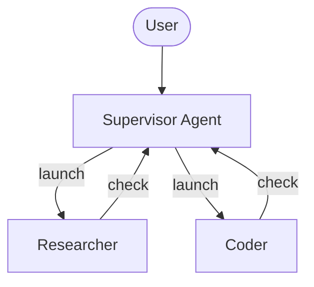
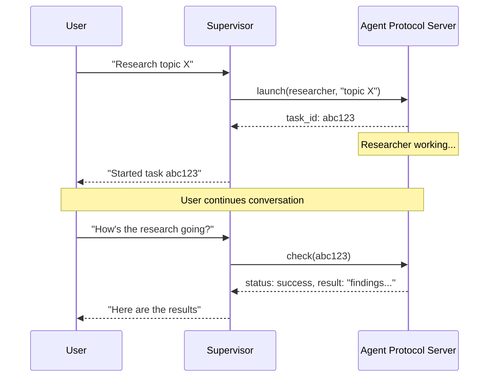

# Async Subagents

> 启动后台 subagent，使其在主管代理继续与用户交互时并发运行

异步 subagent 允许主管代理启动立即返回的后台任务，这样主管可以在 subagent 并发工作时继续与用户交互。主管可以随时检查进度、发送后续指令或取消任务。

这建立在[同步 subagent](/oss/python/deepagents/subagents) 之上，后者会阻塞主管直到完成。当任务长时间运行、可并行化或需要中途引导时，使用异步 subagent。

<Note>
  异步 subagent 是 `deepagents` 0.5.0 中的预览功能。预览功能正在积极开发中，API 可能会变化。
</Note>



<Note>
  异步 subagent 与任何实现了 [Agent Protocol](https://github.com/langchain-ai/agent-protocol) 的服务器通信。你可以使用 [LangSmith Deployments](/langsmith/deployment)，或自托管任何兼容 Agent Protocol 的服务器。每个 subagent 独立于主管运行，主管通过 SDK 控制它们：启动、检查、更新和取消。
</Note>

## 何时使用异步 subagent

| 维度 | 同步 subagent | 异步 subagent |
|------|--------------|--------------|
| **执行模型** | 主管阻塞直到 subagent 完成 | 立即返回任务 ID；主管继续 |
| **并发性** | 并行但阻塞 | 并行且非阻塞 |
| **任务中更新** | 不可能 | 通过 `update_async_task` 发送后续指令 |
| **取消** | 不可能 | 通过 `cancel_async_task` 取消运行中的任务 |
| **有状态性** | 无状态——调用之间无持久状态 | 有状态——在自己的线程上跨交互维护状态 |
| **最适合** | 代理应等待结果后再继续的任务 | 在聊天中交互式管理的长时间运行复杂任务 |

## 配置异步 subagent

将异步 subagent 定义为 [`AsyncSubAgent`](https://reference.langchain.com/python/deepagents/middleware/async_subagents/AsyncSubAgent) 规范列表，每个指向一个 Agent Protocol 服务器：

```python
from deepagents import AsyncSubAgent, create_deep_agent

async_subagents = [
    AsyncSubAgent(
        name="researcher",
        description="Research agent for information gathering and synthesis",
        graph_id="researcher",
        # 无 url → ASGI 传输（同一部署中共同部署）
    ),
    AsyncSubAgent(
        name="coder",
        description="Coding agent for code generation and review",
        graph_id="coder",
        # url="https://coder-deployment.langsmith.dev"  # 可选：远程 HTTP 传输
    ),
]

agent = create_deep_agent(
    model="google_genai:gemini-3.5-flash",
    subagents=async_subagents,
)
```

| 字段 | 类型 | 描述 |
|------|------|------|
| `name` | `str` | 必需。唯一标识符。主管在启动任务时使用。 |
| `description` | `str` | 必需。此 subagent 做什么。主管使用它来决定委派给哪个代理。 |
| `graph_id` | `str` | 必需。Agent Protocol 服务器上的图 ID（或助手 ID）。对于基于 LangGraph 的部署，这必须与 `langgraph.json` 中注册的图匹配。 |
| `url` | `str` | 可选。省略时使用 ASGI 传输（进程内）。设置时使用 HTTP 传输到远程 Agent Protocol 服务器。 |
| `headers` | `dict[str, str]` | 可选。向远程服务器发送请求时的额外头。用于自托管 Agent Protocol 服务器的自定义认证。 |

对于基于 LangGraph 的部署，在同一个 `langgraph.json` 中注册所有图以实现共同部署：

```json
{
  "graphs": {
    "supervisor": "./src/supervisor.py:graph",
    "researcher": "./src/researcher.py:graph",
    "coder": "./src/coder.py:graph"
  }
}
```

## 使用异步 subagent 工具

[`AsyncSubAgentMiddleware`](https://reference.langchain.com/python/deepagents/middleware/async_subagents/AsyncSubAgentMiddleware) 给主管提供五个工具：

| 工具 | 用途 | 返回 |
|------|------|------|
| `start_async_task` | 启动新后台任务 | 任务 ID（立即） |
| `check_async_task` | 获取任务当前状态和结果 | 状态 + 结果（完成时） |
| `update_async_task` | 向运行中的任务发送新指令 | 确认 + 更新状态 |
| `cancel_async_task` | 停止运行中的任务 | 确认 |
| `list_async_tasks` | 列出所有跟踪的任务及实时状态 | 所有任务摘要 |

主管的 LLM 像调用其他工具一样调用这些工具。Middleware 自动处理线程创建、运行管理和状态持久化。

### 理解生命周期

典型交互遵循以下序列：



* **启动（Launch）** 在服务器上创建新线程，以任务描述作为输入启动运行，并返回线程 ID 作为任务 ID。主管向用户报告此 ID 并不轮询完成。
* **检查（Check）** 获取当前运行状态。如果运行成功，它检索线程状态以提取 subagent 的最终输出。如果仍在运行，它向用户报告。
* **更新（Update）** 在同一线程上使用中断多任务策略创建新运行。之前的运行被中断，subagent 以完整对话历史加上新指令重新启动。任务 ID 保持不变。
* **取消（Cancel）** 在服务器上调用 `runs.cancel()` 并将任务标记为 `"cancelled"`。
* **列表（List）** 遍历所有跟踪的任务。对于非终端任务，它并行从服务器获取实时状态。终端状态（`success`、`error`、`cancelled`）从缓存返回。

## 理解状态管理

任务元数据存储在主管图的专用状态通道（`async_tasks`）中，与消息历史分开。这很关键，因为深度代理在上下文窗口填满时会[压缩消息历史](/oss/python/deepagents/context-engineering#summarization)。如果任务 ID 只在工具消息中，它们会在压缩期间丢失。专用通道确保主管始终可以通过 `list_async_tasks` 回忆其任务，即使经过多轮摘要。

每个跟踪的任务记录任务 ID、代理名称、线程 ID、运行 ID、状态和时间戳（`created_at`、`last_checked_at`、`last_updated_at`）。

## 选择传输方式

### ASGI 传输（共同部署）

当 subagent 规范省略 `url` 字段时，LangGraph SDK 使用 ASGI 传输——SDK 调用通过进程内函数调用路由，而不是 HTTP。对于基于 LangGraph 的部署，这要求两个图注册在同一个 `langgraph.json` 中。

ASGI 传输消除了网络延迟，不需要额外的认证配置。Subagent 仍然作为具有自己状态的单独线程运行。这是推荐的默认方式。

### HTTP 传输（远程）

添加 `url` 字段切换到 HTTP 传输，SDK 调用通过网络到远程 Agent Protocol 服务器：

```python
AsyncSubAgent(
    name="researcher",
    description="Research agent",
    graph_id="researcher",
    url="https://my-research-deployment.langsmith.dev",
)
```

对于 LangGraph 部署，认证由 LangGraph SDK 使用环境变量中的 `LANGSMITH_API_KEY`（或 `LANGGRAPH_API_KEY`）处理。自托管的 Agent Protocol 服务器可能使用不同的认证机制。

当 subagent 需要独立扩展、不同的资源配置或由不同团队维护时，使用 HTTP 传输。

## 选择部署拓扑

### 单一部署

单一部署意味着所有代理使用 ASGI 传输共同部署在同一服务器上。对于基于 LangGraph 的部署，在一个 `langgraph.json` 中注册所有图。这是推荐的起点——只需管理一个服务器，代理之间零网络延迟。

### 拆分部署

主管在一个服务器，subagent 通过 HTTP 传输在另一个服务器。当 subagent 需要不同的计算配置或独立扩展时使用。

### 混合部署

在混合部署中，一些 subagent 通过 ASGI 共同部署，其他通过 HTTP 远程部署：

```python
async_subagents = [
    AsyncSubAgent(
        name="researcher",
        description="Research agent",
        graph_id="researcher",
        # 无 url → ASGI（共同部署）
    ),
    AsyncSubAgent(
        name="coder",
        description="Coding agent",
        graph_id="coder",
        url="https://coder-deployment.langsmith.dev",
        # 有 url → HTTP（远程）
    ),
]
```

## 最佳实践

### 为本地开发调整工作池大小

使用 `langgraph dev` 本地运行时，增加工作池以容纳并发的 subagent 运行。每个活动运行占用一个工作槽。具有 3 个并发 subagent 任务的主管需要 4 个槽（1 个主管 + 3 个 subagent）。配置不足会导致启动排队。

```bash
langgraph dev --n-jobs-per-worker 10
```

### 编写清晰的 subagent 描述

主管使用描述来决定启动哪个 subagent。要具体且面向操作：

```python
# 好
AsyncSubAgent(
    name="researcher",
    description="Conducts in-depth research using web search. Use for questions requiring multiple searches and synthesis.",
    graph_id="researcher",
)

# 差
AsyncSubAgent(
    name="helper",
    description="helps with stuff",
    graph_id="helper",
)
```

### 使用线程 ID 追踪

使用基于 LangGraph 的部署时，每个异步 subagent 运行都是标准的 LangGraph 运行，在 LangSmith 中完全可见。主管的追踪显示 `launch`、`check`、`update`、`cancel` 和 `list` 的工具调用。每个 subagent 运行作为单独的追踪出现，通过线程 ID 关联。使用线程 ID（任务 ID）将主管编排追踪与 subagent 执行追踪关联起来。

## 故障排除

### 主管在启动后立即轮询

**问题**：主管在启动后立即在循环中调用 `check`，将异步执行变成阻塞。

**解决方案**：Middleware 注入系统提示规则来防止这种情况。如果轮询持续，在你的主管系统提示中强化此行为：

```python
agent = create_deep_agent(
    model="google_genai:gemini-3.5-flash",
    system_prompt="""...your instructions...

    After launching an async subagent, ALWAYS return control to the user.
    Never call check_async_task immediately after launch.""",
    subagents=async_subagents,
)
```

### 主管报告过期状态

**问题**：主管引用对话历史中较早的任务状态，而不是进行新的 `check` 调用。

**解决方案**：Middleware 提示指示模型"对话历史中的任务状态总是过期的。"如果仍然发生，添加明确指令在报告状态前总是调用 `check` 或 `list`。

### 任务 ID 查找失败

**问题**：主管截断或重新格式化任务 ID，导致 `check` 或 `cancel` 失败。

**解决方案**：Middleware 提示指示模型总是使用完整的任务 ID。如果截断持续，这通常是特定模型的问题——尝试不同的模型或在系统提示中添加"总是显示完整的 task_id，永远不要截断或缩写它"。

### Subagent 启动排队而非运行

**问题**：启动 subagent 挂起或需要很长时间才能开始。

**解决方案**：工作池可能已耗尽。使用 `--n-jobs-per-worker` 增加池大小。参见[调整工作池大小](#为本地开发调整工作池大小)。

## 参考实现

[async-deep-agents](https://github.com/langchain-ai/async-deep-agents) 仓库包含 Python 和 TypeScript 的工作示例，部署到 LangSmith Deployments。它演示了一个主管与研究员和编码员 subagent 作为后台任务运行。
