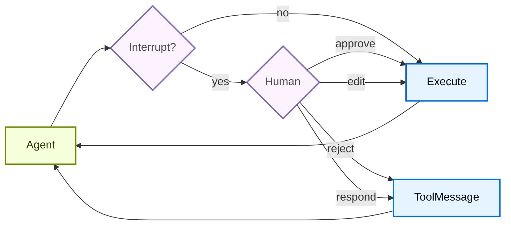

# Human-in-the-Loop

> 了解如何为敏感工具操作配置人工审批

某些工具操作可能是敏感的，需要在执行前获得人工审批。Deep Agents 通过 LangGraph 的中断功能支持人机交互工作流。你可以使用 `interrupt_on` 参数配置哪些工具需要审批。



## 基础配置

`interrupt_on` 参数接受一个字典，将工具名称映射到中断配置。每个工具可以配置为：

* **`True`**：启用中断，使用默认行为（允许 approve、edit、reject、respond）
* **`False`**：禁用此工具的中断
* **`{"allowed_decisions": [...]}`**：自定义配置，指定允许的决策

```python
from langchain.tools import tool
from deepagents import create_deep_agent
from langgraph.checkpoint.memory import MemorySaver


@tool
def remove_file(path: str) -> str:
    """Delete a file from the filesystem."""
    return f"Deleted {path}"


@tool
def fetch_file(path: str) -> str:
    """Read a file from the filesystem."""
    return f"Contents of {path}"


@tool
def notify_email(to: str, subject: str, body: str) -> str:
    """Send an email."""
    return f"Sent email to {to}"


# Checkpointer 是人机交互的必需组件
checkpointer = MemorySaver()

agent = create_deep_agent(
    model="google_genai:gemini-3.5-flash",
    tools=[remove_file, fetch_file, notify_email],
    interrupt_on={
        "remove_file": True,  # 默认：approve、edit、reject、respond
        "fetch_file": False,  # 不需要中断
        "notify_email": {"allowed_decisions": ["approve", "reject"]},  # 不允许编辑
    },
    checkpointer=checkpointer,  # 必需！
)
```

## 决策类型

`allowed_decisions` 列表控制人工审查工具调用时可以采取的操作：

* **`"approve"`**：使用代理提议的原始参数执行工具
* **`"edit"`**：在执行前修改工具参数
* **`"reject"`**：完全跳过执行此工具调用
* **`"respond"`**：直接返回人工消息作为工具结果，跳过执行——用于"询问用户"风格的工具

你可以自定义每个工具可用的决策：

```python
interrupt_on = {
    # 敏感操作：允许所有选项
    "delete_file": {"allowed_decisions": ["approve", "edit", "reject"]},

    # 中等风险：仅允许审批或拒绝
    "write_file": {"allowed_decisions": ["approve", "reject"]},

    # 必须审批（不允许拒绝）
    "critical_operation": {"allowed_decisions": ["approve"]},
}
```

## 处理中断

当中断被触发时，代理暂停执行并返回控制权。在结果中检查中断并相应处理。

```python
from langchain_core.utils.uuid import uuid7
from langgraph.types import Command

# 创建带有 thread_id 的配置以实现状态持久化
config = {"configurable": {"thread_id": str(uuid7())}}

# 调用代理
result = agent.invoke(
    {"messages": [{"role": "user", "content": "Delete the file temp.txt"}]},
    config=config,
    version="v2",  # [!code highlight]
)

# 检查执行是否被中断
if result.interrupts:  # [!code highlight]
    # 提取中断信息
    interrupt_value = result.interrupts[0].value  # [!code highlight]
    action_requests = interrupt_value["action_requests"]
    review_configs = interrupt_value["review_configs"]

    # 创建从工具名称到审查配置的查找映射
    config_map = {cfg["action_name"]: cfg for cfg in review_configs}

    # 向用户显示待处理的操作
    for action in action_requests:
        review_config = config_map[action["name"]]
        print(f"Tool: {action['name']}")
        print(f"Arguments: {action['args']}")
        print(f"Allowed decisions: {review_config['allowed_decisions']}")

    # 获取用户决策（每个 action_request 一个，按顺序）
    decisions = [
        {"type": "approve"}  # 用户批准了删除
    ]

    # 使用决策恢复执行
    result = agent.invoke(
        Command(resume={"decisions": decisions}),
        config=config,  # 必须使用相同的 config！
        version="v2",
    )

# 处理最终结果
print(result.value["messages"][-1].content)  # [!code highlight]
```

## 多个工具调用

当代理调用多个需要审批的工具时，所有中断被批量放在一个中断中。你必须按顺序为每个工具提供决策。

```python
config = {"configurable": {"thread_id": str(uuid7())}}

result = agent.invoke(
    {"messages": [{
        "role": "user",
        "content": "Delete temp.txt and send an email to admin@example.com"
    }]},
    config=config,
    version="v2",  # [!code highlight]
)

if result.interrupts:  # [!code highlight]
    interrupt_value = result.interrupts[0].value  # [!code highlight]
    action_requests = interrupt_value["action_requests"]

    # 两个工具需要审批
    assert len(action_requests) == 2

    # 按与 action_requests 相同的顺序提供决策
    decisions = [
        {"type": "approve"},  # 第一个工具：delete_file
        {"type": "reject"}    # 第二个工具：send_email
    ]

    result = agent.invoke(
        Command(resume={"decisions": decisions}),
        config=config,
        version="v2",
    )
```

## 编辑工具参数

当 `"edit"` 在允许的决策中时，你可以在执行前修改工具参数：

```python
if result.interrupts:  # [!code highlight]
    interrupt_value = result.interrupts[0].value  # [!code highlight]
    action_request = interrupt_value["action_requests"][0]

    # 来自代理的原始参数
    print(action_request["args"])  # {"to": "everyone@company.com", ...}

    # 用户决定编辑收件人
    decisions = [{
        "type": "edit",
        "edited_action": {
            "name": action_request["name"],  # 必须包含工具名称
            "args": {"to": "team@company.com", "subject": "...", "body": "..."}
        }
    }]

    result = agent.invoke(
        Command(resume={"decisions": decisions}),
        config=config,
        version="v2",
    )
```

## Subagent 中断

使用 subagent 时，你可以在[工具调用上](#工具调用中断)和[工具调用内](#工具调用内中断)使用中断。

### 工具调用中断

每个 subagent 可以有自己的 `interrupt_on` 配置，覆盖主代理的设置：

```python
agent = create_deep_agent(
    model="google_genai:gemini-3.5-flash",
    tools=[delete_file, read_file],
    interrupt_on={
        "delete_file": True,
        "read_file": False,
    },
    subagents=[{
        "name": "file-manager",
        "description": "Manages file operations",
        "system_prompt": "You are a file management assistant.",
        "tools": [delete_file, read_file],
        "interrupt_on": {
            # 覆盖：在此 subagent 中要求读取也需要审批
            "delete_file": True,
            "read_file": True,  # 与主代理不同！
        }
    }],
    checkpointer=checkpointer
)
```

当 subagent 触发中断时，处理方式相同——检查结果中的 `interrupts` 并使用 `Command` 恢复。

### 工具调用内中断

Subagent 工具可以直接调用 `interrupt()` 来暂停执行并等待审批：

```python
from langchain.agents import create_agent
from langchain_anthropic import ChatAnthropic
from langchain.messages import HumanMessage
from langchain.tools import tool
from langgraph.checkpoint.memory import InMemorySaver
from langgraph.types import Command, interrupt

from deepagents.graph import create_deep_agent
from deepagents.middleware.subagents import CompiledSubAgent


@tool(description="Request human approval before proceeding with an action.")
def request_approval(action_description: str) -> str:
    """Request human approval using the interrupt() primitive."""
    # interrupt() 暂停执行并返回传递给 Command(resume=...) 的值
    approval = interrupt({
        "type": "approval_request",
        "action": action_description,
        "message": f"Please approve or reject: {action_description}",
    })

    if approval.get("approved"):
        return f"Action '{action_description}' was APPROVED. Proceeding..."
    else:
        return f"Action '{action_description}' was REJECTED. Reason: {approval.get('reason', 'No reason provided')}"


def main():
    checkpointer = InMemorySaver()
    model = ChatAnthropic(
        model_name="claude-sonnet-4-6",
        max_tokens=4096,
    )

    compiled_subagent = create_agent(
        model=model,
        tools=[request_approval],
        name="approval-agent",
    )

    parent_agent = create_deep_agent(
        model="google_genai:gemini-3.5-flash",
        checkpointer=checkpointer,
        subagents=[
            CompiledSubAgent(
                name="approval-agent",
                description="An agent that can request approvals",
                runnable=compiled_subagent,
            )
        ],
    )

    thread_id = "test_interrupt_directly"
    config = {"configurable": {"thread_id": thread_id}}

    print("Invoking agent - sub-agent will use request_approval tool...")

    result = parent_agent.invoke(
        {
            "messages": [
                HumanMessage(
                    content="Use the task tool to launch the approval-agent sub-agent. "
                    "Tell it to use the request_approval tool to request approval for 'deploying to production'."
                )
            ]
        },
        config=config,
        version="v2",  # [!code highlight]
    )

    # 检查中断
    if result.interrupts:  # [!code highlight]
        interrupt_value = result.interrupts[0].value  # [!code highlight]
        print(f"\nInterrupt received!")
        print(f"  Type: {interrupt_value.get('type')}")
        print(f"  Action: {interrupt_value.get('action')}")
        print(f"  Message: {interrupt_value.get('message')}")

        print("\nResuming with Command(resume={'approved': True})...")
        result2 = parent_agent.invoke(
            Command(resume={"approved": True}),
            config=config,
            version="v2",  # [!code highlight]
        )

        if not result2.interrupts:  # [!code highlight]
            print("\nExecution completed!")
            # 查找工具响应
            tool_msgs = [m for m in result2.value.get("messages", []) if m.type == "tool"]  # [!code highlight]
            if tool_msgs:
                print(f"  Tool result: {tool_msgs[-1].content}")
        else:
            print("\nAnother interrupt occurred")
    else:
        print("\n  No interrupt - the model may not have called request_approval")


if __name__ == "__main__":
    main()
```

运行时产生以下输出：

```python
Invoking agent - sub-agent will use request_approval tool...

Interrupt received!
  Type: approval_request
  Action: deploying to production
  Message: Please approve or reject: deploying to production

Resuming with Command(resume={'approved': True})...

Execution completed!
  Tool result: Great! The approval request has been processed. The action **"deploying to production"** was **APPROVED**. You can now proceed with the production deployment.
```

## 最佳实践

### 始终使用 checkpointer

人机交互需要 checkpointer 在中断和恢复之间持久化代理状态：

```python
from langgraph.checkpoint.memory import MemorySaver

checkpointer = MemorySaver()
agent = create_deep_agent(
    model="google_genai:gemini-3.5-flash",
    tools=[...],
    interrupt_on={...},
    checkpointer=checkpointer  # HITL 必需
)
```

### 使用相同的 thread ID

恢复时，你必须使用带有相同 `thread_id` 的相同 config：

```python
# 第一次调用
config = {"configurable": {"thread_id": "my-thread"}}
result = agent.invoke(input, config=config, version="v2")

# 恢复（使用相同 config）
result = agent.invoke(Command(resume={...}), config=config, version="v2")
```

### 决策顺序与操作匹配

decisions 列表必须与 `action_requests` 的顺序匹配：

```python
if result.interrupts:  # [!code highlight]
    interrupt_value = result.interrupts[0].value  # [!code highlight]
    action_requests = interrupt_value["action_requests"]

    # 按顺序为每个操作创建一个决策
    decisions = []
    for action in action_requests:
        decision = get_user_decision(action)  # 你的逻辑
        decisions.append(decision)

    result = agent.invoke(
        Command(resume={"decisions": decisions}),
        config=config,
        version="v2",
    )
```

### 按风险定制配置

根据风险级别配置不同工具：

```python
interrupt_on = {
    # 高风险：完全控制（approve、edit、reject）
    "delete_file": {"allowed_decisions": ["approve", "edit", "reject"]},
    "send_email": {"allowed_decisions": ["approve", "edit", "reject"]},

    # 中等风险：不允许编辑
    "write_file": {"allowed_decisions": ["approve", "reject"]},

    # 低风险：无中断
    "read_file": False,
    "list_files": False,
}
```
