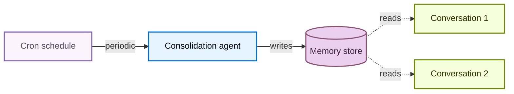

# Memory

> 为使用 Deep Agents 构建的代理添加持久记忆，使其跨对话学习和改进

记忆让你的代理跨对话学习和改进。Deep Agents 将记忆作为一等公民：代理以文件形式读写记忆，你使用 [backend](/oss/python/deepagents/backends) 控制这些文件存储在哪里。

<Note>
  本页介绍**长期记忆**：跨对话持久化的记忆。关于短期记忆（单个会话内的对话历史和草稿文件），参见[上下文工程](/oss/python/deepagents/context-engineering)指南。短期记忆作为代理[状态](/oss/python/langgraph/graph-api#state)的一部分自动管理。

  
</Note>

## 记忆如何工作

1. **将代理指向记忆文件。** 创建代理时将文件路径传递给 `memory=`。你也可以通过 `skills=` 传递 [skills](/oss/python/deepagents/skills) 作为程序性记忆（告诉代理*如何*执行任务的可复用指令）。[Backend](/oss/python/deepagents/backends) 控制文件存储位置和访问权限。
2. **代理读取记忆。** 代理可以在启动时将记忆文件加载到系统提示中，或在对话期间按需读取。例如，[skills](/oss/python/deepagents/skills) 使用按需加载：代理在启动时只读取 skill 描述，然后只在匹配任务时才读取完整 skill 文件。这保持上下文精简，直到需要某个能力。
3. **代理更新记忆（可选）。** 当代理学到新信息时，可以使用内置的 `edit_file` 工具更新记忆文件。更新可以在对话期间进行（默认）或在对话之间通过[后台整合](#后台整合)进行。更改被持久化并在下次对话中可用。并非所有记忆都可写：开发者定义的 [skills](/oss/python/deepagents/skills) 和[组织策略](#组织级记忆)通常是只读的。参见[只读 vs 可写记忆](#只读-vs-可写记忆)了解详情。

两种最常见的模式是[代理范围记忆](#代理范围记忆)（所有用户共享）和[用户范围记忆](#用户范围记忆)（每个用户隔离）。

## 范围化记忆

代理记忆可以被范围化，使得相同的记忆文件对所有使用代理的人都可访问，或者记忆文件可以对每个用户独立。

### 代理范围记忆

给代理自己的持久身份，随时间演变。代理范围记忆在所有用户间共享，因此代理通过每次对话建立自己的人格、积累的知识和学到的偏好。随着与用户交互，它发展专业知识、改进方法并记住有效的方式。当有写入权限时，它还可以学习和更新 [skills](/oss/python/deepagents/skills)。

关键是 backend namespace：设置为 `(assistant_id,)` 意味着此代理的每次对话都读写同一个记忆文件。

<Note>
  访问 `rt.server_info` 需要 `deepagents>=0.5.0`。在旧版本上，从 `get_config()["metadata"]["assistant_id"]` 读取助手 ID。
</Note>

```python
from deepagents import create_deep_agent
from deepagents.backends import CompositeBackend, StateBackend, StoreBackend

agent = create_deep_agent(
    model="google_genai:gemini-3.5-flash",
    memory=["/memories/AGENTS.md"],
    skills=["/skills/"],
    backend=CompositeBackend(
        default=StateBackend(),
        routes={
            "/memories/": StoreBackend(
                namespace=lambda rt: (
                    rt.server_info.assistant_id,  # [!code highlight]
                ),
            ),
            "/skills/": StoreBackend(
                namespace=lambda rt: (
                    rt.server_info.assistant_id,  # [!code highlight]
                ),
            ),
        },
    ),
)
```

<Accordion title="完整示例：种子记忆并调用">
  用初始记忆填充 store，然后跨两个线程调用代理以观察它记住并更新所学内容。

  ```python
  from langchain_core.utils.uuid import uuid7

  from deepagents import create_deep_agent
  from deepagents.backends import CompositeBackend, StateBackend, StoreBackend
  from deepagents.backends.utils import create_file_data
  from langgraph.store.memory import InMemoryStore

  store = InMemoryStore()  # 部署到 LangSmith 时使用平台 store

  # 种子记忆文件
  store.put(
      ("my-agent",),
      "/memories/AGENTS.md",
      create_file_data("""## Response style
  - Keep responses concise
  - Use code examples where possible
  """),
  )

  # 种子 skill
  store.put(
      ("my-agent",),
      "/skills/langgraph-docs/SKILL.md",
      create_file_data("""---
  name: langgraph-docs
  description: Fetch relevant LangGraph documentation to provide accurate guidance.
  ---

  # langgraph-docs

  Use the fetch_url tool to read https://docs.langchain.com/llms.txt, then fetch relevant pages.
  """),
  )

  agent = create_deep_agent(
      model="google_genai:gemini-3.5-flash",
      memory=["/memories/AGENTS.md"],
      skills=["/skills/"],
      backend=lambda rt: CompositeBackend(
          default=StateBackend(rt),
          routes={
              "/memories/": StoreBackend(
                  rt, namespace=lambda rt: ("my-agent",)
              ),
              "/skills/": StoreBackend(
                  rt, namespace=lambda rt: ("my-agent",)
              ),
          },
      ),
      store=store,
  )

  # 线程 1：代理学到新偏好并保存到记忆
  config1 = {"configurable": {"thread_id": str(uuid7())}}
  agent.invoke(
      {"messages": [{"role": "user", "content": "I prefer detailed explanations. Remember that."}]},
      config=config1,
  )

  # 线程 2：代理读取记忆并应用偏好
  config2 = {"configurable": {"thread_id": str(uuid7())}}
  agent.invoke(
      {"messages": [{"role": "user", "content": "Explain how transformers work."}]},
      config=config2,
  )
  ```
</Accordion>

### 用户范围记忆

给每个用户自己的记忆文件。代理按用户记住偏好、上下文和历史，同时核心代理指令保持固定。如果存储在用户范围 backend 中，用户也可以有按用户的 [skills](/oss/python/deepagents/skills)。

namespace 使用 `(user_id,)`，因此每个用户获得记忆文件的隔离副本。用户 A 的偏好永远不会泄露到用户 B 的对话中。

```python
from deepagents import create_deep_agent
from deepagents.backends import CompositeBackend, StateBackend, StoreBackend

agent = create_deep_agent(
    model="google_genai:gemini-3.5-flash",
    memory=["/memories/preferences.md"],
    skills=["/skills/"],
    backend=CompositeBackend(
        default=StateBackend(),
        routes={
            "/memories/": StoreBackend(
                namespace=lambda rt: (rt.server_info.user.identity,),
            ),
            "/skills/": StoreBackend(
                namespace=lambda rt: (rt.server_info.user.identity,),
            ),
        },
    ),
)
```

<Accordion title="完整示例：跨用户隔离记忆">
  为两个用户种子按用户记忆并调用代理。每个用户只看到自己的偏好。

  ```python
  from langchain_core.utils.uuid import uuid7

  from deepagents import create_deep_agent
  from deepagents.backends import CompositeBackend, StateBackend, StoreBackend
  from deepagents.backends.utils import create_file_data
  from langgraph.store.memory import InMemoryStore


  store = InMemoryStore()  # 部署到 LangSmith 时使用平台 store

  # 为两个用户种子偏好
  store.put(
      ("user-alice",),
      "/memories/preferences.md",
      create_file_data("""## Preferences
  - Likes concise bullet points
  - Prefers Python examples
  """),
  )
  store.put(
      ("user-bob",),
      "/memories/preferences.md",
      create_file_data("""## Preferences
  - Likes detailed explanations
  - Prefers TypeScript examples
  """),
  )

  # 为 Alice 种子 skill
  store.put(
      ("user-alice",),
      "/skills/langgraph-docs/SKILL.md",
      create_file_data("""---
  name: langgraph-docs
  description: Fetch relevant LangGraph documentation to provide accurate guidance.
  ---

  # langgraph-docs

  Use the fetch_url tool to read https://docs.langchain.com/llms.txt, then fetch relevant pages.
  """),
  )

  agent = create_deep_agent(
      model="google_genai:gemini-3.5-flash",
      memory=["/memories/preferences.md"],
      skills=["/skills/"],
      backend=lambda rt: CompositeBackend(
          default=StateBackend(rt),
          routes={
              "/memories/": StoreBackend(
                  rt,
                  namespace=lambda rt: (rt.server_info.user.identity,),
              ),
              "/skills/": StoreBackend(
                  rt,
                  namespace=lambda rt: (rt.server_info.user.identity,),
              ),
          },
      ),
      store=store,
  )

  # 部署时，每个认证请求将 rt.server_info.user.identity
  # 解析为调用用户，因此 Alice 和 Bob 自动只看到自己的偏好。
  agent.invoke(
      {"messages": [{"role": "user", "content": "How do I read a CSV file?"}]},
      config={"configurable": {"thread_id": str(uuid7())}},
  )
  ```
</Accordion>

## 高级用法

在记忆路径和范围的基本配置选项之上，你还可以配置更高级的记忆参数：

| 维度 | 回答的问题 | 选项 |
|------|-----------|------|
| **持续时间** | 持续多久？ | [短期](/oss/python/deepagents/context-engineering)（单次对话）或[长期](#范围化记忆)（跨对话） |
| **信息类型** | 什么类型的信息？ | [情景性](#情景性记忆)（过去经历）、[程序性](/oss/python/deepagents/skills)（指令和技能）或[语义性](/oss/python/concepts/memory#semantic-memory)（事实） |
| **范围** | 谁可以查看和修改？ | [用户](#用户范围记忆)、[代理](#代理范围记忆)或[组织](#组织级记忆) |
| **更新策略** | 何时写入记忆？ | 对话期间（默认）或[对话之间](#后台整合) |
| **检索** | 如何读取记忆？ | 加载到提示中（默认）或按需（例如 [skills](/oss/python/deepagents/skills)） |
| **代理权限** | 代理可以写入记忆吗？ | [读写](#只读-vs-可写记忆)（默认）或[只读](#只读-vs-可写记忆)（用于共享策略） |

### 情景性记忆

情景性记忆存储过去经历的记录：发生了什么、按什么顺序、结果如何。与语义性记忆（存储在 `AGENTS.md` 等文件中的事实和偏好）不同，情景性记忆保留完整的对话上下文，因此代理可以回忆问题*如何*被解决，而不仅仅是从中学到了*什么*。

Deep Agents 已经使用 [checkpointer](/oss/python/langgraph/persistence#checkpoints)，这是支持情景性记忆的机制：每次对话都作为检查点线程持久化。

要使过去的对话可搜索，将线程搜索包装在工具中。`user_id` 从运行时上下文获取而非作为参数传递：

```python
from langgraph_sdk import get_client
from langchain.tools import tool, ToolRuntime

client = get_client(url="<DEPLOYMENT_URL>")


@tool
async def search_past_conversations(query: str, runtime: ToolRuntime) -> str:
    """Search past conversations for relevant context."""
    user_id = runtime.server_info.user.identity  # [!code highlight]
    threads = await client.threads.search(
        metadata={"user_id": user_id},
        limit=5,
    )
    results = []
    for thread in threads:
        history = await client.threads.get_history(thread_id=thread["thread_id"])
        results.append(history)
    return str(results)
```

你可以通过调整元数据过滤器按用户或组织范围化线程搜索：

```python
# 搜索特定用户的对话
threads = await client.threads.search(
    metadata={"user_id": user_id},
    limit=5,
)

# 搜索组织内的对话
threads = await client.threads.search(
    metadata={"org_id": org_id},
    limit=5,
)
```

这对于执行复杂多步骤任务的代理很有用。例如，编码代理可以回顾过去的调试会话，直接跳到可能的根本原因。

### 组织级记忆

组织级记忆遵循与用户范围记忆相同的模式，但使用组织范围的 namespace 而非按用户的。用于应适用于组织中所有用户和代理的策略或知识。

组织记忆通常是**只读的**，以防止通过共享状态进行提示注入。参见[只读 vs 可写记忆](#只读-vs-可写记忆)了解详情。

```python
from deepagents import create_deep_agent
from deepagents.backends import CompositeBackend, StateBackend, StoreBackend

agent = create_deep_agent(
    model="google_genai:gemini-3.5-flash",
    memory=[
        "/memories/preferences.md",
        "/policies/compliance.md",
    ],
    backend=CompositeBackend(
        default=StateBackend(),
        routes={
            "/memories/": StoreBackend(
                namespace=lambda rt: (rt.server_info.user.identity,),
            ),
            "/policies/": StoreBackend(
                namespace=lambda rt: (rt.context.org_id,),
            ),
        },
    ),
)
```

从应用代码填充组织记忆：

```python
from langgraph_sdk import get_client
from deepagents.backends.utils import create_file_data

client = get_client(url="<DEPLOYMENT_URL>")

await client.store.put_item(
    (org_id,),
    "/compliance.md",
    create_file_data("""## Compliance policies
- Never disclose internal pricing
- Always include disclaimers on financial advice
"""),
)
```

使用 [permissions](/oss/python/deepagents/permissions) 强制组织级记忆为只读，或使用 [policy hooks](/oss/python/deepagents/backends#add-policy-hooks) 进行自定义验证逻辑。

### 后台整合

默认情况下，代理在对话期间写入记忆（热路径）。另一种方式是在对话**之间**作为后台任务处理记忆，有时称为**睡眠时间计算**。一个单独的深度代理审查最近的对话，提取关键事实，并将它们与现有记忆合并。

| 方式 | 优点 | 缺点 |
|------|------|------|
| **热路径**（对话期间） | 记忆立即可用，对用户透明 | 增加延迟，代理必须多任务处理 |
| **后台**（对话之间） | 无用户面对的延迟，可以跨多个对话综合 | 记忆在下次对话前不可用，需要第二个代理 |

对于大多数应用，热路径足够。当你需要减少延迟或提高跨多个对话的记忆质量时，添加后台整合。

推荐的模式是在主代理旁边部署一个**整合代理**——一个读取最近对话历史、提取关键事实并将它们合并到记忆 store 的深度代理——并使用 [cron 计划](#cron) 触发它。选择反映用户实际与代理交互频率的节奏：每天稳定流量的聊天产品可能每几小时整合一次，而每周只使用几次的工具只需要每晚或每周运行一次。整合频率远高于用户对话频率只是在无操作运行上浪费 token。

#### 整合代理

整合代理读取最近的对话历史并将关键事实合并到记忆 store。在 `langgraph.json` 中将其与主代理一起注册：

```python consolidation_agent.py
from datetime import datetime, timedelta, timezone

from deepagents import create_deep_agent
from langchain.tools import tool, ToolRuntime
from langgraph_sdk import get_client

sdk_client = get_client(url="<DEPLOYMENT_URL>")


@tool
async def search_recent_conversations(query: str, runtime: ToolRuntime) -> str:
    """Search this user's conversations updated in the last 6 hours."""
    user_id = runtime.server_info.user.identity  # [!code highlight]

    since = datetime.now(timezone.utc) - timedelta(hours=6)
    threads = await sdk_client.threads.search(
        metadata={"user_id": user_id},
        updated_after=since.isoformat(),
        limit=20,
    )
    conversations = []
    for thread in threads:
        history = await sdk_client.threads.get_history(
            thread_id=thread["thread_id"]
        )
        conversations.append(history["values"]["messages"])
    return str(conversations)


agent = create_deep_agent(
    model="google_genai:gemini-3.5-flash",
    system_prompt="""Review recent conversations and update the user's memory file.
Merge new facts, remove outdated information, and keep it concise.""",
    tools=[search_recent_conversations],
)
```

```json langgraph.json
{
  "dependencies": ["."],
  "graphs": {
    "agent": "./agent.py:agent",
    "consolidation_agent": "./consolidation_agent.py:agent"
  },
  "env": ".env"
}
```

#### Cron

[cron 任务](/langsmith/cron-jobs)按固定计划运行整合代理。代理搜索最近的对话并将它们综合到记忆中。将计划与使用模式匹配，使整合运行大致跟踪真实活动。



使用 cron 任务安排整合代理：

```python
from langgraph_sdk import get_client

client = get_client(url="<DEPLOYMENT_URL>")

cron_job = await client.crons.create(
    assistant_id="consolidation_agent",
    schedule="0 */6 * * *",
    input={"messages": [{"role": "user", "content": "Consolidate recent memories."}]},
)
```

<Note>
  所有 cron 计划都以 **UTC** 解释。参见 [cron 任务](/langsmith/cron-jobs) 了解管理和删除 cron 任务的详情。
</Note>

<Warning>
  cron 间隔必须与整合代理内的回溯窗口匹配。上面的示例每 6 小时运行一次（`0 */6 * * *`），代理的 `search_recent_conversations` 工具回溯 `timedelta(hours=6)`——保持同步。如果 cron 运行频率比回溯高，你会重新处理相同的对话；如果频率低，你会丢失窗口外的记忆。
</Warning>

有关部署带有后台进程的代理的更多信息，参见[投入生产](/oss/python/deepagents/going-to-production)。

### 只读 vs 可写记忆

默认情况下，代理可以读写记忆文件。对于共享状态如组织策略或合规规则，你可能希望将记忆设为**只读**，以便代理可以引用但不能修改。这防止通过共享记忆进行提示注入，并确保只有你的应用代码控制文件中的内容。

| 权限 | 用例 | 工作原理 |
|------|------|---------|
| **读写**（默认） | 用户偏好、代理自我改进、学到的 [skills](/oss/python/deepagents/skills) | 代理通过 `edit_file` 工具更新文件 |
| **只读** | 组织策略、合规规则、共享知识库、开发者定义的 [skills](/oss/python/deepagents/skills) | 通过应用代码或 [Store API](/langsmith/custom-store) 填充。使用 [permissions](/oss/python/deepagents/permissions) 拒绝对特定路径的写入，或使用 [policy hooks](/oss/python/deepagents/backends#add-policy-hooks) 进行自定义验证逻辑。 |

**安全考虑：** 如果一个用户可以写入另一个用户读取的记忆，恶意用户可能向共享状态注入指令。为缓解：

* **默认使用用户范围** `(user_id)`，除非有特定原因需要共享
* 对共享策略使用**只读记忆**（通过应用代码填充，而非代理）
* 在代理写入共享记忆前添加**人机交互**验证。使用[中断](/oss/python/langgraph/interrupts)要求人工审批对敏感路径的写入。

要强制只读记忆，使用 [permissions](/oss/python/deepagents/permissions) 声明式拒绝写入特定路径。对于自定义验证逻辑（速率限制、审计日志、内容检查），使用 [backend 策略 hooks](/oss/python/deepagents/backends#add-policy-hooks)。

### 并发写入

多个线程可以并行写入记忆，但对**同一文件**的并发写入可能导致后写入获胜冲突。对于用户范围记忆，这很少见，因为用户通常一次只有一个活动对话。对于代理范围或组织范围记忆，考虑使用[后台整合](#后台整合)序列化写入，或将记忆结构化为按主题的单独文件以减少争用。

实际上，如果写入因冲突失败，LLM 通常足够聪明可以重试或优雅恢复，因此单次丢失写入不是灾难性的。

### 同一部署中的多个代理

在共享部署中给每个代理自己的记忆，在 namespace 中添加 `assistant_id`：

```python
StoreBackend(
    namespace=lambda rt: (
        rt.server_info.assistant_id,  # [!code highlight]
        rt.server_info.user.identity,
    ),
)
```

如果只需要按代理隔离而不需要按用户范围化，单独使用 `assistant_id`。

<Tip>
  使用 [LangSmith 追踪](/langsmith/trace-with-langgraph)审计代理写入记忆的内容。每次文件写入在追踪中显示为工具调用。
</Tip>
