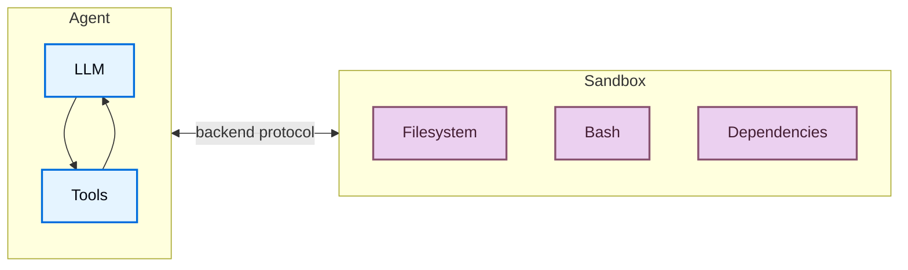
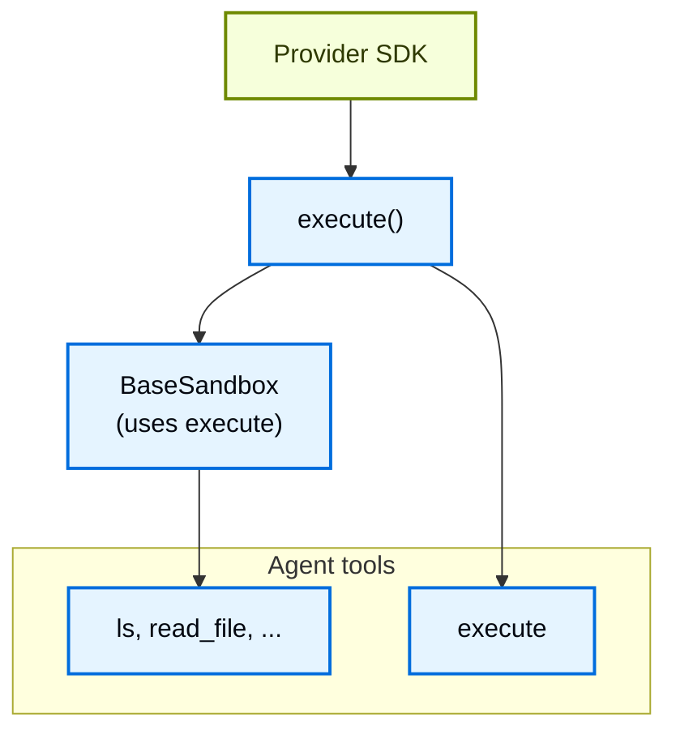
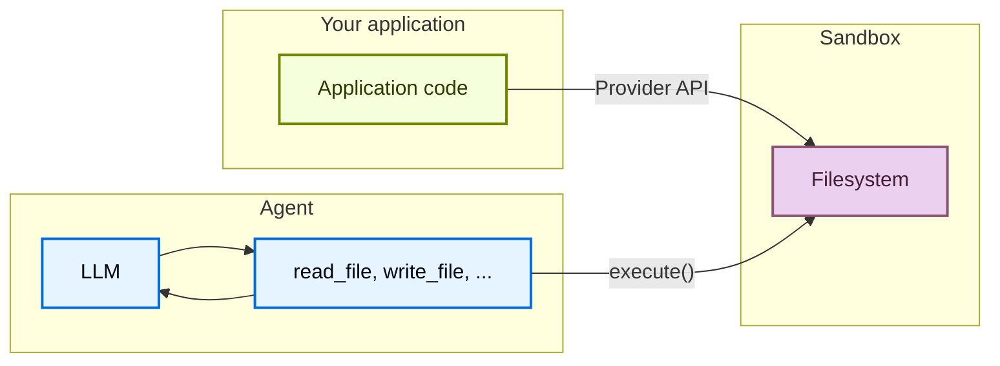

# Sandboxes

> 在隔离环境中使用沙箱 backend 执行代码

代理生成代码、与文件系统交互并运行 shell 命令。因为我们无法预测代理可能做什么，重要的是其环境是隔离的，这样它就无法访问凭证、文件或网络。沙箱通过在代理的执行环境和主机系统之间创建边界来提供这种隔离。

在 Deep Agents 中，**沙箱是 [backend](/oss/python/deepagents/backends)**，定义了代理操作的环境。与其他只暴露文件操作的 backend（State、Filesystem、Store）不同，沙箱 backend 还给代理一个用于运行 shell 命令的 `execute` 工具。配置沙箱 backend 时，代理获得：

* 所有标准文件系统工具（`ls`、`read_file`、`write_file`、`edit_file`、`glob`、`grep`）
* 用于在沙箱中运行任意 shell 命令的 `execute` 工具
* 保护主机系统的安全边界



## 为什么使用沙箱？

沙箱用于安全。它们让代理执行任意代码、访问文件和使用网络，而不会危及你的凭证、本地文件或主机系统。当代理自主运行时，这种隔离至关重要。

沙箱特别适用于：

* 编码代理：自主运行的代理可以使用 shell、git、克隆仓库（许多提供商提供原生 git API，例如 [Daytona 的 git 操作](https://www.daytona.io/docs/en/git-operations/)），并运行 Docker-in-Docker 进行构建和测试流水线
* 数据分析代理——加载文件、安装数据分析库（pandas、numpy 等）、运行统计计算，并在安全隔离的环境中创建输出如 PowerPoint 演示文稿

<Tip>
  **使用 Deep Agents Code？** Deep Agents Code 通过 `--sandbox` 标志内置沙箱支持。参见[使用远程沙箱](/oss/python/deepagents/code/remote-sandboxes)了解 Deep Agents Code 特定设置、标志（`--sandbox-id`、`--sandbox-setup`）和示例。
</Tip>

## 基础用法

这些示例假设你已使用提供商的 SDK 创建了沙箱/devbox 并设置了凭证。关于注册、认证和提供商特定的生命周期详情，参见[可用提供商](#可用提供商)。

### Modal

```python
pip install langchain-modal
```

```python
import modal
from deepagents import create_deep_agent
from langchain_anthropic import ChatAnthropic
from langchain_modal import ModalSandbox

app = modal.App.lookup("your-app")
modal_sandbox = modal.Sandbox.create(app=app)
backend = ModalSandbox(sandbox=modal_sandbox)

agent = create_deep_agent(
    model=ChatAnthropic(model="claude-sonnet-4-6"),
    system_prompt="You are a Python coding assistant with sandbox access.",
    backend=backend,
)
try:
    result = agent.invoke(
        {
            "messages": [
                {
                    "role": "user",
                    "content": "Create a small Python package and run pytest",
                }
            ]
        }
    )
finally:
    modal_sandbox.terminate()
```

### Runloop

```python
pip install langchain-runloop
```

```python
import os

from deepagents import create_deep_agent
from langchain_anthropic import ChatAnthropic
from langchain_runloop import RunloopSandbox
from runloop_api_client import RunloopSDK

client = RunloopSDK(bearer_token=os.environ["RUNLOOP_API_KEY"])

devbox = client.devbox.create()
backend = RunloopSandbox(devbox=devbox)

agent = create_deep_agent(
    model=ChatAnthropic(model="claude-sonnet-4-6"),
    system_prompt="You are a Python coding assistant with sandbox access.",
    backend=backend,
)

try:
    result = agent.invoke(
        {
            "messages": [
                {
                    "role": "user",
                    "content": "Create a small Python package and run pytest",
                }
            ]
        }
    )
finally:
    devbox.shutdown()
```

### Daytona

```python
pip install langchain-daytona
```

```python
from daytona import Daytona
from deepagents import create_deep_agent
from langchain_anthropic import ChatAnthropic
from langchain_daytona import DaytonaSandbox

sandbox = Daytona().create()
backend = DaytonaSandbox(sandbox=sandbox)

agent = create_deep_agent(
    model=ChatAnthropic(model="claude-sonnet-4-6"),
    system_prompt="You are a Python coding assistant with sandbox access.",
    backend=backend,
)

try:
    result = agent.invoke(
        {
            "messages": [
                {
                    "role": "user",
                    "content": "Create a small Python package and run pytest",
                }
            ]
        }
    )
finally:
    sandbox.stop()
```

### LangSmith

<Note>
  LangSmith 沙箱目前处于私有测试阶段。
</Note>

```python
pip install "langsmith[sandbox]"
```

```python
from deepagents import create_deep_agent
from deepagents.backends import LangSmithSandbox
from langchain_anthropic import ChatAnthropic
from langsmith.sandbox import SandboxClient

client = SandboxClient()
ls_sandbox = client.create_sandbox()
backend = LangSmithSandbox(sandbox=ls_sandbox)

agent = create_deep_agent(
    model=ChatAnthropic(model="claude-sonnet-4-6"),
    system_prompt="You are a Python coding assistant with sandbox access.",
    backend=backend,
)
try:
    result = agent.invoke(
        {
            "messages": [
                {
                    "role": "user",
                    "content": "Create a small Python package and run pytest",
                }
            ]
        }
    )
finally:
    client.delete_sandbox(ls_sandbox.name)
```

## 可用提供商

关于提供商特定的设置、认证和生命周期详情，参见[沙箱集成](/oss/python/integrations/sandboxes)。

没有你的提供商？你可以实现自己的沙箱 backend。参见[贡献沙箱集成](/oss/python/contributing/integrations-langchain)。

## 生命周期和范围

大多数应用选择每个[线程](/langsmith/use-threads)一个沙箱（线程范围）或同一[助手](/langsmith/assistants)的所有线程共享一个沙箱（助手范围）。

沙箱在关闭前消耗资源并产生成本。确保在不再使用时关闭沙箱。

关于完整的生命周期表、异步[图工厂](/langsmith/graph-rebuild)注释、TTL 行为、LangGraph Deployment 配置和客户端示例，参见[投入生产](/oss/python/deepagents/going-to-production#lifecycle)中的沙箱生命周期。

### 线程范围（默认）

每个对话获得自己的沙箱。第一次运行创建它；同一线程上的后续轮次复用它。当线程结束或沙箱 TTL 过期时，环境消失。使用提供商标签或元数据存储映射，以便每次运行解析到同一个沙箱。

<Tip>
  当用户可以在空闲时间后返回时，在沙箱上配置 TTL，以便提供商自动删除或归档空闲环境。
</Tip>

```python
from daytona import CreateSandboxFromSnapshotParams, Daytona
from deepagents import create_deep_agent
from langchain_core.runnables import RunnableConfig
from langchain_daytona import DaytonaSandbox

client = Daytona()


async def agent(config: RunnableConfig):
    thread_id = config["configurable"]["thread_id"]
    try:
        sandbox = await client.find_one(labels={"thread_id": thread_id})
    except Exception:
        sandbox = await client.create(
            CreateSandboxFromSnapshotParams(
                labels={"thread_id": thread_id},
                auto_delete_interval=3600,  # TTL: 空闲时清理
            )
        )
    return create_deep_agent(
        model="google_genai:gemini-3.5-flash",
        backend=DaytonaSandbox(sandbox=sandbox)
    )
```

### 助手范围

同一助手上的每个线程复用一个沙箱。文件、安装的包和克隆的仓库跨对话持久化。

<Warning>
  助手范围的沙箱随时间积累沙箱内状态。配置 TTL、使用快照定期重置，或实现清理逻辑，以免磁盘和内存无限增长。
</Warning>

```python
from daytona import CreateSandboxFromSnapshotParams, Daytona
from deepagents import create_deep_agent
from langchain_core.runnables import RunnableConfig
from langchain_daytona import DaytonaSandbox

client = Daytona()


async def agent(config: RunnableConfig):
    assistant_id = config["configurable"]["assistant_id"]
    try:
        sandbox = await client.find_one(labels={"assistant_id": assistant_id})
    except Exception:
        sandbox = await client.create(
            CreateSandboxFromSnapshotParams(labels={"assistant_id": assistant_id})
        )
    return create_deep_agent(
        model="google_genai:gemini-3.5-flash",
        backend=DaytonaSandbox(sandbox=sandbox)
    )
```

## 集成模式

有两种将代理与沙箱集成的架构模式，基于代理运行的位置。

### 代理在沙箱中模式

代理运行在沙箱内部，你通过网络与其通信。你构建一个预装代理框架的 Docker 或 VM 镜像，在沙箱内运行它，并从外部连接发送消息。

优点：

* ✅ 与本地开发紧密镜像
* ✅ 代理与环境紧密耦合

权衡：

* 🔴 API 密钥必须存在于沙箱内（安全风险）
* 🔴 更新需要重建镜像
* 🔴 需要通信基础设施（WebSocket 或 HTTP 层）

### 沙箱作为工具模式

代理运行在你的机器或服务器上。当需要执行代码时，它调用沙箱工具（如 `execute`、`read_file` 或 `write_file`），这些工具调用提供商的 API 在远程沙箱中运行操作。

优点：

* ✅ 即时更新代理代码，无需重建镜像
* ✅ 代理状态与执行更清晰的分离
  * API 密钥留在沙箱外
  * 沙箱故障不会丢失代理状态
  * 可选择在多个沙箱中并行运行任务
* ✅ 只为执行时间付费

权衡：

* 🔴 每次执行调用都有网络延迟

```python
from daytona import Daytona
from deepagents import create_deep_agent
from dotenv import load_dotenv
from langchain_daytona import DaytonaSandbox

load_dotenv()

sandbox = Daytona().create()
backend = DaytonaSandbox(sandbox=sandbox)

agent = create_deep_agent(
    model="google_genai:gemini-3.5-flash",
    backend=backend,
    system_prompt="You are a coding assistant with sandbox access.",
)

try:
    result = agent.invoke(
        {
            "messages": [
                {
                    "role": "user",
                    "content": "Create a hello world Python script and run it",
                }
            ]
        }
    )
    print(result["messages"][-1].content)
except Exception:
    sandbox.stop()
    raise
```

## 沙箱如何工作

### 隔离边界

所有沙箱提供商保护主机系统免受代理文件系统和 shell 操作的影响。代理无法读取本地文件、访问机器上的环境变量或干扰其他进程。然而，沙箱**不能**防止：

* **上下文注入**：控制代理部分输入的攻击者可以指示它在沙箱内运行任意命令。沙箱是隔离的，但代理在其中拥有完全控制权。
* **网络窃取**：除非网络访问被阻止，否则上下文注入的代理可以通过 HTTP 或 DNS 从沙箱发送数据。一些提供商支持阻止网络访问（例如 Modal 的 `blockNetwork: true`）。

参见[安全考虑](#安全考虑)了解如何处理密钥和缓解这些风险。

### `execute` 方法

沙箱 backend 有简单的架构：提供商必须实现的唯一方法是 `execute()`，它运行 shell 命令并返回输出。每个其他文件系统操作（`read`、`write`、`edit`、`ls`、`glob`、`grep`）都由 [`BaseSandbox`](https://reference.langchain.com/python/deepagents/backends/sandbox/BaseSandbox) 基类在 `execute()` 之上构建，它构造脚本并通过 `execute()` 在沙箱内运行它们。



这种设计意味着：

* **添加新提供商很简单。** 实现 `execute()`——基类处理其他一切。
* **`execute` 工具是条件可用的。** 每次模型调用时，harness 检查 backend 是否实现了 [`SandboxBackendProtocol`](https://reference.langchain.com/python/deepagents/backends/protocol/SandboxBackendProtocol)。如果没有，工具被过滤掉，代理永远看不到它。

当代理调用 `execute` 工具时，它提供一个 `command` 字符串并返回组合的 stdout/stderr、退出码和输出过大时的截断通知。

你也可以在应用代码中直接调用 backend `execute()` 方法：

```python
from daytona import Daytona
from langchain_daytona import DaytonaSandbox

sandbox = Daytona().create()
backend = DaytonaSandbox(sandbox=sandbox)

result = backend.execute("python --version")
print(result.output)
```

如果命令产生非常大的输出，结果自动保存到文件，代理被指示使用 `read_file` 增量访问。这防止上下文窗口溢出。

### 两种文件访问平面

有两种不同的文件进出沙箱的方式，理解何时使用每种很重要：

**代理文件系统工具**：`read_file`、`write_file`、`edit_file`、`ls`、`glob`、`grep` 和 `execute` 是 LLM 在执行期间调用的工具。这些通过沙箱内的 `execute()` 执行。代理使用它们读取代码、写入文件和运行命令。

**文件传输 API**：你的应用代码调用的 `uploadFiles()` 和 `downloadFiles()` 方法。这些使用提供商的原生文件传输 API（不是 shell 命令），设计用于在主机环境和沙箱之间移动文件。使用这些来：

* **种子沙箱**：在代理运行前提供源代码、配置或数据
* **检索制品**：代理完成后获取生成的代码、构建输出、报告
* **预填充依赖**：代理将需要的依赖



## 文件操作

DeepAgents 沙箱 backend 支持文件传输 API，用于在应用和沙箱之间移动文件。

### 种子沙箱

使用 `upload_files()` 在代理运行前填充沙箱。路径必须是绝对路径，内容是 `bytes`：

```python
from daytona import Daytona
from langchain_daytona import DaytonaSandbox

sandbox = Daytona().create()
backend = DaytonaSandbox(sandbox=sandbox)

backend.upload_files(
    [
        ("/src/index.py", b"print('Hello')\n"),
        ("/pyproject.toml", b"[project]\nname = 'my-app'\n"),
    ]
)
```

### 检索制品

使用 `download_files()` 在代理完成后从沙箱检索文件：

```python
results = backend.download_files(["/src/index.py", "/output.txt"])
for result in results:
    if result.content is not None:
        print(f"{result.path}: {result.content.decode()}")
    else:
        print(f"Failed to download {result.path}: {result.error}")
```

<Note>
  在沙箱内，代理使用文件系统工具（`read_file`、`write_file`）。`upload_files` 和 `download_files` 方法用于你的应用代码在主机和沙箱之间移动文件。
</Note>

## 安全考虑

沙箱将代码执行与主机系统隔离，但它们不防止**上下文注入**。控制代理部分输入的攻击者可以指示它读取文件、运行命令或从沙箱内窃取数据。这使得沙箱内的凭证特别危险。

<Warning>
  **永远不要在沙箱内放置密钥。** 注入到沙箱中的 API 密钥、令牌、数据库凭证和其他密钥（通过环境变量、挂载文件或 `secrets` 选项）可以被上下文注入的代理读取和窃取。这也适用于短期或范围凭证——如果代理可以访问它们，攻击者也可以。
</Warning>

### 安全处理密钥

如果你的代理需要调用认证 API 或访问受保护资源，有两个选项：

1. **将密钥保存在沙箱外的工具中。** 定义在主机环境（不是沙箱内）运行的工具并在那里处理认证。代理按名称调用这些工具，但永远看不到凭证。这是推荐的方式。

2. **使用注入凭证的网络代理。** 一些沙箱提供商支持代理，拦截来自沙箱的传出 HTTP 请求并在转发前附加凭证（例如 `Authorization` 头）。代理永远看不到密钥——它只是向 URL 发出普通请求。这种方式尚未在提供商中广泛可用。

<Warning>
  如果你必须将密钥注入沙箱（不推荐），请采取以下预防措施：

  * 为**所有**工具调用启用[人机交互](/oss/python/deepagents/human-in-the-loop)审批
  * 阻止或限制沙箱的网络访问以限制窃取路径
  * 使用尽可能窄的凭证范围和尽可能短的生命周期
  * 监控沙箱网络流量以发现意外的出站请求

  即使有这些保障，这仍然是不安全的变通方法。足够有创意的上下文注入攻击可以绕过输出过滤和 HITL 审查。
</Warning>

### 通用最佳实践

* 在应用中操作前审查沙箱输出
* 不需要时阻止沙箱网络访问
* 使用 [middleware](/oss/python/langchain/middleware) 过滤或编辑工具输出中的敏感模式
* 将沙箱内产生的所有内容视为不受信任的输入
