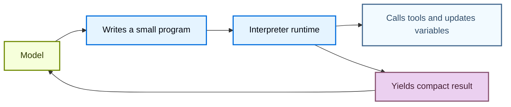
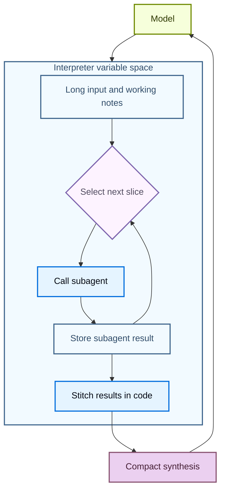

# Interpreters

> 在 Deep Agents 内运行轻量级代码，用于组合工具、编排 subagent 和转换结构化数据

解释器给代理一个可编程的工作区，它们可以在其中探索数据、协调工具调用，并将中间工作保持在模型上下文之外。代理编写代码来表达其意图，然后**内存中**运行时执行该代码并返回相关结果。

[沙箱](/oss/python/deepagents/sandboxes)是对环境执行操作的代码优先方式（如运行命令、安装依赖和编辑文件），而解释器是在代理循环内执行操作的代码优先方式：组合工具、保留状态，以及决定什么信息应该返回给模型。

<Warning>
  解释器是实验性的。API 和生命周期行为可能在版本之间变化。
</Warning>

<Note>
  解释器需要 `langchain-quickjs>=0.1.0` 和 Python `>=3.11`。
</Note>

## 何时使用解释器

大多数代理工作在模型推理和工具执行之间交替。这对简单操作有效，但当代理需要组合多个步骤、对结构化数据推理或管理中间状态时，它变得笨拙。

解释器给代理一个运行时来完成这项工作。代理可以编写一个小程序来运行控制流、调用允许列表中的工具、存储变量，并返回紧凑的结果给模型，而不是要求模型每次一个工具调用来选择每个下一步。

当代理需要以下情况时使用解释器：

* 用代码组合多个工具调用，包括循环、分支、重试和并发。
* 通过代码协调 subagent，将工作分成聚焦的调用，存储它们的结果，并将这些结果拼接成最终综合。
* 将中间值保持在运行时状态中，而不是通过模型上下文发送每个临时结果。
* 确定性地转换结构化数据，如排序、分组、解析、验证、评分或聚合。
* 探索大型变量空间，只返回选定的证据、摘要或输出给模型。



这通过在 [**QuickJS**](https://github.com/quickjs-ng/quickjs) 上运行代码来工作，QuickJS 是为嵌入式执行设计的轻量级 JavaScript 运行时。运行时给代理一个评估代码的地方，默认不暴露主机文件系统、网络、shell、包或时钟 API。

QuickJS 是解释器代码的执行边界。显式桥接（如编程式工具调用）决定代码可以访问什么能力。

## 选择正确的执行路径

| 需求 | 使用 |
|------|------|
| 一两个简单的外部调用 | 普通工具调用 |
| 循环、分支、重试或聚合结果的小程序 | 解释器 |
| 应从代码运行的多个选定工具调用 | 带编程式工具调用的解释器 |
| 跨线程的可复用辅助函数 | 带 [interpreter skills](/oss/python/deepagents/skills#use-interpreter-skills) 的解释器 |
| Shell 命令、包安装、测试或完整 OS 文件系统访问 | [沙箱](/oss/python/deepagents/sandboxes) |

## 向代理添加解释器

安装 QuickJS middleware 包，然后在创建代理时添加 middleware。

```bash
pip install -U "deepagents[quickjs]"
```

```python
from deepagents import create_deep_agent
from langchain_quickjs import CodeInterpreterMiddleware

agent = create_deep_agent(
    model="openai:gpt-5.4",
    middleware=[CodeInterpreterMiddleware()],
)
```

## 在解释器中运行代码

Middleware 向代理添加一个 `eval` 工具。该工具在持久上下文中运行 TypeScript，捕获 `console.log`，并返回最后一个表达式的结果。

代理可以编写这样的代码：

```javascript
const rows = [
  { team: "alpha", score: 8 },
  { team: "beta", score: 13 },
  { team: "alpha", score: 21 },
];

const totals = rows.reduce((acc, row) => {
  acc[row.team] = (acc[row.team] ?? 0) + row.score;
  console.log(`${row.team} score: ${acc[row.team]}`)
  return acc;
}, {});

totals;
```

默认情况下，解释器状态也通过在每次代理运行后快照工作状态并在下次运行前恢复它，来跨同一线程中的轮次持久化。

## 编程式工具调用

编程式工具调用（PTC）在全局 `tools` 命名空间下的解释器中暴露选定的代理工具。代理可以编写代码在循环、分支、重试或并行批次中调用工具，而不是要求模型发出一个工具调用、等待结果，然后决定下一个调用。

当中间工具结果只是下一步的输入时，这很有用。解释器可以在任何内容返回模型上下文之前处理、过滤或聚合这些结果，这可以使多工具/多步骤工作流更节省 token。

PTC 在 Deep Agents 中是模型无关的。它由 middleware 实现，而不是提供商特定的代码执行或工具调用 API。

### 工作原理

1. 你选择解释器可以使用 `ptc` 允许列表调用哪些工具。
2. Middleware 将这些工具作为 `tools` 下的异步 JavaScript 函数暴露。
3. 代理编写解释器代码，使用 `await` 调用这些函数。
4. 解释器运行工具桥，接收工具结果，并继续执行代码。
5. 模型接收最终的解释器输出，而不是每个中间值。

每个允许列表中的工具变成一个异步函数。工具名称转换为驼峰命名，但输入对象仍遵循工具的 schema。例如，名为 `web_search` 的工具变成 `tools.webSearch(...)`：

```typescript
const result: string = await tools.webSearch({
  query: "deepagents interpreters",
});
```

### 有用模式

| 模式 | 解释器可以做什么 |
|------|----------------|
| 批处理 | 循环多个输入并为每个调用工具 |
| 并行工作 | 使用 `Promise.all` 进行独立调用 |
| 条件逻辑 | 根据先前结果选择下一个工具调用 |
| 早期终止 | 满足成功条件后停止调用工具 |
| 数据过滤 | 只返回相关行、片段、错误或摘要给模型 |
| 递归编排 | 重复调用 `task`，然后在代码中组合 subagent 结果 |

### 启用 PTC

使用显式允许列表启用 PTC：

```python
from deepagents import create_deep_agent
from langchain_quickjs import CodeInterpreterMiddleware

agent = create_deep_agent(
    model="openai:gpt-5.4",
    middleware=[CodeInterpreterMiddleware(ptc=["task"])],
)
```

启用 PTC 后，代理可以从解释器代码调用允许列表中的工具。此示例并行启动多个 subagent 并在返回模型前组合它们的最终报告：

```javascript
const topics = ["retrieval", "memory", "evaluation"];

const reports = await Promise.all(
  topics.map((topic) =>
    tools.task({
      description: `Research ${topic} in Deep Agents and return three concise findings.`,
      subagent_type: "general-purpose",
    }),
  ),
);

reports.join("\n\n");
```

因为这是代码，代理也可以在本地处理失败：

```javascript
try {
  const report = await tools.task({
    description: "Check the migration notes and return breaking changes.",
    subagent_type: "general-purpose",
  });
  console.log(report);
} catch (error) {
  console.log(`Subagent failed: ${error.message}`);
}
```

<Warning>
  PTC 调用目前通过解释器桥执行，不通过正常的工具调用路径。因此，`interrupt_on` 审批工作流不针对每个 PTC 调用的工具调用强制执行。
</Warning>

## 递归语言模型

递归语言模型使用解释器作为分解的工作区。模型将大型输入或工作集保持在运行时变量中，编写代码来检查和拆分它，对较小的片段调用 subagent 或其他模型工具，然后在代码中将返回的结果拼接在一起。

这将变量空间与代理的上下文分开。变量空间是存储在解释器中的信息，代理的上下文是模型在下一个模型调用中实际处理的内容。模型可以决定哪些片段变成 subagent 任务，哪些结果需要另一次处理，以及什么最终综合应该返回给主对话。



有关此模式的背景，参见[递归语言模型论文](https://arxiv.org/abs/2512.24601)。

在 Deep Agents 中，递归调用通常是通过编程式工具调用暴露的 `task` 工具。解释器可以对许多片段调用 subagent，组合它们的答案，并返回单个综合结果：

```javascript
const candidates = notes
  .filter((note) => note.includes("migration"))
  .slice(0, 5);

const riskReports = await Promise.all(
  candidates.map((note) =>
    tools.task({
      description: `Analyze this migration note for release risk. Return risks, affected users, and recommended follow-up:\n\n${note}`,
      subagent_type: "general-purpose",
    }),
  ),
);

const releaseSummary = riskReports
  .map((report, index) => `## Candidate ${index + 1}\n${report}`)
  .join("\n\n");

releaseSummary;
```

## Interpreter Skills

Interpreter Skills 是向解释器暴露代码模块的 [skills](/oss/python/deepagents/skills)。配置了解释器 middleware 后，代理可以从代码导入这些模块并将它们用于确定性辅助逻辑。

当代理需要结构化数据工作流的可复用辅助函数时，Interpreter Skills 很有用，如排序、分组、评分、解析、验证或聚合数据。关于设置详情，参见 [Interpreter Skills](/oss/python/deepagents/skills#use-interpreter-skills)。

## 快照和时间旅行

`CodeInterpreterMiddleware` 默认在每次代理运行后快照解释器状态并在下次运行前恢复它。快照是解释器内存中 JavaScript 状态的序列化副本，包括代理完成运行代码时存在的全局变量、变量、函数和导入的模块。

跨对话轮次，生命周期是：

1. 轮次开始，`CodeInterpreterMiddleware` 恢复线程的最新解释器快照。
2. 代理调用 `eval`，代码可以读取或修改解释器变量。
3. 代理运行完成，middleware 将更新的解释器状态快照到图状态中。
4. 下一轮次从该恢复的解释器状态开始，而不是空运行时。

在单个代理运行中，重复的 `eval` 调用使用活动的解释器上下文对象。middleware 不在这些调用之间快照和恢复；它在运行完成时快照上下文，以便在后续轮次或检查点重放时恢复。

<Note>
  在对话轮次之间，快照只保留可以合理序列化的值。将它们用于数据，而不是活动运行时对象。函数、类和其他不可序列化的值恢复为不可访问的工件。如果解释器代码在恢复后访问其中一个，eval 工具将抛出错误，如 `Value for 'fn' was not restored because it is not serializable (type: function).`
</Note>

快照保留解释器内存，不保留外部世界效果。如果解释器代码通过 PTC 调用工具，恢复先前的解释器快照不会撤销该工具调用的副作用。它只恢复记录或处理结果的解释器变量。

当图使用 checkpointer 时，这与 [LangGraph 时间旅行](/oss/python/langgraph/use-time-travel)配对。恢复图检查点可以恢复存储在图状态中的解释器快照，因此你可以在调试或重放时返回到更早的代理上下文和解释器状态。

```python
from deepagents import create_deep_agent
from langchain_quickjs import CodeInterpreterMiddleware
from langgraph.checkpoint.memory import MemorySaver

checkpointer = MemorySaver()

agent = create_deep_agent(
    model="openai:gpt-5.4",
    checkpointer=checkpointer,
    middleware=[
        CodeInterpreterMiddleware(
            snapshot_between_turns=True,  # 默认
        )
    ],
)
```

你可以使用 `snapshot_between_turns=False` 禁用跨轮次快照。

## 安全和限制

解释器使用 QuickJS 以严格的默认隔离运行不受信任的 JavaScript。将其视为范围化的解释器运行时，而不是完整的生产沙箱 backend。

你通过 PTC 暴露的每个工具都是解释器代码可以使用的外部能力。将 PTC 允许列表视为权限边界：只暴露代理需要的工具，除非行为是有意的，否则避免桥接可以访问敏感系统、花钱、修改数据或调用无限制网络的广泛工具。

| 能力 | 默认可用 | 如何暴露 |
|------|---------|---------|
| JavaScript 执行 | 是 | 添加解释器 middleware |
| 顶层 `await` | 是 | 在解释器代码中使用 promise |
| `console.log` 捕获 | 是 | 使用 `capture_console=False` 禁用 |
| 代理工具 | 否 | 添加 PTC 允许列表 |
| Interpreter Skill 模块 | 否 | 添加 `module` 条目并配置 `skills_backend` |
| 文件系统访问 | 否 | 通过 PTC 允许列表添加内置文件系统工具 |
| 网络访问 | 否 | 通过 PTC 暴露特定网络工具 |
| 时钟或日期时间访问 | 否 | 需要时暴露显式时间工具 |
| Shell 命令、包安装、测试、OS 级执行 | 否 | 使用[沙箱 backend](/oss/python/deepagents/sandboxes) |

<Note>
  **代码执行如何工作**

  解释器代码在嵌入式 QuickJS 上下文中运行，不是单独的 VM 或进程。在 Python 中，此运行时由 [`quickjs-rs`](https://github.com/langchain-ai/quickjs-rs) 提供，它在其[安全指南](https://github.com/langchain-ai/quickjs-rs#security)中记录了同进程执行边界。

  将解释器视为能力范围化的执行层，而不是主机内存隔离边界。对于不受信任或半受信任的代码，在隔离的工作进程或容器中运行代理，并保持 PTC 允许列表狭窄。
</Note>

## Middleware 选项

`CodeInterpreterMiddleware` 接受以下选项：

| 参数 | 默认值 | 用途 |
|------|-------|------|
| `memory_limit` | `64 * 1024 * 1024`（64 MB） | QuickJS 堆内存限制（字节） |
| `timeout` | `5.0` | 每次 eval 超时（秒） |
| `max_ptc_calls` | `256` | 每次 eval 的最大 `tools.*` 调用次数。仅在受信任环境中使用 `None` |
| `tool_name` | `"eval"` | 暴露给模型的解释器工具名称 |
| `max_result_chars` | `4000` | 从结果和 stdout 块返回的最大字符数 |
| `capture_console` | `True` | 是否捕获 `console.log`、`console.warn` 和 `console.error` 输出 |
| `ptc` | `None` | PTC 允许列表：工具名称或 `BaseTool` 实例列表 |
| `skills_backend` | `None` | 用于解析 interpreter skill 模块的 backend |
| `snapshot_between_turns` | `True` | 解释器状态快照是否跨代理轮次持久化 |
| `max_snapshot_bytes` | `None` | 最大序列化快照大小。默认为 `memory_limit` |
