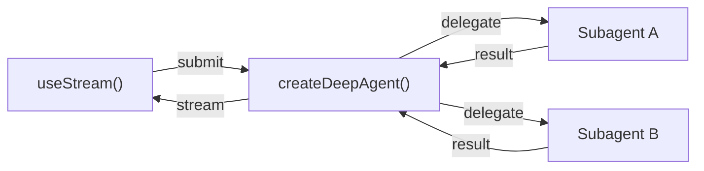
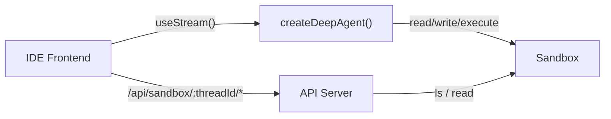
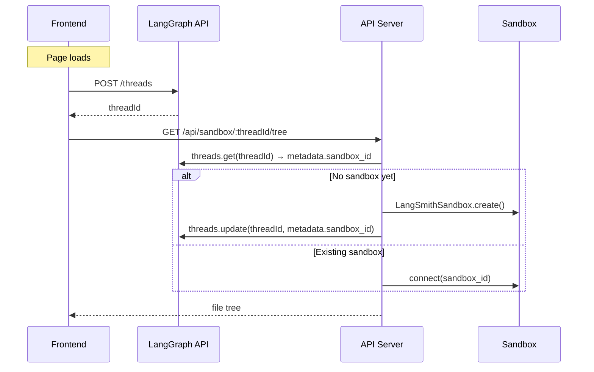

# Frontend - Deep Agent 前端开发

> 构建实时显示 subagent 流、任务进度和 sandbox 的 UI

构建可视化 deep agent 工作流的实时前端。这些模式展示了如何从使用 `createDeepAgent` 创建的 agent 中渲染 subagent 进度、任务规划、流式传输内容和 IDE 风格的 sandbox 体验。

## 架构

Deep Agents 使用 coordinator-worker 架构。主 agent 规划任务并委派给专业化的 subagent，每个 subagent 在隔离环境中运行。在前端，`useStream` 同时展示协调器的消息和每个 subagent 的流式传输状态。



```python
from deepagents import create_deep_agent

agent = create_deep_agent(
    model="google_genai:gemini-3.5-flash",
    tools=[get_weather],
    system_prompt="You are a helpful assistant",
    subagents=[
        {
            "name": "researcher",
            "description": "Research assistant",
        }
    ],
)
```

在前端，使用 `useStream` 连接方式与 `createAgent` 相同。Deep agent 模式使用额外的 `useStream` 功能，如 `stream.subagents`、`stream.values.todos` 和 `filterSubagentMessages` 来渲染 subagent 特定的 UI。

```ts
import { useStream } from "@langchain/react";

function App() {
  const stream = useStream<typeof agent>({
    apiUrl: "http://localhost:2024",
    assistantId: "agent",
  });

  // Deep agent 状态（超越消息）
  const todos = stream.values?.todos;
  const subagents = stream.subagents;
}
```

---

# Subagent Streaming - Subagent 流式传输

> 显示专业化的 subagent，包含流式传输内容、进度跟踪和可折叠卡片

当协调器 agent 产生专业化 subagent（研究员、分析师、写作者）时，你需要将协调器的消息与每个 subagent 的流式传输输出分开渲染。在 `useStream` 中设置 `filterSubagentMessages: true` 来干净地分离这两个流，然后使用 `getSubagentsByMessage` 将每个 subagent 的进度卡片附加到触发它的协调器消息上。

## 为什么过滤 subagent 消息

不过滤时，每个 subagent 产生的每个 token 都会交错出现在协调器的消息流中，使其不可读。使用 `filterSubagentMessages: true`：

* `stream.messages` 仅包含协调器的消息
* 每个 subagent 的内容可通过 `stream.subagents` 和 `stream.getSubagentsByMessage` 访问
* UI 保持整洁：协调器的推理与专家的工作分离

## 设置 useStream

始终设置 `filterSubagentMessages: true`。这会从主消息流中移除 subagent token，让你独立渲染协调器的消息和 subagent 输出。

```tsx
import { useStream } from "@langchain/react";

const AGENT_URL = "http://localhost:2024";

export function DeepAgentChat() {
  const stream = useStream<typeof myAgent>({
    apiUrl: AGENT_URL,
    assistantId: "deep_agent_subagent_cards",
    filterSubagentMessages: true,
  });

  return (
    <div>
      {stream.messages.map((msg) => (
        <MessageWithSubagents
          key={msg.id}
          message={msg}
          subagents={stream.getSubagentsByMessage(msg.id)}
        />
      ))}
    </div>
  );
}
```

## 带 subgraph 流式传输的提交

提交消息时，启用 subgraph 流式传输并设置适当的递归限制：

```ts
stream.submit(
  { messages: [{ type: "human", content: text }] },
  { streamSubgraphs: true }
);
```

> Deep Agents 设置默认递归限制为 10,000，足以满足大多数多专家设置。

## SubagentStreamInterface

每个 subagent 暴露一个 `SubagentStreamInterface`，包含任务、状态和计时的元数据：

```ts
interface SubagentStreamInterface {
  id: string;
  status: "pending" | "running" | "complete" | "error";
  messages: BaseMessage[];
  result: string | undefined;
  toolCall: {
    id: string;
    name: string;
    args: {
      description: string;
      subagent_type: string;
      [key: string]: unknown;
    };
  };
  startedAt: number | undefined;
  completedAt: number | undefined;
}
```

| 属性 | 描述 |
|------|------|
| `id` | 此 subagent 实例的唯一标识符 |
| `status` | 生命周期状态：`pending` → `running` → `complete` 或 `error` |
| `messages` | Subagent 自己的消息流，实时更新 |
| `result` | 最终输出文本，仅在 `status` 为 `"complete"` 时可用 |
| `toolCall` | 产生此 subagent 的工具调用，包括任务元数据 |
| `toolCall.args.description` | 协调器分配给此 subagent 的任务描述 |
| `toolCall.args.subagent_type` | 专家的类型或名称 |
| `startedAt` | Subagent 开始执行的时间戳 |
| `completedAt` | Subagent 完成的时间戳 |

## 将 subagent 关联到消息

`getSubagentsByMessage` 方法返回由特定 AI 消息产生的 subagent：

```ts
const turnSubagents = stream.getSubagentsByMessage(msg.id);
```

## 构建 SubagentCard

每个 subagent 卡片显示专家的名称、任务描述、流式传输内容或最终结果，以及计时信息：

```tsx
function SubagentCard({ subagent }: { subagent: SubagentStreamInterface }) {
  const [expanded, setExpanded] = useState(true);
  const title = subagent.toolCall?.args?.subagent_type ?? `Agent ${subagent.id}`;
  const description = subagent.toolCall?.args?.description ?? "";
  const lastAIMessage = subagent.messages.filter(AIMessage.isInstance).at(-1);
  const displayContent = subagent.status === "complete"
    ? subagent.result
    : typeof lastAIMessage?.content === "string" ? lastAIMessage.content : "";
  const elapsed = getElapsedTime(subagent.startedAt, subagent.completedAt);

  return (
    <div className="rounded-lg border bg-white shadow-sm">
      <button onClick={() => setExpanded(!expanded)} className="flex w-full items-center justify-between p-4">
        <div className="flex items-center gap-3">
          <StatusIcon status={subagent.status} />
          <div>
            <h4 className="font-semibold capitalize">{title}</h4>
            <p className="text-xs text-gray-500">{description}</p>
          </div>
        </div>
        <div className="flex items-center gap-2">
          {elapsed && <span className="text-xs text-gray-400">{elapsed}</span>}
          <StatusBadge status={subagent.status} />
        </div>
      </button>
      {expanded && displayContent && (
        <div className="border-t px-4 py-3">
          <div className="prose prose-sm max-w-none line-clamp-6">
            {displayContent}
            {subagent.status === "running" && <span className="inline-block h-4 w-1 animate-pulse bg-blue-500" />}
          </div>
        </div>
      )}
    </div>
  );
}
```

## 状态图标和徽章

```tsx
function StatusIcon({ status }: { status: SubagentStreamInterface["status"] }) {
  switch (status) {
    case "pending": return <span className="text-gray-400">○</span>;
    case "running": return <span className="animate-spin text-blue-500">◉</span>;
    case "complete": return <span className="text-green-500">✓</span>;
    case "error": return <span className="text-red-500">✕</span>;
  }
}
```

## 进度跟踪

```tsx
function SubagentProgress({ subagents }: { subagents: SubagentStreamInterface[] }) {
  const completed = subagents.filter((s) => s.status === "complete").length;
  const total = subagents.length;
  const percentage = total > 0 ? Math.round((completed / total) * 100) : 0;

  return (
    <div className="space-y-1">
      <div className="flex items-center justify-between text-xs text-gray-500">
        <span>Subagent progress</span>
        <span>{completed}/{total} complete</span>
      </div>
      <div className="h-2 overflow-hidden rounded-full bg-gray-200">
        <div className="h-full rounded-full bg-blue-500 transition-all duration-300" style={{ width: `${percentage}%` }} />
      </div>
    </div>
  );
}
```

## 渲染带 subagent 卡片的消息

关键布局模式是渲染每个协调器消息，如果该消息产生了 subagent，立即在其下方渲染它们的卡片：

```tsx
function MessageWithSubagents({ message, subagents }: { message: BaseMessage; subagents: SubagentStreamInterface[] }) {
  if (message.type === "human") return <HumanMessage content={message.content} />;

  return (
    <div className="space-y-3">
      {message.content && <div className="prose prose-sm max-w-none">{message.content}</div>}
      {subagents.length > 0 && (
        <div className="ml-4 space-y-3 border-l-2 border-blue-200 pl-4">
          <SubagentProgress subagents={subagents} />
          {subagents.map((subagent) => <SubagentCard key={subagent.id} subagent={subagent} />)}
        </div>
      )}
    </div>
  );
}
```

## 综合指示器

所有 subagent 完成后，协调器需要时间来综合结果。在此阶段显示清晰的指示器：

```tsx
function SynthesisIndicator({ subagents, isLoading }: { subagents: SubagentStreamInterface[]; isLoading: boolean }) {
  const allComplete = subagents.length > 0 && subagents.every((s) => s.status === "complete" || s.status === "error");
  if (!allComplete || !isLoading) return null;

  return (
    <div className="flex items-center gap-2 rounded-lg bg-purple-50 px-4 py-2 text-sm text-purple-700">
      <span className="animate-spin">⟳</span>
      Synthesizing results from {subagents.length} subagent{subagents.length !== 1 ? "s" : ""}...
    </div>
  );
}
```

## 访问完整的 subagents 映射

除了按消息查找，你还可以通过 `stream.subagents` 一次访问所有 subagent：

```ts
const allSubagents = [...stream.subagents.values()];
const running = allSubagents.filter((s) => s.status === "running");
const completed = allSubagents.filter((s) => s.status === "complete");
```

---

# Todo List - 待办事项列表

> 使用从 agent 状态同步的实时待办事项列表跟踪 agent 进度

并非每个 agent 交互都是聊天。有时 agent 正在执行多步骤计划，展示进度的最佳方式是实时更新的**待办事项列表**。Deep agent 待办事项列表模式直接从 agent 的状态读取 `todos` 数组，在 agent 执行计划时渲染每个项目及其当前状态。

## 工作原理

在 LangGraph agent 中，状态不限于消息。你可以定义**自定义状态键**来保存任意数据。在这种情况下，是一个 `todos` 数组。随着 agent 执行计划，它将每个 todo 的状态从 `"pending"` 转换为 `"in_progress"` 再到 `"completed"`。`useStream` hook 通过 `stream.values` 暴露这些自定义状态值。

流程：
1. 用户提交请求
2. Agent 创建计划并在状态中填充 `todos`
3. Agent 开始执行每个 todo，状态转换 `pending` → `in_progress` → `completed`
4. `stream.values.todos` 随 agent 进度实时更新
5. UI 使用当前状态重新渲染待办事项列表

## 设置 useStream

无需特殊配置。将 `useStream` 指向你的 agent 并从 `stream.values` 读取 `todos`。

```tsx
import { useStream } from "@langchain/react";

const AGENT_URL = "http://localhost:2024";

export function TodoAgent() {
  const stream = useStream<typeof myAgent>({
    apiUrl: AGENT_URL,
    assistantId: "deep_agent_todo_list",
  });

  const todos = stream.values?.todos ?? [];

  return (
    <div>
      <TodoList todos={todos} />
      {stream.messages.map((msg) => <Message key={msg.id} message={msg} />)}
    </div>
  );
}
```

## Todo 接口

```ts
interface Todo {
  status: "pending" | "in_progress" | "completed";
  content: string;
}
```

| 属性 | 描述 |
|------|------|
| `status` | 此任务的当前状态。选项：`pending`（未开始）、`in_progress`（agent 正在处理）、`completed`（完成） |
| `content` | 任务内容的人类可读描述 |

## 构建 TodoList 组件

```tsx
function TodoList({ todos }: { todos: Todo[] }) {
  const completed = todos.filter((t) => t.status === "completed").length;
  const percentage = todos.length ? Math.round((completed / todos.length) * 100) : 0;

  return (
    <div className="rounded-lg border bg-white p-4 shadow-sm">
      <div className="mb-4 flex items-center justify-between">
        <h2 className="text-lg font-semibold">Agent Progress</h2>
        <span className="text-sm text-gray-500">{completed}/{todos.length} tasks</span>
      </div>
      <ProgressBar percentage={percentage} />
      <ul className="mt-4 space-y-2">
        {todos.map((todo, i) => <TodoItem key={i} todo={todo} />)}
      </ul>
    </div>
  );
}
```

## 单个 todo 项目

```tsx
function TodoItem({ todo }: { todo: Todo }) {
  const config = {
    pending: { icon: "○", textClass: "text-gray-600", bgClass: "bg-gray-50", iconClass: "text-gray-400" },
    in_progress: { icon: "◉", textClass: "text-amber-800", bgClass: "bg-amber-50 border-amber-200", iconClass: "text-amber-500 animate-pulse" },
    completed: { icon: "✓", textClass: "text-green-800 line-through", bgClass: "bg-green-50 border-green-200", iconClass: "text-green-500" },
  };
  const style = config[todo.status];

  return (
    <li className={`flex items-start gap-3 rounded-md border px-3 py-2 ${style.bgClass}`}>
      <span className={`mt-0.5 text-lg leading-none ${style.iconClass}`}>{style.icon}</span>
      <span className={`text-sm ${style.textClass}`}>{todo.content}</span>
    </li>
  );
}
```

## 自定义状态超越 todos

此模式展示了一个强大原则：`stream.values` 可以暴露 agent 定义的**任何自定义状态**，而不仅仅是消息。`todos` 数组只是一个例子：

```ts
const document = stream.values?.document;
const sources = stream.values?.sources ?? [];
const confidence = stream.values?.confidence_score;
```

---

# Sandbox - Sandbox IDE UI

> 为编码 agent 构建由 sandbox 环境支持的 IDE 风格 UI

编码 agent 需要的不仅仅是聊天窗口。他们需要文件浏览器、代码查看器和 diff 面板——IDE 体验。此模式将 deep agent 连接到 [sandbox](/oss/python/deepagents/sandboxes)，使其能在隔离环境中读取、编写和执行代码，然后通过自定义 API 服务器暴露 sandbox 文件系统，让前端在 agent 工作时实时显示文件。

## 架构

Sandbox 模式有三层：

1. **带有 sandbox 后端的 deep agent** — Agent 自动从 sandbox 获得文件系统工具（`read_file`、`write_file`、`edit_file`、`execute`）
2. **自定义 API 服务器** — 通过 `langgraph.json` 的 `http.app` 字段暴露的 FastAPI 应用
3. **IDE 前端** — 三面板布局（文件树、代码/diff 查看器、聊天）



## Sandbox 生命周期

### Thread-scoped sandbox（推荐）

每个 LangGraph thread 拥有自己的 sandbox。Sandbox ID 存储在 thread 的元数据中，通过 `getConfig()` 在运行时解析。

* 对话隔离 — 一个 thread 中的文件更改不影响另一个
* Sandbox 状态跨页面重载持久化
* 清理简单：thread 删除时，其 sandbox 也可以删除



### Agent-scoped sandbox

同一 assistant 下的所有 thread 共享一个 sandbox。适用于持久项目环境。

### User-scoped sandbox

每个用户跨所有 thread 拥有自己的 sandbox。需要自定义认证和用户标识。

## 设置 Agent

### 选择 sandbox 提供商

```python
from deepagents import create_deep_agent
from deepagents.sandbox import LangSmithSandbox

sandbox = LangSmithSandbox.create()
agent = create_deep_agent(model="google_genai:gemini-3.5-flash", backend=sandbox)
```

Agent 自动获得文件系统工具（`read_file`、`write_file`、`edit_file`、`ls`、`glob`、`grep`）和 `execute` 工具。

### 每个 thread 解析 sandbox

```python
from deepagents import create_deep_agent
from deepagents.sandbox import LangSmithSandbox
from langgraph.config import get_config

def get_or_create_sandbox_for_thread(thread_id: str) -> LangSmithSandbox:
    ...

sandbox = LangSmithSandbox(
    resolve=lambda: get_or_create_sandbox_for_thread(
        get_config()["configurable"]["thread_id"]
    ),
)

agent = create_deep_agent(model="google_genai:gemini-3.5-flash", backend=sandbox)
```

## 添加文件浏览 API

### 创建 API 服务器

```python
# src/api/server.py
from fastapi import FastAPI, Query, Path
from utils import get_or_create_sandbox_for_thread

app = FastAPI()

@app.get("/api/sandbox/{thread_id}/tree")
async def list_tree(thread_id: str = Path(...), path: str = Query("/app")):
    sandbox = await get_or_create_sandbox_for_thread(thread_id)
    result = await sandbox.aexecute(f"find {path} -printf '%y\\t%s\\t%p\\n' 2>/dev/null | sort")
    entries = []
    for line in result.output.strip().split("\n"):
        if not line: continue
        type_char, size_str, full_path = line.split("\t")
        entries.append({
            "name": full_path.split("/")[-1],
            "type": "directory" if type_char == "d" else "file",
            "path": full_path,
            "size": int(size_str),
        })
    return {"path": path, "entries": entries, "sandbox_id": sandbox.id}

@app.get("/api/sandbox/{thread_id}/file")
async def read_file(thread_id: str = Path(...), path: str = Query(...)):
    sandbox = await get_or_create_sandbox_for_thread(thread_id)
    results = await sandbox.adownload_files([path])
    return {"path": path, "content": results[0].content.decode()}
```

### 配置 langgraph.json

```json
{
  "graphs": {
    "coding_agent": "./src/agents/my_agent.py:agent"
  },
  "env": ".env",
  "http": {
    "app": "./src/api/server.py:app"
  }
}
```

## 构建前端

### Thread 创建

页面加载时创建 LangGraph thread 并在 `sessionStorage` 中持久化其 ID：

```tsx
const THREAD_KEY = "sandbox-thread-id";

function IDEPreview() {
  const [threadId, setThreadId] = useState<string | null>(() => sessionStorage.getItem(THREAD_KEY));

  const updateThreadId = useCallback((id: string | null) => {
    setThreadId(id);
    if (id) sessionStorage.setItem(THREAD_KEY, id);
    else sessionStorage.removeItem(THREAD_KEY);
  }, []);

  const stream = useStream<typeof myAgent>({
    apiUrl: AGENT_URL,
    assistantId: "coding_agent",
    threadId,
    onThreadId: updateThreadId,
  });

  useEffect(() => {
    if (threadId) return;
    stream.client.threads.create().then((t) => updateThreadId(t.thread_id));
  }, [stream.client, threadId, updateThreadId]);

  const { tree, files } = useSandboxFiles(threadId);
}
```

### 实时文件同步

IDE 体验的关键是在 agent 工作时**实时更新文件**，而不是在完成之后。监控流中的 `ToolMessage` 实例：

```tsx
const FILE_MUTATING_TOOLS = new Set(["write_file", "edit_file", "execute"]);

useEffect(() => {
  const toolCallMap = new Map();
  for (const msg of stream.messages) {
    if (!AIMessage.isInstance(msg)) continue;
    for (const tc of msg.tool_calls ?? []) {
      if (tc.id && FILE_MUTATING_TOOLS.has(tc.name)) {
        toolCallMap.set(tc.id, { name: tc.name, args: tc.args });
      }
    }
  }

  for (const msg of stream.messages) {
    if (!ToolMessage.isInstance(msg)) continue;
    const id = msg.id ?? msg.tool_call_id;
    if (!id || processedIds.current.has(id)) continue;
    const call = toolCallMap.get(msg.tool_call_id);
    if (!call) continue;
    processedIds.current.add(id);

    if (call.name === "write_file" || call.name === "edit_file") {
      refreshSingleFile(call.args.path);
    } else if (call.name === "execute") {
      refreshAllFiles();
    }
  }
}, [stream.messages]);
```

### 三面板布局

| 面板 | 宽度 | 用途 |
|------|------|------|
| 文件树 | 固定（208px） | 浏览 sandbox 文件，查看更改指示器 |
| 代码/Diff | 灵活 | 查看文件内容或统一 diff |
| 聊天 | 固定（320px） | 与 agent 交互 |

```tsx
<div className="flex h-screen">
  <div className="w-52 shrink-0">
    <FileTree />
    <ChangedFilesSummary />
  </div>
  <CodePanel />
  <div className="w-80 shrink-0">
    <ChatPanel />
  </div>
</div>
```

## 最佳实践

* **使用 thread-scoped sandbox** — 将 sandbox ID 存储在 thread 元数据中
* **共享 `getOrCreateSandboxForThread`** — Agent 后端和 API 服务器使用相同函数
* **在 `sessionStorage` 中持久化 `threadId`** — 页面重载时重连到同一 thread
* **在每个相关工具调用时同步文件** — 监控 `write_file`、`edit_file`、`execute`
* **更改文件默认显示 diff 视图**
* **用真实项目 seed sandbox** — 空 sandbox 令人困惑
* **从文件树中过滤 `node_modules`**
