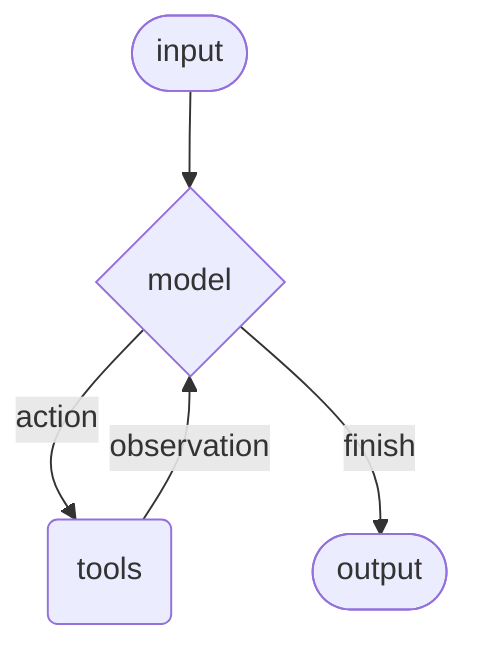

# Agents（智能体）

Agents 将语言模型与[工具](/oss/python/langchain/tools)结合，创建能够推理任务、决定使用哪些工具、并迭代地朝着解决方案工作的系统。

[`create_agent`](https://reference.langchain.com/python/langchain/agents/factory/create_agent) 提供了一个生产级的 Agent 实现。

[一个 LLM Agent 在循环中运行工具来实现目标](https://simonwillison.net/2025/Sep/18/agents/)。
Agent 会一直运行直到满足停止条件——即模型发出最终输出或达到迭代限制。



> [`create_agent`](https://reference.langchain.com/python/langchain/agents/factory/create_agent) 使用 [LangGraph](/oss/python/langgraph/overview) 构建一个**基于图（graph）**的 Agent 运行时。图由节点（步骤）和边（连接）组成，定义了 Agent 如何处理信息。Agent 在图中移动，执行模型节点（调用模型）、工具节点（执行工具）或中间件等节点。
> 
> 了解更多关于 [Graph API](/oss/python/langgraph/graph-api)。

> 使用 [LangSmith](https://smith.langchain.com) 追踪循环的每一步、调试工具调用、评估 Agent 输出。请参阅[追踪快速入门](/langsmith/trace-with-langchain)进行设置。

---

## 核心组件

### Model（模型）

[模型](/oss/python/langchain/models)是 Agent 的推理引擎。可以通过多种方式指定，支持静态和动态模型选择。

#### 静态模型（Static model）

静态模型在创建 Agent 时配置一次，在整个执行过程中保持不变。这是最常见和最直接的方法。

从<Tooltip tip="遵循 `provider:model` 格式的字符串（例如 openai:gpt-5）">模型标识字符串</Tooltip>初始化静态模型：

```python
from langchain.agents import create_agent

agent = create_agent("openai:gpt-5.4", tools=tools)
```

> 模型标识字符串支持自动推断（例如 `"gpt-5.4"` 会被推断为 `"openai:gpt-5.4"`）。请参阅[参考文档](https://reference.langchain.com/python/langchain/chat_models/base/init_chat_model)查看完整的模型标识字符串映射列表。

要对模型配置进行更精细的控制，可以使用 provider 包直接初始化模型实例。以下示例使用 [`ChatOpenAI`](https://reference.langchain.com/python/langchain-openai/chat_models/base/ChatOpenAI)。请参阅 [Chat models](/oss/python/integrations/chat) 了解其他可用的聊天模型类。

```python
from langchain.agents import create_agent
from langchain_openai import ChatOpenAI

model = ChatOpenAI(
    model="gpt-5.4",
    temperature=0.1,
    max_tokens=1000,
    timeout=30
    # ... (其他参数)
)
agent = create_agent(model, tools=tools)
```

模型实例让你完全控制配置。当你需要设置特定[参数](/oss/python/langchain/models#parameters)（如 `temperature`、`max_tokens`、`timeouts`、`base_url` 和其他 provider 特定设置）时使用它们。

#### 动态模型（Dynamic model）

动态模型在**运行时**根据当前**状态**和**上下文**进行选择。这支持复杂的路由逻辑和成本优化。

要使用动态模型，使用 [`@wrap_model_call`](https://reference.langchain.com/python/langchain/agents/middleware/types/wrap_model_call) 装饰器创建中间件来修改请求中的模型：

```python
from langchain_openai import ChatOpenAI
from langchain.agents import create_agent
from langchain.agents.middleware import wrap_model_call, ModelRequest, ModelResponse


basic_model = ChatOpenAI(model="gpt-5.4-mini")
advanced_model = ChatOpenAI(model="gpt-5.4")

@wrap_model_call
def dynamic_model_selection(request: ModelRequest, handler) -> ModelResponse:
    """根据对话复杂度选择模型。"""
    message_count = len(request.state["messages"])

    if message_count > 10:
        # 对较长的对话使用高级模型
        model = advanced_model
    else:
        model = basic_model

    return handler(request.override(model=model))

agent = create_agent(
    model=basic_model,  # 默认模型
    tools=tools,
    middleware=[dynamic_model_selection]
)
```

> **警告：** 使用结构化输出时，不支持预绑定模型（已调用 [`bind_tools`](https://reference.langchain.com/python/langchain-core/language_models/chat_models/BaseChatModel/bind_tools) 的模型）。如果需要带有结构化输出的动态模型选择，请确保传递给中间件的模型未被预绑定。

---

### Tools（工具）

工具赋予 Agent 执行动作的能力。Agent 超越了简单的仅模型工具绑定，支持：

* 顺序多次工具调用（由单个提示触发）
* 适当时并行工具调用
* 基于先前结果的动态工具选择
* 工具重试逻辑和错误处理
* 跨工具调用的状态持久化

更多信息请参阅 [Tools](/oss/python/langchain/tools)。

#### 静态工具（Static tools）

静态工具在创建 Agent 时定义，在整个执行过程中保持不变。

> 工具可以指定为普通 Python 函数或协程（coroutine）。
> 
> [工具装饰器](/oss/python/langchain/tools#create-tools)可用于自定义工具名称、描述、参数模式和其他属性。

```python
from langchain.tools import tool
from langchain.agents import create_agent


@tool
def search(query: str) -> str:
    """搜索信息。"""
    return f"Results for: {query}"

@tool
def get_weather(location: str) -> str:
    """获取指定位置的天气信息。"""
    return f"Weather in {location}: Sunny, 72°F"

agent = create_agent(model, tools=[search, get_weather])
```

如果提供了空的工具列表，Agent 将只包含一个没有工具调用能力的 LLM 节点。

#### 动态工具（Dynamic tools）

使用动态工具，Agent 可用的工具集在运行时被修改，而不是全部预先定义。并非每个工具都适合每种情况。过多的工具可能会让模型不堪重负（过载上下文）并增加错误；太少则限制能力。动态工具选择允许根据认证状态、用户权限、功能标志或对话阶段调整可用工具集。

有两种方法，取决于工具是否提前已知：

**方式一：过滤预注册的工具**

当所有可能的工具在 Agent 创建时已知，可以预注册它们，并根据状态、权限或上下文动态过滤哪些工具暴露给模型。

基于状态的过滤：

```python
from langchain.agents import create_agent
from langchain.agents.middleware import wrap_model_call, ModelRequest, ModelResponse
from typing import Callable

@wrap_model_call
def state_based_tools(
    request: ModelRequest,
    handler: Callable[[ModelRequest], ModelResponse]
) -> ModelResponse:
    """根据对话状态过滤工具。"""
    state = request.state
    is_authenticated = state.get("authenticated", False)
    message_count = len(state["messages"])

    if not is_authenticated:
        tools = [t for t in request.tools if t.name.startswith("public_")]
        request = request.override(tools=tools)
    elif message_count < 5:
        tools = [t for t in request.tools if t.name != "advanced_search"]
        request = request.override(tools=tools)

    return handler(request)

agent = create_agent(
    model="gpt-5.4",
    tools=[public_search, private_search, advanced_search],
    middleware=[state_based_tools]
)
```

基于 Store 的过滤：

```python
from dataclasses import dataclass
from langchain.agents import create_agent
from langchain.agents.middleware import wrap_model_call, ModelRequest, ModelResponse
from typing import Callable
from langgraph.store.memory import InMemoryStore

@dataclass
class Context:
    user_id: str

@wrap_model_call
def store_based_tools(
    request: ModelRequest,
    handler: Callable[[ModelRequest], ModelResponse]
) -> ModelResponse:
    """根据 Store 中的偏好过滤工具。"""
    user_id = request.runtime.context.user_id
    store = request.runtime.store
    feature_flags = store.get(("features",), user_id)

    if feature_flags:
        enabled_features = feature_flags.value.get("enabled_tools", [])
        tools = [t for t in request.tools if t.name in enabled_features]
        request = request.override(tools=tools)

    return handler(request)

agent = create_agent(
    model="gpt-5.4",
    tools=[search_tool, analysis_tool, export_tool],
    middleware=[store_based_tools],
    context_schema=Context,
    store=InMemoryStore()
)
```

基于运行时上下文的过滤：

```python
from dataclasses import dataclass
from langchain.agents import create_agent
from langchain.agents.middleware import wrap_model_call, ModelRequest, ModelResponse
from typing import Callable

@dataclass
class Context:
    user_role: str

@wrap_model_call
def context_based_tools(
    request: ModelRequest,
    handler: Callable[[ModelRequest], ModelResponse]
) -> ModelResponse:
    """根据运行时上下文权限过滤工具。"""
    if request.runtime is None or request.runtime.context is None:
        user_role = "viewer"
    else:
        user_role = request.runtime.context.user_role

    if user_role == "admin":
        pass
    elif user_role == "editor":
        tools = [t for t in request.tools if t.name != "delete_data"]
        request = request.override(tools=tools)
    else:
        tools = [t for t in request.tools if t.name.startswith("read_")]
        request = request.override(tools=tools)

    return handler(request)

agent = create_agent(
    model="gpt-5.4",
    tools=[read_data, write_data, delete_data],
    middleware=[context_based_tools],
    context_schema=Context
)
```

这种方法适用于：

* 所有可能的工具在编译/启动时已知
* 你想基于权限、功能标志或对话状态进行过滤
* 工具是静态的但其可用性是动态的

**方式二：运行时工具注册**

当工具在运行时被发现或创建时（例如从 MCP 服务器加载、基于用户数据生成、或从远程注册表获取），需要同时注册工具并动态处理其执行。

这需要两个中间件钩子：

1. `wrap_model_call` - 将动态工具添加到请求中
2. `wrap_tool_call` - 处理动态添加的工具的执行

```python
from langchain.tools import tool
from langchain.agents import create_agent
from langchain.agents.middleware import AgentMiddleware, ModelRequest, ToolCallRequest

@tool
def calculate_tip(bill_amount: float, tip_percentage: float = 20.0) -> str:
    """计算账单的小费金额。"""
    tip = bill_amount * (tip_percentage / 100)
    return f"Tip: ${tip:.2f}, Total: ${bill_amount + tip:.2f}"

class DynamicToolMiddleware(AgentMiddleware):
    """注册和处理动态工具的中间件。"""

    def wrap_model_call(self, request: ModelRequest, handler):
        updated = request.override(tools=[*request.tools, calculate_tip])
        return handler(updated)

    def wrap_tool_call(self, request: ToolCallRequest, handler):
        if request.tool_call["name"] == "calculate_tip":
            return handler(request.override(tool=calculate_tip))
        return handler(request)

agent = create_agent(
    model="gpt-4o",
    tools=[get_weather],
    middleware=[DynamicToolMiddleware()],
)

# Agent 现在可以同时使用 get_weather 和 calculate_tip
result = agent.invoke({
    "messages": [{"role": "user", "content": "Calculate a 20% tip on $85"}]
})
```

> **注意：** 对于运行时注册的工具，`wrap_tool_call` 钩子是必需的，因为 Agent 需要知道如何执行不在原始工具列表中的工具。没有它，Agent 将不知道如何调用动态添加的工具。

---

#### 工具错误处理

要自定义工具错误的处理方式，使用 [`@wrap_tool_call`](https://reference.langchain.com/python/langchain/agents/middleware/types/wrap_tool_call) 装饰器创建中间件：

```python
from langchain.agents import create_agent
from langchain.agents.middleware import wrap_tool_call
from langchain.messages import ToolMessage


@wrap_tool_call
def handle_tool_errors(request, handler):
    """使用自定义消息处理工具执行错误。"""
    try:
        return handler(request)
    except Exception as e:
        return ToolMessage(
            content=f"Tool error: Please check your input and try again. ({str(e)})",
            tool_call_id=request.tool_call["id"]
        )

agent = create_agent(
    model="gpt-5.4",
    tools=[search, get_weather],
    middleware=[handle_tool_errors]
)
```

当工具失败时，Agent 将返回带有自定义错误消息的 [`ToolMessage`](https://reference.langchain.com/python/langchain-core/messages/tool/ToolMessage)：

```python
[
    ...
    ToolMessage(
        content="Tool error: Please check your input and try again. (division by zero)",
        tool_call_id="..."
    ),
    ...
]
```

---

#### ReAct 循环中的工具使用

Agent 遵循 ReAct（"推理 + 行动"）模式，在简短的推理步骤和有针对性的工具调用之间交替，并将结果观察（observation）反馈到后续决策中，直到能够给出最终答案。

**ReAct 循环示例：**

**提示：** 识别当前最受欢迎的无线耳机并验证其可用性。

```
================================ Human Message =================================

Find the most popular wireless headphones right now and check if they're in stock
```

* **推理**："流行度是有时效性的，我需要使用搜索工具。"
* **行动**：调用 `search_products("wireless headphones")`

```
================================== Ai Message ==================================
Tool Calls:
  search_products (call_abc123)
 Call ID: call_abc123
  Args:
    query: wireless headphones
```

```
================================= Tool Message =================================

Found 5 products matching "wireless headphones". Top 5 results: WH-1000XM5, ...
```

* **推理**："我需要在回答之前确认排名最高产品的可用性。"
* **行动**：调用 `check_inventory("WH-1000XM5")`

```
================================== Ai Message ==================================
Tool Calls:
  check_inventory (call_def456)
 Call ID: call_def456
  Args:
    product_id: WH-1000XM5
```

```
================================= Tool Message =================================

Product WH-1000XM5: 10 units in stock
```

* **推理**："我已获得最受欢迎的型号及其库存状态。现在可以回答用户的问题了。"
* **行动**：生成最终答案

```
================================== Ai Message ==================================

I found wireless headphones (model WH-1000XM5) with 10 units in stock...
```

---

### System prompt（系统提示）

你可以通过提供提示来塑造 Agent 处理任务的方式。[`system_prompt`](https://reference.langchain.com/python/langchain/agents/#langchain.agents.create_agent\(system_prompt\)) 参数可以作为字符串提供：

```python
agent = create_agent(
    model,
    tools,
    system_prompt="You are a helpful assistant. Be concise and accurate."
)
```

当没有提供 `system_prompt` 时，Agent 将直接从消息中推断其任务。

`system_prompt` 参数接受 `str` 或 [`SystemMessage`](https://reference.langchain.com/python/langchain-core/messages/system/SystemMessage)。使用 `SystemMessage` 可以更好地控制提示结构，这对于 provider 特定功能（如 [Anthropic 的提示缓存](/oss/python/integrations/chat/anthropic#prompt-caching)）很有用：

```python
from langchain.agents import create_agent
from langchain.messages import SystemMessage, HumanMessage

literary_agent = create_agent(
    model="google_genai:gemini-3.1-pro-preview",
    system_prompt=SystemMessage(
        content=[
            {
                "type": "text",
                "text": "You are an AI assistant tasked with analyzing literary works.",
            },
            {
                "type": "text",
                "text": "<the entire contents of 'Pride and Prejudice'>",
                "cache_control": {"type": "ephemeral"}
            }
        ]
    )
)

result = literate_agent.invoke(
    {"messages": [HumanMessage("Analyze the major themes in 'Pride and Prejudice'.")]}
)
```

`cache_control` 字段中的 `{"type": "ephemeral"}` 告诉 Anthropic 缓存该内容块，减少重复请求的延迟和成本。

#### 动态系统提示（Dynamic system prompt）

对于需要根据运行时上下文或 Agent 状态修改系统提示的更高级用例，可以使用[中间件](/oss/python/langchain/middleware)。

[`@dynamic_prompt`](https://reference.langchain.com/python/langchain/agents/middleware/types/dynamic_prompt) 装饰器创建基于模型请求生成系统提示的中间件：

```python
from typing import TypedDict

from langchain.agents import create_agent
from langchain.agents.middleware import dynamic_prompt, ModelRequest


class Context(TypedDict):
    user_role: str

@dynamic_prompt
def user_role_prompt(request: ModelRequest) -> str:
    """根据用户角色生成系统提示。"""
    user_role = request.runtime.context.get("user_role", "user")
    base_prompt = "You are a helpful assistant."

    if user_role == "expert":
        return f"{base_prompt} Provide detailed technical responses."
    elif user_role == "beginner":
        return f"{base_prompt} Explain concepts simply and avoid jargon."

    return base_prompt

agent = create_agent(
    model="gpt-5.4",
    tools=[web_search],
    middleware=[user_role_prompt],
    context_schema=Context
)

# 系统提示将根据上下文动态设置
result = agent.invoke(
    {"messages": [{"role": "user", "content": "Explain machine learning"}]},
    context={"user_role": "expert"}
)
```

---

### Name（名称）

为 Agent 设置一个可选的 [`name`](https://reference.langchain.com/python/langchain/agents/factory/create_agent)。在[多 Agent 系统](/oss/python/langchain/multi-agent)中将 Agent 作为子图添加时，这用作节点标识符：

```python
agent = create_agent(
    model,
    tools,
    name="research_assistant"
)
```

> **警告：** Agent 名称建议使用 `snake_case`（例如 `research_assistant` 而不是 `Research Assistant`）。某些模型提供商会拒绝包含空格或特殊字符的名称并报错。仅使用字母数字字符、下划线和连字符可确保跨所有提供商的兼容性。同样的规则也适用于[工具名称](/oss/python/langchain/tools)。

---

## 调用（Invocation）

你可以通过向 Agent 的 [`State`](/oss/python/langgraph/graph-api#state) 传递更新来调用 Agent。所有 Agent 的状态中都包含一个[消息序列](/oss/python/langgraph/use-graph-api#messagesstate)；要调用 Agent，传递一个新消息：

```python
result = agent.invoke(
    {"messages": [{"role": "user", "content": "What's the weather in San Francisco?"}]}
)
```

要从 Agent 流式传输步骤和/或 token，请参阅[流式传输](/oss/python/langchain/streaming)指南。

Agent 遵循 LangGraph [Graph API](/oss/python/langgraph/use-graph-api) 并支持所有相关方法，如 `stream` 和 `invoke`。

---

## 高级概念

### 结构化输出（Structured output）

在某些情况下，你可能希望 Agent 以特定格式返回输出。LangChain 通过 [`response_format`](https://reference.langchain.com/python/langchain/agents/factory/create_agent) 参数提供结构化输出策略。

#### ToolStrategy

`ToolStrategy` 使用人工工具调用来生成结构化输出。这适用于任何支持工具调用的模型。当 provider 原生结构化输出（通过 `ProviderStrategy`）不可用或不可靠时，应使用 `ToolStrategy`。

```python
from pydantic import BaseModel
from langchain.agents import create_agent
from langchain.agents.structured_output import ToolStrategy


class ContactInfo(BaseModel):
    name: str
    email: str
    phone: str

agent = create_agent(
    model="gpt-5.4-mini",
    tools=[search_tool],
    response_format=ToolStrategy(ContactInfo)
)

result = agent.invoke({
    "messages": [{"role": "user", "content": "Extract contact info from: John Doe, john@example.com, (555) 123-4567"}]
})

result["structured_response"]
# ContactInfo(name='John Doe', email='john@example.com', phone='(555) 123-4567')
```

#### ProviderStrategy

`ProviderStrategy` 使用模型提供商的原生结构化输出生成。这更可靠，但仅适用于支持原生结构化输出的提供商：

```python
from langchain.agents.structured_output import ProviderStrategy

agent = create_agent(
    model="gpt-5.4",
    response_format=ProviderStrategy(ContactInfo)
)
```

> 在 `langchain 1.0` 中，简单传递 schema（例如 `response_format=ContactInfo`）将默认使用 `ProviderStrategy`（如果模型支持原生结构化输出），否则将回退到 `ToolStrategy`。

---

### Memory（记忆）

Agent 通过消息状态自动维护对话历史。你还可以配置 Agent 使用自定义状态模式来在对话期间记住额外信息。

存储在状态中的信息可以被视为 Agent 的[短期记忆](/oss/python/langchain/short-term-memory)：

自定义状态模式必须作为 `TypedDict` 扩展 [`AgentState`](https://reference.langchain.com/python/langchain/agents/middleware/types/AgentState)。

有两种方式定义自定义状态：

1. 通过中间件（推荐）
2. 通过 `create_agent` 上的 `state_schema`

#### 通过中间件定义状态

当自定义状态需要被特定的中间件钩子和附加到该中间件的工具访问时，使用中间件定义自定义状态。

```python
from langchain.agents import AgentState
from langchain.agents.middleware import AgentMiddleware
from typing import Any


class CustomState(AgentState):
    user_preferences: dict

class CustomMiddleware(AgentMiddleware):
    state_schema = CustomState
    tools = [tool1, tool2]

    def before_model(self, state: CustomState, runtime) -> dict[str, Any] | None:
        ...

agent = create_agent(
    model,
    tools=tools,
    middleware=[CustomMiddleware()]
)

# Agent 现在可以跟踪消息之外的额外状态
result = agent.invoke({
    "messages": [{"role": "user", "content": "I prefer technical explanations"}],
    "user_preferences": {"style": "technical", "verbosity": "detailed"},
})
```

#### 通过 `state_schema` 定义状态

使用 `state_schema` 参数作为快捷方式来定义仅在工具中使用的自定义状态。

```python
from langchain.agents import AgentState


class CustomState(AgentState):
    user_preferences: dict

agent = create_agent(
    model,
    tools=[tool1, tool2],
    state_schema=CustomState
)
# Agent 现在可以跟踪消息之外的额外状态
result = agent.invoke({
    "messages": [{"role": "user", "content": "I prefer technical explanations"}],
    "user_preferences": {"style": "technical", "verbosity": "detailed"},
})
```

> 在 `langchain 1.0` 中，自定义状态模式**必须**是 `TypedDict` 类型。不再支持 Pydantic 模型和 dataclass。

> 通过中间件定义自定义状态优于通过 `state_schema` 定义，因为它允许你将状态扩展在概念上限定到相关的中间件和工具。`state_schema` 仍然向后兼容。

---

### Streaming（流式传输）

我们已经看到如何使用 `invoke` 调用 Agent 来获取最终响应。如果 Agent 执行多个步骤，这可能需要一段时间。为了显示中间进度，我们可以在消息出现时流式传输它们。

```python
from langchain.messages import AIMessage, HumanMessage

for chunk in agent.stream({
    "messages": [{"role": "user", "content": "Search for AI news and summarize the findings"}]
}, stream_mode="values"):
    # 每个 chunk 包含该时刻的完整状态
    latest_message = chunk["messages"][-1]
    if latest_message.content:
        if isinstance(latest_message, HumanMessage):
            print(f"User: {latest_message.content}")
        elif isinstance(latest_message, AIMessage):
            print(f"Agent: {latest_message.content}")
    elif latest_message.tool_calls:
        print(f"Calling tools: {[tc['name'] for tc in latest_message.tool_calls]}")
```

---

### Middleware（中间件）

[中间件](/oss/python/langchain/middleware)为自定义 Agent 行为提供了强大的可扩展性。你可以使用中间件来：

* 在调用模型之前处理状态（例如消息修剪、上下文注入）
* 修改或验证模型的响应（例如护栏、内容过滤）
* 使用自定义逻辑处理工具执行错误
* 基于状态或上下文实现动态模型选择
* 添加自定义日志、监控或分析

中间件无缝集成到 Agent 的执行中，允许你在关键点拦截和修改数据流，而无需更改核心 Agent 逻辑。

更多关于装饰器如 `@before_model`、`@after_model` 和 `@wrap_tool_call` 的详细信息，请参阅 [Middleware](/oss/python/langchain/middleware)。
