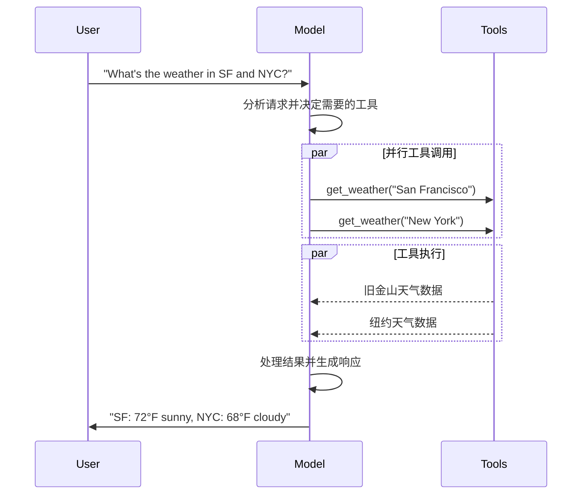

# Models（模型）

[大语言模型（LLM）](https://en.wikipedia.org/wiki/Large_language_model)是强大的 AI 工具，能够像人类一样理解和生成文本。它们足够通用，可以撰写内容、翻译语言、总结和回答问题，而无需为每个任务进行专门训练。

除了文本生成，许多模型还支持：

* **工具调用（Tool calling）** - 调用外部工具（如数据库查询或 API 调用）并在响应中使用结果。
* **结构化输出（Structured output）** - 模型的响应被约束为遵循定义的格式。
* **多模态（Multimodality）** - 处理和返回文本以外的数据，如图像、音频和视频。
* **推理（Reasoning）** - 模型执行多步推理以得出结论。

模型是 [Agent](/oss/python/langchain/agents) 的推理引擎。它们驱动 Agent 的决策过程，决定调用哪些工具、如何解释结果，以及何时提供最终答案。

你选择的模型的质量和能力直接影响 Agent 的基线可靠性和性能。不同的模型擅长不同的任务——有些更擅长遵循复杂指令，有些擅长结构化推理，有些支持更大的上下文窗口来处理更多信息。

LangChain 的标准模型接口让你可以访问许多不同的 provider 集成，这使得实验和切换模型变得容易，以找到最适合你用例的模型。

> 关于 provider 特定的集成信息和功能，请参阅 provider 的[聊天模型页面](/oss/python/integrations/chat)。

---

## 基本用法

模型可以通过两种方式使用：

1. **与 Agent 配合** - 创建 [Agent](/oss/python/langchain/agents#model) 时可以动态指定模型。
2. **独立使用** - 可以直接调用模型（在 Agent 循环之外），用于文本生成、分类或提取等任务，无需 Agent 框架。

相同的模型接口在两种上下文中都适用，这让你可以灵活地从简单开始，根据需要扩展到更复杂的基于 Agent 的工作流。

### 初始化模型

在 LangChain 中开始使用独立模型最简单的方法是使用 [`init_chat_model`](https://reference.langchain.com/python/langchain/chat_models/base/init_chat_model) 从你选择的聊天模型 provider 初始化：

**OpenAI：**

```bash
pip install -U "langchain[openai]"
```

```python
# 方式一：使用 init_chat_model
import os
from langchain.chat_models import init_chat_model

os.environ["OPENAI_API_KEY"] = "sk-..."

model = init_chat_model("gpt-5.4")

# 方式二：使用模型类
from langchain_openai import ChatOpenAI

model = ChatOpenAI(model="gpt-5.4")
```

**Anthropic：**

```bash
pip install -U "langchain[anthropic]"
```

```python
# 方式一
from langchain.chat_models import init_chat_model
os.environ["ANTHROPIC_API_KEY"] = "sk-..."
model = init_chat_model("claude-sonnet-4-6")

# 方式二
from langchain_anthropic import ChatAnthropic
model = ChatAnthropic(model="claude-sonnet-4-6")
```

**Google Gemini：**

```bash
pip install -U "langchain[google-genai]"
```

```python
# 方式一
from langchain.chat_models import init_chat_model
os.environ["GOOGLE_API_KEY"] = "..."
model = init_chat_model("google_genai:gemini-2.5-flash-lite")

# 方式二
from langchain_google_genai import ChatGoogleGenerativeAI
model = ChatGoogleGenerativeAI(model="gemini-2.5-flash-lite")
```

**AWS Bedrock：**

```bash
pip install -U "langchain[aws]"
```

```python
# 方式一
from langchain.chat_models import init_chat_model
model = init_chat_model(
    "anthropic.claude-3-5-sonnet-20240620-v1:0",
    model_provider="bedrock_converse",
)

# 方式二
from langchain_aws import ChatBedrock
model = ChatBedrock(model="anthropic.claude-3-5-sonnet-20240620-v1:0")
```

**HuggingFace：**

```bash
pip install -U "langchain[huggingface]"
```

```python
# 方式一
from langchain.chat_models import init_chat_model
os.environ["HUGGINGFACEHUB_API_TOKEN"] = "hf_..."
model = init_chat_model(
    "microsoft/Phi-3-mini-4k-instruct",
    model_provider="huggingface",
    temperature=0.7,
    max_tokens=1024,
)

# 方式二
from langchain_huggingface import ChatHuggingFace, HuggingFaceEndpoint
llm = HuggingFaceEndpoint(
    repo_id="microsoft/Phi-3-mini-4k-instruct",
    temperature=0.7,
    max_length=1024,
)
model = ChatHuggingFace(llm=llm)
```

**OpenRouter：**

```bash
pip install -U "langchain-openrouter"
```

```python
# 方式一
from langchain.chat_models import init_chat_model
os.environ["OPENROUTER_API_KEY"] = "sk-..."
model = init_chat_model("auto", model_provider="openrouter")

# 方式二
from langchain_openrouter import ChatOpenRouter
model = ChatOpenRouter(model="auto")
```

```python
response = model.invoke("Why do parrots talk?")
```

### 支持的 provider 和模型

LangChain 通过专用集成包支持所有主要模型 provider。每个 provider 包实现了相同的标准接口，因此你可以在不重写应用逻辑的情况下切换 provider。新的模型名称可以立即使用——无需 LangChain 更新——因为 provider 包将模型名称直接传递给 provider 的 API。

浏览[支持的 provider 完整列表](/oss/python/integrations/providers/overview)，或参阅 [Providers and models](/oss/python/concepts/providers-and-models) 了解 provider、包和模型名称在 LangChain 中如何协同工作的概念概述。

### 关键方法

| 方法 | 说明 |
|------|------|
| **Invoke** | 模型接收消息作为输入，在生成完整响应后输出消息。 |
| **Stream** | 调用模型，但在生成时实时流式输出。 |
| **Batch** | 以批处理方式向模型发送多个请求，以实现更高效的处理。 |

> 除了聊天模型，LangChain 还支持其他相关技术，如嵌入模型和向量存储。详见[集成页面](/oss/python/integrations/providers/overview)。

---

## 参数（Parameters）

聊天模型接受可用于配置其行为的参数。支持的完整参数集因模型和 provider 而异，但标准参数包括：

| 参数 | 类型 | 说明 |
|------|------|------|
| `model` | string (必填) | 要使用的特定模型的名称或标识符。也可以使用 `{model_provider}:{model}` 格式同时指定模型和 provider，例如 `'openai:o1'`。 |
| `api_key` | string | 与模型 provider 进行身份验证所需的密钥。通常通过设置环境变量访问。 |
| `temperature` | number | 控制模型输出的随机性。较高的数字使响应更有创意；较低的数字使它们更确定。 |
| `max_tokens` | number | 限制响应中的总 token 数，有效地控制输出可以有多长。 |
| `timeout` | number | 等待模型响应的最大时间（秒），超时后取消请求。 |
| `max_retries` | number (默认 6) | 如果请求因网络超时或速率限制等问题失败，系统将重新发送请求的最大尝试次数。重试使用指数退避和抖动。网络错误、速率限制 (429) 和服务器错误 (5xx) 会自动重试。客户端错误（如 401 未授权或 404）不会重试。对于不可靠网络上的长时间运行的 [Agent](/oss/python/deepagents/overview) 任务，考虑增加到 10-15。 |

使用 `init_chat_model`，将这些参数作为内联 `**kwargs` 传递：

```python
model = init_chat_model(
    "claude-sonnet-4-6",
    temperature=0.7,
    timeout=30,
    max_tokens=1000,
    max_retries=6,
)
```

### 连接弹性

LangChain 聊天模型会自动使用指数退避重试失败的 API 请求。默认情况下，模型对网络错误、速率限制 (429) 和服务器错误 (5xx) 最多重试 **6 次**。客户端错误（如 401 未授权或 404）不会重试。

你可以在创建模型时调整 `max_retries` 和 `timeout`，然后将该实例传递给 `create_agent`、`create_deep_agent` 或独立调用：

```python
from langchain.chat_models import init_chat_model

model = init_chat_model(
    "google_genai:gemini-3.1-pro-preview",
    max_retries=10,  # 不可靠网络时增加（默认：6）
    timeout=120,     # 秒；慢连接时增加
)
```

> 对于不可靠网络上的长时间运行的 Agent 图，考虑使用更高的 `max_retries`（例如 10-15）和 [checkpointer](/oss/python/langgraph/persistence)，以便在失败时保留进度。

> 每个聊天模型集成可能有额外的参数用于控制 provider 特定功能。例如，`ChatOpenAI` 有 `use_responses_api` 来决定使用 OpenAI Responses 还是 Completions API。要查找给定聊天模型支持的所有参数，请前往[聊天模型集成](/oss/python/integrations/chat)页面。

---

## 调用（Invocation）

聊天模型必须被调用才能生成输出。有三种主要调用方法，每种适用于不同的用例。

### Invoke

调用模型最直接的方式是使用 [`invoke()`](https://reference.langchain.com/python/langchain-core/language_models/chat_models/BaseChatModel/invoke) 传递单条消息或消息列表。

```python
# 单条消息
response = model.invoke("Why do parrots have colorful feathers?")
print(response)
```

可以向聊天模型提供消息列表来表示对话历史。每条消息都有一个角色，模型用它来指示对话中谁发送了消息。

```python
# 字典格式
conversation = [
    {"role": "system", "content": "You are a helpful assistant that translates English to French."},
    {"role": "user", "content": "Translate: I love programming."},
    {"role": "assistant", "content": "J'adore la programmation."},
    {"role": "user", "content": "Translate: I love building applications."}
]

response = model.invoke(conversation)
print(response)  # AIMessage("J'adore créer des applications.")
```

```python
# 消息对象格式
from langchain.messages import HumanMessage, AIMessage, SystemMessage

conversation = [
    SystemMessage("You are a helpful assistant that translates English to French."),
    HumanMessage("Translate: I love programming."),
    AIMessage("J'adore la programmation."),
    HumanMessage("Translate: I love building applications.")
]

response = model.invoke(conversation)
print(response)  # AIMessage("J'adore créer des applications.")
```

> 如果调用的返回类型是字符串，请确保你使用的是聊天模型而不是 LLM。旧版文本补全 LLM 直接返回字符串。LangChain 聊天模型以 "Chat" 为前缀，例如 `ChatOpenAI`。

### Stream

大多数模型可以在生成输出内容时进行流式传输。通过逐步显示输出，流式传输显著改善了用户体验，特别是对于较长的响应。

调用 [`stream()`](https://reference.langchain.com/python/langchain-core/language_models/chat_models/BaseChatModel/stream) 返回一个迭代器，它在产生时输出块。你可以使用循环实时处理每个块：

```python
# 基本文本流式传输
for chunk in model.stream("Why do parrots have colorful feathers?"):
    print(chunk.text, end="|", flush=True)

# 流式传输工具调用、推理和其他内容
for chunk in model.stream("What color is the sky?"):
    for block in chunk.content_blocks:
        if block["type"] == "reasoning" and (reasoning := block.get("reasoning")):
            print(f"Reasoning: {reasoning}")
        elif block["type"] == "tool_call_chunk":
            print(f"Tool call chunk: {block}")
        elif block["type"] == "text":
            print(block["text"])
```

与 `invoke()` 在模型完成生成完整响应后返回单个 `AIMessage` 不同，`stream()` 返回多个 `AIMessageChunk` 对象，每个包含部分输出文本。重要的是，流中的每个块设计为可以通过求和聚合成完整消息：

```python
full = None
for chunk in model.stream("What color is the sky?"):
    full = chunk if full is None else full + chunk
    print(full.text)

# The
# The sky
# The sky is
# The sky is typically
# The sky is typically blue
# ...

print(full.content_blocks)
# [{"type": "text", "text": "The sky is typically blue..."}]
```

> 流式传输仅在程序中的所有步骤都知道如何处理块流时才有效。

**高级流式主题：**

**流式事件：** LangChain 聊天模型还可以使用 `astream_events()` 流式传输语义事件：

```python
async for event in model.astream_events("Hello"):
    if event["event"] == "on_chat_model_start":
        print(f"Input: {event['data']['input']}")
    elif event["event"] == "on_chat_model_stream":
        print(f"Token: {event['data']['chunk'].text}")
    elif event["event"] == "on_chat_model_end":
        print(f"Full message: {event['data']['output'].text}")
```

**自动流式传输：** LangChain 通过在某些情况下自动启用流式模式来简化聊天模型的流式传输，即使你没有显式调用流式方法。例如在 LangGraph Agent 中，你可以在节点内调用 `model.invoke()`，但如果运行在流式模式下，LangChain 会自动委托给流式传输。

### Batch

将一组独立请求批处理到模型可以显著提高性能并降低成本，因为处理可以并行完成：

```python
responses = model.batch([
    "Why do parrots have colorful feathers?",
    "How do airplanes fly?",
    "What is quantum computing?"
])
for response in responses:
    print(response)
```

> 本节描述的是聊天模型方法 `batch()`，它在客户端并行化模型调用。它与推理 provider 支持的批处理 API（如 [OpenAI](https://platform.openai.com/docs/guides/batch) 或 [Anthropic](https://platform.claude.com/docs/en/build-with-claude/batch-processing#message-batches-api)）**不同**。

默认情况下，`batch()` 只返回整个批次的最终输出。如果你想在每个单独输入完成生成时接收输出，可以使用 `batch_as_completed()` 流式传输结果：

```python
for response in model.batch_as_completed([
    "Why do parrots have colorful feathers?",
    "How do airplanes fly?",
    "What is quantum computing?"
]):
    print(response)
```

> 使用 `batch_as_completed()` 时，结果可能不按顺序到达。每个结果包含输入索引，用于匹配以根据需要重建原始顺序。

> 使用 `batch()` 或 `batch_as_completed()` 处理大量输入时，你可能想控制最大并行调用数。可以通过在 `RunnableConfig` 字典中设置 `max_concurrency` 属性来实现：
>
> ```python
> model.batch(
>     list_of_inputs,
>     config={'max_concurrency': 5}  # 限制为 5 个并行调用
> )
> ```

---

## 工具调用（Tool calling）

模型可以请求调用执行任务的工具，如从数据库获取数据、搜索网络或运行代码。工具是以下两者的配对：

1. 一个 schema，包括工具名称、描述和/或参数定义（通常是 JSON schema）
2. 一个要执行的函数或协程。

> 你可能听到过"函数调用（function calling）"这个术语。我们将其与"工具调用（tool calling）"互换使用。

基本工具调用流程：



要使你定义的工具可供模型使用，必须使用 [`bind_tools`](https://reference.langchain.com/python/langchain-core/language_models/chat_models/BaseChatModel/bind_tools) 绑定它们。在后续调用中，模型可以选择调用任何已绑定的工具。

某些模型 provider 提供内置工具，可以通过模型或调用参数启用（例如 `ChatOpenAI`、`ChatAnthropic`）。查看相应的 [provider 参考](/oss/python/integrations/providers/overview)了解详情。

```python
from langchain.tools import tool

@tool
def get_weather(location: str) -> str:
    """获取指定位置的天气。"""
    return f"It's sunny in {location}."

model_with_tools = model.bind_tools([get_weather])

response = model_with_tools.invoke("What's the weather like in Boston?")
for tool_call in response.tool_calls:
    print(f"Tool: {tool_call['name']}")
    print(f"Args: {tool_call['args']}")
```

当绑定用户定义的工具时，模型的响应包含一个**执行工具的请求**。当单独使用模型（而非 Agent）时，由你负责执行请求的工具并将结果返回给模型以用于后续推理。使用 Agent 时，Agent 循环会为你处理工具执行循环。

**工具执行循环：**

```python
# 绑定工具
model_with_tools = model.bind_tools([get_weather])

# 步骤 1：模型生成工具调用
messages = [{"role": "user", "content": "What's the weather in Boston?"}]
ai_msg = model_with_tools.invoke(messages)
messages.append(ai_msg)

# 步骤 2：执行工具并收集结果
for tool_call in ai_msg.tool_calls:
    tool_result = get_weather.invoke(tool_call)
    messages.append(tool_result)

# 步骤 3：将结果传回模型获取最终响应
final_response = model_with_tools.invoke(messages)
print(final_response.text)
# "The current weather in Boston is 72°F and sunny."
```

**强制工具调用：**

```python
# 强制使用任意工具
model_with_tools = model.bind_tools([tool_1], tool_choice="any")

# 强制使用特定工具
model_with_tools = model.bind_tools([tool_1], tool_choice="tool_1")
```

**并行工具调用：**

```python
model_with_tools = model.bind_tools([get_weather])
response = model_with_tools.invoke("What's the weather in Boston and Tokyo?")

print(response.tool_calls)
# [
#   {'name': 'get_weather', 'args': {'location': 'Boston'}, 'id': 'call_1'},
#   {'name': 'get_weather', 'args': {'location': 'Tokyo'}, 'id': 'call_2'},
# ]

# 禁用并行工具调用
model.bind_tools([get_weather], parallel_tool_calls=False)
```

**流式工具调用：**

```python
for chunk in model_with_tools.stream("What's the weather in Boston and Tokyo?"):
    for tool_chunk in chunk.tool_call_chunks:
        if name := tool_chunk.get("name"):
            print(f"Tool: {name}")
        if id_ := tool_chunk.get("id"):
            print(f"ID: {id_}")
        if args := tool_chunk.get("args"):
            print(f"Args: {args}")
```

---

## 结构化输出（Structured output）

可以要求模型以匹配给定 schema 的格式提供响应。这对于确保输出可以被轻松解析并在后续处理中使用非常有用。LangChain 支持多种 schema 类型和方法来强制结构化输出。

**Pydantic：**

```python
from pydantic import BaseModel, Field

class Movie(BaseModel):
    """电影详情。"""
    title: str = Field(description="电影名称")
    year: int = Field(description="上映年份")
    director: str = Field(description="导演")
    rating: float = Field(description="评分（满分 10）")

model_with_structure = model.with_structured_output(Movie)
response = model_with_structure.invoke("Provide details about the movie Inception")
print(response)  # Movie(title="Inception", year=2010, director="Christopher Nolan", rating=8.8)
```

**TypedDict：**

```python
from typing_extensions import TypedDict, Annotated

class MovieDict(TypedDict):
    """电影详情。"""
    title: Annotated[str, ..., "电影名称"]
    year: Annotated[int, ..., "上映年份"]
    director: Annotated[str, ..., "导演"]
    rating: Annotated[float, ..., "评分（满分 10）"]

model_with_structure = model.with_structured_output(MovieDict)
response = model_with_structure.invoke("Provide details about the movie Inception")
print(response)  # {'title': 'Inception', 'year': 2010, ...}
```

**JSON Schema：**

```python
import json

json_schema = {
    "title": "Movie",
    "description": "电影详情",
    "type": "object",
    "properties": {
        "title": {"type": "string", "description": "电影名称"},
        "year": {"type": "integer", "description": "上映年份"},
        "director": {"type": "string", "description": "导演"},
        "rating": {"type": "number", "description": "评分（满分 10）"}
    },
    "required": ["title", "year", "director", "rating"]
}

model_with_structure = model.with_structured_output(json_schema, method="json_schema")
response = model_with_structure.invoke("Provide details about the movie Inception")
print(response)
```

> **结构化输出的关键考虑：**
>
> * **Method 参数**：某些 provider 支持不同的结构化输出方法：
>   * `'json_schema'`：使用 provider 提供的专用结构化输出功能。
>   * `'function_calling'`：通过强制遵循给定 schema 的工具调用来派生结构化输出。
>   * `'json_mode'`：某些 provider 提供的 `'json_schema'` 的前身。生成有效 JSON，但 schema 必须在提示中描述。
> * **Include raw**：设置 `include_raw=True` 可同时获取解析后的输出和原始 AI 消息。
> * **验证**：Pydantic 模型提供自动验证。`TypedDict` 和 JSON Schema 需要手动验证。

**嵌套结构：**

```python
from pydantic import BaseModel, Field

class Actor(BaseModel):
    name: str
    role: str

class MovieDetails(BaseModel):
    title: str
    year: int
    cast: list[Actor]
    genres: list[str]
    budget: float | None = Field(None, description="预算（百万美元）")

model_with_structure = model.with_structured_output(MovieDetails)
```

---

## 高级主题

### 模型配置文件（Model profiles）

LangChain 聊天模型可以通过 `profile` 属性暴露支持的功能和能力的字典：

```python
model.profile
# {
#   "max_input_tokens": 400000,
#   "image_inputs": True,
#   "reasoning_output": True,
#   "tool_calling": True,
#   ...
# }
```

模型配置文件数据由 [models.dev](https://github.com/sst/models.dev) 项目提供支持，这是一个提供模型能力数据的开源计划。这些数据被额外字段增强以用于 LangChain。

模型配置文件数据允许应用程序动态地适应模型能力。例如：
1. [总结中间件](/oss/python/langchain/middleware/built-in#summarization) 可以根据模型的上下文窗口大小触发总结。
2. `create_agent` 中的[结构化输出](/oss/python/langchain/structured-output)策略可以自动推断。
3. 模型输入可以基于支持的模态和最大输入 token 进行限制。

### 多模态（Multimodal）

某些模型可以处理和返回非文本数据，如图像、音频和视频。你可以通过提供内容块将非文本数据传递给模型。

> 所有具有底层多模态能力的 LangChain 聊天模型支持：
> 1. 跨 provider 标准格式的数据
> 2. OpenAI 聊天完成格式
> 3. 特定 provider 的原生格式

```python
# 多模态输出
response = model.invoke("Create a picture of a cat")
print(response.content_blocks)
# [
#     {"type": "text", "text": "Here's a picture of a cat"},
#     {"type": "image", "base64": "...", "mime_type": "image/jpeg"},
# ]
```

### 推理（Reasoning）

许多模型能够执行多步推理以得出结论。这涉及将复杂问题分解为更小、更易管理的步骤。

**如果底层模型支持，**你可以展示这个推理过程以更好地理解模型如何得出最终答案。

```python
# 流式推理输出
for chunk in model.stream("Why do parrots have colorful feathers?"):
    reasoning_steps = [r for r in chunk.content_blocks if r["type"] == "reasoning"]
    print(reasoning_steps if reasoning_steps else chunk.text)

# 完整推理输出
response = model.invoke("Why do parrots have colorful feathers?")
reasoning_steps = [b for b in response.content_blocks if b["type"] == "reasoning"]
print(" ".join(step["reasoning"] for step in reasoning_steps))
```

根据模型的不同，有时你可以指定它应该投入推理的努力程度。同样，你可以请求模型完全关闭推理。这可能以分类推理"层级"（例如 `'low'` 或 `'high'`）或整数 token 预算的形式出现。

### 本地模型（Local models）

LangChain 支持在你自己的硬件上本地运行模型。这在数据隐私至关重要、你想调用自定义模型或想避免使用云模型产生的成本时很有用。

[Ollama](/oss/python/integrations/chat/ollama) 是本地运行聊天和嵌入模型最简单的方法之一。

### 提示缓存（Prompt caching）

许多 provider 提供提示缓存功能，以减少重复处理相同 token 的延迟和成本。这些功能可以是**隐式的**或**显式的**：

* **隐式提示缓存：** 如果请求命中缓存，provider 会自动传递成本节省。例如：[OpenAI](/oss/python/integrations/chat/openai) 和 [Gemini](/oss/python/integrations/chat/google_generative_ai)。
* **显式缓存：** provider 允许你手动指示缓存点以获得更大控制或保证成本节省。例如：
  * `ChatOpenAI`（通过 `prompt_cache_key`）
  * Anthropic 的 `AnthropicPromptCachingMiddleware`
  * Gemini
  * AWS Bedrock

> 提示缓存通常只有在超过最小输入 token 阈值时才会启用。详见 [provider 页面](/oss/python/integrations/chat)。

缓存使用将反映在模型响应的使用元数据中。

### 服务端工具使用（Server-side tool use）

某些 provider 支持服务端工具调用循环：模型可以与网络搜索、代码解释器和其他工具交互，并在单个对话轮次中分析结果。

如果模型在服务端调用工具，响应消息的内容将包含表示工具调用和结果的内容。访问响应的内容块将以 provider 无关的格式返回服务端工具调用和结果：

```python
from langchain.chat_models import init_chat_model

model = init_chat_model("gpt-5.4-mini")
tool = {"type": "web_search"}
model_with_tools = model.bind_tools([tool])

response = model_with_tools.invoke("What was a positive news story from today?")
print(response.content_blocks)
```

这代表单个对话轮次；与客户端工具调用不同，没有需要传入的关联 `ToolMessage` 对象。

### 速率限制（Rate limiting）

许多聊天模型 provider 对给定时间段内可进行的调用次数施加限制。如果遇到速率限制，你通常会收到 provider 的速率限制错误响应，需要等待才能发出更多请求。

为帮助管理速率限制，聊天模型集成接受一个 `rate_limiter` 参数，可在初始化期间提供以控制发出请求的速率：

```python
from langchain_core.rate_limiters import InMemoryRateLimiter

rate_limiter = InMemoryRateLimiter(
    requests_per_second=0.1,    # 每 10 秒 1 个请求
    check_every_n_seconds=0.1,  # 每 100ms 检查是否允许发出请求
    max_bucket_size=10,         # 控制最大突发大小
)

model = init_chat_model(
    model="gpt-5.4",
    model_provider="openai",
    rate_limiter=rate_limiter
)
```

> 提供的速率限制器只能限制每单位时间的请求数。如果还需要根据请求大小进行限制，它无济于事。

### Base URL 和代理设置

你可以为实现 OpenAI Chat Completions API 的 provider 配置自定义 base URL：

```python
model = init_chat_model(
    model="MODEL_NAME",
    model_provider="openai",
    base_url="BASE_URL",
    api_key="YOUR_API_KEY",
)
```

HTTP 代理配置：

```python
from langchain_openai import ChatOpenAI

model = ChatOpenAI(
    model="gpt-5.4",
    openai_proxy="http://proxy.example.com:8080"
)
```

### 对数概率（Log probabilities）

某些模型可以配置为返回 token 级别的对数概率，表示给定 token 的可能性：

```python
model = init_chat_model(
    model="gpt-5.4",
    model_provider="openai"
).bind(logprobs=True)

response = model.invoke("Why do parrots talk?")
print(response.response_metadata["logprobs"])
```

### Token 使用量（Token usage）

许多模型 provider 作为调用响应的一部分返回 token 使用信息。当可用时，此信息将包含在相应模型生成的 `AIMessage` 对象上。

你可以使用回调或上下文管理器跟踪应用程序中跨模型的聚合 token 计数：

```python
# 方式一：回调处理器
from langchain.chat_models import init_chat_model
from langchain_core.callbacks import UsageMetadataCallbackHandler

model_1 = init_chat_model(model="gpt-5.4-mini")
model_2 = init_chat_model(model="claude-haiku-4-5-20251001")

callback = UsageMetadataCallbackHandler()
result_1 = model_1.invoke("Hello", config={"callbacks": [callback]})
result_2 = model_2.invoke("Hello", config={"callbacks": [callback]})
print(callback.usage_metadata)

# 方式二：上下文管理器
from langchain_core.callbacks import get_usage_metadata_callback

with get_usage_metadata_callback() as cb:
    model_1.invoke("Hello")
    model_2.invoke("Hello")
    print(cb.usage_metadata)
```

### 调用配置（Invocation config）

调用模型时，你可以通过 `config` 参数使用 `RunnableConfig` 字典传递额外配置。这提供了对执行行为、回调和元数据跟踪的运行时控制。

```python
response = model.invoke(
    "Tell me a joke",
    config={
        "run_name": "joke_generation",      # 此次运行的自定义名称
        "tags": ["humor", "demo"],          # 用于分类的标签
        "metadata": {"user_id": "123"},     # 自定义元数据
        "callbacks": [my_callback_handler], # 回调处理器
    }
)
```

### 可配置模型（Configurable models）

你可以通过指定 `configurable_fields` 创建运行时可配置的模型。如果不指定模型值，则 `'model'` 和 `'model_provider'` 将默认可配置。

```python
from langchain.chat_models import init_chat_model

configurable_model = init_chat_model(temperature=0)

configurable_model.invoke(
    "what's your name",
    config={"configurable": {"model": "gpt-5-nano"}},    # 使用 GPT-5-Nano
)
configurable_model.invoke(
    "what's your name",
    config={"configurable": {"model": "claude-sonnet-4-6"}},  # 使用 Claude
)
```

指定可配置字段和前缀：

```python
first_model = init_chat_model(
    model="gpt-5.4-mini",
    temperature=0,
    configurable_fields=("model", "model_provider", "temperature", "max_tokens"),
    config_prefix="first",  # 当链中有多个模型时很有用
)

first_model.invoke(
    "what's your name",
    config={
        "configurable": {
            "first_model": "claude-sonnet-4-6",
            "first_temperature": 0.5,
            "first_max_tokens": 100,
        }
    },
)
```
