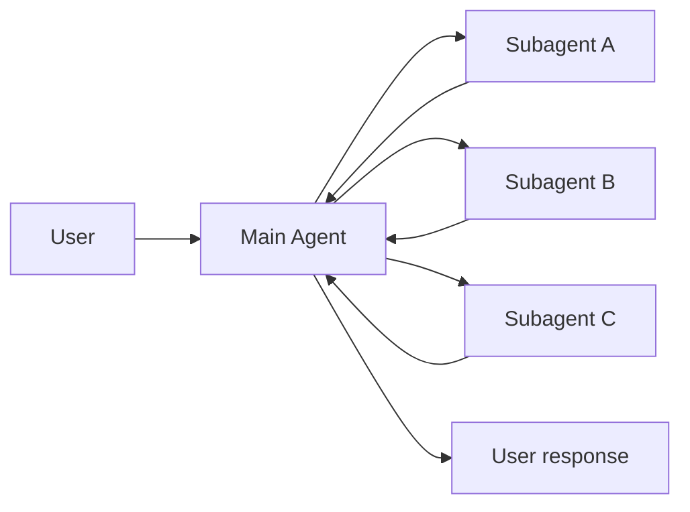

# Subagents 文档总结

## 一句话概述

子 Agent 架构中，主 Agent（监督者）将子 Agent 作为工具调用来协调，所有路由通过主 Agent，子 Agent 无状态。

---

## Mermaid 图

---

## 关键特征

| 特征 | 说明 |
|------|------|
| 集中控制 | 所有路由通过主 Agent |
| 无直接用户交互 | 子 Agent 返回结果给主 Agent |
| 通过工具调用 | 子 Agent 包装为 @tool |
| 并行执行 | 单轮可调用多个子 Agent |
| 无状态 | 子 Agent 不记住过去交互 |

---

## 同步 vs 异步

| 模式 | 行为 | 适用场景 |
|------|------|---------|
| 同步 | 等待子 Agent 完成 | 需要结果才能继续 |
| 异步 | 后台运行 | 独立任务，用户不应等待 |

异步三工具模式：启动作业 → 检查状态 → 获取结果

---

## 两种工具模式

| 模式 | 特点 | 适用 |
|------|------|------|
| 每个 Agent 一个工具 | 细粒度控制 | 少量 Agent |
| 单个分发工具 | 约定优于配置 | 多 Agent、分布式团队 |

---

## 子 Agent 规格发现

| 方法 | 适用 | 权衡 |
|------|------|------|
| 系统提示枚举 | < 10 个 Agent | 简单但需更新提示 |
| 枚举约束 | < 10 个 Agent | 类型安全 |
| 基于工具的发现 | 大型/动态注册表 | 灵活但更复杂 |

---

## 上下文工程

| 类别 | 影响 |
|------|------|
| 子 Agent 规格 | 主 Agent 路由决策 |
| 子 Agent 输入 | 子 Agent 性能 |
| 子 Agent 输出 | 主 Agent 性能 |

---

## 检查点

- 默认：继承的检查点（无状态，支持中断，并行安全）
- 可选：`checkpointer=True`（延续模式，持久化历史）
