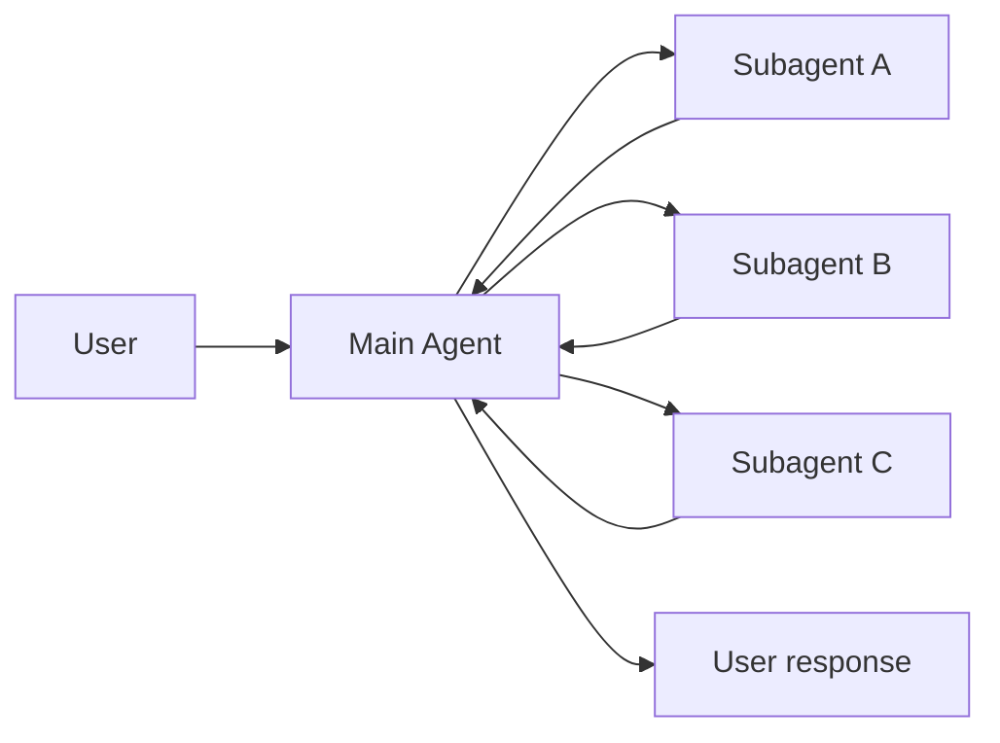
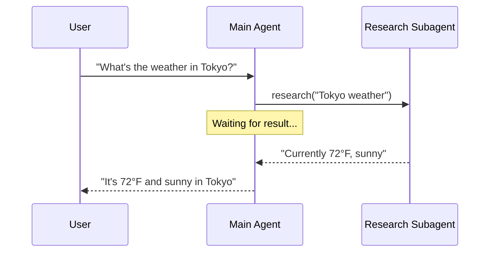
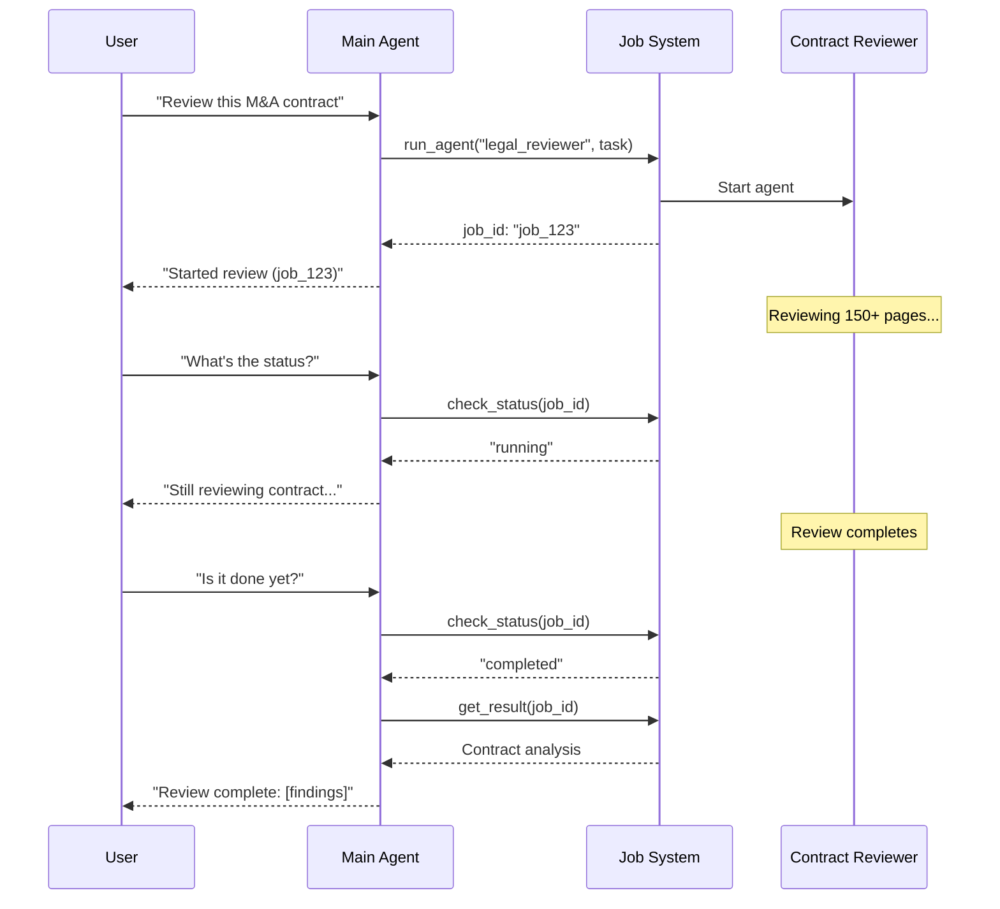
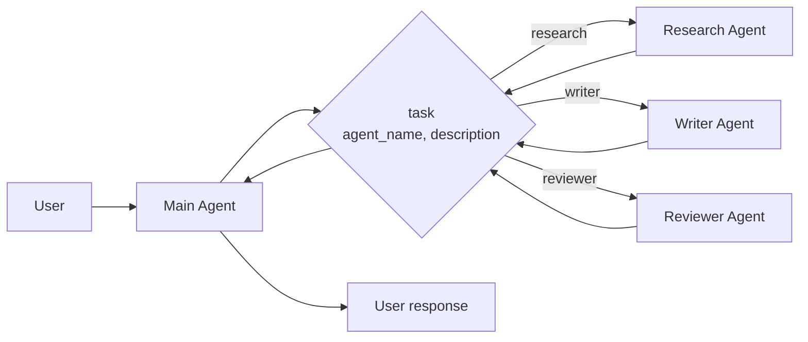

# 子智能体（Subagents）

在**子 Agent** 架构中，一个中央主 [Agent](/oss/python/langchain/agents)（通常称为**监督者**）通过将子 Agent 作为[工具](/oss/python/langchain/tools)来调用以协调它们。主 Agent 决定调用哪个子 Agent、提供什么输入以及如何组合结果。子 Agent 是无状态的——它们不记住过去的交互，所有对话记忆由主 Agent 维护。这提供了[上下文](/oss/python/langchain/context-engineering)隔离：每次子 Agent 调用都在干净的上下文窗口中工作，防止主对话中的上下文膨胀。

有关内置子 Agent 支持，请参阅 [Deep Agents](/oss/python/deepagents/subagents)。



## 关键特征

* 集中控制：所有路由都通过主 Agent
* 无直接用户交互：子 Agent 将结果返回给主 Agent，而不是用户（不过你可以使用[中断](/oss/python/langgraph/interrupts#pause-using-interrupt)在子 Agent 内允许用户交互）
* 通过工具调用子 Agent：子 Agent 通过工具被调用
* 并行执行：主 Agent 可以在单轮中调用多个子 Agent

> **注意：监督者 vs 路由器**：监督者 Agent（本模式）不同于[路由器](/oss/python/langchain/multi-agent/router)。监督者是一个完整的 Agent，维护对话上下文并动态决定跨多轮调用哪些子 Agent。路由器通常是一个单独的分类步骤，将请求分发到 Agent 而不维护持续的对话状态。

## 何时使用

当你有多个不同的领域（例如日历、邮件、CRM、数据库），子 Agent 不需要直接与用户对话，或者你想要集中工作流控制时，使用子 Agent 模式。对于只有几个[工具](/oss/python/langchain/tools)的更简单情况，使用[单个 Agent](/oss/python/langchain/agents)。

> **提示：需要在子 Agent 内进行用户交互？** 虽然子 Agent 通常将结果返回给主 Agent 而不是直接与用户对话，但你可以使用[中断](/oss/python/langgraph/interrupts#pause-using-interrupt)在子 Agent 内暂停执行并收集用户输入。当子 Agent 在继续之前需要澄清或批准时，这很有用。主 Agent 仍然是协调者，但子 Agent 可以在任务中从用户那里收集信息。

## 基本实现

核心机制是将子 Agent 包装为主 Agent 可以调用的工具：

```python
from langchain.tools import tool
from langchain.agents import create_agent

# 创建子 Agent
subagent = create_agent(model="google_genai:gemini-3.1-pro-preview", tools=[...])

# 包装为工具
@tool("research", description="Research a topic and return findings")
def call_research_agent(query: str):
    result = subagent.invoke({"messages": [{"role": "user", "content": query}]})
    return result["messages"][-1].content

# 主 Agent 使用子 Agent 作为工具
main_agent = create_agent(model="google_genai:gemini-3.1-pro-preview", tools=[call_research_agent])
```

## 设计决策

实现子 Agent 模式时，你需要做出几个关键设计选择。下表总结了这些选项——每个选项在以下各节中有详细介绍。

| 决策 | 选项 |
|------|------|
| [**同步 vs 异步**](#同步-vs-异步) | 同步（阻塞）vs 异步（后台） |
| [**工具模式**](#工具模式) | 每个 Agent 一个工具 vs 单个分发工具 |
| [**子 Agent 规格**](#子-agent-规格) | 系统提示 vs 枚举约束 vs 基于工具的发现（仅限单个分发工具） |
| [**子 Agent 输入**](#子-agent-输入) | 仅查询 vs 完整上下文 |
| [**子 Agent 输出**](#子-agent-输出) | 子 Agent 结果 vs 完整对话历史 |

## 同步 vs 异步

子 Agent 执行可以是**同步的**（阻塞）或**异步的**（后台）。你的选择取决于主 Agent 是否需要结果才能继续。

| 模式 | 主 Agent 行为 | 最佳场景 | 权衡 |
|------|-------------|---------|------|
| **同步** | 等待子 Agent 完成 | 主 Agent 需要结果才能继续 | 简单，但阻塞对话 |
| **异步** | 子 Agent 在后台运行时继续 | 独立任务，用户不应等待 | 响应迅速，但更复杂 |

> **提示：** 不要与 Python 的 `async`/`await` 混淆。这里的"异步"意味着主 Agent 启动一个后台作业（通常在单独的进程或服务中）并继续而不阻塞。

### 同步（默认）

默认情况下，子 Agent 调用是**同步的**：主 Agent 在继续之前等待每个子 Agent 完成。当主 Agent 的下一个操作依赖于子 Agent 的结果时使用同步。



**何时使用同步：**

* 主 Agent 需要子 Agent 的结果来制定其响应
* 任务有顺序依赖（例如获取数据 → 分析 → 响应）
* 子 Agent 失败应阻塞主 Agent 的响应

**权衡：**

* 简单实现——只需调用并等待
* 所有子 Agent 完成前用户看不到响应
* 长时间运行的任务会冻结对话

### 异步

当子 Agent 的工作是独立的时使用**异步执行**——主 Agent 不需要结果即可继续与用户对话。主 Agent 启动一个后台作业并保持响应。



**何时使用异步：**

* 子 Agent 工作独立于主流
* 用户应该能够在工作进行时继续聊天
* 你想并行运行多个独立任务

**三工具模式：**

1. **启动作业**：启动后台任务，返回作业 ID
2. **检查状态**：返回当前状态（pending、running、completed、failed）
3. **获取结果**：检索完成的结果

**处理作业完成：** 当作业完成时，你的应用程序需要通知用户。一种方法：呈现一个通知，当点击时发送一条 `HumanMessage`，如"检查 job_123 并总结结果"。

## 工具模式

有两种主要方式将子 Agent 暴露为工具：

| 模式 | 最佳场景 | 权衡 |
|------|---------|------|
| [**每个 Agent 一个工具**](#每个-agent-一个工具) | 对每个子 Agent 的输入/输出进行细粒度控制 | 更多设置，但更多自定义 |
| [**单个分发工具**](#单个分发工具) | 多个 Agent、分布式团队、约定优于配置 | 更简单的组合，更少的每个 Agent 自定义 |

### 每个 Agent 一个工具


关键思想是将子 Agent 包装为主 Agent 可以调用的工具：

```python
from langchain.tools import tool
from langchain.agents import create_agent

# 创建子 Agent
subagent = create_agent(model="...", tools=[...])

# 包装为工具
@tool("subagent_name", description="subagent_description")
def call_subagent(query: str):
    result = subagent.invoke({"messages": [{"role": "user", "content": query}]})
    return result["messages"][-1].content

# 主 Agent 使用子 Agent 作为工具
main_agent = create_agent(model="...", tools=[call_subagent])
```

主 Agent 在决定任务匹配子 Agent 的描述时调用子 Agent 工具，接收结果，并继续协调。参见[上下文工程](#上下文工程)了解细粒度控制。

### 单个分发工具

另一种方法使用单个参数化工具来为独立任务调用临时子 Agent。与[每个 Agent 一个工具](#每个-agent-一个工具)方法不同，每个子 Agent 被包装为单独的工具，而此方法使用基于约定的方法和单个 `task` 工具：任务描述作为人类消息传递给子 Agent，子 Agent 的最终消息作为工具结果返回。

当你想跨多个团队分发 Agent 开发，需要将复杂任务隔离到单独的上下文窗口中，需要可扩展的方式添加新 Agent 而不修改协调器，或偏好约定而非自定义时，使用此方法。此方法在 Agent 组合的简单性和强上下文隔离方面权衡了上下文工程的灵活性。



**关键特征：**

* 单个任务工具：一个参数化工具可以通过名称调用任何注册的子 Agent
* 基于约定的调用：通过名称选择 Agent，任务作为人类消息传递，最终消息作为工具结果返回
* 团队分发：不同团队可以独立开发和部署 Agent
* Agent 发现：子 Agent 可以通过系统提示（列出可用 Agent）或通过[渐进式披露](/oss/python/langchain/multi-agent/skills-sql-assistant)（通过工具按需加载 Agent 信息）来发现

> **提示：** 这种方法的一个有趣方面是，子 Agent 可能与主 Agent 具有完全相同的能力。在这种情况下，调用子 Agent **实际上是为了上下文隔离**——允许多步骤的复杂任务在隔离的上下文窗口中运行，而不会膨胀主 Agent 的对话历史。子 Agent 自主完成工作并仅返回简洁的摘要，保持主线程专注和高效。

<details>
<summary>带任务分发器的 Agent 注册表</summary>

```python
from langchain.tools import tool
from langchain.agents import create_agent

# 由不同团队开发的子 Agent
research_agent = create_agent(
    model="gpt-5.4",
    prompt="You are a research specialist..."
)

writer_agent = create_agent(
    model="gpt-5.4",
    prompt="You are a writing specialist..."
)

# 可用子 Agent 注册表
SUBAGENTS = {
    "research": research_agent,
    "writer": writer_agent,
}

@tool
def task(
    agent_name: str,
    description: str
) -> str:
    """Launch an ephemeral subagent for a task.

    Available agents:
    - research: Research and fact-finding
    - writer: Content creation and editing
    """
    agent = SUBAGENTS[agent_name]
    result = agent.invoke({
        "messages": [
            {"role": "user", "content": description}
        ]
    })
    return result["messages"][-1].content

# 主协调 Agent
main_agent = create_agent(
    model="gpt-5.4",
    tools=[task],
    system_prompt=(
        "You coordinate specialized sub-agents. "
        "Available: research (fact-finding), "
        "writer (content creation). "
        "Use the task tool to delegate work."
    ),
)
```

</details>

## 上下文工程

控制上下文如何在主 Agent 和其子 Agent 之间流动：

| 类别 | 目的 | 影响 |
|------|------|------|
| [**子 Agent 规格**](#子-agent-规格) | 确保子 Agent 在应该被调用时被调用 | 主 Agent 路由决策 |
| [**子 Agent 输入**](#子-agent-输入) | 确保子 Agent 能够以优化的上下文良好执行 | 子 Agent 性能 |
| [**子 Agent 输出**](#子-agent-输出) | 确保监督者能够对子 Agent 结果采取行动 | 主 Agent 性能 |

另请参阅我们关于 Agent [上下文工程](/oss/python/langchain/context-engineering)的综合指南。

### 子 Agent 规格

与子 Agent 关联的**名称**和**描述**是主 Agent 知道调用哪些子 Agent 的主要方式。这些是提示杠杆——谨慎选择它们。

* **名称**：主 Agent 引用子 Agent 的方式。保持清晰和面向行动（例如 `research_agent`、`code_reviewer`）。
* **描述**：主 Agent 关于子 Agent 能力的了解。具体说明它处理什么任务以及何时使用它。

对于[单个分发工具](#单个分发工具)设计，你必须额外向主 Agent 提供有关它可以调用的子 Agent 的信息。你可以根据 Agent 数量和注册表是静态还是动态的不同方式提供此信息：

| 方法 | 最佳场景 | 权衡 |
|------|---------|------|
| **系统提示枚举** | 小型、静态的 Agent 列表（< 10 个） | 简单，但 Agent 更改时需要更新提示 |
| **枚举约束** | 小型、静态的 Agent 列表（< 10 个） | 类型安全且显式，但 Agent 更改时需要更改代码 |
| **基于工具的发现** | 大型或动态的 Agent 注册表 | 灵活且可扩展，但增加复杂性 |

#### 系统提示枚举

在主 Agent 的系统提示中直接列出可用 Agent。主 Agent 作为其指令的一部分看到 Agent 列表和描述。

**何时使用：**

* 你有一小组固定的 Agent（< 10 个）
* Agent 注册表很少更改
* 你想要最简单的实现

**示例：**

```python
main_agent = create_agent(
    model="...",
    tools=[task],
    system_prompt=(
        "You coordinate specialized sub-agents. "
        "Available agents:\n"
        "- research: Research and fact-finding\n"
        "- writer: Content creation and editing\n"
        "- reviewer: Code and document review\n"
        "Use the task tool to delegate work."
    ),
)
```

#### 分发工具上的枚举约束

在分发工具的 `agent_name` 参数上添加枚举约束。这提供了类型安全性，并使可用 Agent 在工具 Schema 中显式。

**何时使用：**

* 你有一小组固定的 Agent（< 10 个）
* 你想要类型安全和显式的 Agent 名称
* 你偏好基于 Schema 的验证而非基于提示的指导

**示例：**

```python
from enum import Enum

class AgentName(str, Enum):
    RESEARCH = "research"
    WRITER = "writer"
    REVIEWER = "reviewer"

@tool
def task(
    agent_name: AgentName,  # 枚举约束
    description: str
) -> str:
    """Launch an ephemeral subagent for a task."""
    # ...
```

#### 基于工具的发现

提供一个单独的工具（例如 `list_agents` 或 `search_agents`），主 Agent 可以调用它来按需发现可用的 Agent。这支持渐进式披露并支持动态注册表。

**何时使用：**

* 你有很多 Agent（> 10 个）或不断增长的注册表
* Agent 注册表经常更改或是动态的
* 你想减少提示大小和 token 使用
* 不同团队独立管理不同的 Agent

**示例：**

```python
@tool
def list_agents(query: str = "") -> str:
    """List available subagents, optionally filtered by query."""
    agents = search_agent_registry(query)
    return format_agent_list(agents)

@tool
def task(agent_name: str, description: str) -> str:
    """Launch an ephemeral subagent for a task."""
    # ...

main_agent = create_agent(
    model="...",
    tools=[task, list_agents],
    system_prompt="Use list_agents to discover available subagents, then use task to invoke them."
)
```

### 子 Agent 输入

自定义子 Agent 接收什么上下文来执行其任务。添加在静态提示中不切实际的输入——完整的消息历史、先前的结果或任务元数据——通过从 Agent 的状态中提取。

```python
from langchain.agents import AgentState
from langchain.tools import tool, ToolRuntime

class CustomState(AgentState):
    example_state_key: str

@tool(
    "subagent1_name",
    description="subagent1_description"
)
def call_subagent1(query: str, runtime: ToolRuntime[None, CustomState]):
    # 应用任何需要的逻辑将消息转换为合适的输入
    subagent_input = some_logic(query, runtime.state["messages"])
    result = subagent1.invoke({
        "messages": subagent_input,
        # 你也可以根据需要在此处传递其他状态键。
        # 确保在主 Agent 和子 Agent 的状态 Schema 中都定义这些。
        "example_state_key": runtime.state["example_state_key"]
    })
    return result["messages"][-1].content
```

### 子 Agent 输出

自定义主 Agent 接收什么回来以便它能做出好的决策。两种策略：

1. **提示子 Agent**：指定应该返回什么。一个常见的失败模式是子 Agent 执行工具调用或推理但不在其最终消息中包含结果——提醒它监督者只看到最终输出。
2. **在代码中格式化**：在返回之前调整或丰富响应。例如，使用 [`Command`](/oss/python/langgraph/graph-api#command) 在最终文本之外传递特定的状态键。

```python
from typing import Annotated
from langchain.agents import AgentState
from langchain.tools import InjectedToolCallId
from langgraph.types import Command

@tool(
    "subagent1_name",
    description="subagent1_description"
)
def call_subagent1(
    query: str,
    tool_call_id: Annotated[str, InjectedToolCallId],
) -> Command:
    result = subagent1.invoke({
        "messages": [{"role": "user", "content": query}]
    })
    return Command(update={
        # 从子 Agent 传回额外状态
        "example_state_key": result["example_state_key"],
        "messages": [
            ToolMessage(
                content=result["messages"][-1].content,
                tool_call_id=tool_call_id
            )
        ]
    })
```

## 检查点和状态检查

默认情况下，子 Agent 使用**继承的检查点**模式——每次调用都从新状态开始，支持[中断](/oss/python/langgraph/interrupts#pause-using-interrupt)，并且可以安全地并行运行。如果你需要子 Agent 在调用之间维护自己的持久对话历史，使用 `checkpointer=True`（延续模式）编译它。参见[子图持久化](/oss/python/langgraph/use-subgraphs#subgraph-persistence)了解模式的完整比较。

因为子 Agent 在工具函数内部调用，LangGraph 无法[静态发现](/oss/python/langgraph/use-subgraphs#view-subgraph-state)它们。这意味着 [`get_state` 配合 `subgraphs`](/oss/python/langgraph/use-subgraphs#view-subgraph-state) 不会返回子 Agent 状态。如果你需要读取嵌套图状态（例如在[中断](/oss/python/langgraph/interrupts#pause-using-interrupt)期间），请在自定义图中的[节点函数](/oss/python/langgraph/use-subgraphs#call-a-subgraph-inside-a-node)中调用子 Agent。参见[子图持久化](/oss/python/langgraph/use-subgraphs#subgraph-persistence)了解每种模式如何影响状态可见性的详细信息。
