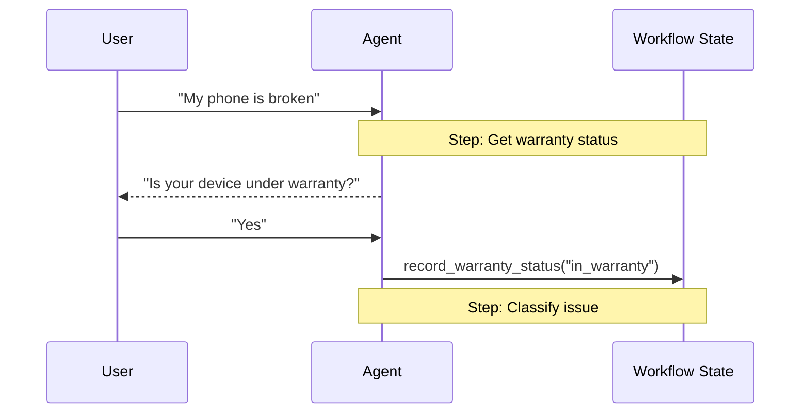

# Handoffs 文档总结

## 一句话概述

切换模式通过工具更新状态变量来动态改变 Agent 行为，支持顺序约束和多阶段对话流。

---

## Mermaid 图



---

## 关键特征

| 特征 | 说明 |
|------|------|
| 状态驱动 | `current_step` 或 `active_agent` 控制行为 |
| 工具触发转换 | 工具返回 `Command(update={"current_step": ...})` |
| 直接用户交互 | 每个状态直接处理用户消息 |
| 持久状态 | 跨轮次持续 |

---

## 两种实现方式

| 方式 | 特点 | 适用 |
|------|------|------|
| 单 Agent + 中间件 | 中间件动态切换 prompt/tools | 大多数场景 |
| 多 Agent 子图 | 不同 Agent 作为图节点 | 需要定制 Agent 实现 |

---

## 切换工具的核心代码

```python
@tool
def transfer_to_specialist(runtime) -> Command:
    return Command(
        update={
            "messages": [ToolMessage(content="...", tool_call_id=runtime.tool_call_id)],
            "current_step": "specialist"
        }
    )
```

---

## 上下文工程要点

- 切换时必须传递 AIMessage + ToolMessage 配对
- 不要传递完整子 Agent 历史（膨胀上下文）
- 只传递切换配对，保持父图上下文聚焦

---

## 重点与难点

### 重点
- 状态变量驱动行为变化
- ToolMessage 配对的必要性
- 两种实现方式的选择

### 难点
- 多 Agent 子图的上下文工程
- Command.PARENT 的使用
- 切换时消息的精简传递
