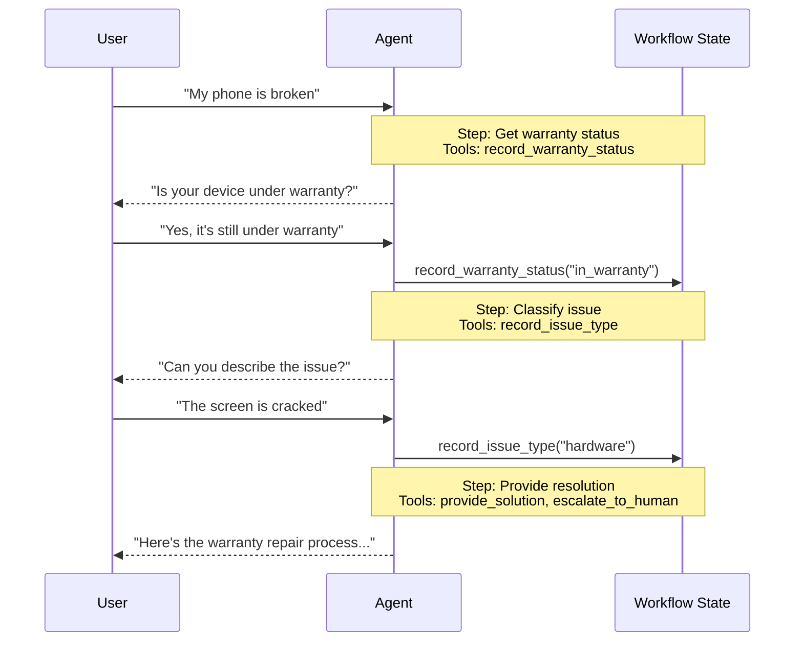

# 切换（Handoffs）

在**切换**架构中，行为根据状态动态变化。核心机制：[工具](/oss/python/langchain/tools)更新一个跨轮次持久化的状态变量（例如 `current_step` 或 `active_agent`），系统读取此变量来调整行为——应用不同的配置（系统提示、工具）或路由到不同的 [Agent](/oss/python/langchain/agents)。此模式支持不同 Agent 之间的切换和单个 Agent 内的动态配置更改。

> **提示：** 术语**切换（handoffs）**由 [OpenAI](https://openai.github.io/openai-agents-python/handoffs/) 提出，用于使用工具调用（例如 `transfer_to_sales_agent`）在 Agent 或状态之间传递控制权。



## 关键特征

* 状态驱动行为：行为根据状态变量（例如 `current_step` 或 `active_agent`）变化
* 基于工具的转换：工具更新状态变量以在状态之间移动
* 直接用户交互：每个状态的配置直接处理用户消息
* 持久状态：状态在对话轮次之间持续存在

## 何时使用

当你需要强制执行顺序约束（只有在满足前置条件后才解锁能力）时，当 Agent 需要在不同状态之间直接与用户对话时，或者当你构建多阶段对话流时，使用切换模式。此模式对于需要按特定顺序收集信息的客户支持场景特别有价值——例如，在处理退款之前收集保修 ID。

## 基本实现

核心机制是一个返回 [`Command`](/oss/python/langgraph/graph-api#command) 来更新状态的[工具](/oss/python/langchain/tools)，触发到新步骤或 Agent 的转换：

```python
from langchain.tools import tool
from langchain.messages import ToolMessage
from langgraph.types import Command

@tool
def transfer_to_specialist(runtime) -> Command:
    """Transfer to the specialist agent."""
    return Command(
        update={
            "messages": [
                ToolMessage(
                    content="Transferred to specialist",
                    tool_call_id=runtime.tool_call_id
                )
            ],
            "current_step": "specialist"  # 触发行为变化
        }
    )
```

> **注意：为什么要包含 `ToolMessage`？** 当 LLM 调用工具时期望响应。带有匹配 `tool_call_id` 的 `ToolMessage` 完成了这个请求-响应周期——没有它，对话历史会变得格式不正确。每当你的切换工具更新消息时，这是必需的。

## 实现方式

有两种方式实现切换：**[带中间件的单 Agent](#带中间件的单-agent)**（一个具有动态配置的 Agent）或**[多 Agent 子图](#多-agent-子图)**（作为图节点的不同 Agent）。

### 带中间件的单 Agent

单个 Agent 根据状态改变其行为。中间件拦截每次模型调用并动态调整系统提示和可用工具。工具更新状态变量以触发转换：

```python
from langchain.tools import ToolRuntime, tool
from langchain.messages import ToolMessage
from langgraph.types import Command

@tool
def record_warranty_status(
    status: str,
    runtime: ToolRuntime[None, SupportState]
) -> Command:
    """Record warranty status and transition to next step."""
    return Command(
        update={
            "messages": [
                ToolMessage(
                    content=f"Warranty status recorded: {status}",
                    tool_call_id=runtime.tool_call_id
                )
            ],
            "warranty_status": status,
            "current_step": "specialist"  # 更新状态以触发转换
        }
    )
```

<details>
<summary>完整示例：带中间件的客户支持</summary>

```python
from langchain.agents import AgentState, create_agent
from langchain.agents.middleware import wrap_model_call, ModelRequest, ModelResponse
from langchain.tools import tool, ToolRuntime
from langchain.messages import ToolMessage
from langgraph.types import Command
from typing import Callable

# 1. 定义带有 current_step 跟踪器的状态
class SupportState(AgentState):
    """Track which step is currently active."""
    current_step: str = "triage"
    warranty_status: str | None = None

# 2. 工具通过 Command 更新 current_step
@tool
def record_warranty_status(
    status: str,
    runtime: ToolRuntime[None, SupportState]
) -> Command:
    """Record warranty status and transition to next step."""
    return Command(update={
        "messages": [
            ToolMessage(
                content=f"Warranty status recorded: {status}",
                tool_call_id=runtime.tool_call_id
            )
        ],
        "warranty_status": status,
        "current_step": "specialist"
    })

# 3. 中间件根据 current_step 应用动态配置
@wrap_model_call
def apply_step_config(
    request: ModelRequest,
    handler: Callable[[ModelRequest], ModelResponse]
) -> ModelResponse:
    """Configure agent behavior based on current_step."""
    step = request.state.get("current_step", "triage")

    configs = {
        "triage": {
            "prompt": "Collect warranty information...",
            "tools": [record_warranty_status]
        },
        "specialist": {
            "prompt": "Provide solutions based on warranty: {warranty_status}",
            "tools": [provide_solution, escalate]
        }
    }

    config = configs[step]
    request = request.override(
        system_prompt=config["prompt"].format(**request.state),
        tools=config["tools"]
    )
    return handler(request)

# 4. 创建带中间件的 Agent
agent = create_agent(
    model,
    tools=[record_warranty_status, provide_solution, escalate],
    state_schema=SupportState,
    middleware=[apply_step_config],
    checkpointer=InMemorySaver()
)
```

</details>

### 多 Agent 子图

多个不同的 Agent 作为图中的单独节点存在。切换工具使用 `Command.PARENT` 导航 Agent 节点之间，指定接下来执行哪个节点。

> **警告：** 子图切换需要仔细的**[上下文工程](/oss/python/langchain/context-engineering)**。与单 Agent 中间件（消息历史自然流动）不同，你必须显式决定什么消息在 Agent 之间传递。搞错这一点，Agent 会收到格式不正确的对话历史或膨胀的上下文。

```python
from langchain.messages import AIMessage, ToolMessage
from langchain.tools import tool, ToolRuntime
from langgraph.types import Command

@tool
def transfer_to_sales(
    runtime: ToolRuntime,
) -> Command:
    """Transfer to the sales agent."""
    last_ai_message = next(
        msg for msg in reversed(runtime.state["messages"]) if isinstance(msg, AIMessage)
    )
    transfer_message = ToolMessage(
        content="Transferred to sales agent",
        tool_call_id=runtime.tool_call_id,
    )
    return Command(
        goto="sales_agent",
        update={
            "active_agent": "sales_agent",
            "messages": [last_ai_message, transfer_message],
        },
        graph=Command.PARENT
    )
```

> **提示：** 对于大多数切换用例，使用**带中间件的单 Agent**——更简单。只有当你需要定制的 Agent 实现（例如一个本身是带有反思或检索步骤的复杂图的节点）时才使用**多 Agent 子图**。

#### 上下文工程

使用子图切换时，你可以精确控制什么消息在 Agent 之间流动。这种精确性对于维护有效的对话历史和避免可能混淆下游 Agent 的上下文膨胀至关重要。

**切换期间处理上下文**

在 Agent 之间切换时，你需要确保对话历史保持有效。LLM 期望工具调用与其响应配对，因此当使用 `Command.PARENT` 切换到另一个 Agent 时，你必须包含两者：

1. **包含工具调用的 `AIMessage`**（触发切换的消息）
2. **确认切换的 `ToolMessage`**（对该工具调用的人工响应）

没有这种配对，接收 Agent 会看到不完整的对话并可能产生错误或意外行为。

```python
@tool
def transfer_to_sales(runtime: ToolRuntime) -> Command:
    # 获取触发此切换的 AI 消息
    last_ai_message = runtime.state["messages"][-1]

    # 创建人工工具响应以完成配对
    transfer_message = ToolMessage(
        content="Transferred to sales agent",
        tool_call_id=runtime.tool_call_id,
    )

    return Command(
        goto="sales_agent",
        update={
            "active_agent": "sales_agent",
            # 只传递这两个消息，而不是完整的子 Agent 历史
            "messages": [last_ai_message, transfer_message],
        },
        graph=Command.PARENT,
    )
```

> **注意：为什么不传递所有子 Agent 消息？** 虽然你可以在切换中包含完整的子 Agent 对话，但这通常会产生问题。接收 Agent 可能会被不相关的内部推理搞糊涂，token 成本也会不必要地增加。通过只传递切换配对，你保持父图的上下文专注于高层协调。如果接收 Agent 需要额外上下文，考虑在 ToolMessage 内容中总结子 Agent 的工作，而不是传递原始消息历史。

**将控制权返回给用户**

当将控制权返回给用户（结束 Agent 的回合）时，确保最终消息是 `AIMessage`。这维护了有效的对话历史并向用户界面发出 Agent 已完成工作的信号。

## 实现注意事项

在设计多智能体系统时，考虑：

* **上下文过滤策略**：每个 Agent 会接收完整的对话历史、过滤的部分还是摘要？不同的 Agent 可能根据其角色需要不同的上下文。
* **工具语义**：澄清切换工具是只更新路由状态还是也执行副作用。例如，`transfer_to_sales()` 是否也应该创建支持工单，还是应该是单独的操作？
* **token 效率**：平衡上下文完整性和 token 成本。随着对话变长，总结和选择性上下文传递变得更加重要。
