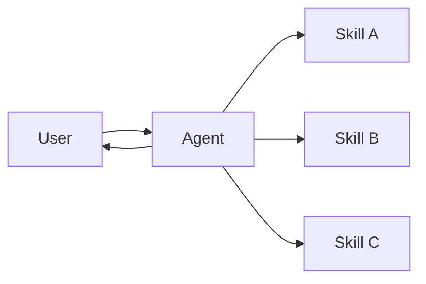

# Skills 文档总结

## 一句话概述

技能模式将专门化能力打包为可调用的提示，Agent 按需加载，实现渐进式披露。

---

## Mermaid 图



---

## 关键特征

| 特征 | 说明 |
|------|------|
| 提示驱动 | 技能 = 专门化的提示 |
| 渐进式披露 | 按需加载，不预先全部加载 |
| 团队分发 | 不同团队独立维护 |
| 轻量级 | 比子 Agent 更简单 |
| 引用感知 | 可引用脚本、模板等资源 |

---

## 核心实现

```python
@tool
def load_skill(skill_name: str) -> str:
    """按需加载技能提示。"""
    skills = {"write_sql": "...", "review_legal_doc": "..."}
    return skills[skill_name]
```

---

## 扩展模式

| 模式 | 说明 |
|------|------|
| 动态工具注册 | 加载技能时注册新工具 |
| 层级技能 | 技能定义子技能（树结构） |
| 引用感知 | 提示引用外部资源位置 |

---

## 与子 Agent 的区别

| 维度 | 技能 | 子 Agent |
|------|------|---------|
| 本质 | 提示加载 | Agent 调用 |
| 状态 | 单 Agent 保持控制 | 子 Agent 无状态 |
| 复杂度 | 轻量 | 较重 |
| 适用 | 简单专门化 | 复杂独立任务 |
