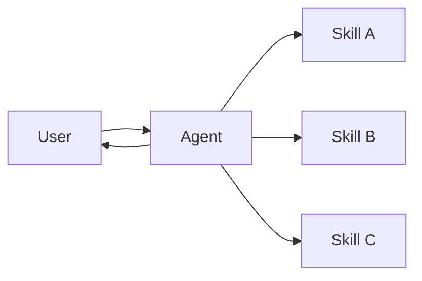

# 技能（Skills）

在**技能**架构中，专门化的能力被打包为可调用的"技能"来增强 [Agent](/oss/python/langchain/agents) 的行为。技能主要是提示驱动的专门化，Agent 可以按需调用。有关内置技能支持，请参阅 [Deep Agents](/oss/python/deepagents/skills)。

> **提示：** 此模式在概念上与 [Agent Skills](https://agentskills.io/) 和 [llms.txt](https://llmstxt.org/)（由 Jeremy Howard 提出）相同，后者使用工具调用来渐进式披露文档。技能模式将渐进式披露应用于专门化的提示和领域知识，而不仅仅是文档页面。
>
> 有关改善你的 Agent 在 LangChain 生态系统任务上性能的即用型技能，请参阅 [LangChain Skills](https://github.com/langchain-ai/langchain-skills) 仓库。



## 关键特征

* 提示驱动的专门化：技能主要由专门化的提示定义
* 渐进式披露：技能根据上下文或用户需求变得可用
* 团队分发：不同团队可以独立开发和维护技能
* 轻量级组合：技能比完整的子 Agent 更简单
* 引用感知：技能可以引用脚本、模板和其他资源

## 何时使用

当你想要一个具有许多可能专门化的单个 [Agent](/oss/python/langchain/agents)，你不需要在技能之间强制执行特定约束，或者不同团队需要独立开发能力时，使用技能模式。常见示例包括编码助手（不同语言或任务的技能）、知识库（不同领域的技能）和创意助手（不同格式的技能）。

## 基本实现

```python
from langchain.tools import tool
from langchain.agents import create_agent

@tool
def load_skill(skill_name: str) -> str:
    """Load a specialized skill prompt.

    Available skills:
    - write_sql: SQL query writing expert
    - review_legal_doc: Legal document reviewer

    Returns the skill's prompt and context.
    """
    # 从文件/数据库加载技能内容
    ...

agent = create_agent(
    model="gpt-5.4",
    tools=[load_skill],
    system_prompt=(
        "You are a helpful assistant. "
        "You have access to two skills: "
        "write_sql and review_legal_doc. "
        "Use load_skill to access them."
    ),
)
```

## 扩展模式

编写自定义实现时，你可以通过多种方式扩展基本技能模式：

* **动态工具注册**：将渐进式披露与状态管理结合，在技能加载时注册新[工具](/oss/python/langchain/tools)。例如，加载"database_admin"技能可以同时添加专门的上下文和注册数据库特定的工具（备份、恢复、迁移）。这使用了跨多智能体模式使用的相同工具和状态机制——工具更新状态以动态更改 Agent 能力。

* **层级技能**：技能可以在树结构中定义其他技能，创建嵌套的专门化。例如，加载"data_science"技能可能会使"pandas_expert"、"visualization"和"statistical_analysis"等子技能可用。每个子技能可以根据需要独立加载，允许对领域知识进行细粒度的渐进式披露。这种层级方法通过将能力组织成可以按需发现和加载的逻辑分组来帮助管理大型知识库。

* **引用感知**：虽然每个技能只有一个提示，但此提示可以引用其他资产的位置，并提供 Agent 何时应使用这些资产的信息。当这些资产变得相关时，Agent 会知道这些文件存在并根据需要读取它们到内存中以完成任务。这也遵循渐进式披露模式并限制上下文窗口中的信息。
