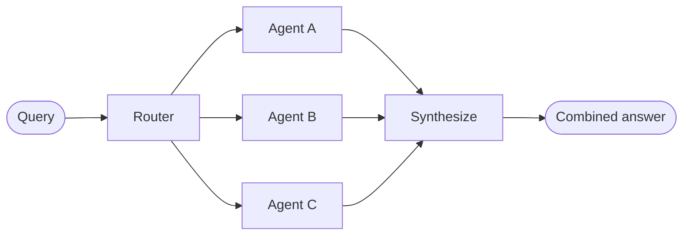

# Router 文档总结

## 一句话概述

路由器模式对输入进行分类，定向到专门化 Agent，并行执行后合成结果。

---

## Mermaid 图

---

## 关键特征

| 特征 | 说明 |
|------|------|
| 查询分解 | 路由器分析输入 |
| 并行调用 | 多个 Agent 同时执行 |
| 结果合成 | 组合多个 Agent 的结果 |

---

## 两种路由方式

| 方式 | 机制 | 适用 |
|------|------|------|
| 单 Agent | `Command(goto=agent)` | 只需一个 Agent |
| 多 Agent 并行 | `Send(agent, data)` | 同时查询多个来源 |

---

## 无状态 vs 有状态

| 类型 | 特点 | 适用 |
|------|------|------|
| 无状态 | 每次独立路由 | 单轮查询 |
| 有状态 | 工具包装器维护历史 | 多轮对话 |

---

## 路由器 vs 子 Agent

| 维度 | 路由器 | 子 Agent |
|------|--------|---------|
| 路由 | 专门的分类步骤 | 主 Agent 动态决定 |
| 状态 | 通常不维护 | 维护对话上下文 |
| 适用 | 清晰的输入类别 | 灵活的对话协调 |
