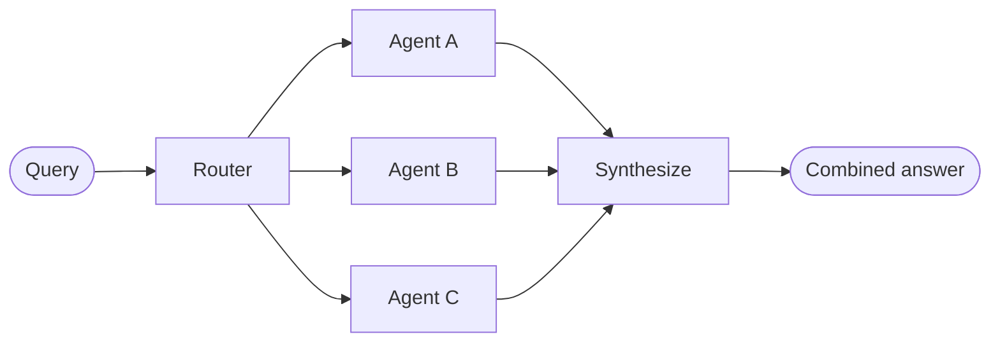

# 路由器（Router）

在**路由器**架构中，一个路由步骤对输入进行分类并将其定向到专门化的 [Agent](/oss/python/langchain/agents)。当你有不同的**垂直领域**（各自需要自己 Agent 的独立知识领域）时，这很有用。



## 关键特征

* 路由器分解查询
* 零个或多个专门化 Agent 被并行调用
* 结果被合成为连贯的响应

## 何时使用

当你有不同的垂直领域（各自需要自己 Agent 的独立知识领域），需要并行查询多个来源，并想将结果合成为组合响应时，使用路由器模式。

## 基本实现

路由器对查询进行分类并将其定向到适当的 Agent。使用 [`Command`](/oss/python/langgraph/graph-api#command) 进行单 Agent 路由，或使用 [`Send`](/oss/python/langgraph/graph-api#send) 进行并行扇出到多个 Agent。

**单 Agent 路由：** 使用 `Command` 路由到单个专门化 Agent：

```python
from langgraph.types import Command

def classify_query(query: str) -> str:
    """Use LLM to classify query and determine the appropriate agent."""
    # 分类逻辑
    ...

def route_query(state: State) -> Command:
    """Route to the appropriate agent based on query classification."""
    active_agent = classify_query(state["query"])
    return Command(goto=active_agent)
```

**多 Agent 并行路由：** 使用 `Send` 并行扇出到多个专门化 Agent：

```python
from typing import TypedDict
from langgraph.types import Send

class ClassificationResult(TypedDict):
    query: str
    agent: str

def classify_query(query: str) -> list[ClassificationResult]:
    """Use LLM to classify query and determine which agents to invoke."""
    # 分类逻辑
    ...

def route_query(state: State):
    """Route to relevant agents based on query classification."""
    classifications = classify_query(state["query"])
    return [
        Send(c["agent"], {"query": c["query"]})
        for c in classifications
    ]
```

## 无状态 vs 有状态

两种方式：

* [**无状态路由器**](#无状态)独立处理每个请求
* [**有状态路由器**](#有状态)跨请求维护对话历史

### 无状态

每个请求被独立路由——调用之间没有记忆。对于多轮对话，请参阅[有状态路由器](#有状态)。

> **提示：路由器 vs 子 Agent**：两种模式都可以将工作分发给多个 Agent，但它们在路由决策的制定方式上有所不同：
>
> * **路由器**：一个专门的路由步骤（通常是单个 LLM 调用或基于规则的逻辑）对输入进行分类并分发到 Agent。路由器本身通常不维护对话历史或执行多轮协调——它是一个预处理步骤。
> * **子 Agent**：一个主监督者 Agent 动态决定在持续对话中调用哪些[子 Agent](/oss/python/langchain/multi-agent/subagents)。主 Agent 维护上下文，可以跨轮次调用多个子 Agent，并协调复杂的多步骤工作流。
>
> 当你有清晰的输入类别并想要确定性或轻量级分类时使用**路由器**。当你需要灵活的、对话感知的协调，LLM 根据不断发展的上下文决定下一步做什么时使用**监督者**。

### 有状态

对于多轮对话，你需要跨调用维护上下文。

**工具包装器：** 最简单的方法：将无状态路由器包装为对话 Agent 可以调用的工具。对话 Agent 处理内存和上下文；路由器保持无状态。这避免了跨多个并行 Agent 管理对话历史的复杂性。

```python
@tool
def search_docs(query: str) -> str:
    """Search across multiple documentation sources."""
    result = workflow.invoke({"query": query})
    return result["final_answer"]

# 对话 Agent 使用路由器作为工具
conversational_agent = create_agent(
    model,
    tools=[search_docs],
    prompt="You are a helpful assistant. Use search_docs to answer questions."
)
```

**完全持久化：** 如果你需要路由器本身维护状态，使用[持久化](/oss/python/langchain/short-term-memory)来存储消息历史。当路由到 Agent 时，从状态中获取先前的消息并选择性地将它们包含在 Agent 的上下文中——这是[上下文工程](/oss/python/langchain/context-engineering)的杠杆。

> **警告：有状态路由器需要自定义历史管理。** 如果路由器在轮次之间切换 Agent，当 Agent 有不同的语气或提示时，对话对最终用户来说可能不够流畅。使用并行调用时，你需要在路由器级别维护历史（输入和合成输出）并在路由逻辑中利用此历史。考虑改用[切换模式](/oss/python/langchain/multi-agent/handoffs)或[子 Agent 模式](/oss/python/langchain/multi-agent/subagents)——两者都为多轮对话提供了更清晰的语义。
