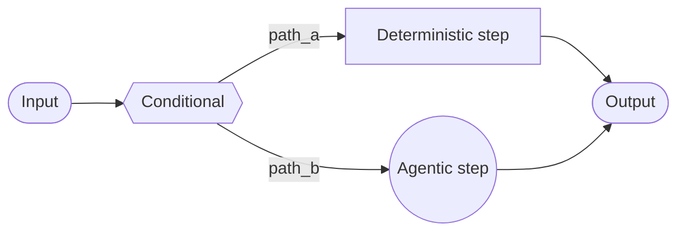

# Custom Workflow 文档总结

## 一句话概述

自定义工作流使用 LangGraph 定义完全定制的执行流，混合确定性逻辑和 Agent 行为。

---

## Mermaid 图



---

## 关键特征

| 特征 | 说明 |
|------|------|
| 完全控制 | 自定义图结构 |
| 混合逻辑 | 确定性 + Agent 行为 |
| 灵活结构 | 顺序/条件/循环/并行 |
| 可嵌套 | 其他模式作为节点 |

---

## 节点类型

| 类型 | 示例 | 是否用 LLM |
|------|------|:---------:|
| 函数节点 | 数据处理、格式转换 | ❌ |
| 模型节点 | 查询重写、分类 | ✅ |
| Agent 节点 | 推理、工具调用 | ✅ |
| 确定性节点 | 检索、路由 | ❌ |

---

## 核心实现

```python
agent = create_agent(model="...", tools=[...])

def agent_node(state: State) -> dict:
    result = agent.invoke({"messages": [{"role": "user", "content": state["query"]}]})
    return {"answer": result["messages"][-1].content}

workflow = (
    StateGraph(State)
    .add_node("agent", agent_node)
    .add_edge(START, "agent")
    .add_edge("agent", END)
    .compile()
)
```

---

## RAG 管道示例

```
Query → Rewrite（模型节点）→ Retrieve（确定性节点）→ Agent（Agent 节点）→ Response
```

三种节点类型演示了如何混合确定性和 Agent 行为。
