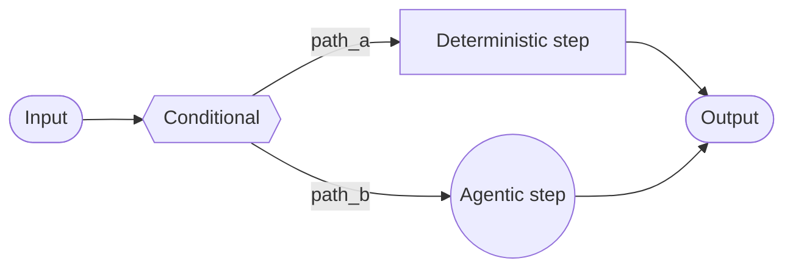
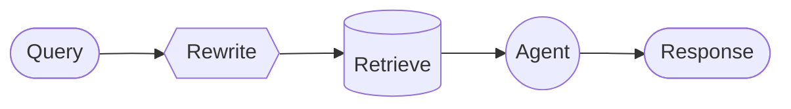

# 自定义工作流（Custom Workflow）

在**自定义工作流**架构中，你使用 [LangGraph](/oss/python/langgraph/overview) 定义自己的定制执行流。你对图结构有完全的控制——包括顺序步骤、条件分支、循环和并行执行。



## 关键特征

* 对图结构的完全控制
* 混合确定性逻辑和 Agent 行为
* 支持顺序步骤、条件分支、循环和并行执行
* 将其他模式嵌入为工作流中的节点

## 何时使用

当标准模式（子 Agent、技能等）不符合你的需求时，当你需要混合确定性逻辑和 Agent 行为时，或者你的用例需要复杂的路由或多阶段处理时，使用自定义工作流。

工作流中的每个节点可以是一个简单的函数、一个 LLM 调用，或者一个带有[工具](/oss/python/langchain/tools)的完整 [Agent](/oss/python/langchain/agents)。你还可以在自定义工作流内组合其他架构——例如，将多智能体系统嵌入为单个节点。

## 基本实现

核心见解是你可以在任何 LangGraph 节点内部直接调用 LangChain Agent，将自定义工作流的灵活性与预构建 Agent 的便利性结合：

```python
from langchain.agents import create_agent
from langgraph.graph import StateGraph, START, END

agent = create_agent(model="openai:gpt-5.4", tools=[...])

def agent_node(state: State) -> dict:
    """A LangGraph node that invokes a LangChain agent."""
    result = agent.invoke({
        "messages": [{"role": "user", "content": state["query"]}]
    })
    return {"answer": result["messages"][-1].content}

# 构建简单工作流
workflow = (
    StateGraph(State)
    .add_node("agent", agent_node)
    .add_edge(START, "agent")
    .add_edge("agent", END)
    .compile()
)
```

## 示例：RAG 管道

一个常见用例是将[检索](/oss/python/langchain/retrieval)与 Agent 结合。此示例构建了一个 WNBA 统计助手，从知识库检索并可以获取实时新闻。

<details>
<summary>自定义 RAG 工作流</summary>

该工作流演示了三种类型的节点：

* **模型节点**（Rewrite）：使用[结构化输出](/oss/python/langchain/structured-output)重写用户查询以获得更好的检索效果。
* **确定性节点**（Retrieve）：执行向量相似性搜索——不涉及 LLM。
* **Agent 节点**（Agent）：对检索到的上下文进行推理，并可以通过工具获取额外信息。



> **提示：** 你可以使用 LangGraph 状态在工作流步骤之间传递信息。这允许工作流的每个部分读取和更新结构化字段，使跨节点共享数据和上下文变得容易。

```python
from typing import TypedDict
from pydantic import BaseModel
from langgraph.graph import StateGraph, START, END
from langchain.agents import create_agent
from langchain.tools import tool
from langchain_openai import ChatOpenAI, OpenAIEmbeddings
from langchain_core.vectorstores import InMemoryVectorStore

class State(TypedDict):
    question: str
    rewritten_query: str
    documents: list[str]
    answer: str

# WNBA 知识库
embeddings = OpenAIEmbeddings()
vector_store = InMemoryVectorStore(embeddings)
vector_store.add_texts([
    "New York Liberty 2024 roster: Breanna Stewart, Sabrina Ionescu, Jonquel Jones.",
    "Las Vegas Aces 2024 roster: A'ja Wilson, Kelsey Plum, Jackie Young.",
    "A'ja Wilson 2024 season stats: 26.9 PPG, 11.9 RPG, 2.6 BPG. Won MVP.",
    "Caitlin Clark 2024 rookie stats: 19.2 PPG, 8.4 APG. Won Rookie of the Year.",
])
retriever = vector_store.as_retriever(search_kwargs={"k": 5})

@tool
def get_latest_news(query: str) -> str:
    """Get the latest WNBA news."""
    return "Latest: The WNBA announced expanded playoff format for 2025..."

agent = create_agent(model="openai:gpt-5.4", tools=[get_latest_news])
model = ChatOpenAI(model="gpt-5.4")

class RewrittenQuery(BaseModel):
    query: str

def rewrite_query(state: State) -> dict:
    """Rewrite the user query for better retrieval."""
    response = model.with_structured_output(RewrittenQuery).invoke([
        {"role": "system", "content": "Rewrite this query to retrieve relevant WNBA information."},
        {"role": "user", "content": state["question"]}
    ])
    return {"rewritten_query": response.query}

def retrieve(state: State) -> dict:
    """Retrieve documents based on the rewritten query."""
    docs = retriever.invoke(state["rewritten_query"])
    return {"documents": [doc.page_content for doc in docs]}

def call_agent(state: State) -> dict:
    """Generate answer using retrieved context."""
    context = "\n\n".join(state["documents"])
    prompt = f"Context:\n{context}\n\nQuestion: {state['question']}"
    response = agent.invoke({"messages": [{"role": "user", "content": prompt}]})
    return {"answer": response["messages"][-1].content}

workflow = (
    StateGraph(State)
    .add_node("rewrite", rewrite_query)
    .add_node("retrieve", retrieve)
    .add_node("agent", call_agent)
    .add_edge(START, "rewrite")
    .add_edge("rewrite", "retrieve")
    .add_edge("retrieve", "agent")
    .add_edge("agent", END)
    .compile()
)

result = workflow.invoke({"question": "Who won the 2024 WNBA Championship?"})
print(result["answer"])
```

</details>
