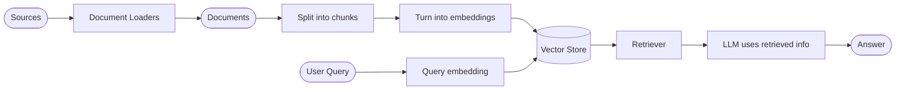
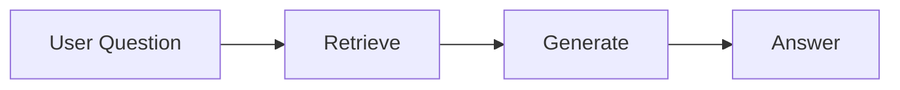
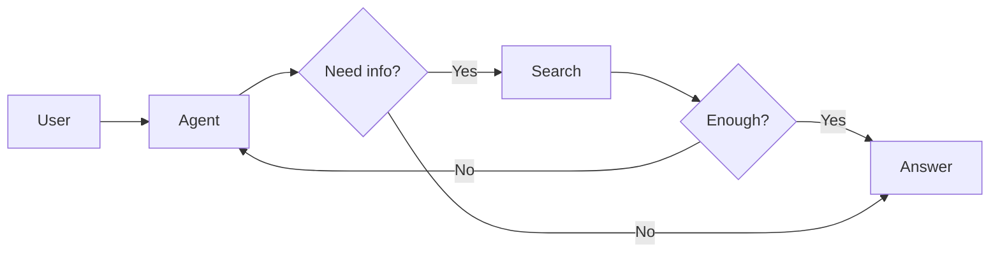
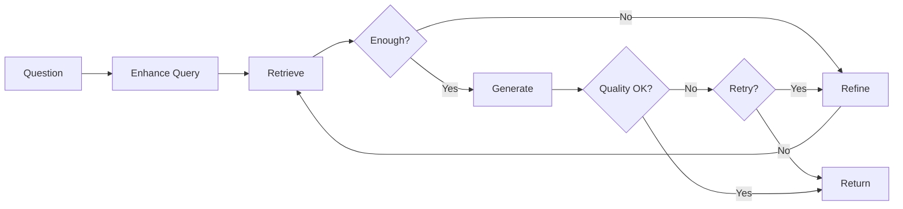

# Retrieval 文档总结

## 一句话概述

检索通过在查询时获取外部知识来解决 LLM 的有限上下文和静态知识问题，是 RAG 的基础。

---

## Mermaid 图：检索管道

---

## 构建模块

| 组件 | 作用 |
|------|------|
| Document Loaders | 从外部来源摄取数据 |
| Text Splitters | 分割大文档为小块 |
| Embedding Models | 文本 → 数字向量 |
| Vector Stores | 存储和搜索嵌入 |
| Retrievers | 查询接口，返回文档 |

---

## 三种 RAG 架构

### 2-Step RAG

- 检索总是在生成之前
- 简单、可预测、快速
- 适用：FAQ、文档机器人

### Agentic RAG

- Agent 决定何时和如何检索
- 灵活、可变延迟
- 适用：研究助手、多工具场景

### Hybrid RAG

- 查询增强 + 检索验证 + 回答验证
- 支持迭代优化
- 适用：模糊查询、质量要求高

---

## 架构对比

| 架构 | 控制力 | 灵活性 | 延迟 |
|------|:------:|:------:|:----:|
| 2-Step RAG | 高 | 低 | 快 |
| Agentic RAG | 低 | 高 | 可变 |
| Hybrid RAG | 中 | 中 | 可变 |

---

## 与已学知识的关系

| 已学知识 | Retrieval 的角色 |
|---------|-----------------|
| Tools（第 4 篇） | 检索工具（fetch_url 等） |
| Context Engineering（第 14 篇） | 检索是上下文工程的核心手段 |
| Multi-agent（第 17 篇） | Agentic RAG 使用 Agent 模式 |
