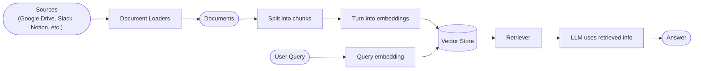
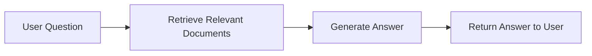
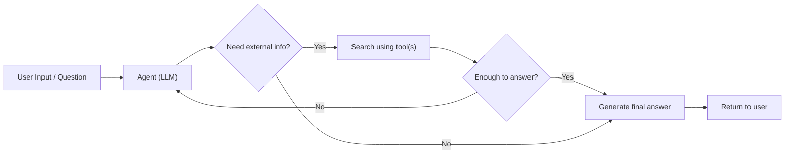
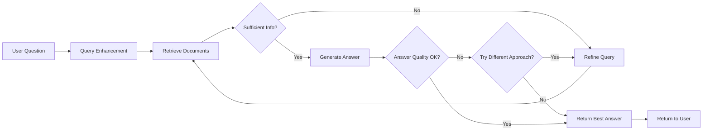

# 检索（Retrieval）

大语言模型（LLM）功能强大，但有两个关键限制：

* **有限的上下文**——它们无法一次性摄取整个语料库。
* **静态知识**——它们的训练数据冻结在某个时间点。

检索通过在查询时获取相关的外部知识来解决这些问题。这是**检索增强生成（RAG）**的基础：用上下文特定的信息增强 LLM 的回答。

## 构建知识库

**知识库**是检索期间使用的文档或结构化数据仓库。

如果你需要自定义知识库，可以使用 LangChain 的文档加载器和向量存储从你自己的数据构建一个。

> **注意：** 如果你已经有知识库（例如 SQL 数据库、CRM 或内部文档系统），你**不需要**重建它。你可以：
>
> * 在 Agentic RAG 中将其作为 Agent 的**工具**连接。
> * 查询它并将检索到的内容作为上下文提供给 LLM [（2-Step RAG）](#2-step-rag)。

### 从检索到 RAG

检索允许 LLM 在运行时访问相关上下文。但大多数现实世界的应用更进一步：它们**将检索与生成集成**以产生有根据的、上下文感知的回答。

这是**检索增强生成（RAG）**背后的核心思想。检索管道成为将搜索与生成结合的更广泛系统的基础。

### 检索管道

典型的检索工作流如下：



每个组件都是模块化的：你可以交换加载器、分割器、嵌入模型或向量存储，而无需重写应用逻辑。

### 构建模块

| 组件 | 说明 |
|------|------|
| **文档加载器（Document Loaders）** | 从外部来源（Google Drive、Slack、Notion 等）摄取数据，返回标准化的 [`Document`](https://reference.langchain.com/python/langchain-core/documents/base/Document) 对象。 |
| **文本分割器（Text Splitters）** | 将大文档分成更小的块，这些块可以单独检索并适合模型的上下文窗口。 |
| **嵌入模型（Embedding Models）** | 嵌入模型将文本转换为数字向量，使含义相似的文本在向量空间中彼此接近。 |
| **向量存储（Vector Stores）** | 用于存储和搜索嵌入的专门数据库。 |
| **检索器（Retrievers）** | 检索器是一个接口，给定非结构化查询返回文档。 |

## RAG 架构

RAG 可以以多种方式实现，取决于你的系统需求。我们在以下各节中概述每种类型。

| 架构 | 描述 | 控制力 | 灵活性 | 延迟 | 示例用例 |
|------|------|:------:|:------:|:----:|---------|
| **2-Step RAG** | 检索总是在生成之前发生。简单且可预测 | ✅ 高 | ❌ 低 | ⚡ 快 | FAQ、文档机器人 |
| **Agentic RAG** | LLM 驱动的 Agent 在推理过程中决定*何时*和*如何*检索 | ❌ 低 | ✅ 高 | ⏳ 可变 | 具有多个工具访问权限的研究助手 |
| **Hybrid** | 结合两种方法的特征并带有验证步骤 | ⚖️ 中 | ⚖️ 中 | ⏳ 可变 | 带质量验证的领域特定问答 |

> **信息：延迟**：在 **2-Step RAG** 中延迟通常更**可预测**，因为 LLM 调用的最大数量是已知且有上限的。这种可预测性假设 LLM 推理时间是主导因素。然而，现实世界的延迟也可能受检索步骤性能的影响——如 API 响应时间、网络延迟或数据库查询——这些可能因使用的工具和基础设施而异。

### 2-Step RAG

在 **2-Step RAG** 中，检索步骤总是在生成步骤之前执行。这种架构简单直接且可预测，适用于许多将相关文档检索作为生成回答明确前提的应用。



### Agentic RAG

**Agentic 检索增强生成（RAG）**将检索增强生成的优势与基于 Agent 的推理相结合。Agent（由 LLM 驱动）不是在回答前检索文档，而是逐步推理并在交互过程中决定**何时**和**如何**检索信息。

> **提示：** Agent 实现 RAG 行为唯一需要的是访问一个或多个可以获取外部知识的**工具**——如文档加载器、Web API 或数据库查询。



```python
import requests
from langchain.tools import tool
from langchain.chat_models import init_chat_model
from langchain.agents import create_agent

@tool
def fetch_url(url: str) -> str:
    """Fetch text content from a URL"""
    response = requests.get(url, timeout=10.0)
    response.raise_for_status()
    return response.text

system_prompt = """\
Use fetch_url when you need to fetch information from a web-page; quote relevant snippets.
"""

agent = create_agent(
    model="claude-sonnet-4-6",
    tools=[fetch_url],  # 用于检索的工具
    system_prompt=system_prompt,
)
```

<details>
<summary>扩展示例：LangGraph llms.txt 的 Agentic RAG</summary>

此示例实现了一个 **Agentic RAG 系统**来辅助用户查询 LangGraph 文档。Agent 首先加载 [llms.txt](https://llmstxt.org/)，其中列出了可用的文档 URL，然后可以根据用户的问题动态使用 `fetch_documentation` 工具来检索和处理相关内容。

```python
import requests
from langchain.agents import create_agent
from langchain.messages import HumanMessage
from langchain.tools import tool
from markdownify import markdownify

ALLOWED_DOMAINS = ["https://langchain-ai.github.io/"]
LLMS_TXT = 'https://langchain-ai.github.io/langgraph/llms.txt'

@tool
def fetch_documentation(url: str) -> str:
    """Fetch and convert documentation from a URL"""
    if not any(url.startswith(domain) for domain in ALLOWED_DOMAINS):
        return (
            "Error: URL not allowed. "
            f"Must start with one of: {', '.join(ALLOWED_DOMAINS)}"
        )
    response = requests.get(url, timeout=10.0)
    response.raise_for_status()
    return markdownify(response.text)

# 我们将获取 llms.txt 的内容，因此可以
# 提前完成而不需要 LLM 请求。
llms_txt_content = requests.get(LLMS_TXT).text

# Agent 的系统提示
system_prompt = f"""
You are an expert Python developer and technical assistant.
Your primary role is to help users with questions about LangGraph and related tools.

Instructions:

1. If a user asks a question you're unsure about—or one that likely involves API usage,
   behavior, or configuration—you MUST use the `fetch_documentation` tool to consult the relevant docs.
2. When citing documentation, summarize clearly and include relevant context from the content.
3. Do not use any URLs outside of the allowed domain.
4. If a documentation fetch fails, tell the user and proceed with your best expert understanding.

You can access official documentation from the following approved sources:

{llms_txt_content}

You MUST consult the documentation to get up to date documentation
before answering a user's question about LangGraph.

Your answers should be clear, concise, and technically accurate.
"""

tools = [fetch_documentation]

model = init_chat_model("claude-sonnet-4-0", max_tokens=32_000)

agent = create_agent(
    model=model,
    tools=tools,
    system_prompt=system_prompt,
    name="Agentic RAG",
)

response = agent.invoke({
    'messages': [
        HumanMessage(content=(
            "Write a short example of a langgraph agent using the "
            "prebuilt create react agent. the agent should be able "
            "to look up stock pricing information."
        ))
    ]
})

print(response['messages'][-1].content)
```

</details>

### Hybrid RAG

Hybrid RAG 结合了 2-Step 和 Agentic RAG 的特征。它引入了中间步骤，如查询预处理、检索验证和生成后检查。这些系统比固定管道提供更多的灵活性，同时保持对执行的一定控制。

典型组件包括：

* **查询增强**：修改输入问题以提高检索质量。这可以涉及重写不清楚的查询、生成多个变体，或用额外上下文扩展查询。
* **检索验证**：评估检索到的文档是否相关和充分。如果不充分，系统可能会优化查询并重新检索。
* **回答验证**：检查生成的回答的准确性、完整性以及与源内容的一致性。如果需要，系统可以重新生成或修改回答。

该架构通常支持这些步骤之间的多次迭代：



此架构适用于：

* 具有模糊或不明确查询的应用
* 需要验证或质量控制步骤的系统
* 涉及多个来源或迭代优化的工作流
