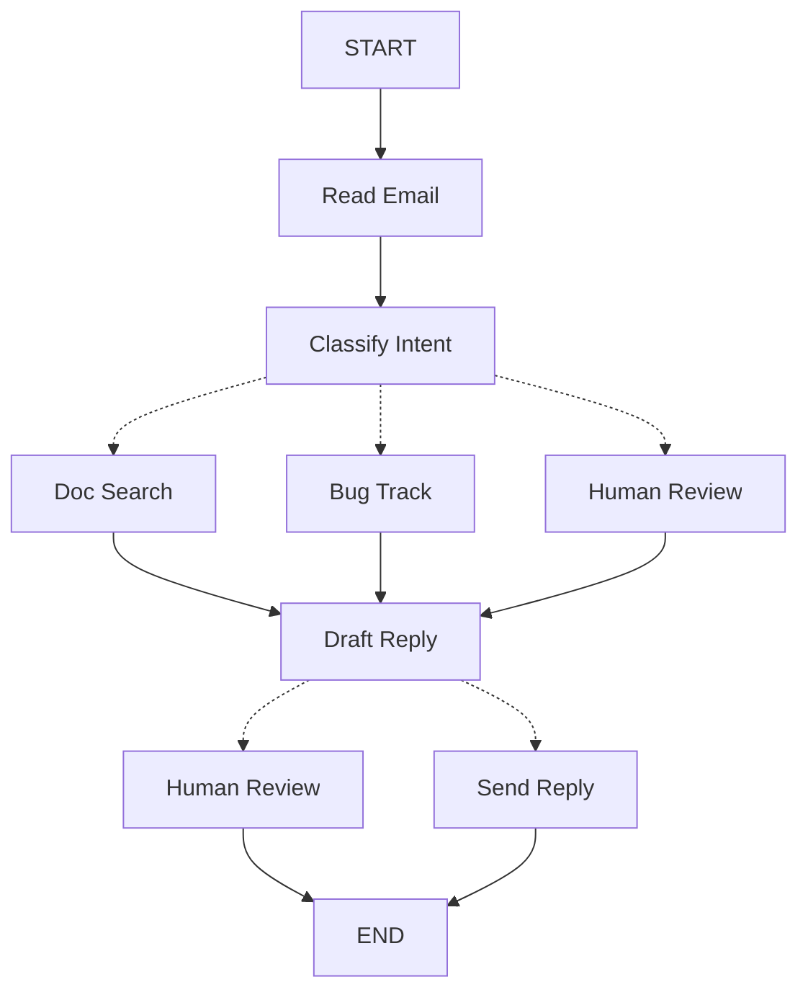

# Thinking in LangGraph 文档总结

## 一句话概述

用 LangGraph 构建 Agent 的思维方式：分解为离散步骤（节点），设计共享状态，用 Command 路由，适配错误处理策略。

---

## Mermaid 图：邮件 Agent 工作流



---

## 5 步构建流程

```
1. 映射工作流 → 识别节点和连接
2. 识别步骤类型 → LLM/数据/操作/用户输入
3. 设计状态 → 原始数据，按需格式化
4. 构建节点 → 函数 + 错误处理
5. 连接图 → add_node + add_edge + compile
```

---

## 四种节点类型

| 类型 | 用途 | 示例 |
|------|------|------|
| LLM 步骤 | 理解/分析/生成 | 分类意图、起草回复 |
| 数据步骤 | 检索外部信息 | 文档搜索、客户查询 |
| 操作步骤 | 执行外部操作 | 发送邮件、创建工单 |
| 用户输入步骤 | 人工干预 | 人工审查 |

---

## 状态设计原则

| 原则 | 说明 |
|------|------|
| 存储原始数据 | 不存格式化文本 |
| 按需格式化提示 | 在节点内格式化 |
| 跨步骤持久化 | 需要跨节点的数据才存 |
| 可派生的不存 | 能算出来的不存 |

---

## 五种错误处理策略

| 错误类型 | 策略 |
|---------|------|
| 瞬时错误 | `RetryPolicy` 自动重试 |
| LLM 可恢复 | 存入状态，循环回来 |
| 用户可修复 | `interrupt()` 暂停等待输入 |
| 重试后可恢复 | `error_handler` 补偿分支 |
| 意外错误 | 让它冒泡，不捕获 |

---

## Command 路由模式

```python
def my_node(state) -> Command[Literal["next_a", "next_b"]]:
    if 条件:
        return Command(update={...}, goto="next_a")
    else:
        return Command(update={...}, goto="next_b")
```

节点自己决定路由，图只定义基本连接。

---

## 关键洞察

| 洞察 | 说明 |
|------|------|
| 离散步骤 | 每个节点做好一件事 |
| 共享状态 | 原始数据，非格式化文本 |
| 节点是函数 | 接受状态，返回更新 |
| 错误是流的一部分 | 不同错误不同策略 |
| 人工输入是一等公民 | `interrupt()` 无限暂停 |
| 图结构自然产生 | 节点自路由，图连基本边 |

---

## 与 Quickstart 的关系

| Quickstart | Thinking in LangGraph |
|-----------|----------------------|
| 怎么写代码 | 怎么思考设计 |
| 6 步实现 | 5 步思维方式 |
| 计算器（简单） | 邮件 Agent（复杂） |
| 无错误处理 | 完整错误策略 |
| 无人机交互 | interrupt() 模式 |
