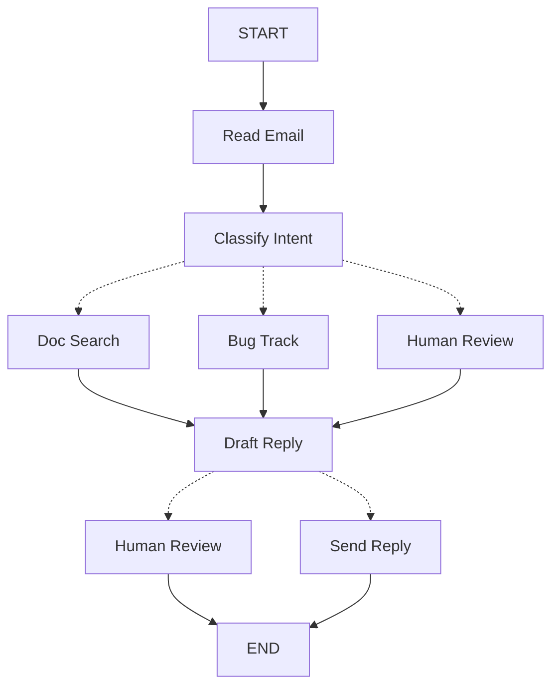

# 用 LangGraph 思考

> 学习如何思考用 LangGraph 构建 Agent

当你用 LangGraph 构建 Agent 时，你首先要将其分解为称为**节点**的离散步骤。然后，你描述每个节点的不同决策和转换。最后，你通过每个节点可以读取和写入的共享**状态**将节点连接在一起。

在本演练中，我们将引导你完成用 LangGraph 构建客户支持邮件 Agent 的思考过程。

## 从你想要自动化的过程开始

假设你需要构建一个处理客户支持邮件的 AI Agent。你的产品团队给了你这些需求：

```txt
Agent 应该：

- 读取收到的客户邮件
- 按紧急程度和主题分类
- 搜索相关文档来回答问题
- 起草适当的回复
- 将复杂问题升级给人工客服
- 需要时安排后续跟进

需要处理的示例场景：

1. 简单产品问题："如何重置密码？"
2. Bug 报告："选择 PDF 格式时导出功能崩溃"
3. 紧急账单问题："我的订阅被扣了两次费！"
4. 功能请求："能在移动应用中添加暗黑模式吗？"
5. 复杂技术问题："我们的 API 集成间歇性出现 504 错误"
```

要在 LangGraph 中实现 Agent，你通常会遵循相同的五个步骤。

## 第 1 步：将工作流映射为离散步骤

首先识别过程中的不同步骤。每个步骤将成为一个**节点**（执行一个特定任务的函数）。然后，勾画这些步骤如何相互连接。



此图中的箭头显示可能的路径，但实际决定走哪条路径发生在每个节点内部。

现在我们已经识别了工作流中的组件，让我们了解每个节点需要做什么：

* `Read Email`：提取和解析邮件内容
* `Classify Intent`：使用 LLM 对紧急程度和主题进行分类，然后路由到适当的操作
* `Doc Search`：查询知识库获取相关信息
* `Bug Track`：在跟踪系统中创建或更新问题
* `Draft Reply`：生成适当的回复
* `Human Review`：升级给人工客服进行审批或处理
* `Send Reply`：发送邮件回复

> **提示：** 注意有些节点决定下一步去哪里（`Classify Intent`、`Draft Reply`、`Human Review`），而其他节点总是继续到相同的下一步（`Read Email` 总是去 `Classify Intent`，`Doc Search` 总是去 `Draft Reply`）。

## 第 2 步：识别每个步骤需要做什么

对于图中的每个节点，确定它代表什么类型的操作以及它需要什么上下文才能正常工作。

### LLM 步骤

当一个步骤需要理解、分析、生成文本或做出推理决策时：

**分类意图：**
* 静态上下文（提示）：分类类别、紧急程度定义、响应格式
* 动态上下文（来自状态）：邮件内容、发件人信息
* 期望结果：决定路由的结构化分类

**起草回复：**
* 静态上下文（提示）：语气指南、公司政策、响应模板
* 动态上下文（来自状态）：分类结果、搜索结果、客户历史
* 期望结果：准备好审查的专业邮件回复

### 数据步骤

当一个步骤需要从外部来源检索信息时：

**文档搜索：**
* 参数：从意图和主题构建的查询
* 重试策略：是，对瞬时故障使用指数退避
* 缓存：可以缓存常见查询以减少 API 调用

**客户历史查询：**
* 参数：来自状态的客户邮箱或 ID
* 重试策略：是，但如果不可用则回退到基本信息
* 缓存：是，使用存活时间平衡新鲜度和性能

### 操作步骤

当一个步骤需要执行外部操作时：

**发送回复：**
* 何时执行节点：审批后（人工或自动）
* 重试策略：是，对网络问题使用指数退避
* 不应缓存：每次发送都是唯一操作

**Bug 跟踪：**
* 何时执行节点：当意图是"bug"时总是执行
* 重试策略：是，不能丢失 bug 报告至关重要
* 返回：工单 ID 以包含在回复中

### 用户输入步骤

当一个步骤需要人工干预时：

**人工审查节点：**
* 决策上下文：原始邮件、草稿回复、紧急程度、分类
* 期望输入格式：审批布尔值加可选的编辑回复
* 何时触发：高紧急程度、复杂问题或质量问题

## 第 3 步：设计你的状态

状态是 Agent 中所有节点都可以访问的共享[记忆](/oss/python/concepts/memory)。把它想象成你的 Agent 用来跟踪它在处理过程中学到和决定的一切的笔记本。

### 什么属于状态？

关于每条数据问自己这些问题：

* **包含在状态中**：它需要跨步骤持久化吗？如果是，它进入状态。
* **不存储**：你能从其他数据派生它吗？如果可以，在需要时计算它而不是存储在状态中。

对于我们的邮件 Agent，我们需要跟踪：

* 原始邮件和发件人信息（以后无法重建）
* 分类结果（多个后续/下游节点需要）
* 搜索结果和客户数据（重新获取成本高）
* 草稿回复（需要在审查期间持久化）
* 执行元数据（用于调试和恢复）

### 保持状态原始，按需格式化提示

> **提示：** 一个关键原则：你的状态应该存储原始数据，而不是格式化文本。在需要时在节点内部格式化提示。

这种分离意味着：

* 不同节点可以根据需要以不同方式格式化相同数据
* 你可以更改提示模板而无需修改状态 Schema
* 调试更清晰——你可以准确看到每个节点收到了什么数据
* 你的 Agent 可以发展而不会破坏现有状态

让我们定义状态：

```python
from typing import TypedDict, Literal

# 定义邮件分类的结构
class EmailClassification(TypedDict):
    intent: Literal["question", "bug", "billing", "feature", "complex"]
    urgency: Literal["low", "medium", "high", "critical"]
    topic: str
    summary: str

class EmailAgentState(TypedDict):
    # 原始邮件数据
    email_content: str
    sender_email: str
    email_id: str

    # 分类结果
    classification: EmailClassification | None

    # 原始搜索/API 结果
    search_results: list[str] | None  # 原始文档块列表
    customer_history: dict | None  # 来自 CRM 的原始客户数据

    # 生成的内容
    draft_response: str | None
    messages: list[str] | None
```

注意状态只包含原始数据——没有提示模板，没有格式化字符串，没有指令。分类输出作为单个字典存储，直接来自 LLM。

## 第 4 步：构建你的节点

现在我们将每个步骤实现为一个函数。LangGraph 中的节点只是一个接受当前状态并返回更新的 Python 函数。

### 适当地处理错误

不同的错误需要不同的处理策略：

| 错误类型 | 谁修复 | 策略 | 何时使用 |
|---------|--------|------|---------|
| 瞬时错误（网络问题、限流） | 系统（自动） | 重试策略 | 通常在重试时解决的临时故障 |
| LLM 可恢复错误（工具故障、解析问题） | LLM | 将错误存储在状态中并循环回来 | LLM 可以看到错误并调整方法 |
| 用户可修复错误（缺少信息、指令不清） | 人类 | 用 `interrupt()` 暂停 | 需要用户输入才能继续 |
| 重试后可恢复的失败 | 开发者（声明式） | `error_handler` | 重试耗尽后运行补偿/恢复分支 |
| 意外错误 | 开发者 | 让它们冒泡 | 需要调试的未知问题 |

**瞬时错误：** 添加重试策略自动重试网络问题和限流。与 `timeout=` 结合使用以限制每次尝试。参见[容错性](/oss/python/langgraph/fault-tolerance)了解完整生命周期。

```python
from langgraph.types import RetryPolicy

workflow.add_node(
    "search_documentation",
    search_documentation,
    retry_policy=RetryPolicy(max_attempts=3, initial_interval=1.0)
)
```

**LLM 可恢复：** 将错误存储在状态中并循环回来，让 LLM 看到出了什么问题并重试：

```python
from langgraph.types import Command

def execute_tool(state: State) -> Command[Literal["agent", "execute_tool"]]:
    try:
        result = run_tool(state['tool_call'])
        return Command(update={"tool_result": result}, goto="agent")
    except ToolError as e:
        # 让 LLM 看到出了什么问题并重试
        return Command(
            update={"tool_result": f"Tool error: {str(e)}"},
            goto="agent"
        )
```

**用户可修复：** 暂停并从用户那里收集信息（如账户 ID、订单号或澄清）：

```python
from langgraph.types import Command

def lookup_customer_history(state: State) -> Command[Literal["draft_response"]]:
    if not state.get('customer_id'):
        user_input = interrupt({
            "message": "Customer ID needed",
            "request": "Please provide the customer's account ID to look up their subscription history"
        })
        return Command(
            update={"customer_id": user_input['customer_id']},
            goto="lookup_customer_history"
        )
    # 现在继续查询
    customer_data = fetch_customer_history(state['customer_id'])
    return Command(update={"customer_history": customer_data}, goto="draft_response")
```

**意外错误：** 让它们冒泡用于调试。不要捕获你无法处理的错误：

```python
def send_reply(state: EmailAgentState):
    try:
        email_service.send(state["draft_response"])
    except Exception:
        raise  # 暴露意外错误
```

**Saga / 补偿：** 重试耗尽后，运行更新状态并路由到补偿分支的恢复函数。参见[容错性](/oss/python/langgraph/fault-tolerance#error-handling)了解完整模式。

> **注意：** `error_handler` 需要 `langgraph>=1.2`。

```python
from langgraph.errors import NodeError
from langgraph.types import Command, RetryPolicy

def payment_error_handler(state: State, error: NodeError) -> Command:
    return Command(
        update={"status": f"compensated: {error.error}"},
        goto="finalize",
    )

workflow.add_node(
    "charge_payment",
    charge_payment,
    retry_policy=RetryPolicy(max_attempts=3, retry_on=ConnectionError),
    error_handler=payment_error_handler,
)
```

### 实现邮件 Agent 节点

我们将每个节点实现为简单函数。记住：节点接受状态、执行工作并返回更新。

**读取和分类节点：**

```python
from typing import Literal
from langgraph.graph import StateGraph, START, END
from langgraph.types import interrupt, Command, RetryPolicy
from langchain_openai import ChatOpenAI
from langchain.messages import HumanMessage

llm = ChatOpenAI(model="gpt-5-nano")

def read_email(state: EmailAgentState) -> dict:
    """Extract and parse email content"""
    return {
        "messages": [HumanMessage(content=f"Processing email: {state['email_content']}")]
    }

def classify_intent(state: EmailAgentState) -> Command[Literal["search_documentation", "human_review", "draft_response", "bug_tracking"]]:
    """Use LLM to classify email intent and urgency, then route accordingly"""

    structured_llm = llm.with_structured_output(EmailClassification)

    # 按需格式化提示，不存储在状态中
    classification_prompt = f"""
    Analyze this customer email and classify it:

    Email: {state['email_content']}
    From: {state['sender_email']}

    Provide classification including intent, urgency, topic, and summary.
    """

    classification = structured_llm.invoke(classification_prompt)

    # 根据分类确定下一个节点
    if classification['intent'] == 'billing' or classification['urgency'] == 'critical':
        goto = "human_review"
    elif classification['intent'] in ['question', 'feature']:
        goto = "search_documentation"
    elif classification['intent'] == 'bug':
        goto = "bug_tracking"
    else:
        goto = "draft_response"

    # 将分类作为单个字典存储在状态中
    return Command(
        update={"classification": classification},
        goto=goto
    )
```

**搜索和跟踪节点：**

```python
def search_documentation(state: EmailAgentState) -> Command[Literal["draft_response"]]:
    """Search knowledge base for relevant information"""

    classification = state.get('classification', {})
    query = f"{classification.get('intent', '')} {classification.get('topic', '')}"

    try:
        search_results = [
            "Reset password via Settings > Security > Change Password",
            "Password must be at least 12 characters",
            "Include uppercase, lowercase, numbers, and symbols"
        ]
    except SearchAPIError as e:
        search_results = [f"Search temporarily unavailable: {str(e)}"]

    return Command(
        update={"search_results": search_results},
        goto="draft_response"
    )

def bug_tracking(state: EmailAgentState) -> Command[Literal["draft_response"]]:
    """Create or update bug tracking ticket"""

    ticket_id = "BUG-12345"

    return Command(
        update={
            "search_results": [f"Bug ticket {ticket_id} created"],
            "current_step": "bug_tracked"
        },
        goto="draft_response"
    )
```

**响应节点：**

```python
def draft_response(state: EmailAgentState) -> Command[Literal["human_review", "send_reply"]]:
    """Generate response using context and route based on quality"""

    classification = state.get('classification', {})

    # 按需从原始状态数据格式化上下文
    context_sections = []

    if state.get('search_results'):
        formatted_docs = "\n".join([f"- {doc}" for doc in state['search_results']])
        context_sections.append(f"Relevant documentation:\n{formatted_docs}")

    if state.get('customer_history'):
        context_sections.append(f"Customer tier: {state['customer_history'].get('tier', 'standard')}")

    draft_prompt = f"""
    Draft a response to this customer email:
    {state['email_content']}

    Email intent: {classification.get('intent', 'unknown')}
    Urgency level: {classification.get('urgency', 'medium')}

    {chr(10).join(context_sections)}

    Guidelines:
    - Be professional and helpful
    - Address their specific concern
    - Use the provided documentation when relevant
    """

    response = llm.invoke(draft_prompt)

    needs_review = (
        classification.get('urgency') in ['high', 'critical'] or
        classification.get('intent') == 'complex'
    )

    goto = "human_review" if needs_review else "send_reply"

    return Command(
        update={"draft_response": response.content},
        goto=goto
    )

def human_review(state: EmailAgentState) -> Command[Literal["send_reply", END]]:
    """Pause for human review using interrupt and route based on decision"""

    classification = state.get('classification', {})

    # interrupt() 必须在最前面——恢复时它之前的代码会重新运行
    human_decision = interrupt({
        "email_id": state.get('email_id',''),
        "original_email": state.get('email_content',''),
        "draft_response": state.get('draft_response',''),
        "urgency": classification.get('urgency'),
        "intent": classification.get('intent'),
        "action": "Please review and approve/edit this response"
    })

    if human_decision.get("approved"):
        return Command(
            update={"draft_response": human_decision.get("edited_response", state.get('draft_response',''))},
            goto="send_reply"
        )
    else:
        return Command(update={}, goto=END)

def send_reply(state: EmailAgentState) -> dict:
    """Send the email response"""
    print(f"Sending reply: {state['draft_response'][:100]}...")
    return {}
```

## 第 5 步：连接在一起

现在我们将节点连接成一个工作图。由于我们的节点自己处理路由决策，我们只需要几个基本边。

要启用带 `interrupt()` 的[人机交互](/oss/python/langgraph/interrupts)，我们需要用[检查点](/oss/python/langgraph/persistence)编译以在运行之间保存状态：

```python
from langgraph.checkpoint.memory import MemorySaver
from langgraph.types import RetryPolicy

# 创建图
workflow = StateGraph(EmailAgentState)

# 添加节点
workflow.add_node("read_email", read_email)
workflow.add_node("classify_intent", classify_intent)

# 为可能有瞬时故障的节点添加重试策略
workflow.add_node(
    "search_documentation",
    search_documentation,
    retry_policy=RetryPolicy(max_attempts=3)
)
workflow.add_node("bug_tracking", bug_tracking)
workflow.add_node("draft_response", draft_response)
workflow.add_node("human_review", human_review)
workflow.add_node("send_reply", send_reply)

# 只添加基本边
workflow.add_edge(START, "read_email")
workflow.add_edge("read_email", "classify_intent")
workflow.add_edge("send_reply", END)

# 用检查点编译以持久化
memory = MemorySaver()
app = workflow.compile(checkpointer=memory)
```

图结构是最小的，因为路由通过 [`Command`](https://reference.langchain.com/python/langgraph/types/Command) 对象在节点内部发生。每个节点使用类型提示声明它可以去哪里，如 `Command[Literal["node1", "node2"]]`，使流明确且可追踪。

### 试用你的 Agent

让我们用需要人工审查的紧急账单问题运行 Agent：

```python
# 用紧急账单问题测试
initial_state = {
    "email_content": "I was charged twice for my subscription! This is urgent!",
    "sender_email": "customer@example.com",
    "email_id": "email_123",
    "messages": []
}

# 用 thread_id 运行以持久化
config = {"configurable": {"thread_id": "customer_123"}}
result = app.invoke(initial_state, config)
# 图会在 human_review 处暂停
print(f"human review interrupt:{result['__interrupt__']}")

# 准备好后，提供人工输入以恢复
from langgraph.types import Command

human_response = Command(
    resume={
        "approved": True,
        "edited_response": "We sincerely apologize for the double charge. I've initiated an immediate refund..."
    }
)

# 恢复执行
final_result = app.invoke(human_response, config)
print(f"Email sent successfully!")
```

当图遇到 `interrupt()` 时会暂停，将所有内容保存到检查点，然后等待。它可以在几天后恢复，精确地从离开的地方继续。`thread_id` 确保此对话的所有状态一起保存。

## 总结和后续步骤

### 关键洞察

构建这个邮件 Agent 向我们展示了 LangGraph 的思维方式：

* **分解为离散步骤**：每个节点做好一件事。这种分解支持流式进度更新、可以暂停和恢复的持久执行，以及清晰的调试（因为你可以在步骤之间检查状态）。

* **状态是共享记忆**：存储原始数据，而不是格式化文本。这让不同节点以不同方式使用相同信息。

* **节点是函数**：它们接受状态、执行工作并返回更新。当需要做路由决策时，它们同时指定状态更新和下一个目的地。

* **错误是流的一部分**：瞬时故障获得重试，LLM 可恢复错误带上下文循环回来，用户可修复问题暂停等待输入，意外错误冒泡用于调试。

* **人工输入是一等公民**：`interrupt()` 函数无限期暂停执行，保存所有状态，并在你提供输入时精确恢复到离开的地方。当与节点中的其他操作组合时，它必须在最前面。

* **图结构自然产生**：你定义基本连接，你的节点处理自己的路由逻辑。这使控制流明确且可追踪——你总是可以通过查看当前节点来理解你的 Agent 接下来会做什么。

### 高级考虑

**节点粒度权衡：**

你可能想知道：为什么不把 `Read Email` 和 `Classify Intent` 合并为一个节点？或者为什么把 Doc Search 和 Draft Reply 分开？

答案涉及弹性和可观测性之间的权衡。

**弹性考虑：** LangGraph 的[持久执行](/oss/python/langgraph/durable-execution)在节点边界创建检查点。当工作流在中断或故障后恢复时，它从执行停止的节点开头重新开始。更小的节点意味着更频繁的检查点，这意味着如果出错需要重复的工作更少。

**应用级关注：** 第 2 步中的缓存讨论（是否缓存搜索结果）是应用级决策，不是 LangGraph 框架功能。你在节点函数中根据具体需求实现缓存——LangGraph 不规定这个。

**性能考虑：** 更多节点不意味着更慢的执行。LangGraph 默认在后台写入检查点（[异步持久模式](/oss/python/langgraph/durable-execution#durability-modes)），所以你的图继续运行而不等待检查点完成。这意味着你获得频繁的检查点而性能影响最小。

### 后续方向

* [人机交互模式](/oss/python/langgraph/interrupts)
* [子图](/oss/python/langgraph/use-subgraphs)
* [流式处理](/oss/python/langgraph/streaming)
* [可观测性](/oss/python/langgraph/observability)
* [工具集成](/oss/python/langchain/tools)
* [重试逻辑](/oss/python/langgraph/use-graph-api#add-retry-policies)
