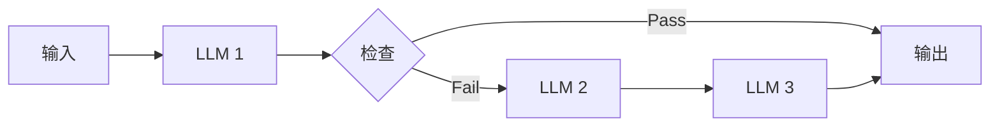
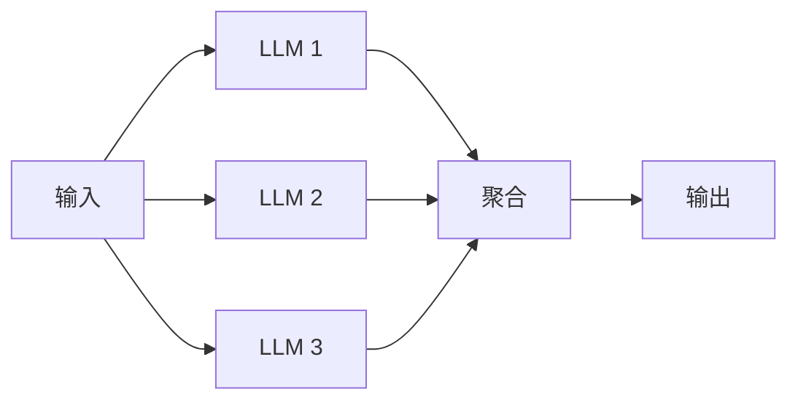
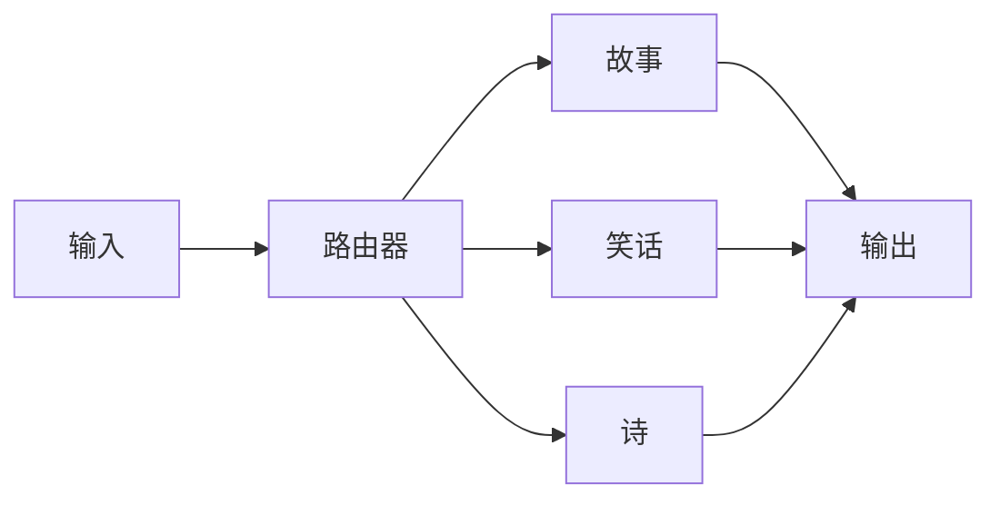
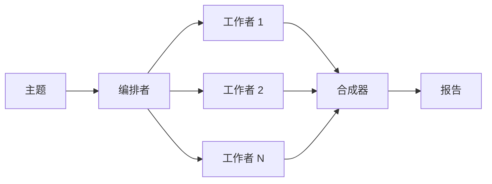
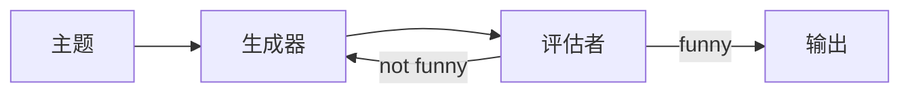
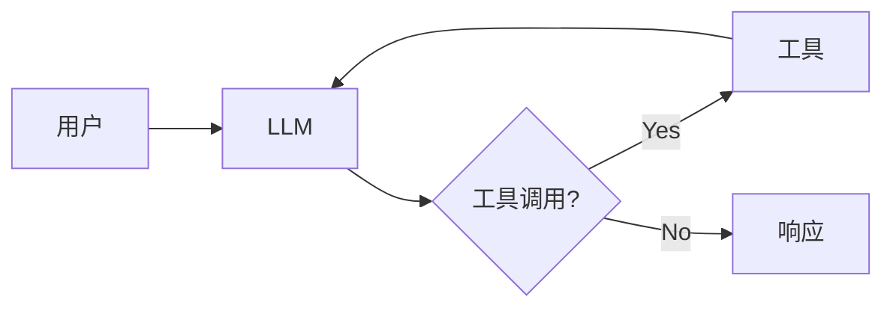

# Workflows and Agents 文档总结

## 一句话概述

LangGraph 的 5 种工作流模式（提示链、并行化、路由、编排者-工作者、评估者-优化者）+ Agent 模式，每种都用 Graph API 和 Functional API 实现。

---

## 6 种模式一览

| 模式 | 核心思想 | 适用场景 |
|------|---------|---------|
| **提示链** | 顺序执行，前一步输出→后一步输入 | 翻译、验证 |
| **并行化** | 多个 LLM 同时工作 | 速度提升、多角度评估 |
| **路由** | 分类输入→定向到专门流程 | 产品问答、客服 |
| **编排者-工作者** | 编排者分解任务→工作者执行→合成 | 报告生成、代码编写 |
| **评估者-优化者** | 生成→评估→反馈→迭代 | 翻译、内容创作 |
| **Agent** | LLM 自主决定工具使用 | 不可预测的问题 |

---

## 提示链

---

## 并行化

关键：多个节点从 START 开始 → 并行执行

---

## 路由

路由器用 `with_structured_output` 做分类

---

## 编排者-工作者

关键：`Send()` API 动态创建工作者

---

## 评估者-优化者

---

## Agent

---

## Graph API vs Functional API 对比

| 模式 | Graph API | Functional API |
|------|-----------|----------------|
| 提示链 | `add_conditional_edges` | `if/else` |
| 并行化 | 多个 `add_edge(START, ...)` | 多个 `@task` 并发调用 |
| 路由 | `add_conditional_edges` | `if/elif` |
| 编排者-工作者 | `Send()` API | 列表推导 |
| 评估者-优化者 | `add_conditional_edges` | `while True` |
| Agent | `add_conditional_edges` | `while True` |

---

## ToolNode

预构建节点，自动处理：
- 并行工具执行
- 错误处理
- 状态注入
