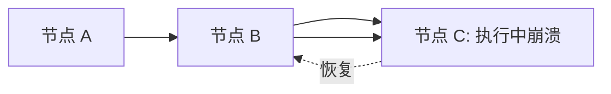
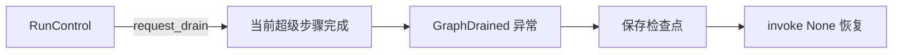

# Durable Execution 文档总结

## 一句话概述

持久执行通过检查点保存工作流进度，支持暂停/恢复、故障恢复和优雅关闭，确保长时间运行的工作流不会丢失已完成的工作。

---

## 三大要求

| 要求 | 说明 |
|------|------|
| 启用持久化 | 指定 checkpointer 保存工作流进度 |
| 线程标识符 | 指定 thread_id 跟踪执行历史 |
| 封装副作用 | 用 `@task` 包装非确定性和副作用操作 |

---

## 核心机制：确定性与一致重放

恢复时代码**不会从同一行继续**，而是从起点**重放**到停止点。



三条准则：
- **避免重复工作**：多个副作用操作 → 每个包装为独立 `@task`
- **封装非确定性**：随机数、时间戳等放在 `@task` 或节点内
- **使用幂等操作**：API 调用用幂等性键，避免重复写入

---

## 三种持久性模式

| 模式 | 时机 | 性能 | 持久性 |
|------|------|------|--------|
| `"exit"` | 仅退出时保存 | 最高 | 最低 |
| `"async"` | 异步保存 | 中等 | 中等 |
| `"sync"` | 同步保存 | 最低 | 最高 |

```python
graph.stream({"input": "test"}, durability="sync")
```

---

## 恢复场景

| 场景 | 方式 |
|------|------|
| 人机交互暂停 | `interrupt()` + `Command(resume=...)` |
| 故障恢复 | `graph.invoke(None, config)` |
| 优雅关闭后恢复 | `graph.invoke(None, config)` |

---

## 优雅关闭（Graceful Shutdown）

> 需要 `langgraph>=1.2`



### Drain 语义

| 场景 | 行为 |
|------|------|
| 节点执行中 | 运行到完成，下一超级步骤生效 |
| 重试中 | 重试完成后生效 |
| 图自然完成 | 正常返回 |
| 还有剩余步骤 | 抛出 GraphDrained |
| 子图请求 drain | 冒泡到父图 |

### 节点内检查 drain

```python
async def my_node(state, runtime):
    if runtime.drain_requested:
        return {"status": "skipped"}
    return {"status": await do_work()}
```

---

## 恢复起点

| API | 起点 |
|-----|------|
| StateGraph | 停止节点的开始 |
| 子图 | 父节点 + 子图内停止节点 |
| Functional API | entrypoint 的开始 |

---

## 关键 API

```python
# 持久性模式
graph.invoke(input, durability="sync")

# 优雅关闭
control = RunControl()
graph.invoke(inputs, config, control=control)
control.request_drain("reason")

# 恢复
graph.invoke(None, config)

# 节点内检查
runtime.drain_requested
runtime.drain_reason
```
