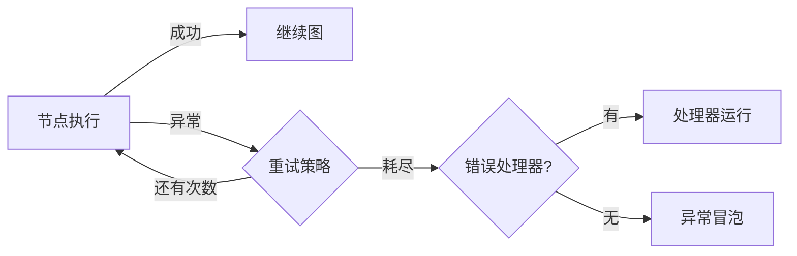

# Fault Tolerance 文档总结

## 一句话概述

LangGraph 的容错机制由重试、超时和错误处理三个可组合机制组成，按固定顺序执行：异常 → 重试策略 → 错误处理器。

---

## 执行流程



---

## 三大机制

### 1. 重试（RetryPolicy）

```python
RetryPolicy(max_attempts=3, initial_interval=0.5, backoff_factor=2.0)
```

| 参数 | 默认值 | 说明 |
|------|--------|------|
| `max_attempts` | 3 | 最大尝试次数 |
| `initial_interval` | 0.5s | 首次重试前等待 |
| `backoff_factor` | 2.0 | 退避乘数 |
| `max_interval` | 128s | 最大重试间隔 |
| `jitter` | True | 随机抖动 |
| `retry_on` | default_retry_on | 可重试异常类型 |

默认不重试的异常：ValueError, TypeError, SyntaxError 等编程错误。

### 2. 超时（Timeout）

```python
# 简单超时
timeout=60  # 秒
timeout=timedelta(minutes=2)

# 分别设置
timeout=TimeoutPolicy(run_timeout=120, idle_timeout=30)
```

| 类型 | 说明 | 刷新 |
|------|------|------|
| `run_timeout` | 硬挂钟限制 | 不刷新 |
| `idle_timeout` | 空闲超时 | 进度信号时重置 |

> 超时仅适用于 async 节点！

空闲超时的进度信号：
- 状态写入
- 流输出
- 子任务调度
- LangChain 回调事件
- `runtime.heartbeat()` 手动心跳

### 3. 错误处理（error_handler）

```python
def error_handler(state: State, error: NodeError) -> Command:
    return Command(update={"status": "recovered"}, goto="fallback")
```

- 仅在重试耗尽后触发
- 返回 `Command` 可更新状态并路由
- 支持 Saga/补偿模式

---

## NodeError 数据类

| 属性 | 类型 | 描述 |
|------|------|------|
| `node` | `str` | 失败节点名称 |
| `error` | `BaseException` | 引发的异常 |

---

## 图默认值（set_node_defaults）

```python
StateGraph(State).set_node_defaults(
    retry_policy=RetryPolicy(max_attempts=3),
    error_handler=default_handler,
    timeout=TimeoutPolicy(run_timeout=30),
)
```

优先级：`add_node()` 参数 > `set_node_defaults()` 默认值

适用性矩阵：

| 参数 | 常规节点 | 错误处理器节点 |
|------|---------|--------------|
| retry_policy | ✅ | ✅ |
| timeout | ✅ | ✅ |
| error_handler | ✅ | ❌ |
| cache_policy | ✅ | ❌ |

---

## execution_info 检查重试状态

```python
runtime.execution_info.node_attempt      # 当前尝试次数
runtime.execution_info.thread_id         # 线程 ID
runtime.execution_info.run_id            # 运行 ID
```

---

## Functional API 支持

```python
@task(timeout=30, retry_policy=RetryPolicy(max_attempts=3))
async def call_api(url: str) -> str: ...

@entrypoint(timeout=60)
async def my_workflow(inputs): ...
```

---

## 限制

- 超时和错误处理器仅 Python
- 超时仅 async 节点
- 每节点最多一个 error_handler
- 子图不继承父图默认值
