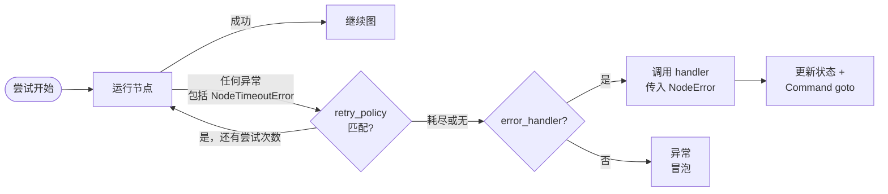

# 容错（Fault Tolerance）

> 在 LangGraph 中配置每节点超时、重试和错误处理器。

当节点失败时——来自缓慢的外部 API、瞬时网络错误或未处理的异常——LangGraph 提供三种可组合的机制来响应：

* [**重试**](#重试) — 基于异常类型和退避设置自动重新运行失败的尝试
* [**超时**](#超时) — 限制单次尝试可以运行多长时间
* [**错误处理**](#错误处理) — 在所有重试耗尽后运行恢复函数

使用 [**`set_node_defaults`**](#图默认值) 一次为所有节点配置这些机制，而不是在每个 `add_node` 调用上重复它们。

这些机制按固定顺序组合：当节点尝试引发任何异常（包括来自超时的 [`NodeTimeoutError`](https://reference.langchain.com/python/langgraph/errors/NodeTimeoutError)）时，重试策略决定是否重试。只有在重试耗尽后，错误处理器才会运行。

> **注意：** 每节点超时和节点级错误处理器需要 `langgraph>=1.2`。



## 重试

重试策略基于异常类型和退避设置自动重新运行失败的节点尝试。将 `retry_policy=` 传递给 [`add_node`](https://reference.langchain.com/python/langgraph/graph/state/StateGraph/add_node)：

```python
from langgraph.types import RetryPolicy

builder.add_node(
    "call_api",
    call_api,
    retry_policy=RetryPolicy(max_attempts=3),
)
```

### 默认行为

默认情况下，`retry_on` 使用 `default_retry_on`，它会重试**任何**异常，除了以下异常（及其子类）：

* `ValueError`
* `TypeError`
* `ArithmeticError`
* `ImportError`
* `LookupError`
* `NameError`
* `SyntaxError`
* `RuntimeError`
* `ReferenceError`
* `StopIteration`
* `StopAsyncIteration`
* `OSError`

对于来自流行 HTTP 库（如 `requests` 和 `httpx`）的异常，它只重试 5xx 状态码。[`NodeTimeoutError`](https://reference.langchain.com/python/langgraph/errors/NodeTimeoutError) 默认可重试。

### 参数

| 参数 | 类型 | 默认值 | 描述 |
|------|------|--------|------|
| `max_attempts` | `int` | `3` | 最大尝试次数，包括第一次。 |
| `initial_interval` | `float` | `0.5` | 第一次重试前的秒数。 |
| `backoff_factor` | `float` | `2.0` | 每次重试后应用于间隔的乘数。 |
| `max_interval` | `float` | `128.0` | 重试之间的最大秒数。 |
| `jitter` | `bool` | `True` | 向间隔添加随机抖动。 |
| `retry_on` | `type[Exception] \| Sequence[type[Exception]] \| Callable[[Exception], bool]` | `default_retry_on` | 要重试的异常，或返回 `True` 表示可重试异常的可调用对象。 |

### 自定义重试逻辑

将可调用对象或异常类型传递给 `retry_on`。导入 `default_retry_on` 以扩展默认行为：

```python
from langgraph.types import RetryPolicy, default_retry_on

def custom_retry_on(exc: BaseException) -> bool:
    if isinstance(exc, MyCustomError):
        return False
    return default_retry_on(exc)

builder.add_node(
    "call_api",
    call_api,
    retry_policy=RetryPolicy(max_attempts=3, retry_on=custom_retry_on),
)
```

### 检查重试状态

在节点内使用 `runtime.execution_info` 检查当前尝试次数。当主调用持续失败时，这对于切换到备用方案很有用：

```python
from langgraph.graph import StateGraph, START, END
from langgraph.runtime import Runtime
from langgraph.types import RetryPolicy
from typing_extensions import TypedDict

class State(TypedDict):
    result: str

def my_node(state: State, runtime: Runtime) -> State:
    if runtime.execution_info.node_attempt > 1:
        return {"result": call_fallback_api()}
    return {"result": call_primary_api()}

builder = StateGraph(State)
builder.add_node("my_node", my_node, retry_policy=RetryPolicy(max_attempts=3))
builder.add_edge(START, "my_node")
builder.add_edge("my_node", END)
```

`execution_info` 暴露以下字段：

| 属性 | 类型 | 描述 |
|------|------|------|
| `node_attempt` | `int` | 当前尝试次数（从 1 开始）。第一次为 `1`，第一次重试为 `2`，依此类推。 |
| `node_first_attempt_time` | `float \| None` | 第一次尝试开始的 Unix 时间戳。在重试之间保持不变。 |
| `thread_id` | `str \| None` | 当前执行的线程 ID。无检查点器时为 `None`。 |
| `run_id` | `str \| None` | 当前执行的运行 ID。未在配置中提供时为 `None`。 |
| `checkpoint_id` | `str` | 当前执行的检查点 ID。 |
| `task_id` | `str` | 当前执行的任务 ID。 |

`execution_info` 即使没有重试策略也可用——`node_attempt` 默认为 `1`。

## 超时

> 需要 `langgraph>=1.2`。

[`add_node`](https://reference.langchain.com/python/langgraph/graph/state/StateGraph/add_node) 上的 `timeout=` 参数限制单个节点尝试可以运行多长时间。传递数字（秒）、`timedelta` 或 [`TimeoutPolicy`](https://reference.langchain.com/python/langgraph/types/TimeoutPolicy) 以分别设置运行和空闲限制：

```python
from datetime import timedelta
from langgraph.types import TimeoutPolicy

# 简单的挂钟限制
builder.add_node("call_model", call_model, timeout=60)
builder.add_node("call_model", call_model, timeout=timedelta(minutes=2))

# 分别设置运行和空闲限制
builder.add_node(
    "call_model",
    call_model,
    timeout=TimeoutPolicy(run_timeout=120, idle_timeout=30),
)
```

> **警告：** 节点超时仅适用于 **async** 节点。带有 `timeout` 的同步节点在编译时会被拒绝。要包装阻塞 I/O，请在异步节点内使用 `asyncio.to_thread`。

### 运行超时

`run_timeout` 是单次尝试的硬挂钟限制。无论节点活动如何，它都不会刷新：

```python
from langgraph.types import TimeoutPolicy

builder.add_node(
    "call_model",
    call_model,
    timeout=TimeoutPolicy(run_timeout=120),
)
```

当超过限制时，LangGraph 引发 [`NodeTimeoutError`](https://reference.langchain.com/python/langgraph/errors/NodeTimeoutError)，清除失败尝试的任何写入，并让重试策略决定是否重试。

### 空闲超时

`idle_timeout` 是进度重置限制。它仅在节点在指定持续时间内停止取得可观察进度时触发——与 `run_timeout` 不同，当时钟产生进度信号时会重置：

```python
builder.add_node(
    "call_model",
    call_model,
    timeout=TimeoutPolicy(idle_timeout=30),
)
```

你可以同时设置 `run_timeout` 和 `idle_timeout`。先触发的取消尝试。

#### 进度信号

在默认的 `refresh_on="auto"` 下，空闲时钟在以下任一情况下重置：

* 通过 `CONFIG_KEY_SEND` 的状态写入
* 流输出（yield 的异步流块）
* 子任务调度
* Runtime stream-writer 调用
* 来自节点或其后代的任何 LangChain 回调事件（LLM token、工具调用、链开始/结束等）

#### 心跳模式

设置 `refresh_on="heartbeat"` 将刷新源缩小到仅显式 `runtime.heartbeat()` 调用。当你想要不被嘈杂下属重置的严格空闲定义时很有用：

```python
builder.add_node(
    "call_model",
    call_model,
    timeout=TimeoutPolicy(idle_timeout=30, refresh_on="heartbeat"),
)
```

#### 手动心跳

对于不自然发出进度信号的长时间运行的异步工作，调用 `runtime.heartbeat()` 手动重置空闲时钟：

```python
from langgraph.graph import StateGraph, START, END
from langgraph.runtime import Runtime
from langgraph.types import TimeoutPolicy
from typing_extensions import TypedDict

class State(TypedDict):
    result: str

async def long_running_node(state: State, runtime: Runtime) -> State:
    for batch in fetch_batches():
        process(batch)
        runtime.heartbeat()
    return {"result": "done"}

builder = StateGraph(State)
builder.add_node(
    "long_running_node",
    long_running_node,
    timeout=TimeoutPolicy(idle_timeout=30, refresh_on="heartbeat"),
)
builder.add_edge(START, "long_running_node")
builder.add_edge("long_running_node", END)
```

`runtime.heartbeat()` 在空闲计时尝试之外是无操作，因此你可以无条件调用它。

### NodeTimeoutError

当超时触发时，LangGraph 引发 [`NodeTimeoutError`](https://reference.langchain.com/python/langgraph/errors/NodeTimeoutError)，包含关于哪个限制被触发的结构化上下文：

| 属性 | 类型 | 描述 |
|------|------|------|
| `node` | `str` | 执行超时的节点名称。 |
| `elapsed` | `float` | 超时触发前经过的秒数。 |
| `kind` | `Literal["idle", "run"]` | 哪个超时触发了。 |
| `idle_timeout` | `float \| None` | 配置的空闲超时（秒），如有。 |
| `run_timeout` | `float \| None` | 配置的运行超时（秒），如有。 |

`NodeTimeoutError` 默认可重试。将 `timeout=` 与 `retry_policy=` 结合使用开箱即用——超时时钟在每次新尝试时重置，超时尝试的写入在下次重试前清除：

```python
from langgraph.types import RetryPolicy, TimeoutPolicy

builder.add_node(
    "call_model",
    call_model,
    timeout=TimeoutPolicy(idle_timeout=30),
    retry_policy=RetryPolicy(max_attempts=3),
)
```

### 使用 Send 的动态超时

使用 [`Send`](https://reference.langchain.com/python/langgraph/types/Send) 动态调度节点时（例如在 map-reduce 模式中），你可以直接在 `Send` 上传递 `timeout=` 来覆盖该特定推送的目标节点静态超时：

```python
from langgraph.types import Send, TimeoutPolicy

def fan_out(state: OverallState):
    return [
        Send("process_item", {"item": item}, timeout=TimeoutPolicy(idle_timeout=15))
        for item in state["items"]
    ]
```

如果 `Send` 上省略 `timeout=`，则应用目标节点的超时（在 `add_node` 时设置）。这让你可以在节点上设置默认超时，并为单个调用收紧它。

## 错误处理

> 需要 `langgraph>=1.2`。

错误处理器在节点失败且所有重试耗尽后运行。它接收当前状态并可以更新状态或使用 [`Command`](https://reference.langchain.com/python/langgraph/types/Command) 路由到不同节点。这对于补偿流程（Saga 模式）很有用，你希望优雅恢复而不是中止整个图。

将 `error_handler=` 传递给 [`add_node`](https://reference.langchain.com/python/langgraph/graph/state/StateGraph/add_node)：

```python
from langgraph.errors import NodeError
from langgraph.types import Command, RetryPolicy
from langgraph.graph import StateGraph, START
from typing_extensions import TypedDict

class State(TypedDict):
    status: str

def charge_payment(state: State) -> State:
    raise RuntimeError("payment gateway timeout")

def payment_error_handler(state: State, error: NodeError) -> Command:
    return Command(
        update={"status": f"compensated: {error.error}"},
        goto="finalize",
    )

def finalize(state: State) -> State:
    return state

graph = (
    StateGraph(State)
    .add_node(
        "charge_payment",
        charge_payment,
        retry_policy=RetryPolicy(max_attempts=3, retry_on=ConnectionError),
        error_handler=payment_error_handler,
    )
    .add_node("finalize", finalize)
    .add_edge(START, "charge_payment")
    .compile()
)
```

处理器仅在 `retry_policy` 耗尽后触发，或在未配置重试策略时立即触发。重试策略和错误处理器保持解耦：独立配置何时重试和何时补偿。

### NodeError

错误处理器通过类型化的 `error: NodeError` 参数接收故障上下文，通过类型注解注入（与 `runtime: Runtime` 相同的模式）：

```python
from langgraph.errors import NodeError

def my_handler(state: State, error: NodeError) -> Command:
    print(f"Node {error.node} failed with: {error.error}")
    return Command(update={"status": "recovered"}, goto="next_step")
```

[`NodeError`](https://reference.langchain.com/python/langgraph/errors/NodeError) 是一个冻结的数据类，有两个字段：

| 属性 | 类型 | 描述 |
|------|------|------|
| `node` | `str` | 执行失败的节点名称。 |
| `error` | `BaseException` | 失败节点引发的异常。 |

`error: NodeError` 参数是可选的。不需要故障上下文的处理器可以使用更简单的签名如 `(state)` 或 `(state, runtime)`。

### 使用 Command 路由

错误处理器可以返回 [`Command`](https://reference.langchain.com/python/langgraph/types/Command) 来更新状态并路由到特定节点，实现 Saga/补偿模式：

```python
from langgraph.errors import NodeError
from langgraph.types import Command, RetryPolicy
from langgraph.graph import StateGraph, START
from typing_extensions import TypedDict

class State(TypedDict):
    status: str

def reserve_inventory(state: State) -> State:
    return {"status": "reserved"}

def charge_payment(state: State) -> State:
    raise RuntimeError("payment timeout")

def payment_error_handler(state: State, error: NodeError) -> Command:
    return Command(
        update={"status": f"compensated_after_{error.node}: {error.error}"},
        goto="finalize",
    )

def finalize(state: State) -> State:
    return state

graph = (
    StateGraph(State)
    .add_node("reserve_inventory", reserve_inventory)
    .add_node(
        "charge_payment",
        charge_payment,
        retry_policy=RetryPolicy(max_attempts=3, retry_on=ConnectionError),
        error_handler=payment_error_handler,
    )
    .add_node("finalize", finalize)
    .add_edge(START, "reserve_inventory")
    .add_edge("reserve_inventory", "charge_payment")
    .compile()
)
```

`charge_payment` 在 `ConnectionError` 上最多重试 3 次。如果重试耗尽（或错误不是 `ConnectionError`），处理器通过更新状态并路由到 `finalize` 来补偿，而不是中止图。

### 恢复安全的故障

> **注意：** 故障来源被检查点化。如果图在节点失败后但在处理器完成前被中断或进程崩溃，当图从检查点恢复时，处理器会看到相同的 `NodeError` 上下文。

### 与 `interrupt()` 的行为

> **警告：** 在节点内引发的 `interrupt()` **不会**路由到错误处理器。中断使用 `GraphBubbleUp` 机制暂停图执行用于人机交互工作流，绕过重试策略和错误处理器。图照常暂停。

### 子图故障

如果节点包装了子图且子图引发了未处理的异常，该异常会冒泡到父节点。如果父节点有 `error_handler`，处理器将以子图的异常在 `error.error` 中触发。

## 图默认值

> 需要 `langgraph>=1.2`。

与其在每个 `add_node` 调用上重复相同的 `retry_policy=`、`error_handler=`、`timeout=` 或 `cache_policy=`，使用 `set_node_defaults()` 在一处配置图范围的默认值：

```python
from langgraph.errors import NodeError
from langgraph.types import RetryPolicy, TimeoutPolicy
from langgraph.graph import StateGraph, START
from typing_extensions import TypedDict

class State(TypedDict):
    status: str

def default_error_handler(state: State, error: NodeError) -> State:
    return {"status": f"handled: {error.error}"}

graph = (
    StateGraph(State)
    .set_node_defaults(
        retry_policy=RetryPolicy(max_attempts=3),
        error_handler=default_error_handler,
        timeout=TimeoutPolicy(run_timeout=30),
    )
    .add_node("step_a", step_a)
    .add_node("step_b", step_b)
    .add_edge(START, "step_a")
    .compile()
)
```

`step_a` 和 `step_b` 现在共享相同的重试策略、错误处理器和超时，没有任何重复。

### 优先级

直接传递给 `add_node()` 的每节点值始终覆盖 `set_node_defaults()` 设置的默认值。默认值在 `compile()` 时解析，因此你可以在 `add_node()` 之前或之后以任意顺序调用 `set_node_defaults()`：

```python
graph = (
    StateGraph(State)
    .set_node_defaults(error_handler=default_error_handler)
    .add_node("step_a", step_a)                                     # 使用 default_error_handler
    .add_node("step_b", step_b, error_handler=custom_error_handler) # 使用 custom_error_handler
    .add_edge(START, "step_a")
    .compile()
)
```

### 默认错误处理器

当你想要一个单一的全局恢复函数来处理任何没有自己处理器的失败节点时，`error_handler` 默认值特别有价值。处理器接受与[错误处理](#错误处理)中描述的相同 `(state, error: NodeError)` 签名：

```python
from langgraph.errors import NodeError
from langgraph.graph import StateGraph, START
from langgraph.types import RetryPolicy
from typing_extensions import TypedDict

class State(TypedDict):
    status: str

def always_failing(state: State) -> State:
    raise ValueError("something went wrong")

def default_handler(state: State, error: NodeError) -> State:
    return {"status": f"recovered from {error.node}: {error.error}"}

graph = (
    StateGraph(State)
    .set_node_defaults(
        retry_policy=RetryPolicy(max_attempts=2),
        error_handler=default_handler,
    )
    .add_node("always_failing", always_failing)
    .add_edge(START, "always_failing")
    .compile()
)
```

节点重试两次，然后 `default_handler` 运行。默认处理器也接受 `RunnableConfig` 作为可选的第三个参数，如果你需要访问配置值如 `thread_id`：

```python
from langchain_core.runnables import RunnableConfig

def default_handler(state: State, error: NodeError, config: RunnableConfig) -> State:
    thread_id = config["configurable"].get("thread_id")
    return {"status": f"handled on thread {thread_id}"}
```

### 适用性矩阵

并非所有默认值适用于所有节点类型。错误处理器节点（通过 `add_node(error_handler=...)` 注册的节点）被排除在某些默认值之外，以防止不安全行为：

| `set_node_defaults` 参数 | 适用于常规节点 | 适用于错误处理器节点 | 原因 |
|--------------------------|---------------|-------------------|------|
| `retry_policy` | ✅ | ✅ | 处理器应在瞬时故障时重试 |
| `timeout` | ✅ | ✅ | 卡住的处理器应像卡住的常规节点一样被取消 |
| `error_handler` | ✅ | ❌ | 处理器永远不应捕获自身 |
| `cache_policy` | ✅ | ❌ | 缓存处理器结果不安全 |

### 范围

父图上设置的默认值**不会**被子图继承。每个图维护自己的默认值。

## Functional API

`@task` 和 `@entrypoint` 上可用相同的 `timeout=` 和 `retry_policy=` 参数：

```python
from langgraph.func import entrypoint, task
from langgraph.types import RetryPolicy, TimeoutPolicy

@task(
    timeout=TimeoutPolicy(idle_timeout=30),
    retry_policy=RetryPolicy(max_attempts=3),
)
async def call_api(url: str) -> str:
    response = await fetch(url)
    return response.text

@entrypoint(timeout=60)
async def my_workflow(inputs: dict) -> str:
    result = await call_api("https://api.example.com/data")
    return result
```

行为与 `add_node` 相同：超时时引发 `NodeTimeoutError`，缓冲写入被清除，重试策略决定是否重试。

## 限制

* **仅 Python**：超时和错误处理器在 JavaScript/TypeScript SDK 中不可用。重试策略在 Python 和 TypeScript 中均可工作。
* **超时仅异步**：带有 `timeout` 的同步节点在编译时被拒绝。
* **每节点一个处理器**：每个节点最多可以有一个 `error_handler`。
* **处理器故障冒泡**：如果错误处理器本身引发异常，该异常会像节点没有处理器一样传播。
* **`set_node_defaults` 不被子图继承**：每个图独立管理自己的默认值。
