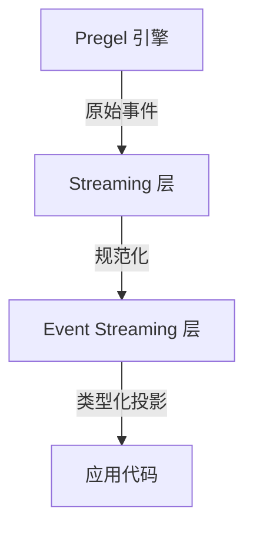

# Event Streaming 文档总结

## 一句话概述

事件流是 LangGraph 推荐的流式模型，通过类型化投影（messages、values、subgraphs 等）在一个底层事件流上提供多种消费方式。

---

## 两层架构



| 层 | 作用 |
|----|------|
| Streaming | 发出原始图执行事件 |
| Event Streaming | 规范化 + 转换器 + 类型化投影 |

---

## 8 种投影

| 投影 | 用途 |
|------|------|
| `stream` | 迭代每个协议事件 |
| `stream.messages` | 聊天模型消息和 token 增量 |
| `stream.values` | 状态快照 |
| `stream.output` | 最终输出 |
| `stream.subgraphs` | 嵌套图执行 |
| `stream.interrupts` | 人机交互中断负载 |
| `stream.interrupted` | 是否暂停 |
| `stream.extensions` | 自定义转换器投影 |

多个消费者可并发读取，互不干扰。

---

## 10 种通道

| 通道 | 内容 |
|------|------|
| `values` | 完整状态快照 |
| `updates` | 每节点增量 |
| `messages` | 内容块输出 |
| `tools` | 工具调用事件 |
| `lifecycle` | 运行状态变更 |
| `checkpoints` | 检查点信封 |
| `input` | 人机交互输入 |
| `tasks` | 任务创建/结果 |
| `custom` | 用户定义负载 |
| `custom:<name>` | 转换器输出 |

---

## ProtocolEvent 结构

```python
{
    "seq": 1,              # 严格递增，用于排序
    "method": "messages",  # 通道名称
    "params": {
        "namespace": [],   # 从根图到作用域的路径
        "timestamp": 123,  # 挂钟毫秒
        "data": {...}      # 通道特定负载
    }
}
```

---

## 消息通道事件流

```
message-start
  → content-block-start
    → content-block-delta (多次)
  → content-block-finish
  → content-block-start (下一个块)
  → ...
→ message-finish
```

---

## 流转换器（StreamTransformer）

```python
class MyTransformer(StreamTransformer):
    required_stream_modes = ("custom",)

    def init(self) -> dict:           # 创建投影对象
        return {"my_proj": StreamChannel()}

    def process(self, event) -> bool: # 处理事件
        return True

    def finalize(self) -> None:       # 成功结束
        pass

    def fail(self, err) -> None:      # 失败处理
        pass
```

### StreamChannel

| 类型 | 用途 |
|------|------|
| `StreamChannel()` | 仅侧通道投影 |
| `StreamChannel("name")` | 同时流入主流 |

### 注册方式

```python
# 调用时注册（实验）
stream = graph.stream_events(input, transformers=[MyTransformer])

# 编译时注册（永久）
graph = builder.compile(transformers=[MyTransformer])
```

---

## 与 LangChain Event Streaming 的区别

| 特性 | LangChain Event Streaming | LangGraph Event Streaming |
|------|--------------------------|--------------------------|
| 层级 | 应用级 | 图引擎级 |
| 事件类型 | `on_chat_model_stream` 等 | `messages`, `tools`, `lifecycle` 等 |
| 投影 | 无 | 8 种类型化投影 |
| 转换器 | 无 | StreamTransformer 体系 |
| 命名空间 | `['chatmodel:xxx']` | `['node:xxx', 'subgraph:xxx']` |

---

## 关键 API

```python
# 创建事件流
stream = graph.stream_events(input, version="v3")

# 消费投影
for msg in stream.messages: ...
for snap in stream.values: ...
for sub in stream.subgraphs: ...
final = stream.output

# 并发消费
await asyncio.gather(consume_messages(), consume_subgraphs())

# 交错消费
for name, item in stream.interleave("values", "messages"): ...

# 中断恢复
if stream.interrupted:
    stream = graph.stream_events(Command(resume=...), version="v3")
```
