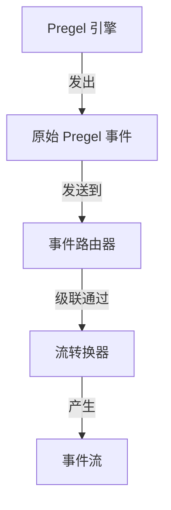
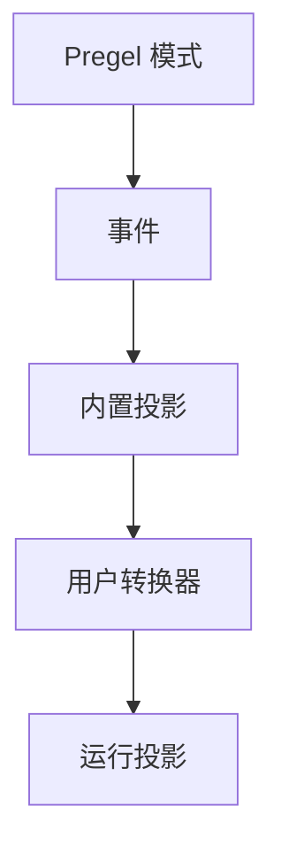

# 事件流（Event Streaming）

> 使用类型化投影流式传输 LangGraph 运行的消息、状态、子图、输出和扩展。

事件流是大多数 LangGraph 应用程序代码推荐的进程内流式模型。它返回一个运行流对象，可以同时以多种方式消费。

## 快速开始

```python
stream = graph.stream_events({
    "messages": [{"role": "user", "content": "What is 42 * 17?"}],
}, version="v3")

for message in stream.messages:
    for token in message.text:
        print(token, end="", flush=True)

final_state = stream.output
```

## 各部分如何协同

流式堆栈有两个主要层：

1. **Streaming（流式传输）** 从 Pregel 引擎发出原始图执行事件。
2. **Event Streaming（事件流）** 规范化这些事件，通过流转换器处理它们，并暴露类型化投影。



**原始 Pregel 事件类型：** `updates`, `values`, `messages`, `custom`, `checkpoints`, `tasks`, `debug`

**流转换器：** ValuesTransformer, MessagesTransformer, 自定义转换器等

事件路由器是两层之间的桥梁。它接收规范化的 Pregel 事件，并将每个事件通过注册的流转换器传递。内置转换器创建标准投影如 `stream.messages`、`stream.values`、`stream.subgraphs` 和 `stream.output`。自定义转换器可以在 `stream.extensions` 下添加应用特定的投影。

## 事件流提供的功能

运行流在一个底层事件流上暴露类型化投影：

| 投影 | 用途 |
|------|------|
| `stream` | 迭代每个协议事件。 |
| `stream.messages` | 流式传输聊天模型消息和 token 增量。 |
| `stream.values` | 迭代状态快照并等待最终值。 |
| `stream.output` | 等待最终输出。 |
| `stream.subgraphs` | 发现和观察嵌套图执行。 |
| `stream.interrupts` | 检查人机交互中断负载。 |
| `stream.interrupted` | 检查运行是否为人类输入而暂停。 |
| `stream.extensions` | 消费自定义流转换器投影。 |

多个消费者可以并发读取这些投影。读取 `stream.messages` 不会消费 `stream.values`、`stream.subgraphs` 或 `stream.output` 所需的事件。

事件流位于 [streaming](/oss/python/langgraph/streaming) 之上一层，后者通过 `stream_mode` 模式（如 `updates`、`values`、`messages`、`custom`、`checkpoints`、`tasks` 和 `debug`）暴露原始图执行事件。当你需要对这些模式进行低级访问时使用 streaming；当应用程序代码受益于类型化投影时使用事件流。

## 流式传输消息

使用 `stream.messages` 获取聊天模型输出：

```python
stream = graph.stream_events(input, version="v3")

for message in stream.messages:
    text = str(message.text)
    usage = message.output.usage_metadata

    print(text)
    print(usage)
```

`message.text` 在同步代码中是可迭代的。迭代它以获得逐 token 输出，或调用 `str(message.text)` 获取完整文本。

`message.reasoning` 暴露推理增量，`message.tool_calls` 暴露工具调用参数块。如果你需要按精确到达顺序获取文本、推理和工具调用块，请迭代消息流的原始事件，而不是分别迭代每个投影。

## 流式传输子图

使用 `stream.subgraphs` 观察嵌套图工作而无需解析命名空间字符串：

```python
stream = graph.stream_events(input, version="v3")

for subgraph in stream.subgraphs:
    print(subgraph.graph_name, subgraph.path)

    for message in subgraph.messages:
        print(message.text)
```

## 流式传输状态

使用 `stream.values` 在每一步后流式传输完整状态快照：

```python
stream = graph.stream_events(input, version="v3")

for snapshot in stream.values:
    print(snapshot)

final_state = stream.output
```

## 流式传输多个投影

在异步代码中进行并发消费，使用 `astream_events` 配合 `asyncio.gather`：

```python
import asyncio

stream = await graph.astream_events(input, version="v3")

async def consume_messages():
    async for message in stream.messages:
        print(f"[llm] node={message.node}")

async def consume_subgraphs():
    async for subgraph in stream.subgraphs:
        print(f"[subgraph] path={subgraph.path}")

await asyncio.gather(consume_messages(), consume_subgraphs())
```

在同步代码中，使用 `stream.interleave(...)` 按严格到达顺序消费多个投影：

```python
stream = graph.stream_events(input, version="v3")

for name, item in stream.interleave("values", "messages", "subgraphs"):
    if name == "values":
        print(f"[state] keys={list(item)}")
    elif name == "messages":
        print(f"[llm] node={item.node}")
    elif name == "subgraphs":
        print(f"[subgraph] path={item.path}")
```

## 中断后恢复

当图因人类输入而暂停时，检查 `stream.interrupted` 和 `stream.interrupts`，然后通过再次调用 `stream_events(..., version="v3")` 并使用 `Command` 来恢复。

恢复需要一个编译时带有检查点器的图和一个携带线程 ID 的配置——参见[持久化](/oss/python/langgraph/persistence)。

```python
from langgraph.types import Command

stream = graph.stream_events(input, version="v3")

for message in stream.messages:
    print(message.text)

if stream.interrupted:
    print(stream.interrupts)

stream = graph.stream_events(
    Command(resume={"decisions": [{"type": "approve"}]}),
    version="v3",
)
final_state = stream.output
```

## 流式传输所有协议事件

当你需要原始协议事件流时，使用运行对象本身：

```python
stream = graph.stream_events({
    "messages": [{"role": "user", "content": "What is 42 * 17?"}],
}, version="v3")

for event in stream:
    namespace = event["params"]["namespace"]
    print(namespace, event["method"], event["params"]["data"])
```

每个事件是一个 `ProtocolEvent` 信封，包装了特定通道的有效负载。转换器的 `process(event)` 接收的也是相同的形状。

```python
class ProtocolEvent(TypedDict):
    seq: int                    # 在运行内严格递增；用于排序
    method: str                 # 通道名称："messages", "values", "updates", "custom", "tools", "lifecycle", ...
    params: ProtocolEventParams

class ProtocolEventParams(TypedDict):
    namespace: list[str]        # 从根图开始的 "<name>:<runtime_id>" 段路径；[] 是根
    timestamp: int              # 挂钟毫秒；可能漂移，不要依赖它排序
    data: Any                   # 特定通道的有效负载；形状取决于 `method`
```

`namespace` 是从根图到发出事件的作用域的路径。根是空数组 `[]`。每个子执行添加一个 `"name:runtime_id"` 段，因此子图内的嵌套工具调用看起来像 `["researcher:6f4d", "tools:91ac"]`。`:` 前的名称是稳定的图或节点名称；后缀是每次调用的运行时 ID。当你只关心特定子树时，自己按命名空间过滤原始事件——`stream.subgraphs` 已经为嵌套图执行做了这件事。

## 通道和事件生命周期

原始事件在通道上流动。通道名称出现在事件的 `method` 中；每个通道发出特定的事件形状。

| 通道 | 用途 |
|------|------|
| `values` | 完整图状态快照。 |
| `updates` | 每节点状态增量。 |
| `messages` | 以内容块为中心的聊天模型输出。 |
| `tools` | 工具调用开始、流式输出、完成和错误事件。 |
| `lifecycle` | 运行、子图和子代理状态变更。 |
| `checkpoints` | 用于分支和时间旅行的轻量级检查点信封。 |
| `input` | 人机交互输入请求和响应。 |
| `tasks` | Pregel 任务创建和结果事件。 |
| `custom` | 来自图代码的用户定义负载。 |
| `custom:<name>` | 应用定义的流转换器输出。 |

类型化投影（`stream.messages`、`stream.values` 等）由这些通道构建。当你直接迭代运行对象时，通道名称作为原始事件上的 `method` 字段出现。

### Messages

`messages` 通道将输出建模为内容块。数据的 `event` 字段是以下之一：

* `message-start`
* `content-block-start`
* `content-block-delta`
* `content-block-finish`
* `message-finish`

内容块有明确的边界：块开始，发出零个或多个增量，然后在同一消息中的下一个块开始之前完成。这使得 token 流式传输、推理块、工具调用块和多模态内容显式化，无需特定提供商格式。`message-finish` 可能包含 token 使用量；不可恢复的模型调用故障作为消息错误事件到达。

要直接消费原始内容块事件而不是使用 `stream.messages` 投影：

```python
for event in stream:
    if event["method"] != "messages":
        continue

    data = event["params"]["data"][0]
    if not isinstance(data, dict):
        continue
    if data.get("event") != "content-block-delta":
        continue

    block = data.get("delta") or {}
    if block.get("type") == "text-delta":
        print(block.get("text", ""), end="", flush=True)
    elif block.get("type") == "reasoning-delta":
        print(f"[thinking]{block.get('reasoning', '')}", end="", flush=True)
```

### Tools

`tools` 通道暴露工具执行。数据的 `event` 字段是以下之一：

* `tool-started`
* `tool-output-delta`
* `tool-finished`
* `tool-error`

工具事件通过工具调用 ID 关联，因此工具执行可以连接回其在 `messages` 通道上发起的工具调用内容块。

### Lifecycle

`lifecycle` 通道跟踪根运行、子图和子代理状态。数据的 `event` 字段是以下之一：

* `started`
* `running`
* `completed`
* `failed`
* `interrupted`

除了 `event`，lifecycle 数据可能包括可选的 `graph_name`、`error` 和描述子作用域启动原因的 `cause`（父工具调用、扇出发送、边转换）。

## 构建自己的投影

流转换器是事件流中的投影层。它们观察协议事件，维护自己的状态，并暴露运行的派生视图——如工具活动、token 总量、进度事件、工件或另一个协议的消息。`StreamChannel` 是转换器用来发布这些视图的投影原语。

内置投影（`stream.messages`、`stream.values`、`stream.subgraphs`、`stream.output`）和产品特定投影（LangChain 的 `stream.tool_calls`、Deep Agents 的 `stream.subagents`）本身就是使用此相同契约的转换器。用户转换器通过编译时或调用时注册堆叠在顶部，其投影出现在 `stream.extensions` 下。

当现有投影不匹配应用程序所需的形状时，编写一个。

### 转换器如何工作

事件流从 LangGraph Pregel 引擎的流式输出开始。运行时将这些块规范化为协议事件，然后流处理器将每个事件通过流转换器堆栈路由。



流处理器是单个流的中央调度器。对于每个协议事件，它：

1. 按顺序调用每个注册转换器的 `process(event)` 钩子。
2. 将命名的 `StreamChannel` 推送回协议事件流。
3. 将事件存储在运行流中，除非转换器抑制它。
4. 当运行结束时，对每个转换器调用 `finalize()` 或 `fail()`。

转换器是观察性的。它们不回调图运行时。相反，它们消费事件并将派生值推入 `StreamChannel`、promise 或其他投影对象。

### 转换器形状

转换器实现 `StreamTransformer` 接口：

```python
from langgraph.stream import ProtocolEvent, StreamTransformer

class MyTransformer(StreamTransformer):
    def init(self) -> dict:
        ...

    def process(self, event: ProtocolEvent) -> bool:
        ...

    def finalize(self) -> None:
        ...

    def fail(self, err: BaseException) -> None:
        ...
```

* `init()` 创建投影对象。用户转换器投影出现在 `stream.extensions` 下。
* `process()` 观察每个协议事件。参见[流式传输所有协议事件](#流式传输所有协议事件)了解 `ProtocolEvent` 形状。仅当你有意想抑制原始事件时返回 `false`。
* `finalize()` 在成功流后关闭或解析非通道投影。
* `fail()` 将错误传播到非通道投影。

### 声明所需的流模式

`required_stream_modes` 控制底层图在流期间发出哪些 Pregel 流模式。运行时取每个注册转换器的 `required_stream_modes` 的并集，并将该并集作为 `stream_mode` 参数传递给图的 `.stream()` 调用。**没有转换器请求的模式永远不会被发出**——声明 `("custom",)` 是导致 `custom` 事件在运行中流动的原因。

```python
class CustomTransformer(StreamTransformer):
    required_stream_modes = ("custom",)

    def process(self, event: ProtocolEvent) -> bool:
        if event["method"] == "custom":
            ...
        return True
```

`process()` 接收图发出的每个事件，并负责按 `event["method"]` 过滤。声明打开上游发出；它不缩小 `process()` 看到的内容。有效值是 Pregel 流模式：`"messages"`、`"tools"`、`"custom"`、`"values"`、`"updates"`、`"checkpoints"`、`"tasks"`、`"debug"`。每个转换器必须声明它作用于的每个模式——省略的模式不会被图发出，也永远不会到达 `process()`。

### StreamChannel

`StreamChannel` 是转换器用于流式传输值的投影原语。它总是在 `stream.extensions.<name>` 上暴露一个可迭代流。构造函数参数决定每个 `push()` 是否也作为 `custom:<name>` 事件流入运行的主流——也就是说，投影的值在迭代原始协议事件时是否显示。

| 需求 | 使用 |
|------|------|
| 仅侧通道投影 | `StreamChannel()` |
| 每个推送也流入主流 | `StreamChannel(name)` |

命名通道负载必须可序列化，因为每个推送的值也成为主流中的 `custom:<name>` 协议事件。将 promise、异步可迭代对象、类实例和其他进程内句柄保留在未命名通道中。

流处理器拥有通道生命周期。一旦 `init()` 返回通道，处理器会在运行结束时为你关闭或失败它。转换器只推送值。

### 示例：命名通道

将字符串名称传递给 `StreamChannel`，通过 `stream.extensions` 暴露流式投影，并将每个推送的值作为 `custom:<name>` 协议事件转发到运行的主流：

```python
from typing import TypedDict
from langgraph.stream import ProtocolEvent, StreamChannel, StreamTransformer

class ToolActivity(TypedDict):
    name: str
    status: str

class ToolActivityTransformer(StreamTransformer):
    required_stream_modes = ("tools",)

    def __init__(self, scope: tuple[str, ...] = ()) -> None:
        super().__init__(scope)
        self.activity = StreamChannel[ToolActivity]("tool_activity")

    def init(self) -> dict:
        return {"tool_activity": self.activity}

    def process(self, event: ProtocolEvent) -> bool:
        if event["method"] != "tools":
            return True
        data = event["params"]["data"]
        if isinstance(data, dict) and data.get("tool_name") and data.get("event"):
            status = "error" if data["event"] == "tool-error" else "started"
            self.activity.push({"name": data["tool_name"], "status": status})
        return True
```

### 示例：未命名通道

没有名称时，通道仅是侧通道投影——可在 `stream.extensions` 上访问，但对迭代原始事件的消费者不可见。这对于持有无法序列化到主流的进程内句柄（promise、异步可迭代对象、类实例）的投影是正确的选择。

以下示例将未命名通道与 `get_stream_writer` 配对，后者让图节点发出 `custom` 通道事件，然后转换器将其排入投影：

```python
from langgraph.config import get_stream_writer
from langgraph.stream import ProtocolEvent, StreamChannel, StreamTransformer

def node(state):
    writer = get_stream_writer()
    writer({"kind": "progress", "message": "retrieving context"})
    return state

class CustomTransformer(StreamTransformer):
    required_stream_modes = ("custom",)

    def __init__(self, scope: tuple[str, ...] = ()) -> None:
        super().__init__(scope)
        self.log = StreamChannel()

    def init(self) -> dict:
        return {"custom": self.log}

    def process(self, event: ProtocolEvent) -> bool:
        if event["method"] == "custom":
            self.log.push(event["params"]["data"])
        return True

stream = graph.stream_events(input, version="v3", transformers=[CustomTransformer])

for item in stream.extensions["custom"]:
    print(item)
```

### 示例：最终值投影

当投影不应流入主流时，使用未命名流、promise 或其他进程内对象：

```python
from langgraph.stream import ProtocolEvent, StreamChannel, StreamTransformer

class StatsTransformer(StreamTransformer):
    required_stream_modes = ("messages",)

    def __init__(self, scope: tuple[str, ...] = ()) -> None:
        super().__init__(scope)
        self.total_tokens = 0
        self.total_tokens_log = StreamChannel[int]()

    def init(self) -> dict:
        return {"total_tokens": self.total_tokens_log}

    def process(self, event: ProtocolEvent) -> bool:
        data = event["params"]["data"]
        if isinstance(data, dict):
            usage = data.get("usage") or {}
            self.total_tokens += usage.get("output_tokens") or 0
        return True

    def finalize(self) -> None:
        self.total_tokens_log.push(self.total_tokens)
        self.total_tokens_log.close()
```

### 在调用时或编译时注册

在调用时传递转换器用于本地实验：

```python
stream = graph.stream_events(
    input,
    version="v3",
    transformers=[StatsTransformer, ToolActivityTransformer],
)
```

当该图的每次运行都应产生投影时，将转换器编译到图中：

```python
graph = builder.compile(
    transformers=[StatsTransformer, ToolActivityTransformer],
)
```

### 内置：ToolCallTransformer

LangGraph 附带 `ToolCallTransformer` 作为内置转换器。注册它以在普通 `StateGraph` 上暴露 `stream.tool_calls`：

```python
from langgraph.prebuilt import ToolCallTransformer

stream = graph.stream_events(input, version="v3", transformers=[ToolCallTransformer])

for tool_call in stream.tool_calls:
    print(tool_call.tool_name, tool_call.input)
```
