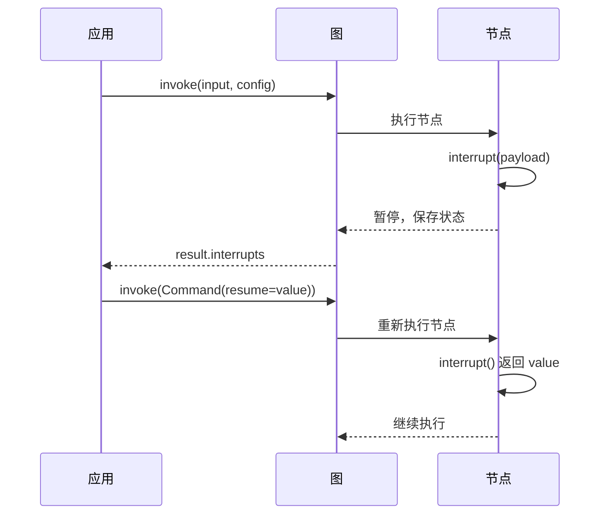

# Interrupts 文档总结

## 一句话概述

中断通过 `interrupt()` 函数在图节点内动态暂停执行，等待外部输入后用 `Command(resume=...)` 恢复，是 LangGraph 人机交互的核心机制。

---

## 核心流程



---

## 三个必要条件

| 条件 | 说明 |
|------|------|
| 检查点器 | 持久化图状态 |
| thread_id | 标识要恢复的状态 |
| interrupt() | 暂停点，负载可 JSON 序列化 |

---

## 5 种常见模式

### 1. 批准/拒绝

```python
def approval_node(state) -> Command[Literal["proceed", "cancel"]]:
    is_approved = interrupt({"question": "批准?", "details": state["action"]})
    return Command(goto="proceed" if is_approved else "cancel")

# 恢复
graph.invoke(Command(resume=True), config)   # 批准
graph.invoke(Command(resume=False), config)  # 拒绝
```

### 2. 审查和编辑

```python
def review_node(state):
    edited = interrupt({"instruction": "审查并编辑", "content": state["text"]})
    return {"text": edited}
```

### 3. 工具中的中断

```python
@tool
def send_email(to: str, subject: str):
    response = interrupt({"action": "send_email", "to": to})
    if response.get("action") == "approve":
        return f"已发送到 {to}"
    return "已取消"
```

### 4. 验证输入（循环）

```python
def get_age(state):
    while True:
        answer = interrupt("请输入年龄")
        if isinstance(answer, int) and answer > 0:
            break
    return {"age": answer}
```

### 5. 多个并行中断

```python
# 并行分支各自 interrupt
interrupted = graph.invoke(input, config)
resume_map = {i.id: f"answer for {i.value}" for i in interrupted.interrupts}
graph.invoke(Command(resume=resume_map), config)
```

---

## 四条规则

| 规则 | 原因 |
|------|------|
| 不要包装在 try/except | interrupt 用异常实现，会被捕获 |
| 不要重新排序 interrupt | 匹配基于索引 |
| 不要传复杂值 | 需可 JSON 序列化 |
| interrupt 前的副作用必须幂等 | 节点会重新执行 |

---

## 恢复行为

```
interrupt 前的代码 → 会重新执行
interrupt()        → 返回 resume 值
interrupt 后的代码 → 正常继续
```

---

## 静态断点 vs 动态中断

| 特性 | 静态断点 | 动态中断 |
|------|---------|---------|
| 设置方式 | `interrupt_before/after` | `interrupt()` |
| 位置 | 节点边界 | 节点内任意位置 |
| 条件 | 无 | 可条件执行 |
| 用途 | 调试 | 人机交互 |
| 恢复 | `invoke(None, config)` | `invoke(Command(resume=...))` |

---

## 关键 API

```python
# 暂停
interrupt(payload)  # 返回 resume 值

# 恢复
graph.invoke(Command(resume=value), config)

# 多个中断恢复
graph.invoke(Command(resume={id1: val1, id2: val2}), config)

# v2 格式获取中断信息
result = graph.invoke(input, config, version="v2")
result.interrupts  # (Interrupt(value=..., id=...),)

# 静态断点
graph = builder.compile(interrupt_before=["node_a"], interrupt_after=["node_b"])
```
