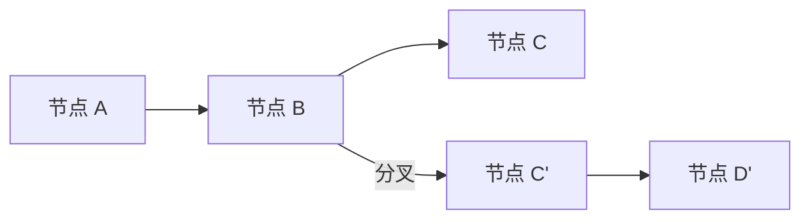

# Time Travel 文档总结

## 一句话概述

时间旅行通过检查点实现两种操作：重放（从检查点重试）和分叉（修改状态后探索替代路径）。

---

## 两种操作

| 操作 | 方法 | 效果 |
|------|------|------|
| **重放** | `invoke(None, checkpoint_config)` | 从检查点重新执行后续节点 |
| **分叉** | `update_state()` + `invoke(None, fork_config)` | 修改状态后创建新分支 |

---

## 重放（Replay）


```python
# 1. 查找检查点
history = list(graph.get_state_history(config))
checkpoint = next(s for s in history if s.next == ("target_node",))

# 2. 重放
graph.invoke(None, checkpoint.config)
```

关键点：
- 检查点之前的节点**不执行**
- 检查点之后的节点**重新执行**（LLM 调用等会产生不同结果）
- 从最终检查点重放是无操作

---

## 分叉（Fork）



```python
# 1. 查找检查点
history = list(graph.get_state_history(config))
before_target = next(s for s in history if s.next == ("target_node",))

# 2. 分叉（修改状态）
fork_config = graph.update_state(before_target.config, {"key": "new_value"})

# 3. 从分叉恢复
graph.invoke(None, fork_config)
```

关键点：
- `update_state` **不会回滚**线程，创建新检查点
- 原始执行历史保持完整
- 用 `as_node` 指定更新来源节点

---

## as_node 参数

| 场景 | 说明 |
|------|------|
| 并行分支 | 多节点更新，无法推断时需指定 |
| 无执行历史 | 新线程设置状态 |
| 跳过节点 | 让图认为某节点已执行 |

```python
graph.update_state(
    config,
    values={"topic": "chickens"},
    as_node="generate_topic",  # 显式指定
)
```

---

## 中断 + 时间旅行

中断在时间旅行时**总是重新触发**：

```python
# 原始执行
graph.invoke(input, config)           # 命中中断
graph.invoke(Command(resume="Alice")) # 恢复

# 重放 — 中断会再次触发
graph.invoke(None, before_interrupt_config)
# 需要新的 Command(resume=...)

# 分叉 — 中断也会触发
fork_config = graph.update_state(before_config, {"value": ["forked"]})
graph.invoke(None, fork_config)
# 需要新的 Command(resume=...)
```

### 多个中断分叉

从两个中断之间分叉，只改变后面的答案：

```python
# ask_name -> ask_age -> final
# 完成后从 ask_name 和 ask_age 之间分叉
between = [s for s in history if s.next == ("ask_age",)][-1]
fork_config = graph.update_state(between.config, {"value": ["modified"]})
graph.invoke(None, fork_config)
# ask_name 结果保留，ask_age 重新等待输入
```

---

## 子图时间旅行

| 配置 | 粒度 | 能力 |
|------|------|------|
| 继承检查点器（默认） | 整个子图是一个检查点 | 只能从子图之前分叉 |
| `checkpointer=True` | 子图内每步检查点 | 可从子图内特定点分叉 |

```python
# 继承（默认）
subgraph = StateGraph(State).compile()  # 无检查点器

# 独立检查点
subgraph = StateGraph(State).compile(checkpointer=True)
# 访问子图检查点
parent_state = graph.get_state(config, subgraphs=True)
sub_config = parent_state.tasks[0].state.config
```

---

## 关键 API

```python
# 获取历史
history = list(graph.get_state_history(config))

# 重放
graph.invoke(None, checkpoint_config)

# 分叉
fork_config = graph.update_state(checkpoint_config, {"key": "value"})
graph.invoke(None, fork_config)

# 指定 as_node
graph.update_state(config, values, as_node="node_name")

# 子图检查点
parent_state = graph.get_state(config, subgraphs=True)
sub_config = parent_state.tasks[0].state.config
```
