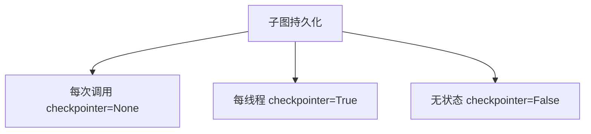

# Subgraphs 文档总结

## 一句话概述

子图是作为另一个图的节点使用的图，支持两种通信模式（不同 schema / 共享 schema）和三种持久化模式（每次调用 / 每线程 / 无状态）。

---

## 两种通信模式

| 模式 | 适用场景 | 实现方式 |
|------|---------|---------|
| **在节点内调用** | 不同状态 schema | 包装函数：`subgraph.invoke()` |
| **添加为节点** | 共享状态键 | `add_node("name", subgraph)` |

### 在节点内调用

```python
def call_subgraph(state: State):
    sub_output = subgraph.invoke({"bar": state["foo"]})  # 转换
    return {"foo": sub_output["bar"]}                     # 转换回
```

### 添加为节点

```python
builder.add_node("node_1", subgraph)  # 直接传递编译后的子图
```

---

## 三种持久化模式



| 模式 | checkpointer | 记忆 | 中断 | 并行调用 |
|------|-------------|------|------|---------|
| 每次调用 | `None` | ❌ | ✅ | ✅ |
| 每线程 | `True` | ✅ | ✅ | ⚠️ 冲突 |
| 无状态 | `False` | ❌ | ❌ | ✅ |

### 每次调用（推荐）

- 每次调用全新状态
- 支持中断和持久执行
- 适合多代理工具调用

### 每线程

- 状态跨调用累积
- 需要 `ToolCallLimitMiddleware` 防止并行冲突
- 适合需要记忆的助手

### 无状态

- 无检查点开销
- 无中断、无持久执行
- 适合简单函数式调用

---

## 多代理场景示例

```python
# 子代理（每次调用模式）
fruit_agent = create_agent(model, tools, checkpointer=None)

# 包装为工具
@tool
def ask_fruit(question): return fruit_agent.invoke(...).content

# 外层代理
agent = create_agent(model, tools=[ask_fruit], checkpointer=MemorySaver())
```

---

## 查看子图状态

```python
# 需要 subgraphs=True
subgraph_state = graph.get_state(config, subgraphs=True).tasks[0].state
```

---

## 流式子图输出

```python
graph.stream(input, subgraphs=True, stream_mode="updates", version="v2")
```

`chunk["ns"]` 标识来源：`()` 根图，`("node:task_id",)` 子图。

---

## 关键 API

```python
# 通信模式 1：节点内调用
def node(state):
    return subgraph.invoke({"bar": state["foo"]})

# 通信模式 2：添加为节点
builder.add_node("name", subgraph)

# 持久化配置
subgraph.compile(checkpointer=None)   # 每次调用
subgraph.compile(checkpointer=True)   # 每线程
subgraph.compile(checkpointer=False)  # 无状态

# 防止并行调用
ToolCallLimitMiddleware(tool_name="tool", run_limit=1)

# 查看子图状态
graph.get_state(config, subgraphs=True).tasks[0].state
```
