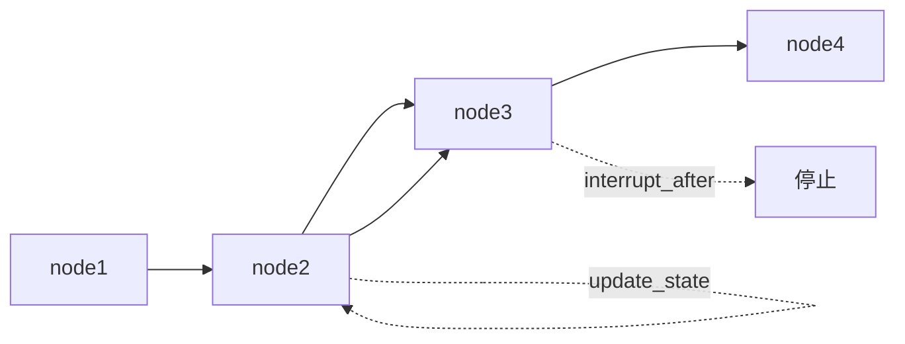

# Test 文档总结

## 一句话概述

LangGraph 测试指南介绍三种测试模式：基本执行测试、单节点测试和部分执行测试，利用检查点器和时间旅行实现精确的测试范围控制。

---

## 三种测试模式

### 1. 基本执行测试

```python
def test_basic():
    graph = create_graph()
    compiled = graph.compile(checkpointer=MemorySaver())
    result = compiled.invoke(input, config={"configurable": {"thread_id": "1"}})
    assert result["key"] == expected
```

### 2. 单节点测试

```python
def test_node():
    graph = create_graph()
    compiled = graph.compile()
    # 直接调用单个节点，绕过检查点器
    result = compiled.nodes["node1"].invoke(input)
    assert result["key"] == expected
```

### 3. 部分执行测试

```python
def test_partial():
    compiled = graph.compile(checkpointer=MemorySaver())
    # 模拟节点 1 执行后的状态
    compiled.update_state(
        config={"configurable": {"thread_id": "1"}},
        values={"key": "value"},
        as_node="node1",  # 假装来自节点 1
    )
    # 从节点 2 开始，到节点 3 停止
    result = compiled.invoke(
        None,
        config={"configurable": {"thread_id": "1"}},
        interrupt_after="node3",
    )
    assert result["key"] == expected
```

---

## 部分执行原理



利用时间旅行功能：
1. `update_state(as_node="node1")`：模拟节点 1 执行后的状态
2. `invoke(None, interrupt_after="node3")`：从节点 2 开始，节点 3 后停止

---

## 关键 API

```python
# 基本测试
compiled.invoke(input, config)

# 单节点测试
compiled.nodes["node_name"].invoke(input)

# 部分执行
compiled.update_state(config, values, as_node="prev_node")
compiled.invoke(None, config, interrupt_after="stop_node")
```
