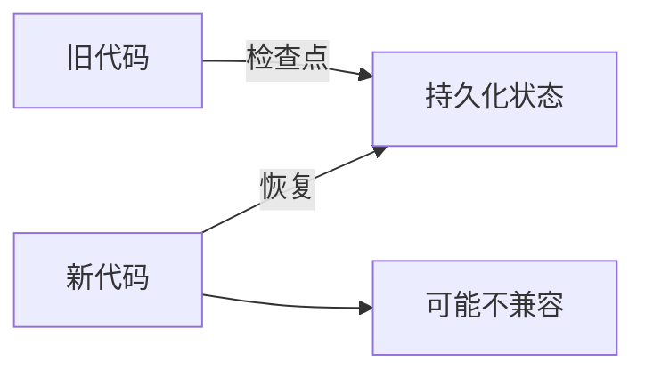

# Backward Compatibility 文档总结

## 一句话概述

LangGraph 立即将最新图应用于所有线程（新+旧），因此代码更改必须考虑正在运行的任务的向后兼容性，分为技术兼容性、业务兼容性和非确定性三类。

---

## 核心机制



LangGraph 不固定版本——最新代码立即应用于所有线程。

---

## 三类兼容性问题

### 1. 技术兼容性（最常见）

| 破坏性操作 | 原因 |
|-----------|------|
| 重命名/删除节点 | 恢复时找不到节点 |
| 重命名/删除状态键 | 旧检查点缺少键 |
| 收紧字段（Optional→Required） | 旧检查点不满足新 schema |

**安全操作**：添加/删除/重路由边（边拓扑不持久化）

### 2. 业务兼容性

技术上有效，但行为含义不同。

**解决方案**：版本标记 + 条件边

```python
def intake(state):
    return {"flow_version": state.get("flow_version", 2)}

def after_triage(state):
    if state.get("flow_version", 1) >= 2:
        return "policy_check"  # 新流程
    return "respond"           # 旧流程
```

### 3. 非确定性（仅 Functional API）

| 问题 | 原因 |
|------|------|
| 添加/删除/重排序 @task | 缓存结果位置错配 |
| @task 外的非确定性操作 | 重放时产生不同值 |

---

## 推荐模式

### 技术兼容性

| 模式 | 做法 |
|------|------|
| 新字段 | `NotRequired` 或 `Optional = None` |
| 删除 | 先弃用，确认无线程依赖后删除 |
| 重命名 | 先添加新字段，双写，再删除旧字段 |
| 节点容忍 | `TypedDict` 自动忽略额外键 |

### 业务兼容性

```python
# 1. 线程开始时打版本
def intake(state):
    return {"flow_version": state.get("flow_version", 2)}

# 2. 条件边按版本路由
def route(state):
    return "new_path" if state["flow_version"] >= 2 else "old_path"
```

### 非确定性

- 让正在运行的任务排空
- 新逻辑包装为新 @task
- 注册新 entrypoint

---

## 检测正在运行的线程

```python
# 单线程检查
graph.get_state(config)           # 最新检查点
graph.get_state_history(config)   # 完整历史

# LangSmith Agent Server
# 按 status 过滤: idle, busy, interrupted, error
```

---

## 关键 API

```python
# 检查线程状态
state = graph.get_state(config)
state.next          # 下一个节点
state.values        # 当前状态

# 安全添加字段
class State(TypedDict):
    existing: str
    new_field: NotRequired[str]  # 安全

# 版本化路由
builder.add_conditional_edges("node", version_router, ["old_path", "new_path"])
```
