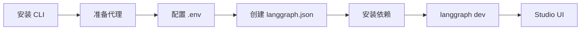

# LangSmith Studio 文档总结

## 一句话概述

LangSmith Studio 是免费的可视化界面，通过本地 Agent Server 连接你的 LangChain 代理，实现实时调试、测试和迭代。

---

## 设置流程



---

## 六步设置

| 步骤 | 命令/文件 |
|------|----------|
| 1. 安装 CLI | `pip install "langgraph-cli[inmem]"` |
| 2. 准备代理 | `agent.py` |
| 3. 环境变量 | `.env` 中 `LANGSMITH_API_KEY` |
| 4. 配置文件 | `langgraph.json` |
| 5. 安装依赖 | `pip install langchain langchain-openai` |
| 6. 启动 | `langgraph dev` |

---

## langgraph.json 配置

```json
{
  "dependencies": ["."],
  "graphs": {
    "agent": "./src/agent.py:agent"
  },
  "env": ".env"
}
```

---

## 访问方式

| 方式 | 地址 |
|------|------|
| API | `http://127.0.0.1:2024` |
| Studio UI | `https://smith.langchain.com/studio/?baseUrl=http://127.0.0.1:2024` |

---

## Studio 功能

| 功能 | 说明 |
|------|------|
| 执行追踪 | 查看提示、工具调用、返回值 |
| 实时测试 | 测试不同输入 |
| 状态检查 | 检查中间状态 |
| 热重载 | 代码修改立即生效 |
| 异常捕获 | 捕获异常及周围状态 |
| 线程重放 | 从任何步骤重新运行 |

---

## 关键 API

```bash
# 安装
pip install --upgrade "langgraph-cli[inmem]"

# 启动开发服务器
langgraph dev

# 使用 tunnel（Safari 需要）
langgraph dev --tunnel
```
