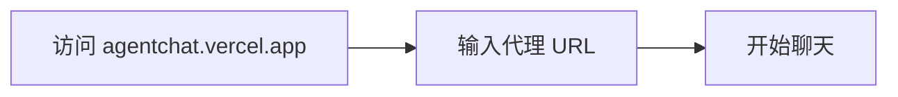

# Agent Chat UI 文档总结

## 一句话概述

Agent Chat UI 是开源的 Next.js 聊天界面，支持实时对话、工具可视化、时间旅行调试，可连接本地或已部署的 LangChain 代理。

---

## 三种使用方式

| 方式 | 命令 | 适用场景 |
|------|------|---------|
| 托管版本 | 访问 agentchat.vercel.app | 快速测试 |
| npx 创建 | `npx create-agent-chat-app` | 自定义开发 |
| 克隆仓库 | `git clone` | 深度定制 |

---

## 快速开始



---

## 连接配置

| 配置项 | 说明 | 示例 |
|--------|------|------|
| Graph ID | langgraph.json 中的图名 | `"agent"` |
| Deployment URL | Agent Server 地址 | `http://localhost:2024` |
| API Key | LangSmith 密钥（可选） | `lsv2...` |

---

## 功能特性

| 功能 | 说明 |
|------|------|
| 实时聊天 | 流式对话 |
| 工具可视化 | 自动渲染工具调用 |
| 中断处理 | 显示中断线程 |
| 时间旅行 | 调试和状态分叉 |
| 生成式 UI | 自定义 UI 组件 |
| 消息过滤 | 隐藏特定消息 |

---

## 关键 API

```bash
# 快速创建
npx create-agent-chat-app --project-name my-chat-ui

# 克隆仓库
git clone https://github.com/langchain-ai/agent-chat-ui.git

# 本地运行
pnpm install && pnpm dev
```
