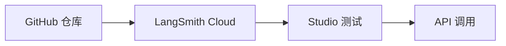

# LangSmith Deployment 文档总结

## 一句话概述

LangSmith Cloud 是专为有状态、长时间运行的代理设计的托管平台，支持从 GitHub 仓库直接部署，自动处理基础设施和扩展。

---

## 部署流程



---

## 五步部署

| 步骤 | 操作 |
|------|------|
| 1. 创建仓库 | 代码推送到 GitHub |
| 2. 部署 | LangSmith 连接 GitHub，自动部署 |
| 3. 测试 | 在 Studio 中测试代理 |
| 4. 获取 URL | 复制 API URL |
| 5. 调用 API | 使用 SDK 或 REST API |

---

## API 调用方式

### Python SDK

```python
from langgraph_sdk import get_sync_client

client = get_sync_client(url="...", api_key="...")

for chunk in client.runs.stream(
    None, "agent",
    input={"messages": [{"role": "human", "content": "..."}]},
    stream_mode="updates",
):
    print(chunk.data)
```

### REST API

```bash
curl -X POST <URL>/runs/stream \
  -H "Content-Type: application/json" \
  -H "X-Api-Key: <KEY>" \
  -d '{"assistant_id": "agent", "input": {...}}'
```

---

## 部署选项

| 选项 | 说明 |
|------|------|
| Cloud | 完全托管，最简单 |
| 控制平面 | 混合/自托管 |
| 独立服务器 | 完全自托管 |

---

## 关键 API

```bash
# 安装 SDK
pip install langgraph-sdk

# Python 调用
client.runs.stream(None, "agent", input={...})

# REST 调用
curl -X POST <URL>/runs/stream -H "X-Api-Key: <KEY>" -d {...}
```
