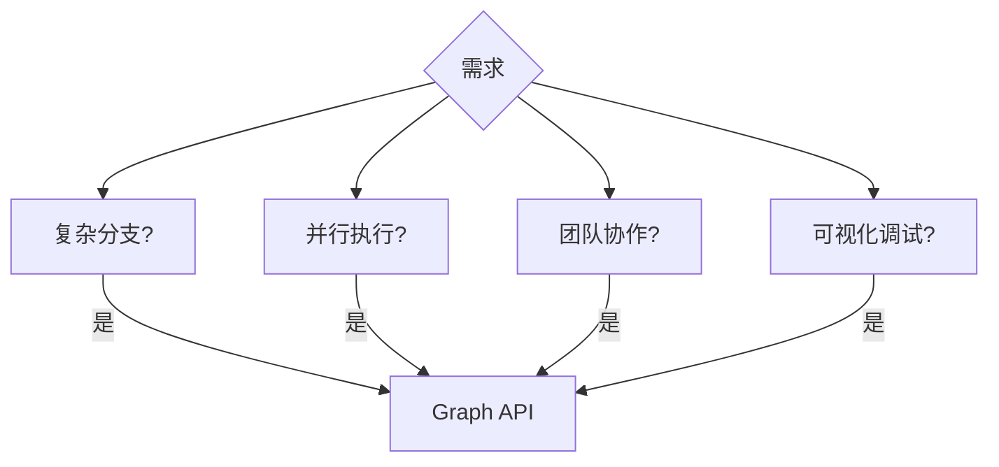

# Choosing APIs 文档总结

## 一句话概述

LangGraph 提供 Graph API（声明式、可视化）和 Functional API（命令式、过程式）两种构建代理工作流的方式，共享同一运行时，可混合使用。

---

## 快速对比

| 特性 | Graph API | Functional API |
|------|-----------|----------------|
| 编程范式 | 声明式 | 命令式 |
| 状态管理 | 显式共享状态 | 函数作用域 |
| 控制流 | 条件边、Command | if/else、循环 |
| 可视化 | 内置图可视化 | 无 |
| 样板代码 | 较多 | 较少 |
| 适用场景 | 复杂工作流 | 简单线性流程 |

---

## 选择指南

### 选 Graph API



- 复杂决策树
- 跨组件状态共享
- 并行处理 + 同步
- 团队开发

### 选 Functional API

- 现有代码改造
- 线性工作流
- 快速原型
- 函数局部状态

---

## 组合使用

```python
# Graph API 做协调
graph = StateGraph(State)
graph.add_node("orchestrator", orchestrator)

# Functional API 做处理
@entrypoint()
def process(data): ...

# 图节点中调用 Functional API
def orchestrator(state):
    result = process.invoke(state["data"])
```

---

## 关键区别

| 方面 | Graph API | Functional API |
|------|-----------|----------------|
| 定义方式 | `StateGraph` + `add_node` | `@entrypoint` + `@task` |
| 状态 | `TypedDict` 共享 | 函数参数/返回值 |
| 分支 | `add_conditional_edges` | `if/elif` |
| 并行 | 多个 `add_edge(START, ...)` | 多个 `@task` 并发 |
| 循环 | `add_conditional_edges` | `while True` |
