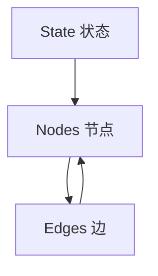

# Graph API Overview 文档总结

## 一句话概述

Graph API 是 LangGraph 的核心，通过 State（状态）、Nodes（节点）、Edges（边）三个组件构建代理工作流图，支持条件分支、并行执行、子图和 Command 控制流。

---

## 三大核心组件



| 组件 | 作用 | 定义方式 |
|------|------|---------|
| State | 共享数据结构 | `TypedDict` / `Pydantic` |
| Nodes | 执行逻辑的函数 | `add_node()` |
| Edges | 路由逻辑 | `add_edge()` / `add_conditional_edges()` |

---

## State 详解

### Schema 类型

| 类型 | 特点 |
|------|------|
| `TypedDict` | 最常用，性能最好 |
| `dataclass` | 支持默认值 |
| `Pydantic BaseModel` | 运行时验证 |

### 多 Schema

```python
StateGraph(OverallState, input_schema=InputState, output_schema=OutputState)
```

### Reducers

```python
class State(TypedDict):
    messages: Annotated[list[AnyMessage], add_messages]  # 追加
    count: int                                            # 覆盖（默认）
```

### MessagesState

```python
from langgraph.graph import MessagesState

class State(MessagesState):
    extra_field: str
```

---

## 节点参数

```python
def node(state, config, runtime):
    runtime.context        # 运行时上下文
    runtime.store          # 跨线程存储
    runtime.execution_info # 执行信息
    runtime.server_info    # 服务器信息
```

---

## 边类型

| 类型 | 方法 | 用途 |
|------|------|------|
| 普通边 | `add_edge()` | 固定路由 |
| 条件边 | `add_conditional_edges()` | 动态路由 |
| 入口点 | `add_edge(START, ...)` | 起始节点 |
| 条件入口 | `add_conditional_edges(START, ...)` | 动态起始 |

---

## Command 原语

```python
Command(
    update={"key": "value"},  # 状态更新
    goto="next_node",         # 路由
    graph=Command.PARENT,     # 父图导航
    resume="answer",          # 中断恢复
)
```

---

## Send API（Map-Reduce）

```python
def fan_out(state):
    return [Send("worker", {"item": item}) for item in state["items"]]
```

---

## 运行时配置

```python
@dataclass
class Context:
    llm_provider: str = "openai"

graph = StateGraph(State, context_schema=Context)
graph.invoke(input, context={"llm_provider": "anthropic"})
```

---

## 关键 API

```python
# 构建
builder = StateGraph(State)
builder.add_node("name", func)
builder.add_edge(START, "name")
builder.add_conditional_edges("name", router)
graph = builder.compile(checkpointer=..., cache=...)

# 运行
graph.invoke(input, config, context)
graph.stream(input, stream_mode="updates")

# 特殊节点
START, END

# 控制流
Send("node", state)
Command(update=..., goto=..., resume=...)
```
