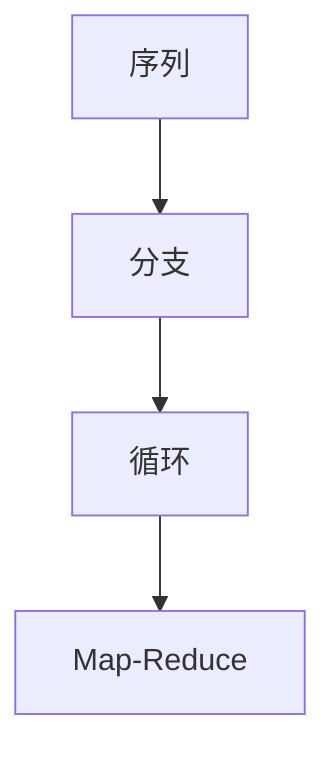

# Use Graph API 文档总结

## 一句话概述

Use Graph API 是 Graph API 的实践指南，涵盖状态定义/更新、序列/分支/循环构建、Send Map-Reduce、Command 控制流和运行时配置。

---

## 核心操作

### 状态定义与更新

| 操作 | 方法 |
|------|------|
| 定义状态 | `TypedDict` / `Pydantic` |
| 默认 reducer | 覆盖 |
| 追加 reducer | `Annotated[list, add]` |
| 消息 reducer | `Annotated[list, add_messages]` |
| 绕过 reducer | `Overwrite(value)` |

### 图结构



| 结构 | 实现 |
|------|------|
| 序列 | `add_edge` 链式连接 |
| 并行 | 多个 `add_edge(START, ...)` |
| 条件分支 | `add_conditional_edges` |
| 循环 | 条件边 + 回边 |
| Map-Reduce | `Send` API |

---

## 关键 API 速查

### 构建

```python
# 序列
builder.add_sequence([step1, step2, step3])

# 条件分支
builder.add_conditional_edges("node", router, {"a": "node_a", "b": "node_b"})

# 并行
builder.add_edge(START, "a")
builder.add_edge(START, "b")

# Map-Reduce
[Send("worker", {"item": item}) for item in items]

# Command
Command(update={"key": "val"}, goto="next_node")
```

### 运行时配置

```python
graph.invoke(input, context={"key": "value"}, config={"recursion_limit": 10})
```

### 错误处理

```python
builder.add_node("node", func,
    retry_policy=RetryPolicy(max_attempts=3),
    timeout=TimeoutPolicy(run_timeout=60),
    error_handler=error_handler,
    cache_policy=CachePolicy(ttl=120),
)
```

---

## 可视化

```python
graph.get_graph().draw_mermaid()      # Mermaid 语法
graph.get_graph().draw_mermaid_png()  # PNG 图片
graph.get_graph().draw_png()          # Graphviz PNG
```
