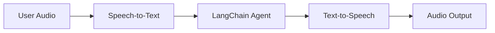
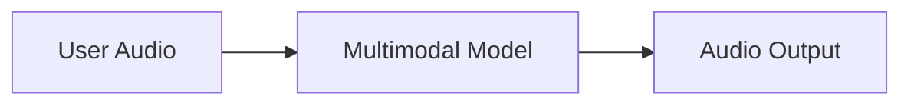

# Build a Voice Agent with LangChain — 逐段翻译

> 原文：https://docs.langchain.com/oss/python/langchain/voice-agent

---

## Overview / 概览

Chat interfaces have dominated how we interact with AI, but recent breakthroughs in multimodal AI are opening up exciting new possibilities. High-quality generative models and expressive text-to-speech (TTS) systems now make it possible to build agents that feel less like tools and more like conversational partners.

聊天界面一直主导着我们与 AI 的交互方式，但多模态 AI 的最新突破正在开启令人兴奋的新可能。高质量的生成模型和富有表现力的 TTS 系统使得构建更像对话伙伴而非工具的代理成为可能。

### What are voice agents? / 什么是语音代理？

Voice agents are agents that can engage in natural spoken conversations with users. They combine speech recognition, natural language processing, generative AI, and text-to-speech technologies.

语音代理是能与用户进行自然语音对话的代理。它们结合了语音识别、自然语言处理、生成式 AI 和 TTS 技术。

Use cases: 适用场景：
* Customer support — 客户支持
* Personal assistants — 个人助手
* Hands-free interfaces — 免提界面
* Coaching and training — 辅导和培训

### How do voice agents work? / 语音代理如何工作？

Every voice agent needs to handle three tasks: 每个语音代理需要处理三个任务：

1. **Listen** — capture audio and transcribe it — 听：捕获音频并转录
2. **Think** — interpret intent, reason, plan — 想：理解意图、推理、规划
3. **Speak** — generate audio and stream it back — 说：生成音频并流式返回

---

## Architecture 1: Sandwich (STT > Agent > TTS)



**Pros / 优点:**
* Full control over each component — 完全控制每个组件
* Access to latest text-modality models — 使用最新文本模型
* Transparent behavior — 行为透明

**Cons / 缺点:**
* Requires orchestrating multiple services — 需要编排多个服务
* Speech-to-text loses tone/emotion — 转录丢失语调/情感信息

## Architecture 2: Speech-to-Speech (S2S)



**Pros / 优点:**
* Simpler architecture — 架构更简单
* Lower latency — 延迟更低
* Captures tone and nuances — 捕获语调和细微差别

**Cons / 缺点:**
* Limited model options — 模型选择有限
* Less transparency — 透明度较低
* Reduced controllability — 可控性降低

---

## Demo: Sandwich Architecture / 三明治架构示例

We'll build a voice-based agent for a sandwich shop. 使用三明治架构构建三明治店语音代理。

### Architecture / 架构

**Client (Browser):** 客户端（浏览器）
* Captures microphone audio as PCM — 捕获麦克风音频
* WebSocket connection to backend — WebSocket 连接后端
* Streams audio chunks to server — 流式发送音频块
* Receives and plays synthesized speech — 接收并播放合成语音

**Server (Python):** 服务端
* Accepts WebSocket connections — 接受 WebSocket 连接
* Orchestrates STT → Agent → TTS pipeline — 编排三步管道

---

## 1. Speech-to-Text / 语音转文字

The STT stage transforms an incoming audio stream into text transcripts.
STT 阶段将输入音频流转换为文本转录。

**Key concepts:**
* **Producer-Consumer Pattern** — 生产者-消费者模式：音频发送和转录接收并发进行
* **Event Types** — 事件类型：
  * `stt_chunk`: 部分转录（实时）
  * `stt_output`: 最终转录（触发代理处理）

```python
async def stt_stream(audio_stream: AsyncIterator[bytes]) -> AsyncIterator[VoiceAgentEvent]:
    """Transform: Audio (Bytes) → Voice Events"""
    stt = AssemblyAISTT(sample_rate=16000)

    async def send_audio():
        async for audio_chunk in audio_stream:
            await stt.send_audio(audio_chunk)
        await stt.close()

    send_task = asyncio.create_task(send_audio())
    try:
        async for event in stt.receive_events():
            yield event
    finally:
        send_task.cancel()
        await stt.close()
```

---

## 2. LangChain Agent / LangChain 代理

The agent stage processes text transcripts and streams response tokens.
代理阶段处理文本转录并流式输出响应 token。

**Key concepts:**
* **Streaming Responses** — 流式响应：`stream_mode="messages"` 实时输出 token
* **Conversation Memory** — 对话记忆：checkpointer 维护跨轮次状态

```python
from langchain.agents import create_agent
from langgraph.checkpoint.memory import InMemorySaver

def add_to_order(item: str, quantity: int) -> str:
    """Add an item to the customer's order."""
    return f"Added {quantity} x {item} to the order."

def confirm_order(order_summary: str) -> str:
    """Confirm the final order."""
    return f"Order confirmed: {order_summary}."

agent = create_agent(
    model="google_genai:gemini-3.5-flash",
    tools=[add_to_order, confirm_order],
    system_prompt="You are a helpful sandwich shop assistant. Be concise. Do NOT use emojis.",
    checkpointer=InMemorySaver(),
)

async def agent_stream(event_stream):
    thread_id = str(uuid7())
    async for event in event_stream:
        yield event
        if event.type == "stt_output":
            stream = agent.astream(
                {"messages": [HumanMessage(content=event.transcript)]},
                {"configurable": {"thread_id": thread_id}},
                stream_mode="messages",
            )
            async for message, _ in stream:
                if message.text:
                    yield AgentChunkEvent.create(message.text)
```

---

## 3. Text-to-Speech / 文字转语音

The TTS stage synthesizes agent response text into audio.
TTS 阶段将代理响应文本合成为音频。

**Key concepts:**
* **Concurrent Processing** — 并发处理：上游事件传递 + TTS 音频接收同时进行
* **Streaming TTS** — 流式 TTS：收到文本即开始合成，无需等待完整响应

```python
async def tts_stream(event_stream):
    tts = CartesiaTTS()

    async def process_upstream():
        async for event in event_stream:
            yield event
            if event.type == "agent_chunk":
                await tts.send_text(event.text)

    async for event in merge_async_iters(process_upstream(), tts.receive_events()):
        yield event
```

---

## Putting it all together / 组合完整管道

```python
from langchain_core.runnables import RunnableGenerator

pipeline = (
    RunnableGenerator(stt_stream)      # Audio → STT events
    | RunnableGenerator(agent_stream)  # STT events → Agent events
    | RunnableGenerator(tts_stream)    # Agent events → TTS audio
)

@app.websocket("/ws")
async def websocket_endpoint(websocket: WebSocket):
    await websocket.accept()
    async def websocket_audio_stream():
        while True:
            data = await websocket.receive_bytes()
            yield data

    output_stream = pipeline.atransform(websocket_audio_stream())
    async for event in output_stream:
        if event.type == "tts_chunk":
            await websocket.send_bytes(event.audio)
```

Each stage processes independently and concurrently. This architecture can achieve sub-700ms latency.
每个阶段独立并发处理。此架构可达 700ms 以下延迟。
