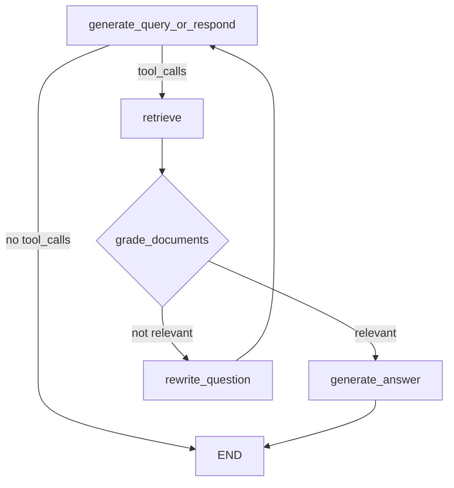

# Build a Custom RAG Agent with LangGraph — 逐段翻译

> 原文：https://docs.langchain.com/oss/python/langgraph/agentic-rag

---

## Overview / 概览

In this tutorial we will build a retrieval agent using LangGraph. LangChain offers built-in agent implementations using LangGraph primitives. If deeper customization is required, agents can be implemented directly in LangGraph.

本教程使用 LangGraph 构建检索代理。LangChain 提供基于 LangGraph 原语的内置代理实现。如需更深度自定义，可直接用 LangGraph 实现代理。

Retrieval agents are useful when you want an LLM to make a decision about whether to retrieve context from a vectorstore or respond to the user directly.

当你希望 LLM 决定是从向量存储检索上下文还是直接回复用户时，检索代理很有用。

By the end: 最终你将：

1. Fetch and preprocess documents — 获取和预处理文档
2. Index documents for semantic search and create a retriever tool — 索引文档并创建检索工具
3. Build an agentic RAG system that can decide when to use the retriever — 构建可决定何时使用检索器的代理式 RAG 系统

### Concepts / 概念

* **Retrieval** — document loaders, text splitters, embeddings, vector stores
* **LangGraph Graph API** — state, nodes, edges, conditional edges

---

## 1. Preprocess documents / 预处理文档

```python
import bs4, requests
from langchain_core.documents import Document

def load_web_page(url, bs_kwargs=None):
    response = requests.get(url)
    soup = bs4.BeautifulSoup(response.text, "html.parser", **(bs_kwargs or {}))
    return [Document(page_content=soup.get_text(), metadata={"source": url})]

urls = [
    "https://lilianweng.github.io/posts/2024-11-28-reward-hacking/",
    "https://lilianweng.github.io/posts/2024-07-07-hallucination/",
    "https://lilianweng.github.io/posts/2024-04-12-diffusion-video/",
]
docs = [load_web_page(url) for url in urls]

# Split
from langchain_text_splitters import RecursiveCharacterTextSplitter
docs_list = [item for sublist in docs for item in sublist]
text_splitter = RecursiveCharacterTextSplitter.from_tiktoken_encoder(chunk_size=100, chunk_overlap=50)
doc_splits = text_splitter.split_documents(docs_list)
```

---

## 2. Create a retriever tool / 创建检索工具

```python
from langchain_core.vectorstores import InMemoryVectorStore
from langchain_openai import OpenAIEmbeddings
from langchain.tools import tool

vectorstore = InMemoryVectorStore.from_documents(doc_splits, OpenAIEmbeddings())
retriever = vectorstore.as_retriever()

@tool
def retrieve_blog_posts(query: str) -> str:
    """Search and return information about Lilian Weng blog posts."""
    docs = retriever.invoke(query)
    return "\n\n".join([doc.page_content for doc in docs])
```

---

## 3. Generate query node / 生成查询节点

Call the LLM, which decides to use the retriever tool or respond directly.

调用 LLM，由其决定使用检索工具还是直接回复。

```python
from langgraph.graph import MessagesState
from langchain.chat_models import init_chat_model

response_model = init_chat_model("gpt-5.4", temperature=0)

def generate_query_or_respond(state: MessagesState):
    """LLM decides: call retriever_tool or respond directly."""
    response = response_model.bind_tools([retriever_tool]).invoke(state["messages"])
    return {"messages": [response]}
```

- "hello!" → 直接回复（不调用工具）
- "What does Lilian Weng say about reward hacking?" → tool_call: retrieve_blog_posts

---

## 4. Grade documents / 评估文档

Conditional edge: determine if retrieved documents are relevant.

条件边：判断检索到的文档是否相关。

```python
from pydantic import BaseModel, Field
from typing import Literal

class GradeDocuments(BaseModel):
    binary_score: str = Field(description="'yes' if relevant, 'no' if not")

grader_model = init_chat_model("gpt-5.4", temperature=0)

def grade_documents(state: MessagesState) -> Literal["generate_answer", "rewrite_question"]:
    """Grade relevance of retrieved documents."""
    question = state["messages"][0].content
    context = state["messages"][-1].content
    response = grader_model.with_structured_output(GradeDocuments).invoke([...])
    return "generate_answer" if response.binary_score == "yes" else "rewrite_question"
```

- 相关 → `generate_answer`
- 不相关 → `rewrite_question`

---

## 5. Rewrite question / 重写问题

```python
REWRITE_PROMPT = "Look at the input and try to reason about the underlying semantic intent..."

def rewrite_question(state: MessagesState):
    """Rewrite the original user question for better retrieval."""
    question = state["messages"][0].content
    response = response_model.invoke([{"role": "user", "content": REWRITE_PROMPT.format(question=question)}])
    return {"messages": [HumanMessage(content=response.content)]}
```

---

## 6. Generate answer / 生成答案

```python
GENERATE_PROMPT = "You are an assistant for Q&A. Use the retrieved context to answer..."

def generate_answer(state: MessagesState):
    """Generate answer from question + context."""
    question = state["messages"][0].content
    context = state["messages"][-1].content
    response = response_model.invoke([{"role": "user", "content": GENERATE_PROMPT.format(...)}])
    return {"messages": [response]}
```

---

## 7. Assemble the graph / 组装图

```python
from langgraph.graph import END, START, StateGraph
from langgraph.prebuilt import ToolNode

workflow = StateGraph(MessagesState)

workflow.add_node(generate_query_or_respond)
workflow.add_node("retrieve", ToolNode([retriever_tool]))
workflow.add_node(rewrite_question)
workflow.add_node(generate_answer)

workflow.add_edge(START, "generate_query_or_respond")

def route_on_tool_calls(state):
    if getattr(state["messages"][-1], "tool_calls", None):
        return "tools"
    return END

workflow.add_conditional_edges("generate_query_or_respond", route_on_tool_calls, {"tools": "retrieve", END: END})
workflow.add_conditional_edges("retrieve", grade_documents)  # → "generate_answer" or "rewrite_question"
workflow.add_edge("generate_answer", END)
workflow.add_edge("rewrite_question", "generate_query_or_respond")

graph = workflow.compile()
```



---

## 8. Run / 运行

```python
for chunk in graph.stream({"messages": [{"role": "user", "content": "What does Lilian Weng say about types of reward hacking?"}]}):
    for node, update in chunk.items():
        update["messages"][-1].pretty_print()
```

Flow: generate_query_or_respond → retrieve → grade_documents → generate_answer → END
