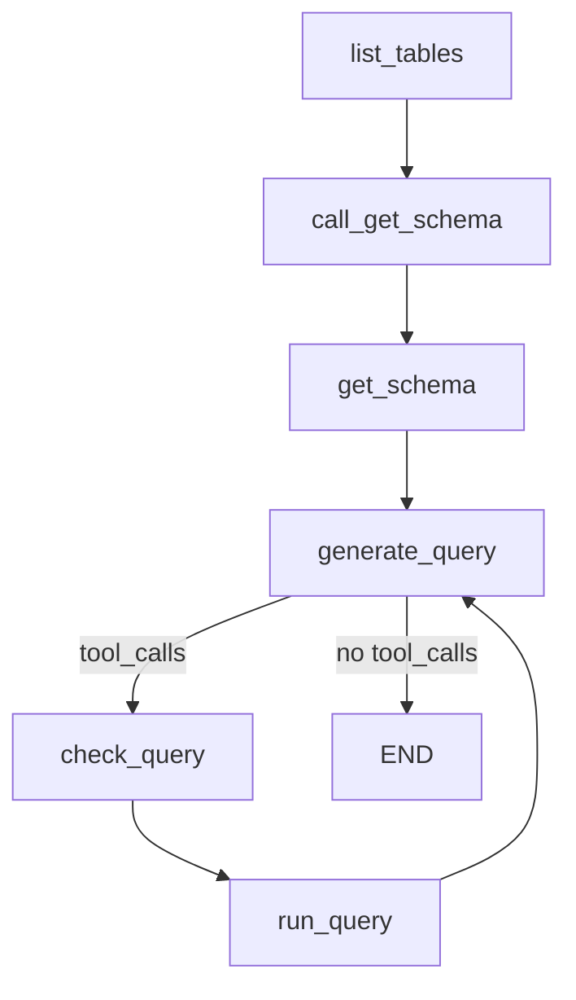

# Build a Custom SQL Agent with LangGraph — 逐段翻译

> 原文：https://docs.langchain.com/oss/python/langgraph/sql-agent

---

## Overview / 概览

In this tutorial we will build a custom agent that can answer questions about a SQL database using LangGraph.

本教程使用 LangGraph 构建自定义 SQL 数据库问答代理。

The prebuilt agent lets us get started quickly, but we relied on the system prompt to constrain behavior. We can enforce a higher degree of control in LangGraph by customizing the agent with dedicated nodes for specific tool-calls.

预构建代理能快速启动，但依赖系统提示词约束行为。通过 LangGraph 自定义代理，用专用节点处理特定工具调用，可以实现更高程度的控制。

---

## 1-2. Database setup / 数据库设置

```python
import requests, pathlib, sqlite3

url = "https://storage.googleapis.com/benchmarks-artifacts/chinook/Chinook.db"
local_path = pathlib.Path("Chinook.db")
if not local_path.exists():
    local_path.write_bytes(requests.get(url).content)
```

Tables: Album, Artist, Customer, Employee, Genre, Invoice, InvoiceLine, MediaType, Playlist, PlaylistTrack, Track

---

## 3. Tools / 工具

Three tools: 三个工具：

| 工具 | 作用 |
|------|------|
| `sql_db_list_tables` | 列出所有表 |
| `sql_db_schema` | 获取表结构 + 示例数据 |
| `sql_db_query` | 执行 SQL 查询 |

---

## 4. Define application steps / 定义应用步骤

We construct **dedicated nodes** for each step. This lets us (1) force tool-calls when needed, and (2) customize prompts for each step.

为每个步骤构建**专用节点**。这样可以 (1) 强制工具调用，(2) 为每个步骤自定义提示词。

### list_tables — 强制列出表

```python
def list_tables(state: MessagesState):
    tool_call = {"name": "sql_db_list_tables", "args": {}, "id": "abc123", "type": "tool_call"}
    tool_call_message = AIMessage(content="", tool_calls=[tool_call])
    tool_message = list_tables_tool.invoke(tool_call)
    response = AIMessage(f"Available tables: {tool_message.content}")
    return {"messages": [tool_call_message, tool_message, response]}
```

**关键：** 直接构造 `AIMessage` 和 `ToolMessage`，不通过 LLM，确保一定执行。

### call_get_schema — 强制获取 schema

```python
def call_get_schema(state: MessagesState):
    llm_with_tools = model.bind_tools([get_schema_tool], tool_choice="any")
    response = llm_with_tools.invoke(state["messages"])
    return {"messages": [response]}
```

**关键：** `tool_choice="any"` 强制 LLM 调用工具。

### generate_query — 生成 SQL

```python
def generate_query(state: MessagesState):
    system_message = {"role": "system", "content": "You are an agent... create SQL queries..."}
    llm_with_tools = model.bind_tools([run_query_tool])
    response = llm_with_tools.invoke([system_message] + state["messages"])
    return {"messages": [response]}
```

**关键：** 不强制工具调用，让 LLM 自然回复（可能直接回答，也可能生成 SQL）。

### check_query — 检查 SQL

```python
def check_query(state: MessagesState):
    system_message = {"role": "system", "content": "Double check the query for common mistakes..."}
    tool_call = state["messages"][-1].tool_calls[0]
    user_message = {"role": "user", "content": tool_call["args"]["query"]}
    llm_with_tools = model.bind_tools([run_query_tool], tool_choice="any")
    response = llm_with_tools.invoke([system_message, user_message])
    return {"messages": [response]}
```

**关键：** 从上一条消息提取 SQL，让 LLM 检查后强制调用执行工具。

---

## 5. Implement the agent / 实现代理

```python
def should_continue(state: MessagesState) -> Literal[END, "check_query"]:
    if not state["messages"][-1].tool_calls:
        return END
    return "check_query"

builder = StateGraph(MessagesState)
builder.add_node(list_tables)
builder.add_node(call_get_schema)
builder.add_node(get_schema_node, "get_schema")
builder.add_node(generate_query)
builder.add_node(check_query)
builder.add_node(run_query_node, "run_query")

builder.add_edge(START, "list_tables")
builder.add_edge("list_tables", "call_get_schema")
builder.add_edge("call_get_schema", "get_schema")
builder.add_edge("get_schema", "generate_query")
builder.add_conditional_edges("generate_query", should_continue)  # → check_query or END
builder.add_edge("check_query", "run_query")
builder.add_edge("run_query", "generate_query")

agent = builder.compile()
```



**与预构建代理的区别：**
- 预构建：LLM 自行决定调用顺序（依赖提示词）
- 自定义：**强制执行顺序**（list → schema → query → check → run）

---

## 6. Human-in-the-loop / 人在回路

Wrap `sql_db_query` with `interrupt` for human review.

用 `interrupt` 包装 `sql_db_query` 实现人工审查。

```python
from langgraph.types import interrupt

@tool
def run_query_tool_with_interrupt(config, **tool_input):
    request = {"action": "sql_db_query", "args": tool_input, "description": "Please review"}
    response = interrupt([request])

    if response["type"] == "accept":
        return run_query_tool.invoke(tool_input, config)
    elif response["type"] == "edit":
        return run_query_tool.invoke(response["args"]["args"], config)
    elif response["type"] == "response":
        return response["args"]  # 用户反馈
```

Resume with Command:

```python
from langgraph.types import Command

# 批准
agent.stream(Command(resume={"type": "accept"}), config)

# 编辑
agent.stream(Command(resume={"type": "edit", "args": {"query": "SELECT ..."}}), config)

# 用户反馈
agent.stream(Command(resume={"type": "response", "args": "Please explain the query first"}), config)
```

---

## LangGraph vs 预构建代理对比

| 维度 | 预构建 (create_agent) | LangGraph 自定义 |
|------|---------------------|-----------------|
| 工具调用顺序 | LLM 自主决定 | 强制顺序 |
| 检查逻辑 | 提示词约束 | 代码强制 |
| 人在回路 | HumanInTheLoopMiddleware | interrupt 函数 |
| 灵活性 | 中 | 高 |
| 复杂度 | 低 | 高 |
