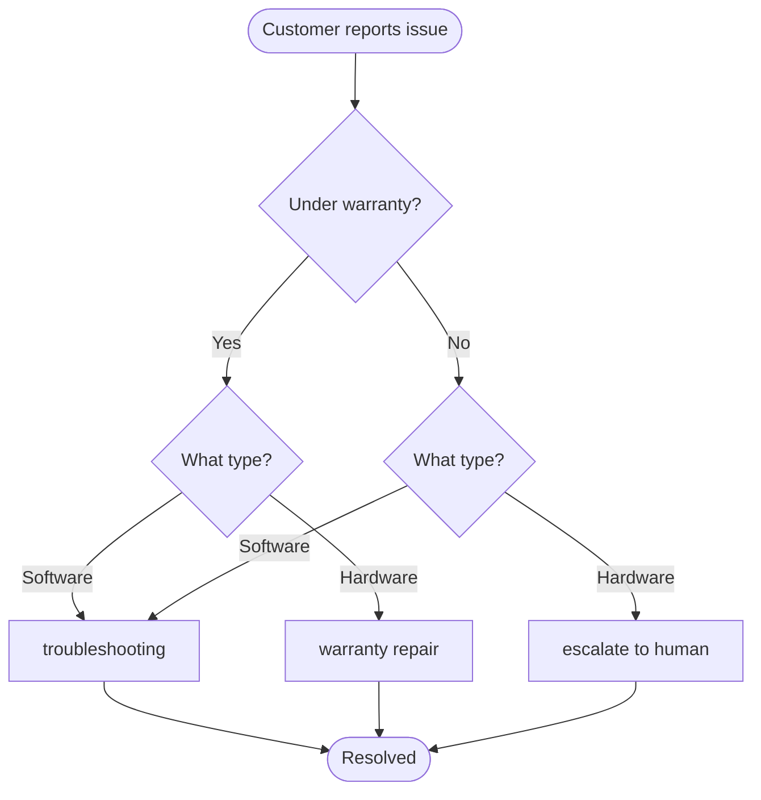

# Build Customer Support with Handoffs — 逐段翻译

> 原文：https://docs.langchain.com/oss/python/langchain/multi-agent/handoffs-customer-support

---

## Overview / 概览

The **state machine pattern** describes workflows where an agent's behavior changes as it moves through different states of a task. This tutorial shows how to implement a state machine by using tool calls to dynamically change a single agent's configuration—updating its available tools and instructions based on the current state.

**状态机模式**描述的是代理行为随任务状态变化而变化的工作流。本教程展示如何通过工具调用动态改变单个代理的配置——根据当前状态更新可用工具和指令。

In this tutorial, you'll build a customer support agent: 你将构建客户支持代理：

* Collects warranty information before proceeding — 收集保修信息
* Classifies issues as hardware or software — 将问题分类为硬件或软件
* Provides solutions or escalates to human support — 提供解决方案或升级到人工支持
* Maintains conversation state across multiple turns — 跨多轮维护对话状态

Unlike the **subagents pattern** where sub-agents are called as tools, the **state machine pattern** uses a single agent whose configuration changes based on workflow progress.

与子代理模式（子代理作为工具被调用）不同，**状态机模式**使用单个代理，其配置根据工作流进度变化。

Each "step" is just a different configuration (system prompt + tools) of the same underlying agent, selected dynamically based on state.

每个"步骤"只是同一底层代理的不同配置（系统提示词 + 工具），根据状态动态选择。



---

## 1. Define custom state / 定义自定义状态

```python
from langchain.agents import AgentState
from typing_extensions import NotRequired
from typing import Literal

SupportStep = Literal["warranty_collector", "issue_classifier", "resolution_specialist"]

class SupportState(AgentState):
    """State for customer support workflow."""
    current_step: NotRequired[SupportStep]          # 当前步骤
    warranty_status: NotRequired[Literal["in_warranty", "out_of_warranty"]]
    issue_type: NotRequired[Literal["hardware", "software"]]
```

The `current_step` field is the core of the state machine pattern — it determines which configuration is loaded on each turn.

`current_step` 字段是状态机模式的核心——它决定每轮加载哪个配置。

---

## 2. Create tools that manage workflow state / 创建管理工作流状态的工具

The key is using `Command` to update state, including the `current_step` field.

关键是使用 `Command` 更新状态，包括 `current_step` 字段。

```python
from langchain.tools import tool, ToolRuntime
from langchain.messages import ToolMessage
from langgraph.types import Command

@tool
def record_warranty_status(
    status: Literal["in_warranty", "out_of_warranty"],
    runtime: ToolRuntime[None, SupportState],
) -> Command:
    """Record warranty status and transition to issue classification."""
    return Command(
        update={
            "messages": [ToolMessage(content=f"Warranty: {status}", tool_call_id=runtime.tool_call_id)],
            "warranty_status": status,
            "current_step": "issue_classifier",  # ← 状态转换！
        }
    )

@tool
def record_issue_type(
    issue_type: Literal["hardware", "software"],
    runtime: ToolRuntime[None, SupportState],
) -> Command:
    """Record issue type and transition to resolution specialist."""
    return Command(
        update={
            "messages": [ToolMessage(content=f"Issue: {issue_type}", tool_call_id=runtime.tool_call_id)],
            "issue_type": issue_type,
            "current_step": "resolution_specialist",  # ← 状态转换！
        }
    )

@tool
def escalate_to_human(reason: str) -> str:
    """Escalate to human support specialist."""
    return f"Escalating to human support. Reason: {reason}"

@tool
def provide_solution(solution: str) -> str:
    """Provide a solution to the customer's issue."""
    return f"Solution provided: {solution}"
```

**Tools drive the workflow** by updating `current_step`. **工具通过更新 `current_step` 驱动工作流。**

---

## 3. Define step configurations / 定义步骤配置

```python
STEP_CONFIG = {
    "warranty_collector": {
        "prompt": WARRANTY_COLLECTOR_PROMPT,
        "tools": [record_warranty_status],
        "requires": [],
    },
    "issue_classifier": {
        "prompt": ISSUE_CLASSIFIER_PROMPT,
        "tools": [record_issue_type],
        "requires": ["warranty_status"],
    },
    "resolution_specialist": {
        "prompt": RESOLUTION_SPECIALIST_PROMPT,
        "tools": [provide_solution, escalate_to_human],
        "requires": ["warranty_status", "issue_type"],
    },
}
```

Prompt templates support state variables: 提示词模板支持状态变量：

```python
ISSUE_CLASSIFIER_PROMPT = """...
CUSTOMER INFO: Warranty status is {warranty_status}
..."""
```

---

## 4. Create step-based middleware / 创建基于步骤的中间件

```python
from langchain.agents.middleware import wrap_model_call, ModelRequest, ModelResponse

@wrap_model_call
def apply_step_config(
    request: ModelRequest,
    handler: Callable[[ModelRequest], ModelResponse],
) -> ModelResponse:
    """Configure agent behavior based on the current step."""
    current_step = request.state.get("current_step", "warranty_collector")
    stage_config = STEP_CONFIG[current_step]

    # 验证依赖状态
    for key in stage_config["requires"]:
        if request.state.get(key) is None:
            raise ValueError(f"{key} must be set before reaching {current_step}")

    # 格式化提示词
    system_prompt = stage_config["prompt"].format(**request.state)

    # 注入配置
    request = request.override(
        system_prompt=system_prompt,
        tools=stage_config["tools"],
    )
    return handler(request)
```

`request.override()` dynamically changes agent behavior without creating separate agent instances.
`request.override()` 动态改变代理行为，无需创建单独的代理实例。

---

## 5. Create the agent / 创建代理

```python
from langchain.agents import create_agent
from langgraph.checkpoint.memory import InMemorySaver

all_tools = [record_warranty_status, record_issue_type, provide_solution, escalate_to_human]

agent = create_agent(
    model,
    tools=all_tools,
    state_schema=SupportState,
    middleware=[apply_step_config],
    checkpointer=InMemorySaver(),  # 必须：维护跨轮次状态
)
```

---

## 6. Test the workflow / 测试工作流

```python
config = {"configurable": {"thread_id": str(uuid7())}}

# Turn 1: warranty_collector → 问保修
agent.invoke({"messages": [HumanMessage("My phone screen is cracked")]}, config)

# Turn 2: record_warranty_status("in_warranty") → current_step 变为 issue_classifier
agent.invoke({"messages": [HumanMessage("Yes, under warranty")]}, config)

# Turn 3: record_issue_type("hardware") → current_step 变为 resolution_specialist
agent.invoke({"messages": [HumanMessage("Screen physically cracked")]}, config)

# Turn 4: resolution_specialist → 提供解决方案
agent.invoke({"messages": [HumanMessage("What should I do?")]}, config)
```

---

## 7. State transitions / 状态转换

| Turn | current_step | 工具调用 | 结果 |
|------|-------------|---------|------|
| 1 | warranty_collector | — | 问保修状态 |
| 2 | warranty_collector → issue_classifier | record_warranty_status("in_warranty") | 问问题类型 |
| 3 | issue_classifier → resolution_specialist | record_issue_type("hardware") | 提供解决方案 |
| 4 | resolution_specialist | provide_solution / escalate_to_human | 完成 |

---

## 8. Summarization middleware / 摘要中间件

Use summarization to compress message history as it grows.

```python
from langchain.agents.middleware import SummarizationMiddleware

agent = create_agent(
    model, tools=all_tools,
    state_schema=SupportState,
    middleware=[
        apply_step_config,
        SummarizationMiddleware(model="gpt-4o-mini", trigger=("tokens", 4000), keep=("messages", 10)),
    ],
    checkpointer=InMemorySaver(),
)
```

---

## 9. Go back tools / 回退工具

Add tools to return to previous steps for corrections.

```python
@tool
def go_back_to_warranty() -> Command:
    """Go back to warranty verification step."""
    return Command(update={"current_step": "warranty_collector"})

@tool
def go_back_to_classification() -> Command:
    """Go back to issue classification step."""
    return Command(update={"current_step": "issue_classifier"})

# 加入 resolution_specialist 的工具列表
STEP_CONFIG["resolution_specialist"]["tools"].extend([go_back_to_warranty, go_back_to_classification])
```

---

## Key takeaways / 核心要点

* **State machine pattern** — 用 `current_step` 驱动工作流
* **Tools return Command** — 工具通过 `Command(update={...})` 更新状态
* **@wrap_model_call** — 中间件根据状态动态注入提示词和工具
* **request.override()** — 动态改变代理行为
* **Single agent, multiple configs** — 同一代理，不同配置
