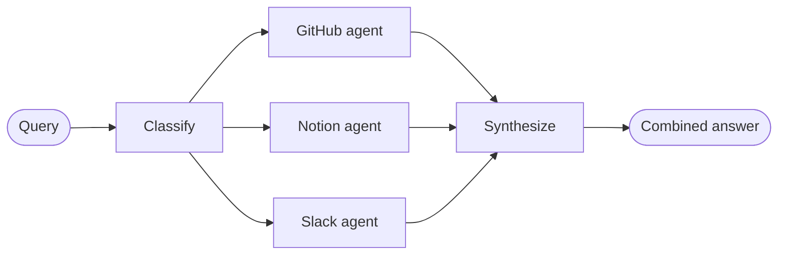

# Build a Multi-Source Knowledge Base with Routing — 逐段翻译

> 原文：https://docs.langchain.com/oss/python/langchain/multi-agent/router-knowledge-base

---

## Overview / 概览

The **router pattern** is a multi-agent architecture where a routing step classifies input and directs it to specialized agents, with results synthesized into a combined response. This pattern excels when your organization's knowledge lives across distinct **verticals** (separate knowledge domains that each require their own agent with specialized tools and prompts).

**路由器模式**是一种多代理架构，由路由步骤对输入进行分类并将其定向到专门的代理，最终将结果合成为统一响应。当组织的知识分布在不同的**垂直领域**（各自需要专门的代理、工具和提示词的独立知识域）时，这种模式表现出色。

The system will coordinate three specialists: 系统将协调三个专家：

* A **GitHub agent** that searches code, issues, and pull requests — 搜索代码、issue 和 PR
* A **Notion agent** that searches internal documentation and wikis — 搜索内部文档和 wiki
* A **Slack agent** that searches relevant threads and discussions — 搜索相关讨论线程



### Why use a router? / 为什么用路由器？

* **Parallel execution** — 并行查询多个源，降低延迟
* **Specialized agents** — 每个垂直领域有专门的工具和提示词
* **Selective routing** — 不是每个查询都需要每个源
* **Targeted sub-questions** — 每个代理收到针对其领域优化的子问题
* **Clean synthesis** — 多源结果合并为单一连贯响应

---

## 1. Define state / 定义状态

```python
from typing import Annotated, Literal, TypedDict
import operator

class AgentInput(TypedDict):
    """子代理输入 — 只有 query"""
    query: str

class AgentOutput(TypedDict):
    """子代理输出 — source + result"""
    source: str
    result: str

class Classification(TypedDict):
    """路由决策 — 调用哪个代理，用什么查询"""
    source: Literal["github", "notion", "slack"]
    query: str

class RouterState(TypedDict):
    query: str
    classifications: list[Classification]
    results: Annotated[list[AgentOutput], operator.add]  # Reducer 收集并行结果
    final_answer: str
```

The `results` field uses a **reducer** (`operator.add`) to collect outputs from parallel agent executions.

`results` 字段使用 **reducer**（`operator.add`）收集并行代理执行的输出。

---

## 2. Define tools / 定义工具

7 tools across 3 verticals: 3 个垂直领域共 7 个工具：

| 垂直领域 | 工具 | 作用 |
|----------|------|------|
| GitHub | `search_code`, `search_issues`, `search_prs` | 代码、issue、PR |
| Notion | `search_notion`, `get_page` | 文档、页面 |
| Slack | `search_slack`, `get_thread` | 消息、线程 |

---

## 3. Create specialized agents / 创建专门代理

```python
github_agent = create_agent(model, tools=[search_code, search_issues, search_prs],
    system_prompt="You are a GitHub expert...")

notion_agent = create_agent(model, tools=[search_notion, get_page],
    system_prompt="You are a Notion expert...")

slack_agent = create_agent(model, tools=[search_slack, get_thread],
    system_prompt="You are a Slack expert...")
```

---

## 4. Build the router workflow / 构建路由器工作流

### Step 1: Classify — 用结构化输出分类查询

```python
from pydantic import BaseModel, Field

class ClassificationResult(BaseModel):
    classifications: list[Classification] = Field(
        description="List of agents to invoke with their targeted sub-questions"
    )

def classify_query(state: RouterState) -> dict:
    structured_llm = router_llm.with_structured_output(ClassificationResult)
    result = structured_llm.invoke([...])
    return {"classifications": result.classifications}
```

Uses **structured output** to ensure valid routing decisions.
使用**结构化输出**确保有效的路由决策。

### Step 2: Route — 用 Send API 并行分发

```python
from langgraph.types import Send

def route_to_agents(state: RouterState) -> list[Send]:
    return [
        Send(c["source"], {"query": c["query"]})
        for c in state["classifications"]
    ]
```

`Send` enables parallel execution of selected agents.
`Send` 实现选定代理的并行执行。

### Step 3: Query agents — 各代理独立查询

```python
def query_github(state: AgentInput) -> dict:
    result = github_agent.invoke({"messages": [{"role": "user", "content": state["query"]}]})
    return {"results": [{"source": "github", "result": result["messages"][-1].content}]}
```

Each agent receives only `AgentInput` (just a query), not the full router state.
每个代理只接收 `AgentInput`（仅查询），而非完整的路由器状态。

### Step 4: Synthesize — 综合结果

```python
def synthesize_results(state: RouterState) -> dict:
    formatted = [f"**From {r['source'].title()}:**\n{r['result']}" for r in state["results"]]
    response = router_llm.invoke([...])
    return {"final_answer": response.content}
```

---

## 5. Compile the workflow / 编译工作流

```python
from langgraph.graph import StateGraph, START, END

workflow = (
    StateGraph(RouterState)
    .add_node("classify", classify_query)
    .add_node("github", query_github)
    .add_node("notion", query_notion)
    .add_node("slack", query_slack)
    .add_node("synthesize", synthesize_results)
    .add_edge(START, "classify")
    .add_conditional_edges("classify", route_to_agents, ["github", "notion", "slack"])
    .add_edge("github", "synthesize")
    .add_edge("notion", "synthesize")
    .add_edge("slack", "synthesize")
    .add_edge("synthesize", END)
    .compile()
)
```

`add_conditional_edges` connects classify to agents through `route_to_agents`. When it returns multiple `Send` objects, those nodes execute in parallel.

`add_conditional_edges` 通过 `route_to_agents` 将 classify 连接到代理。当返回多个 `Send` 对象时，这些节点并行执行。

---

## 6. Use the router / 使用路由器

```python
result = workflow.invoke({"query": "How do I authenticate API requests?"})
```

Expected flow: 期望流程：

1. Classify → github + notion (not slack)
2. GitHub agent searches code/issues/PRs
3. Notion agent searches docs
4. Synthesize → combined answer

---

## 7. Architecture understanding / 架构理解

| Phase | Function | Key technique |
|-------|----------|---------------|
| Classify | `classify_query` | Structured output (Pydantic) |
| Route | `route_to_agents` | `Send` API for parallel execution |
| Query | `query_*` | Independent agent invocation |
| Collect | Reducer | `operator.add` concatenates results |
| Synthesize | `synthesize_results` | LLM combines multi-source results |

---

## 8. Advanced: Stateful routers / 高级：有状态路由器

### Tool wrapper approach / 工具包装方式

```python
@tool
def search_knowledge_base(query: str) -> str:
    """Search across multiple knowledge sources."""
    result = workflow.invoke({"query": query})
    return result["final_answer"]

conversational_agent = create_agent(
    model,
    tools=[search_knowledge_base],
    system_prompt="You are a helpful assistant...",
    checkpointer=InMemorySaver(),
)
```

Router stays stateless; conversational agent handles memory.
路由器保持无状态；对话代理处理记忆。

---

## Key takeaways / 核心要点

* **Three phases** — Decompose → Route → Synthesize
* **Structured output** — 用 Pydantic 确保有效路由决策
* **Send API** — 实现代理并行执行
* **Reducer** — `operator.add` 收集并行结果
* **Selective routing** — 不是每个查询都需要每个源
