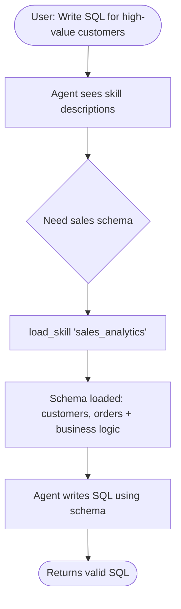

# Build a SQL Assistant with On-Demand Skills — 逐段翻译

> 原文：https://docs.langchain.com/oss/python/langchain/multi-agent/skills-sql-assistant

---

## Overview / 概览

This tutorial shows how to use **progressive disclosure** — a context management technique where the agent loads information on-demand rather than upfront — to implement **skills** (specialized prompt-based instructions). The agent loads skills via tool calls, rather than dynamically changing the system prompt, discovering and loading only the skills it needs for each task.

本教程展示如何使用**渐进式披露**——一种代理按需加载信息而非预先加载的上下文管理技术——来实现**技能**（专门的基于提示词的指令）。代理通过工具调用加载技能，而非动态改变系统提示词，只发现和加载每个任务所需的技能。

**Use case:** Imagine building an agent to help write SQL queries across different business verticals. Loading all schemas upfront would overwhelm the context window. Progressive disclosure solves this by loading only the relevant schema when needed.

**用例：** 想象构建一个帮助跨不同业务垂直领域编写 SQL 查询的代理。预先加载所有 schema 会压垮上下文窗口。渐进式披露通过按需加载相关 schema 来解决这个问题。

### What you'll build / 你将构建什么

A SQL query assistant with two skills (sales analytics and inventory management). The agent sees lightweight skill descriptions in its system prompt, then loads full database schemas and business logic through tool calls only when relevant.

一个有两个技能（销售分析和库存管理）的 SQL 查询助手。代理在系统提示词中看到轻量级技能描述，然后仅在相关时通过工具调用加载完整的数据库 schema 和业务逻辑。



### Why progressive disclosure? / 为什么用渐进式披露？

* **Reduces context usage** — 只加载 2-3 个技能，而非全部
* **Enables team autonomy** — 不同团队独立开发技能
* **Scales efficiently** — 添加数十上百个技能而不压垮上下文
* **Simplifies conversation history** — 单个代理，单个对话线程

### What are skills? / 什么是技能？

Skills are primarily prompt-based: self-contained units of specialized instructions for specific business tasks. Skills guide behavior through prompts and can provide information about tool usage or include sample code.

技能主要是基于提示词的：针对特定业务任务的自包含专门指令单元。技能通过提示词引导行为，可以提供工具使用信息或包含示例代码。

> **Tip:** Skills with progressive disclosure can be viewed as a form of RAG, where each skill is a retrieval unit — though not necessarily backed by embeddings, but by tools for browsing content.
>
> 带渐进式披露的技能可以看作 RAG 的一种形式，每个技能是一个检索单元——但不一定是基于嵌入的，而是基于内容浏览工具的。

---

## 1. Define skills / 定义技能

```python
class Skill(TypedDict):
    name: str        # 唯一标识符
    description: str # 1-2 句描述（显示在系统提示词中）
    content: str     # 完整技能内容（按需加载）
```

Three-level architecture: 三层架构：

| 层级 | 内容 | 何时加载 | 示例 |
|------|------|---------|------|
| Metadata | name + description | 始终在系统提示词中 | "sales_analytics: 销售数据分析" |
| Core content | 完整 schema + 业务逻辑 | 通过 load_skill 工具 | customers, orders 表结构 |
| Detailed resources | 示例查询、边缘情况 | 可选加载 | 复杂 JOIN 示例 |

### 销售分析技能

```python
{
    "name": "sales_analytics",
    "description": "Database schema and business logic for sales data analysis.",
    "content": """
# Sales Analytics Schema

## Tables
### customers: customer_id, name, email, signup_date, status, customer_tier
### orders: order_id, customer_id, order_date, status, total_amount, sales_region
### order_items: item_id, order_id, product_id, quantity, unit_price, discount_percent

## Business Logic
- Active customers: status = 'active' AND signup_date <= 90 days ago
- Revenue: Only count status = 'completed'
- High-value orders: total_amount > 1000
- CLV: Sum of all completed order amounts

## Example Query
SELECT c.name, SUM(o.total_amount) as revenue
FROM customers c JOIN orders o ON c.customer_id = o.customer_id
WHERE o.status = 'completed' AND o.order_date >= CURRENT_DATE - INTERVAL '3 months'
GROUP BY c.customer_id ORDER BY revenue DESC LIMIT 10;
"""
}
```

### 库存管理技能

```python
{
    "name": "inventory_management",
    "description": "Database schema and business logic for inventory tracking.",
    "content": """
# Inventory Management Schema

## Tables
### products: product_id, product_name, sku, category, unit_cost, reorder_point, discontinued
### warehouses: warehouse_id, warehouse_name, location, capacity
### inventory: inventory_id, product_id, warehouse_id, quantity_on_hand, last_updated
### stock_movements: movement_id, product_id, warehouse_id, movement_type, quantity, movement_date

## Business Logic
- Available stock: quantity_on_hand > 0
- Reorder needed: total quantity_on_hand <= reorder_point
- Active products: discontinued = false
- Stock valuation: quantity_on_hand * unit_cost
"""
}
```

---

## 2. Create skill loading tool / 创建技能加载工具

```python
from langchain.tools import tool

@tool
def load_skill(skill_name: str) -> str:
    """Load the full content of a skill into the agent's context.

    Args:
        skill_name: The name of the skill to load
    """
    for skill in SKILLS:
        if skill["name"] == skill_name:
            return f"Loaded skill: {skill_name}\n\n{skill['content']}"
    available = ", ".join(s["name"] for s in SKILLS)
    return f"Skill '{skill_name}' not found. Available: {available}"
```

Returns full skill content as a string, which becomes part of the conversation as a ToolMessage.

---

## 3. Build skill middleware / 构建技能中间件

```python
from langchain.agents.middleware import AgentMiddleware, ModelRequest, ModelResponse

class SkillMiddleware(AgentMiddleware):
    """Injects skill descriptions into system prompt + registers load_skill tool."""

    tools = [load_skill]  # 注册工具

    def __init__(self):
        skills_list = [f"- **{s['name']}**: {s['description']}" for s in SKILLS]
        self.skills_prompt = "\n".join(skills_list)

    def wrap_model_call(self, request, handler):
        skills_addendum = (
            f"\n\n## Available Skills\n\n{self.skills_prompt}\n\n"
            "Use the load_skill tool when you need detailed information."
        )
        new_content = list(request.system_message.content_blocks) + [
            {"type": "text", "text": skills_addendum}
        ]
        return handler(request.override(system_message=SystemMessage(content=new_content)))
```

---

## 4. Create the agent / 创建代理

```python
from langchain.agents import create_agent
from langgraph.checkpoint.memory import InMemorySaver

agent = create_agent(
    model,
    system_prompt="You are a SQL query assistant.",
    middleware=[SkillMiddleware()],
    checkpointer=InMemorySaver(),
)
```

---

## 5. Test progressive disclosure / 测试渐进式披露

```
用户: "Write SQL to find customers with orders over $1000 last month"
    │
    ▼ Agent 看到系统提示词中的技能描述
    │
    ▼ tool_call: load_skill("sales_analytics")
    │   → 返回完整 schema + 业务逻辑
    │
    ▼ Agent 基于 schema 写出正确 SQL
    │
    ▼ 回答: "SELECT DISTINCT c.customer_id, c.name..."
```

---

## 6. Advanced: Constraints with custom state / 高级：带约束的自定义状态

Track loaded skills and enforce that certain tools require specific skills:

```python
class CustomState(AgentState):
    skills_loaded: NotRequired[list[str]]

@tool
def load_skill(skill_name: str, runtime: ToolRuntime) -> Command:
    """Load skill and track it in state."""
    for skill in SKILLS:
        if skill["name"] == skill_name:
            return Command(update={
                "messages": [ToolMessage(content=skill["content"], tool_call_id=runtime.tool_call_id)],
                "skills_loaded": [skill_name],  # ← 记录已加载
            })

@tool
def write_sql_query(query: str, vertical: str, runtime: ToolRuntime) -> str:
    """Write SQL query. Must load skill first."""
    skills_loaded = runtime.state.get("skills_loaded", [])
    if vertical not in skills_loaded:
        return f"Error: Load '{vertical}' skill first using load_skill('{vertical}')"
    return f"SQL Query:\n```sql\n{query}\n```"
```

---

## Implementation variations / 实现变体

| 维度 | 选项 | 说明 |
|------|------|------|
| 存储 | 内存 / 文件系统 / 远程 | 本教程用内存；Claude Code 用文件系统 |
| 发现 | 系统提示词 / 文件扫描 / 注册表 | 本教程用系统提示词列出 |
| 加载 | 单次加载 / 分页 / 搜索 | 本教程用单次加载 |
| 大小 | 小(<1K) / 中(1-10K) / 大(>10K) | 中等技能最适合渐进式披露 |
